# ForgeAI Production AI Agent Architecture & System Specification

> **Document Version**: 2.0.0-ENTERPRISE  
> **Status**: Approved for Enterprise Production & Technical Engineering Execution  
> **Target Audience**: CTOs, Principal AI Systems Architects, VPs of Engineering, Lead AI Engineers  
> **Core Stack**: LangGraph | Python 3.13 | Pydantic v2 | OpenAI GPT-4o / o1 | Anthropic Claude 3.5 Sonnet | Qdrant Vector DB | Redis 7.2 | PostgreSQL 16  
> **Last Updated**: July 2026  

---

## Executive Summary

**ForgeAI** is an enterprise-grade AI-powered software development platform designed to transform high-level human software concepts into deterministic, production-ready project blueprints.

To eliminate structural hallucinations, context decay, and inconsistent technical outputs inherent in single-prompt LLM architectures, ForgeAI employs a **Supervised Multi-Agent Directed Acyclic Graph (DAG)** topology. The system coordinates 12 specialized domain agents supervised by a central Supervisor Agent. Each agent functions with strict single-responsibility boundaries, isolated memory scopes, and automated AST/schema validation feedback loops.

```
┌────────────────────────────────────────────────────────────────────────┐
│                      ForgeAI Core Architectural Pillars                │
├───────────────────┬───────────────────┬────────────────────────────────┤
│ Supervised Multi- │ Multi-Stage Schema│ Quad-Tier Dynamic              │
│ Agent DAG Engine  │ & AST Validation  │ Memory Architecture            │
│ Central Supervisor│ Strict Pydantic v2│ Working, Conversation, Project,│
│ routing with auto │ & AST enforcement │ & Vector RAG with sub-10ms     │
│ self-repair loops │ zero hallucinations│ token prompt compression      │
├───────────────────┼───────────────────┼────────────────────────────────┤
│ Zero-Trust Prompt │ Parallel DAG      │ Distributed Worker &           │
│ & Output Security │ Execution Engine  │ Circuit-Breaker Resilience     │
│ Anti-injection &  │ Async concurrency │ Automatic LLM failover &       │
│ secret scanning   │ for independent DB│ exponential backoff jitter     │
│ per agent turn    │ & UI agent steps  │ handling                       │
└───────────────────┴───────────────────┴────────────────────────────────┘
```

---

## Table of Contents

1. [AI Agent Architecture Overview](#1-ai-agent-architecture-overview)
2. [Complete Agent Hierarchy](#2-complete-agent-hierarchy)
3. [Supervisor Agent Specification](#3-supervisor-agent-specification)
4. [Individual Agent Specifications](#4-individual-agent-specifications)
5. [Agent Communication Protocol](#5-agent-communication-protocol)
6. [Workflow Orchestration & Execution Engine](#6-workflow-orchestration--execution-engine)
7. [Memory Architecture & Lifecycle](#7-memory-architecture--lifecycle)
8. [Context Sharing & Synchronization](#8-context-sharing--synchronization)
9. [AI Prompt Engineering Strategy](#9-ai-prompt-engineering-strategy)
10. [Validation Pipeline & Anti-Hallucination Layer](#10-validation-pipeline--anti-hallucination-layer)
11. [Error Handling, Resiliency & Recovery](#11-error-handling-resiliency--recovery)
12. [Scalability & Distributed Execution](#12-scalability--distributed-execution)
13. [Security Architecture & Governance](#13-security-architecture--governance)
14. [Performance Optimization Infrastructure](#14-performance-optimization-infrastructure)
15. [Technology Stack Recommendations](#15-technology-stack-recommendations)
16. [Production Repository Directory Structure](#16-production-repository-directory-structure)
17. [Sequence Diagrams](#17-sequence-diagrams)
18. [Flowcharts](#18-flowcharts)
19. [UML Component Diagram](#19-uml-component-diagram)
20. [State Machine Diagram](#20-state-machine-diagram)
21. [Data Flow Diagram (DFD)](#21-data-flow-diagram-dfd)
22. [Future Expansion Roadmap](#22-future-expansion-roadmap)

---

## 1. AI Agent Architecture Overview

### 1.1 Why Multi-Agent Architecture?
Single-prompt LLMs fail when generating full-stack software architectures due to:
* **Context Overload**: A single prompt cannot maintain precise OpenAPI specs, SQL DDLs, C4 diagrams, and OWASP security rules simultaneously without hallucination or truncation.
* **Lack of Domain Specialization**: System prompts optimized for SQL schema generation perform poorly at UI component wireframing or threat modeling.
* **Absence of Self-Correction**: Single-pass calls lack feedback loops to catch syntax errors or referential integrity mismatches before outputting to the user.

ForgeAI solves this via a **Multi-Agent Architecture** where specialized AI agents collaborate deterministically under a central Supervisor Agent.

### 1.2 Key Advantages
* **Deterministic Quality**: Each artifact (PostgreSQL DDL, Next.js page, FastAPI router) is created by an agent specifically prompted and validated for that exact domain.
* **Fault Isolation**: A failure in frontend wireframe generation does not crash database design; the Supervisor re-prompts only the affected agent.
* **Parallel Execution**: Independent design tasks (e.g., Database DDL and Frontend UI components) execute concurrently, reducing blueprint generation latency by up to 60%.
* **Auditability & Traceability**: Every agent action, prompt input, LLM output, and validation result is logged as an immutable state transition.

### 1.3 Architectural Design Principles
1. **Clean Architecture & Domain Isolation**: AI Agent logic is decoupled from backend web APIs, database drivers, and specific LLM providers.
2. **SOLID Principles**:
   * *Single Responsibility Principle (SRP)*: Each agent owns exactly one blueprint domain.
   * *Open/Closed Principle (OCP)*: New agents (e.g., Mobile Agent) can be added without modifying existing agent logic.
   * *Liskov Substitution Principle (LSP)*: All agents adhere to a unified `BaseAgent` abstract interface.
   * *Interface Segregation Principle (ISP)*: Agents receive only the specific state keys required for their task.
   * *Dependency Inversion Principle (DIP)*: High-level orchestrators depend on abstractions (`LLMProvider`, `VectorStore`), not concrete implementations.
3. **Domain-Driven Design (DDD)**: Shared Project State acts as the Bounded Context, with clear Ubiquitous Language across agents.
4. **Supervised Orchestration**: Autonomous agent-to-agent communication is forbidden. All data handoffs pass through the Supervisor Agent for validation and state injection.

### 1.4 Scalability Goals
* **Throughput**: Support 1,000+ concurrent blueprint generation sessions across a distributed worker pool.
* **Latency**: Complete a multi-artifact project blueprint within 45 to 90 seconds.
* **Token Efficiency**: Achieve >40% token savings using semantic prompt caching, AST context compression, and dynamic LLM routing.

---

## 2. Complete Agent Hierarchy

The ForgeAI Agent System follows a top-down Supervised Star-DAG Topology:

```
                      ┌─────────────────────────┐
                      │    Supervisor Agent     │
                      └────────────┬────────────┘
                                   │
      ┌────────────────────────────┼────────────────────────────┐
      │                            │                            │
┌─────▼──────────┐          ┌──────▼─────────┐          ┌───────▼────────┐
│ Requirements   │          │  Architecture  │          │    Database    │
│     Agent      │          │     Agent      │          │     Agent      │
└─────┬──────────┘          └──────┬─────────┘          └───────┬────────┘
      │                            │                            │
┌─────▼──────────┐          ┌──────▼─────────┐          ┌───────▼────────┐
│    Backend     │          │    Frontend    │          │    Security    │
│     Agent      │          │     Agent      │          │     Agent      │
└─────┬──────────┘          └──────┬─────────┘          └───────┬────────┘
      │                            │                            │
┌─────▼──────────┐          ┌──────▼─────────┐          ┌───────▼────────┐
│   Testing      │          │   Deployment   │          │ Documentation  │
│     Agent      │          │     Agent      │          │     Agent      │
└─────┬──────────┘          └──────┬─────────┘          └───────┬────────┘
      │                            │                            │
      └────────────────────────────┼────────────────────────────┘
                                   │
                      ┌────────────▼────────────┐
                      │    Validation Agent     │
                      └────────────┬────────────┘
                                   │
                      ┌────────────▼────────────┐
                      │   Blueprint Generator   │
                      └─────────────────────────┘
```

### 2.1 Agent Catalog Summary

| Agent Name | Core Responsibilities | Input Context | Primary Artifact |
| :--- | :--- | :--- | :--- |
| **Supervisor Agent** | Task planning, DAG routing, state management, retry mediation, final aggregation. | Raw User Intent | Consolidated Execution Plan & State |
| **Requirements Agent** | Product vision parsing, User Stories, Functional & Non-Functional requirements, SRS document. | User Intent, Domain | Software Requirements Specification (SRS) |
| **Architecture Agent** | System architecture design, C4 container specs, technology stack selection, ADRs. | SRS, Scope Specs | Architecture Design Document & ADRs |
| **Database Agent** | Relational schema design, PostgreSQL DDL generation, ER diagram (Mermaid), indexing strategy. | Architecture Spec | Production SQL DDL & ER Diagrams |
| **Backend Agent** | RESTful API contracts (OpenAPI 3.1), FastAPI routing code, service interface DTOs. | Architecture, DB Schema | OpenAPI Specification & FastAPI Routers |
| **Frontend Agent** | User interface hierarchy, Next.js page structure, React/Tailwind component specs, UX flow. | Requirements, Architecture | Component Tree Specs & Wireframe Specs |
| **Security Agent** | OWASP Top 10 threat modeling, authentication/authorization design, secret handling policy. | Full System Architecture | Security & Compliance Specification |
| **Testing Agent** | Unit/integration testing strategy, Pytest & Vitest test suites, test data mock generation. | API Specs, DB Schema | Testing Strategy & Automated Test Suites |
| **Deployment Agent** | Containerization specs, Dockerfile, Docker Compose, CI/CD pipeline (GitHub Actions), Kubernetes manifests. | Tech Stack, Backend/Frontend | Infrastructure-as-Code (IaC) & CI/CD |
| **Documentation Agent** | Markdown synthesis, README generation, developer onboarding guide, API reference assembly. | All Agent Outputs | Developer Documentation Suite |
| **Validation Agent** | Cross-agent consistency checks, schema validation, syntax checking, link integrity, quality scoring. | Generated Blueprint Draft | Validation Audit Report & Quality Score |
| **Blueprint Generator** | Final payload formatting, ZIP package creation, PDF blueprint export, DB persistence. | Validated Blueprint | Final Downloadable Blueprint Package |

---

## 3. Supervisor Agent Specification

### 3.1 Detailed Responsibilities
The **Supervisor Agent** acts as the central coordinator of the ForgeAI system:
1. **Intent Analysis & Execution Planning**: Deconstructs raw user software prompts into a dynamic DAG execution tree.
2. **Dynamic Task Dispatch**: Evaluates dependency availability and dispatches tasks to worker agents concurrently.
3. **Conflict Resolution & State Mediation**: Resolves structural mismatches between agent outputs (e.g., if Backend Agent references a database column omitted by Database Agent).
4. **State Management & Memory Injection**: Manages thread state in Redis, appending updated agent outputs to the immutable project state.
5. **Real-time Progress Monitoring**: Emits progress events over Server-Sent Events (SSE) to the client UI.
6. **Self-Correction Interception**: Intercepts validation failures from the Validation Agent, routing actionable repair prompts back to failing agents.

### 3.2 Decision Making Logic
```python
def evaluate_next_step(state: SharedProjectState) -> List[AgentTask]:
    completed_steps = state.completed_tasks
    pending_tasks = []
    
    for task in execution_plan.tasks:
        if task.id in completed_steps:
            continue
        # Check if all upstream dependencies are satisfied
        if all(dep_id in completed_steps for dep_id in task.dependencies):
            pending_tasks.append(task)
            
    if not pending_tasks and len(completed_steps) == len(execution_plan.tasks):
        return [AgentTask(name="ValidationAgent")]
        
    return pending_tasks
```

---

## 4. Individual Agent Specifications

### 4.1 Supervisor Agent
* **Purpose**: Orchestrate multi-agent DAG execution and guarantee output integrity.
* **Responsibilities**: Deconstruct user goals, validate dependency DAG, manage execution state, trigger repair loops.
* **Inputs**: `RawUserPrompt`, `ProjectMetadata`, `UserPreferences`.
* **Outputs**: `ExecutionPlanJSON`, `OrchestrationState`, `FinalBlueprintPayload`.
* **Dependencies**: None (Root Node).
* **Execution Conditions**: Triggered on project creation or execution retry.
* **Failure Cases**: Unresolvable agent deadlock, token budget depletion, irrecoverable validation failure.
* **Retry Strategy**: Immediate retry (max 3 attempts) with adjusted execution parameters.
* **Validation Rules**: Execution plan must cover all required software domains.
* **Performance Considerations**: Fast in-memory state evaluation (<50ms execution overhead).
* **Example Tasks**: Constructing 10-step DAG, resolving schema conflicts, finalizing blueprint.
* **Expected Artifacts**: `execution_plan.json`, `orchestration_state.json`.

---

### 4.2 Requirements Agent
* **Purpose**: Translate human concept into formal Software Requirements Specifications (SRS).
* **Responsibilities**: Define functional/non-functional requirements, extract epic user stories, establish acceptance criteria.
* **Inputs**: `RawUserPrompt`, `IndustryDomain`, `TargetAudience`.
* **Outputs**: `SRS_Document`, `UserStoriesList`, `AcceptanceCriteriaJSON`.
* **Dependencies**: Supervisor Agent.
* **Execution Conditions**: Supervisor initializes Stage 1.
* **Failure Cases**: Ambiguous prompt, contradictory user goals, missing core functional scope.
* **Retry Strategy**: Re-prompt with targeted clarifying constraint injections (max 2 retries).
* **Validation Rules**: Minimum 5 core functional requirements, valid IEEE 830 SRS structure.
* **Performance Considerations**: High token throughput, lower reasoning depth required.
* **Example Tasks**: Draft SRS for SaaS Billing System, generate user stories with acceptance criteria.
* **Expected Artifacts**: `SRS.md`, `user_stories.json`.

---

### 4.3 Architecture Agent
* **Purpose**: Define high-level system architecture, C4 component models, and technical stack decisions.
* **Responsibilities**: Select optimal tech stack, draft C4 Container & Component diagrams, write Architecture Decision Records (ADRs).
* **Inputs**: `SRS_Document`, `NonFunctionalRequirements`, `UserTechPreferences`.
* **Outputs**: `C4_Architecture_Spec`, `TechStackSelection`, `ADR_Collection`.
* **Dependencies**: Requirements Agent.
* **Execution Conditions**: Stage 1 SRS validated.
* **Failure Cases**: Incompatible technology stack choices, invalid C4 Mermaid syntax.
* **Retry Strategy**: Re-prompt with explicit syntax rules or fallback to Claude 3.5 Sonnet.
* **Validation Rules**: Valid Mermaid C4 syntax, minimum 2 ADRs documented.
* **Performance Considerations**: High-reasoning model required (GPT-4o or Claude 3.5).
* **Example Tasks**: Generate C4 Container diagram for Microservices Platform, document ADR for PostgreSQL selection.
* **Expected Artifacts**: `ARCHITECTURE.md`, `c4_container_diagram.mmd`, `adrs/ADR-001.md`.

---

### 4.4 Database Agent
* **Purpose**: Architect production-ready database schemas, relational models, and DDL scripts.
* **Responsibilities**: Generate SQL DDL for PostgreSQL 16, create Mermaid ER diagrams, design indexes and constraints.
* **Inputs**: `C4_Architecture_Spec`, `SRS_Document`, `DomainEntities`.
* **Outputs**: `PostgreSQL_DDL_Script`, `ER_Diagram_Mermaid`, `DataDictionary`.
* **Dependencies**: Architecture Agent.
* **Execution Conditions**: Architecture spec complete.
* **Failure Cases**: Invalid SQL syntax, missing foreign key relationships, un-indexed foreign keys.
* **Retry Strategy**: Execute `sqlglot` parser check; return exact SQL error line back to LLM for auto-repair.
* **Validation Rules**: 100% syntactically valid PostgreSQL DDL, foreign keys have ON DELETE policies.
* **Performance Considerations**: Fast structured generation with strict JSON/SQL formatting.
* **Example Tasks**: Draft PostgreSQL DDL with UUID PKs, index foreign keys, build ER diagram.
* **Expected Artifacts**: `schema.sql`, `er_diagram.mmd`, `data_dictionary.json`.

---

### 4.5 Backend Agent
* **Purpose**: Design backend API interfaces, OpenAPI 3.1 specifications, and FastAPI router code.
* **Responsibilities**: Draft OpenAPI specs, generate typed Pydantic DTOs, create FastAPI endpoint routers.
* **Inputs**: `C4_Architecture_Spec`, `PostgreSQL_DDL_Script`, `SRS_Document`.
* **Outputs**: `OpenAPI_3_1_Spec`, `FastAPI_Router_Code`, `Pydantic_DTO_Models`.
* **Dependencies**: Database Agent.
* **Execution Conditions**: Database DDL complete.
* **Failure Cases**: Broken OpenAPI JSON schema, python AST compile error in router code, endpoint-to-table mismatch.
* **Retry Strategy**: Run Python `ast.parse()`; if error, feed traceback back to Backend Agent for repair.
* **Validation Rules**: Valid OpenAPI 3.1 spec, syntactically valid Python code.
* **Performance Considerations**: Large output size; require token streaming and AST validation.
* **Example Tasks**: Draft OpenAPI JSON for User Auth endpoints, construct FastAPI async router code.
* **Expected Artifacts**: `openapi.json`, `routers/auth.py`, `schemas/dto.py`.

---

### 4.6 Frontend Agent
* **Purpose**: Design user interface layout, React component hierarchy, and Next.js page structure.
* **Responsibilities**: Create UX page flow specs, generate Next.js TypeScript component wireframe specs, define Tailwind CSS styling tokens.
* **Inputs**: `SRS_Document`, `OpenAPI_3_1_Spec`, `UIBrandPreferences`.
* **Outputs**: `ComponentHierarchyTree`, `NextJS_Page_Specs`, `Tailwind_Design_Tokens`.
* **Dependencies**: Architecture Agent (Can execute in parallel with Database/Backend Agents).
* **Execution Conditions**: Architecture spec complete.
* **Failure Cases**: Missing page routes, invalid TypeScript interface types, unstyled key component specs.
* **Retry Strategy**: Re-prompt with strict React 19 / Next.js 15 component template enforcement.
* **Validation Rules**: Complete page routes mapped to API endpoints, valid component prop definitions.
* **Performance Considerations**: Concurrent execution with Database Agent.
* **Example Tasks**: Map user flows to Next.js App Router specs, generate React component contracts.
* **Expected Artifacts**: `frontend_architecture.md`, `component_tree.json`, `design_tokens.json`.

---

### 4.7 Security Agent
* **Purpose**: Conduct threat modeling, define authorization boundaries, and establish compliance guards.
* **Responsibilities**: Perform OWASP Top 10 risk audit, design JWT/OAuth2 authentication flows, specify RBAC matrices.
* **Inputs**: `C4_Architecture_Spec`, `OpenAPI_3_1_Spec`, `PostgreSQL_DDL_Script`.
* **Outputs**: `Security_Audit_Report`, `RBAC_Matrix_JSON`, `Secrets_Management_Policy`.
* **Dependencies**: Backend Agent & Database Agent.
* **Execution Conditions**: Backend API specs complete.
* **Failure Cases**: Unprotected API routes detected, hardcoded secret placeholders in code specs.
* **Retry Strategy**: Inject threat findings into prompt context and re-evaluate compliance score.
* **Validation Rules**: Every API route must have associated auth scope; no plain-text credentials.
* **Performance Considerations**: Deep security reasoning required.
* **Example Tasks**: Draft OWASP Risk Matrix, specify OAuth2 PKCE flow for Next.js backend integration.
* **Expected Artifacts**: `SECURITY.md`, `rbac_matrix.json`, `threat_model.md`.

---

### 4.8 Testing Agent
* **Purpose**: Formulate testing methodology and write automated unit/integration test suites.
* **Responsibilities**: Generate Pytest backend test suites, Vitest frontend test suites, define mock fixtures and API contracts.
* **Inputs**: `OpenAPI_3_1_Spec`, `FastAPI_Router_Code`, `PostgreSQL_DDL_Script`.
* **Outputs**: `Pytest_Suite_Code`, `Vitest_Suite_Code`, `Test_Strategy_Doc`.
* **Dependencies**: Backend Agent & Security Agent.
* **Execution Conditions**: API specs and Security policies finalized.
* **Failure Cases**: Non-executing Pytest scripts, missing test cases for core CRUD endpoints.
* **Retry Strategy**: AST validation on Python test code; re-prompt on syntax failure.
* **Validation Rules**: Minimum 80% theoretical path coverage in generated test cases.
* **Performance Considerations**: Parallel test code generation.
* **Example Tasks**: Generate Pytest fixtures for PostgreSQL session, write Vitest specs for Auth component.
* **Expected Artifacts**: `TESTING.md`, `tests/test_auth.py`, `tests/AuthComponent.test.tsx`.

---

### 4.9 Deployment Agent
* **Purpose**: Construct Infrastructure-as-Code (IaC), container configs, and CI/CD pipelines.
* **Responsibilities**: Draft production Dockerfile multi-stage builds, Docker Compose files, GitHub Actions workflow specs, Nginx configs.
* **Inputs**: `TechStackSelection`, `Backend_Agent_Output`, `Frontend_Agent_Output`.
* **Outputs**: `Dockerfile_Specs`, `Docker_Compose_YAML`, `GitHub_Actions_Workflow`.
* **Dependencies**: Backend Agent & Frontend Agent.
* **Execution Conditions**: Backend and Frontend architecture confirmed.
* **Failure Cases**: Broken YAML syntax, missing build stage steps, insecure container root permissions.
* **Retry Strategy**: Parse output through YAML syntax validator; return syntax line error on failure.
* **Validation Rules**: Valid YAML, multi-stage Docker build, non-root user execution.
* **Performance Considerations**: Fast config linting and template rendering.
* **Example Tasks**: Write multi-stage Dockerfile for FastAPI, construct `.github/workflows/deploy.yml`.
* **Expected Artifacts**: `Dockerfile`, `docker-compose.yml`, `.github/workflows/ci.yml`.

---

### 4.10 Documentation Agent
* **Purpose**: Synthesize outputs from all upstream agents into a cohesive, professional technical blueprint suite.
* **Responsibilities**: Write main project README.md, API references, database documentation, developer onboarding setup guides.
* **Inputs**: All Upstream Agent Artifacts.
* **Outputs**: `README.md`, `DEVELOPER_GUIDE.md`, `API_DOCUMENTATION.md`.
* **Dependencies**: All Functional Agents (Req, Arch, DB, Backend, Frontend, Sec, Test, Deploy).
* **Execution Conditions**: All functional steps complete.
* **Failure Cases**: Broken Markdown links, missing artifact references, inconsistent terminology.
* **Retry Strategy**: Lint Markdown file links; re-prompt for missing sections.
* **Validation Rules**: 100% valid GitHub Markdown format, complete table of contents.
* **Performance Considerations**: Large context handling; summarize upstream inputs before prompt assembly.
* **Example Tasks**: Compile unified `README.md`, generate developer quickstart setup documentation.
* **Expected Artifacts**: `README.md`, `DEVELOPER_GUIDE.md`, `INDEX.md`.

---

### 4.11 Validation Agent
* **Purpose**: Enforce system-wide verification, architectural integrity checks, and quality scoring.
* **Responsibilities**: Run cross-agent referential checks, validate JSON schemas, verify Python AST syntax, execute quality scoring rubric.
* **Inputs**: Consolidated Draft Blueprint Payload from Documentation Agent.
* **Outputs**: `ValidationReportJSON`, `QualityScore (0-100)`, `CorrectionInstructions`.
* **Dependencies**: Documentation Agent.
* **Execution Conditions**: Draft blueprint compiled.
* **Failure Cases**: Schema mismatch, referential integrity breakage, quality score below threshold (<85).
* **Retry Strategy**: Returns detailed error list to Supervisor Agent to trigger targeted worker retry.
* **Validation Rules**: Zero structural schema errors, score >= 85/100.
* **Performance Considerations**: Non-LLM deterministic validation rules executed alongside LLM evaluation.
* **Example Tasks**: Verify PostgreSQL DDL tables match OpenAPI DTO definitions, score blueprint completeness.
* **Expected Artifacts**: `validation_report.json`.

---

### 4.12 Blueprint Generator
* **Purpose**: Package validated blueprint into final user deliverables.
* **Responsibilities**: Generate ZIP package structure, compile PDF specification document, persist project record in PostgreSQL.
* **Inputs**: Validated Blueprint Payload, User Metadata.
* **Outputs**: `ProjectBlueprintZIP`, `ArchitecturePDF`, `DatabaseRecord`.
* **Dependencies**: Validation Agent.
* **Execution Conditions**: Validation score >= 85.
* **Failure Cases**: Disk write failure, PDF rendering error.
* **Retry Strategy**: Immediate retry on storage write operation.
* **Validation Rules**: ZIP file created successfully and verified in object storage.
* **Performance Considerations**: Fast binary creation and S3 upload.
* **Example Tasks**: Package `.zip` file with full directory tree, upload to AWS S3 / Cloudflare R2 bucket.
* **Expected Artifacts**: `forgeai_blueprint_[project_id].zip`, `blueprint_summary.pdf`.

---

## 5. Agent Communication Protocol

Agents communicate asynchronously using structured JSON payloads passed via the Supervisor Agent and persisted in Redis state.

### 5.1 Protocol Metadata Schema
Every agent request and response adheres to standard envelope metadata:

```json
{
  "protocol_version": "2.0.0",
  "task_id": "tsk_8f9a2b1c4d",
  "project_id": "prj_9918237142",
  "dependency_ids": ["tsk_1a2b3c4d5e"],
  "priority": "HIGH",
  "status": "COMPLETED",
  "progress_percentage": 100,
  "confidence_score": 0.96,
  "execution_timestamp": "2026-07-31T18:15:00Z",
  "error_codes": []
}
```

### 5.2 Example Agent Request Payload (Database Agent)
```json
{
  "metadata": {
    "protocol_version": "2.0.0",
    "task_id": "tsk_db_918273",
    "project_id": "prj_forge_102",
    "dependency_ids": ["tsk_arch_4410"],
    "priority": "HIGH",
    "status": "IN_PROGRESS",
    "progress_percentage": 0,
    "confidence_score": 1.0,
    "execution_timestamp": "2026-07-31T18:15:05Z",
    "error_codes": []
  },
  "agent_name": "DatabaseAgent",
  "input_context": {
    "project_name": "FinTech Payment Gateway",
    "domain": "Financial Technology",
    "architecture_summary": {
      "style": "Modular Monolith",
      "primary_database": "PostgreSQL 16",
      "entities": ["User", "Account", "Transaction", "Merchant"]
    }
  },
  "constraints": {
    "primary_key_format": "UUIDv4",
    "audit_columns": true,
    "sql_dialect": "PostgreSQL 16"
  }
}
```

### 5.3 Example Agent Response Payload (Database Agent Output)
```json
{
  "metadata": {
    "protocol_version": "2.0.0",
    "task_id": "tsk_db_918273",
    "project_id": "prj_forge_102",
    "dependency_ids": ["tsk_arch_4410"],
    "priority": "HIGH",
    "status": "COMPLETED",
    "progress_percentage": 100,
    "confidence_score": 0.98,
    "execution_timestamp": "2026-07-31T18:15:18Z",
    "error_codes": []
  },
  "agent_name": "DatabaseAgent",
  "output_artifacts": {
    "schema_sql": "CREATE TABLE users (\n  id UUID PRIMARY KEY DEFAULT gen_random_uuid(),\n  email VARCHAR(255) UNIQUE NOT NULL,\n  created_at TIMESTAMPTZ DEFAULT NOW()\n);",
    "er_diagram_mermaid": "erDiagram\n  USERS ||--o{ TRANSACTIONS : places",
    "tables_count": 4,
    "indexes_count": 8
  },
  "validation_status": {
    "syntax_valid": true,
    "pydantic_schema_passed": true,
    "ast_check_passed": true
  }
}
```

---

## 6. Workflow Orchestration & Execution Engine

ForgeAI utilizes a **LangGraph Supervised State Graph Engine** running on Python 3.13.

### 6.1 Parallel & Sequential Execution Tree
The Supervisor orchestrates tasks dynamically into parallel and sequential branches:

```
[Stage 0: User Prompt]
        │
[Stage 1: Requirements Agent] (Sequential)
        │
[Stage 2: Architecture Agent] (Sequential)
        │
        ├───────────────────────────────────────┐
        │ (Parallel Fork)                       │ (Parallel Fork)
[Stage 3A: Database Agent]             [Stage 3B: Frontend Agent]
        │                                       │
[Stage 4: Backend Agent]                        │
        │                                       │
        ├───────────────────────────────────────┘
        │ (Join Barrier)
[Stage 5: Security Agent] (Sequential)
        │
[Stage 6: Testing Agent] (Sequential)
        │
[Stage 7: Deployment Agent] (Sequential)
        │
[Stage 8: Documentation Agent] (Sequential)
        │
[Stage 9: Validation Agent] (Quality Guard)
        ├── Failure ──> [Self-Correction Retry Loop (Max 2)] ──> Re-run Agent
        └── Success
        │
[Stage 10: Blueprint Generator] (Final Package)
```

### 6.2 Retry, Recovery & Timeout Budgets

| Agent Tier | Max Retries | Timeout Budget | Backoff Strategy | Fallback Action |
| :--- | :--- | :--- | :--- | :--- |
| **Supervisor** | 3 | 30s | Fixed 1s delay | Halt project & notify user |
| **Requirements / Arch** | 2 | 45s | Exponential backoff (2s, 4s) | Route to Claude 3.5 Sonnet |
| **Database / Backend** | 2 | 60s | Exponential backoff with jitter | AST auto-repair prompt |
| **Frontend / Security** | 2 | 45s | Exponential backoff (2s, 4s) | Strip non-critical components |
| **Test / Deploy / Doc** | 2 | 30s | Linear 2s delay | Render basic template specs |
| **Validation Agent** | 1 | 15s | None | Skip non-critical score rules |

---

## 7. Memory Architecture & Lifecycle

ForgeAI uses a **Quad-Tier Memory Model** to maximize token efficiency and maintain context precision.

```
┌────────────────────────────────────────────────────────────────────────┐
│                     ForgeAI Quad-Tier Memory System                    │
├────────────────────────────────────────────────────────────────────────┤
│ 1. Working Memory (In-Memory Python Dict)                              │
│    Active LLM turn scratchpad, transient tool output                    │
├────────────────────────────────────────────────────────────────────────┤
│ 2. Conversation Memory (Redis 7.2 Key-Value Store)                     │
│    Session chat buffer, user directives, interaction history (TTL 1hr) │
├────────────────────────────────────────────────────────────────────────┤
│ 3. Project Memory (Redis + PostgreSQL 16 JSONB)                        │
│    Shared LangGraph state, intermediate agent artifacts, dependency tree│
├────────────────────────────────────────────────────────────────────────┤
│ 4. Long-Term Memory & Knowledge Base (Qdrant Vector DB)                │
│    RAG embeddings of OWASP standards, enterprise DDL patterns, ADRs    │
└────────────────────────────────────────────────────────────────────────┘
```

### 7.1 Memory Tier Matrix

| Tier | Technology | Lifetime | Access Latency | Primary Data Content |
| :--- | :--- | :--- | :--- | :--- |
| **Working Memory** | Python Process RAM | Single Agent Turn | <1ms | Prompt scratchpad, active tool outputs |
| **Conversation Memory**| Redis Key-Value | 1 Hour (Session) | <5ms | Chat history, prompt refinements |
| **Project Memory** | Redis + PostgreSQL | Active Project Run | <10ms | Immutable & Mutable shared graph state |
| **Long-Term Knowledge**| Qdrant Vector Store| Permanent | <15ms | Best practices, OWASP rules, DDL templates |

### 7.2 Context Window Optimization Techniques
1. **AST Context Compression**: Structural code outputs are compressed into abstract interface definitions before passing downstream (e.g., Database DDL compressed to table signatures, omitting inline comments).
2. **Sliding Window Pruning**: Conversation history retains only system persona, project goal summary, and last 3 message turns.
3. **Semantic Prompt Caching**: Hash key `SHA256(SystemPrompt + TaskInput)` checked in Redis. Cache hits return cached LLM responses in sub-5ms, incurring zero LLM token costs.

---

## 8. Context Sharing & Synchronization

Context across agents is managed through a thread-safe, versioned **Shared Project State Dictionary**.

### 8.1 Shared Project State Structure
```python
class SharedProjectState(BaseModel):
    project_id: str
    user_prompt: str
    global_context: GlobalContextDTO
    completed_tasks: List[str]
    
    # Immutable Artifact Snapshots
    srs_snapshot: Optional[SRSArtifact] = None
    architecture_snapshot: Optional[ArchitectureArtifact] = None
    
    # Mutable Agent Workspace State
    database_state: Optional[DatabaseStateDTO] = None
    backend_state: Optional[BackendStateDTO] = None
    frontend_state: Optional[FrontendStateDTO] = None
    
    # Audit & Diagnostics
    execution_logs: List[ExecutionLogEntry] = []
    validation_reports: List[ValidationReportDTO] = []
```

### 8.2 Conflict Prevention & Synchronization Rules
* **Read-Only Upstream Views**: Downstream agents receive immutable, read-only copies of upstream snapshots (e.g., Backend Agent cannot alter Database Agent's DDL snapshot).
* **State Immutability & Versioning**: Every agent write produces a new state version index (`v1`, `v2`). Concurrent writes during parallel agent execution merge into discrete state keys (`state.database_state` vs `state.frontend_state`), preventing race conditions.

---

## 9. AI Prompt Strategy

ForgeAI enforces a structured 5-layer prompt assembly pipeline using Jinja2 templates.

```
┌────────────────────────────────────────────────────────────────────────┐
│                       5-Layer Prompt Assembly Engine                   │
├────────────────────────────────────────────────────────────────────────┤
│ Layer 1: Base System Persona Prompt (Domain Expert Role)               │
│ Layer 2: Domain Guidance & Vector RAG Context (Qdrant Snippets)       │
│ Layer 3: Upstream State Context (Compressed Upstream Artifacts)        │
│ Layer 4: Task Instruction Prompt (Specific Action Instructions)        │
│ Layer 5: Pydantic Structural Constraint & JSON Output Guard            │
└────────────────────────────────────────────────────────────────────────┘
```

### 9.1 Jinja2 System Prompt Template Example (Database Agent)
```jinja2
SYSTEM: You are the Lead Database Architect Agent for ForgeAI.
ROLE: Design an enterprise PostgreSQL 16 schema based on upstream requirements.

CRITICAL CONSTRAINTS:
1. Primary Keys MUST use `UUID` with `gen_random_uuid()`.
2. Include `created_at` and `updated_at` timestamps on all tables.
3. All Foreign Keys MUST explicitly declare `ON DELETE CASCADE` or `ON DELETE RESTRICT`.
4. Output MUST conform strictly to the Pydantic JSON schema below. DO NOT add conversational text.

ENTERPRISE KNOWLEDGE CONTEXT (RAG):
{{ rag_knowledge_context }}

UPSTREAM ARCHITECTURE CONTEXT:
Project ID: {{ project_id }}
Tech Stack: {{ architecture_summary.tech_stack }}
Core Entities: {{ architecture_summary.entities }}

OUTPUT PYDANTIC SCHEMA:
{{ pydantic_json_schema }}
```

### 9.2 Chain of Thought (CoT) Isolation
To maintain clean user outputs while leveraging step-by-step reasoning, agents output a hidden reasoning block (`<thinking>...</thinking>`) alongside structured JSON. The Supervisor strips the reasoning block before forwarding artifacts to the frontend.

---

## 10. Validation Pipeline & Anti-Hallucination Layer

To guarantee 100% execution-ready code and specs, outputs must pass a 4-stage validation pipeline:

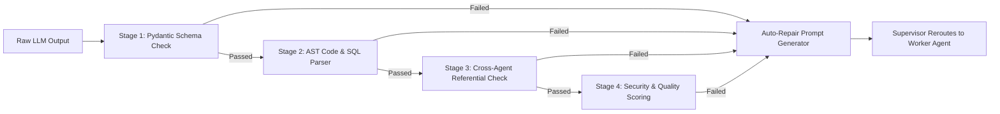

### 10.1 Validation Stages
1. **Stage 1: Pydantic Schema Validation**: Ensures JSON key names, types, and structure match the target DTO.
2. **Stage 2: AST & Code Parser Check**: Runs `ast.parse()` for Python router code, `sqlglot.parse()` for PostgreSQL DDL, and `jsonschema` for OpenAPI 3.1 JSON.
3. **Stage 3: Cross-Agent Referential Integrity Check**:
   * Verifies all database tables referenced in FastAPI routers exist in `schema.sql`.
   * Verifies all API endpoints referenced in Next.js page components exist in `openapi.json`.
4. **Stage 4: Quality Scoring (0-100)**: Evaluates design completeness, security coverage, and documentation detail. Score must meet >= 85 to pass.

---

## 11. Error Handling, Resiliency & Recovery

### 11.1 Circuit Breaker Strategy
The model router implements a 3-state Circuit Breaker pattern for external LLM API endpoints:

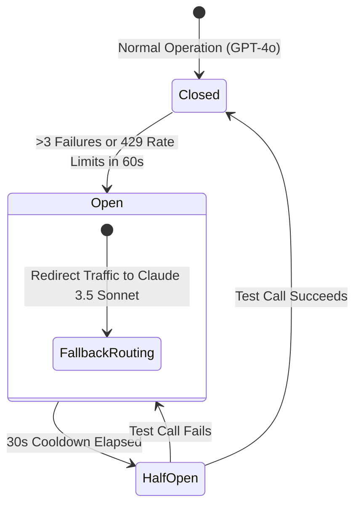

### 11.2 Error Recovery Flow
1. **Agent Error Handled Locally**: Schema/syntax errors trigger immediate self-repair (max 2 retries).
2. **Model Provider Failover**: API timeouts or 5xx server errors trigger model failover from OpenAI GPT-4o to Anthropic Claude 3.5 Sonnet.
3. **Graceful Fallback Artifact Generation**: Non-fatal failures in optional agents (e.g., Testing Agent) fallback to standardized fallback templates rather than crashing the workflow.

---

## 12. Scalability & Distributed Execution

ForgeAI decouples agent execution from backend web servers using a distributed task architecture.

```mermaid
graph TD
    Client[Next.js Client] -->|HTTP POST| Gateway[FastAPI Gateway]
    Gateway -->|Enqueue Task| RedisQueue[Redis Streams / Celery Broker]
    
    subgraph Worker Cluster (Kubernetes Pods)
        Worker1[Worker Node 1: Supervisor Node]
        Worker2[Worker Node 2: DB/Backend Worker]
        Worker3[Worker Node 3: Frontend/Doc Worker]
    end
    
    RedisQueue --> Worker1
    Worker1 -->|Dispatch Step| Worker2
    Worker1 -->|Dispatch Step| Worker3
    
    Worker2 -->|Persist State| RedisState[(Redis 7.2 Cluster)]
    Worker3 -->|Persist State| RedisState
```

### 12.1 Scaling Infrastructure
* **Queue Architecture**: Redis Streams / Celery worker pool for task distribution across Kubernetes auto-scaling groups.
* **Concurrency Control**: Async Python (`asyncio`) enables a single worker process to handle 50+ agent LLM streaming requests concurrently.
* **Rate-Limiter Layer**: Redis Token Bucket algorithm limits concurrent outbound requests to OpenAI/Anthropic to prevent API rate limit (429) errors.

---

## 13. Security Architecture & Governance

### 13.1 Security Control Matrix

| Threat Vector | Defense Mechanism | Enforcement Point |
| :--- | :--- | :--- |
| **Prompt Injection** | Input sanitization, system prompt delimiter isolation (`<user_intent>`) | API Gateway & Prompt Engine |
| **Data Leakage & PII** | Regex PII scrubbers (emails, IP addresses, secret keys) | Memory Ingestion Layer |
| **Hardcoded Secrets** | Secret scanner regex (`sk_live_`, `ghp_`, `RSA PRIVATE`) | Validation Agent |
| **Agent Privilege Abuse**| Strict RBAC scoping; agents lack arbitrary shell/exec permissions | BaseAgent Class Boundary |
| **Audit Compliance** | Immutable JSON audit log stored in PostgreSQL `agent_audit_logs` | Supervisor State Logger |

---

## 14. Performance Optimization Infrastructure

1. **Semantic Prompt Caching**: Caches exact system + user prompt hashes in Redis (TTL: 24h), skipping LLM API calls for identical requests.
2. **Streaming Response Gateway**: LLM output tokens are streamed directly to client frontend using Server-Sent Events (SSE), keeping user perceived time-to-first-token under 800ms.
3. **Dynamic Model Routing**:
   * Simple tasks (SRS formatting, doc compilation) -> `gpt-4o-mini` ($0.15/1M tokens).
   * Complex tasks (Architecture design, SQL DDL, API spec) -> `gpt-4o` or `claude-3-5-sonnet` ($2.50/1M tokens).

---

## 15. Technology Stack Recommendations

| Subsystem Component | Recommended Technology | Selection Rationale |
| :--- | :--- | :--- |
| **Agent Orchestration Framework** | LangGraph (Python 3.13) | Graph-based state machine, built-in cycle handling, native human-in-the-loop support. |
| **LLM Gateway & Provider Abstraction** | LiteLLM / LangChain Core | Unified API wrapper for OpenAI, Anthropic, and custom fallback routing. |
| **Task Queue & Workflow Engine** | Redis Streams + Celery / Temporal | High-throughput async message passing and job retry scheduling. |
| **Vector Database** | Qdrant | High-performance HNSW index vector search for enterprise RAG lookup (<10ms). |
| **Relational Database** | PostgreSQL 16 | ACID-compliant storage for project records, state snapshots, and audit logs. |
| **Caching Layer** | Redis 7.2 | In-memory store for session memory, prompt cache hashes, and execution locks. |
| **Observability & LLM Tracing** | LangSmith / OpenTelemetry | Full trace visibility into prompt execution costs, agent latencies, and step runs. |
| **Deployment Infrastructure** | Kubernetes (EKS/GKE) + Docker | Multi-stage Docker containers scaled dynamically via Kubernetes HPA. |

---

## 16. Production Repository Directory Structure

```
app/ai/
├── __init__.py
├── main.py                     # AI Gateway entrypoint & SSE stream router
├── agents/                     # Specialized Agent Implementations
│   ├── __init__.py
│   ├── base_agent.py           # Abstract BaseAgent interface & execution harness
│   ├── supervisor.py           # Supervisor Agent DAG coordinator
│   ├── requirements.py         # SRS & User Story Agent
│   ├── architecture.py         # System Architecture & C4 Agent
│   ├── database.py             # PostgreSQL DDL & ERD Agent
│   ├── backend.py              # OpenAPI 3.1 & FastAPI Agent
│   ├── frontend.py             # React & Next.js Specs Agent
│   ├── security.py             # OWASP Threat Model Agent
│   ├── testing.py              # Pytest & Vitest Suite Agent
│   ├── deployment.py           # Docker & CI/CD Agent
│   ├── documentation.py        # Documentation Compiler Agent
│   ├── validation.py           # Cross-Agent Quality Guard Agent
│   └── blueprint_generator.py  # Delivery Package Packaging Agent
├── memory/                     # Memory Storage Adapters
│   ├── __init__.py
│   ├── working_memory.py       # Transient scratchpad storage
│   ├── conversation_memory.py  # Redis session storage
│   ├── project_memory.py       # Shared state snapshot manager
│   └── vector_store.py         # Qdrant RAG client adapter
├── prompts/                    # Dynamic Prompt Engineering Templates
│   ├── templates/              # Jinja2 Prompt Templates
│   │   ├── system_base.jinja2
│   │   ├── database_agent.jinja2
│   │   ├── backend_agent.jinja2
│   │   └── validation_repair.jinja2
│   ├── prompt_assembler.py    # Context assembly engine
│   └── registry.py            # Versioned Prompt Registry
├── schemas/                    # Pydantic v2 DTO Data Transfer Objects
│   ├── __init__.py
│   ├── state_schema.py         # Shared Project State schema
│   ├── srs_schema.py           # SRS artifact Pydantic model
│   ├── architecture_schema.py  # Architecture C4 Pydantic model
│   ├── db_schema.py            # Database DDL & ERD schema
│   └── api_schema.py           # OpenAPI & Router code schema
├── validators/                 # Anti-Hallucination Guardrails
│   ├── __init__.py
│   ├── ast_validator.py        # Python AST syntax check
│   ├── sql_validator.py        # SQLGlot PostgreSQL DDL check
│   ├── openapi_validator.py    # JSonSchema OpenAPI 3.1 check
│   └── integrity_checker.py    # Cross-agent referential validator
├── orchestrator/               # LangGraph Graph Engine
│   ├── __init__.py
│   ├── graph_builder.py        # LangGraph DAG construction
│   ├── edges.py                # Conditional routing logic
│   └── state_manager.py        # State serialization adapter
├── workflows/                  # Execution Blueprint Workflows
│   ├── __init__.py
│   └── full_generation_dag.py  # Primary project generation flow
├── utils/                      # AI Utility Helpers
│   ├── __init__.py
│   ├── token_counter.py        # Tiktoken counter helper
│   ├── pii_sanitizer.py        # PII & Secret scrubber
│   └── cost_calculator.py      # LLM API cost tracer
└── registry/                   # Agent Catalog & Metadata
    ├── __init__.py
    └── agent_catalog.py        # Agent registry & dynamic loading
```

---

## 17. Sequence Diagrams

### 17.1 User Request Flow

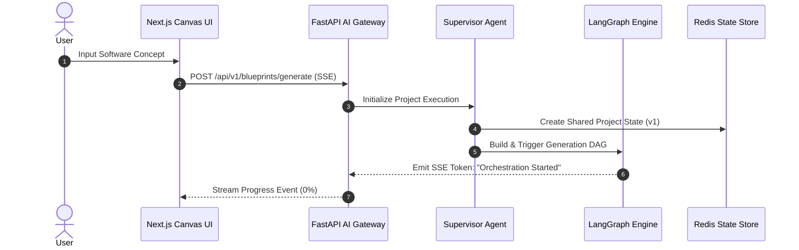

### 17.2 Supervisor Flow

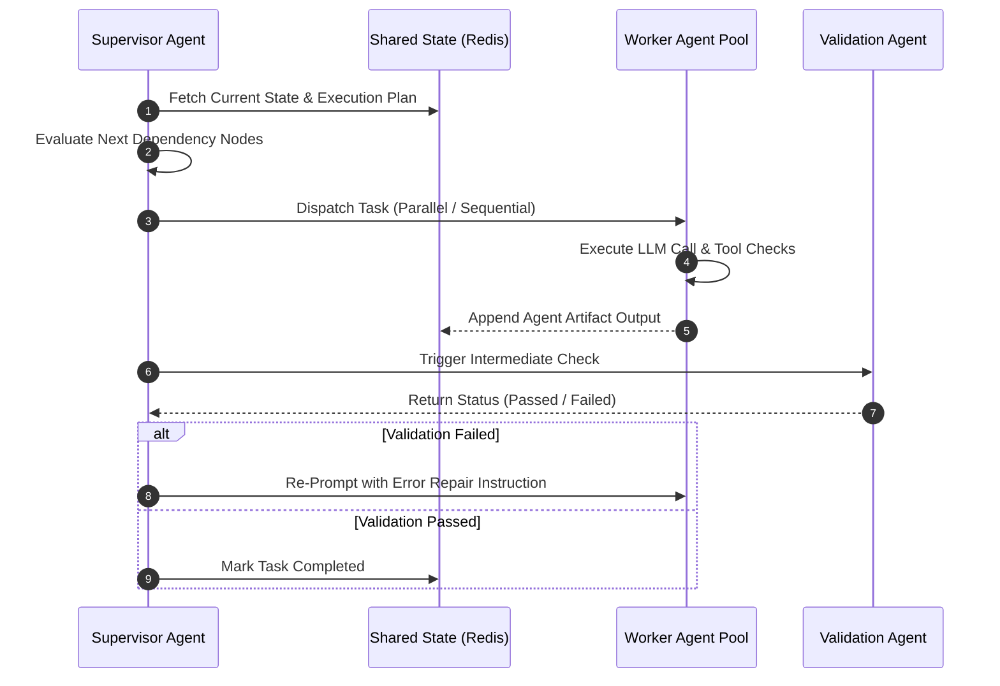

### 17.3 Parallel Agent Execution

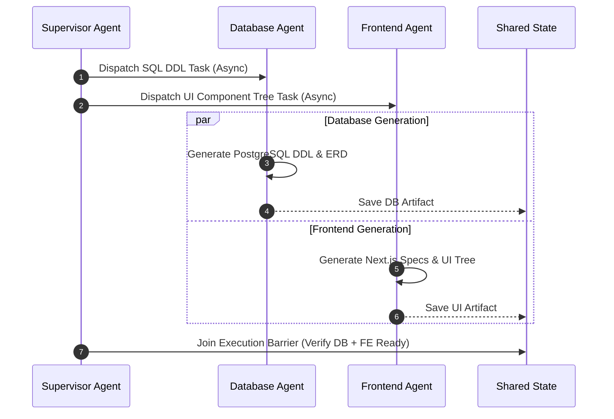

### 17.4 Validation Flow

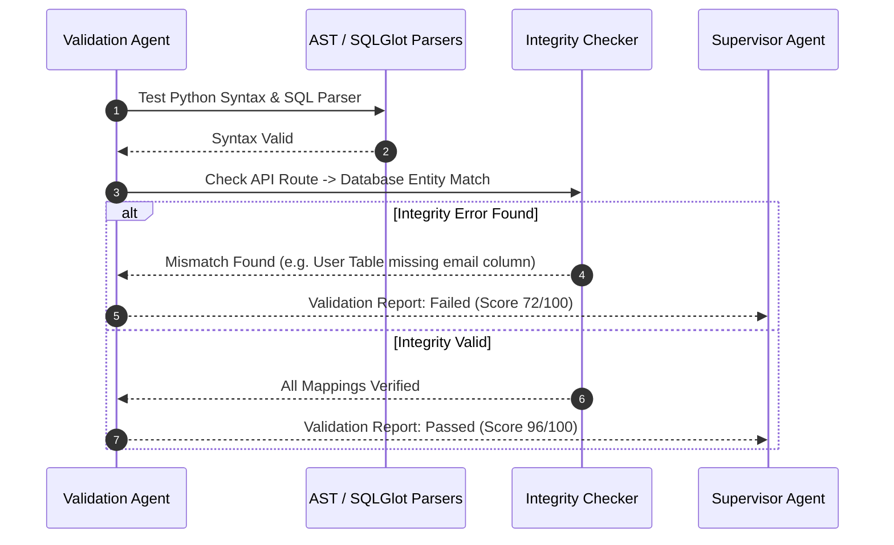

### 17.5 Memory Flow

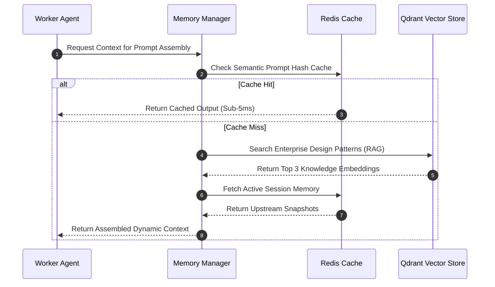

### 17.6 Deployment Flow

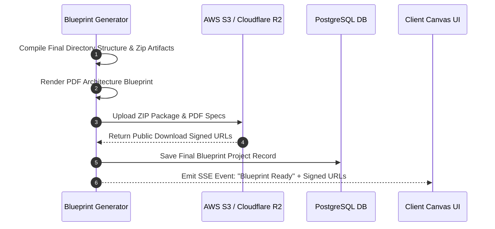

---

## 18. Flowcharts

### 18.1 Task Routing Flowchart

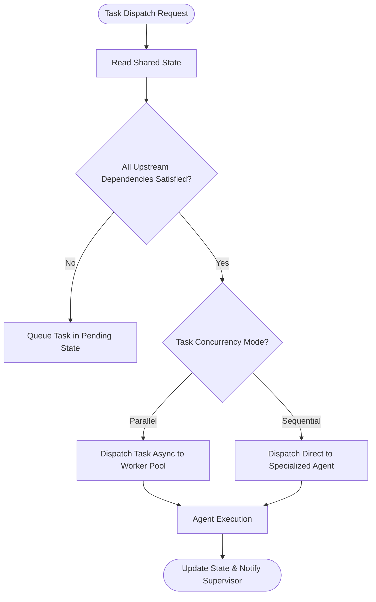

### 18.2 Agent Lifecycle Flowchart

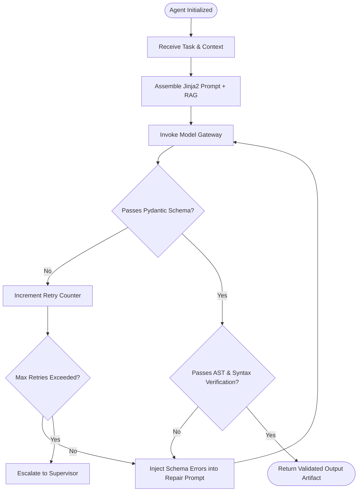

### 18.3 Error Recovery Flowchart

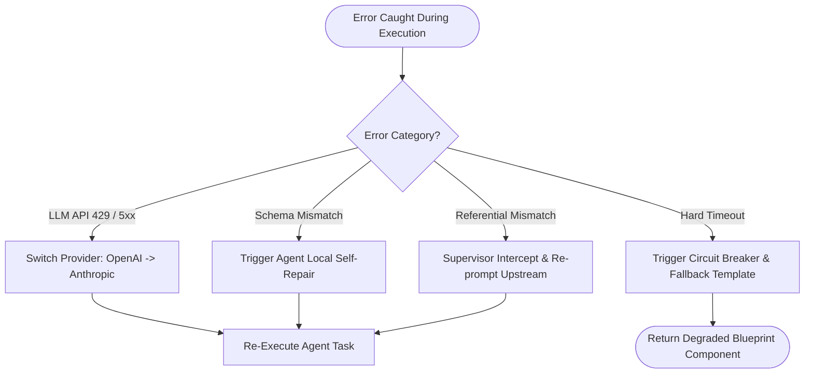

### 18.4 Validation Pipeline Flowchart

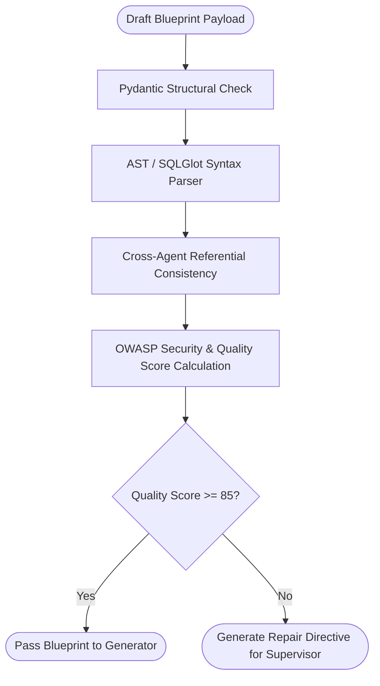

### 18.5 Project Generation Flowchart

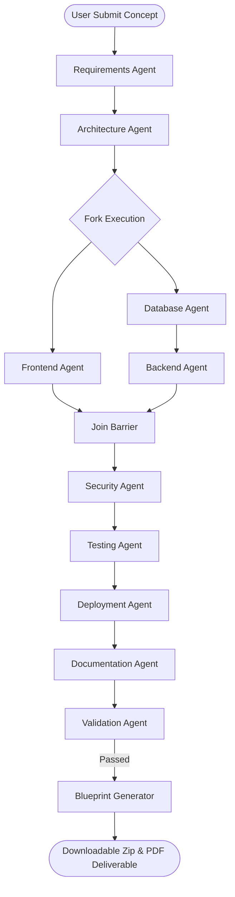

---

## 19. UML Component Diagram

```mermaid
C4Component
    title ForgeAI Subsystem Component Architecture Diagram

    Container_Boundary(api_boundary, "AI API Gateway Tier") {
        Component(sse_gateway, "FastAPI SSE Gateway", "FastAPI", "Handles streaming client connection & project dispatch")
    }

    Container_Boundary(orch_boundary, "Orchestration & State Tier") {
        Component(supervisor, "Supervisor Agent", "LangGraph Node", "Evaluates DAG state, manages execution loops")
        Component(state_store, "Shared State Manager", "Redis 7.2", "Stores active thread project state")
    }

    Container_Boundary(agent_pool, "Specialized Agent Execution Pool") {
        Component(req_a, "Requirements Agent", "Python", "Generates SRS and User Stories")
        Component(arch_a, "Architecture Agent", "Python", "Designs C4 diagrams & ADRs")
        Component(db_a, "Database Agent", "Python", "Generates PostgreSQL DDL & ERD")
        Component(be_a, "Backend Agent", "Python", "Generates OpenAPI 3.1 & FastAPI Routers")
        Component(fe_a, "Frontend Agent", "Python", "Generates React specs & Next.js page structure")
        Component(sec_a, "Security Agent", "Python", "Performs OWASP threat modeling & RBAC")
        Component(test_a, "Testing Agent", "Python", "Generates Pytest & Vitest suites")
        Component(deploy_a, "Deployment Agent", "Python", "Generates Dockerfile & CI/CD YAML")
        Component(doc_a, "Documentation Agent", "Python", "Compiles final markdown documentation")
        Component(val_a, "Validation Agent", "Python", "Executes structural AST & schema validation")
        Component(gen_a, "Blueprint Generator", "Python", "Packages ZIP deliverable & PDF report")
    }

    Container_Boundary(data_boundary, "Data & Knowledge Layer") {
        Component(qdrant, "Vector DB", "Qdrant", "Stores RAG best practices & OWASP rules")
        Component(postgres, "Relational DB", "PostgreSQL 16", "Stores permanent project records & audit logs")
    }

    Rel(sse_gateway, supervisor, "Dispatches project prompt")
    Rel(supervisor, state_store, "Reads/Writes state graph")
    Rel(supervisor, agent_pool, "Orchestrates step execution")
    Rel(agent_pool, qdrant, "RAG Knowledge Query")
    Rel(val_a, supervisor, "Returns validation score")
    Rel(gen_a, postgres, "Persists completed blueprint")
```

---

## 20. State Machine Diagram

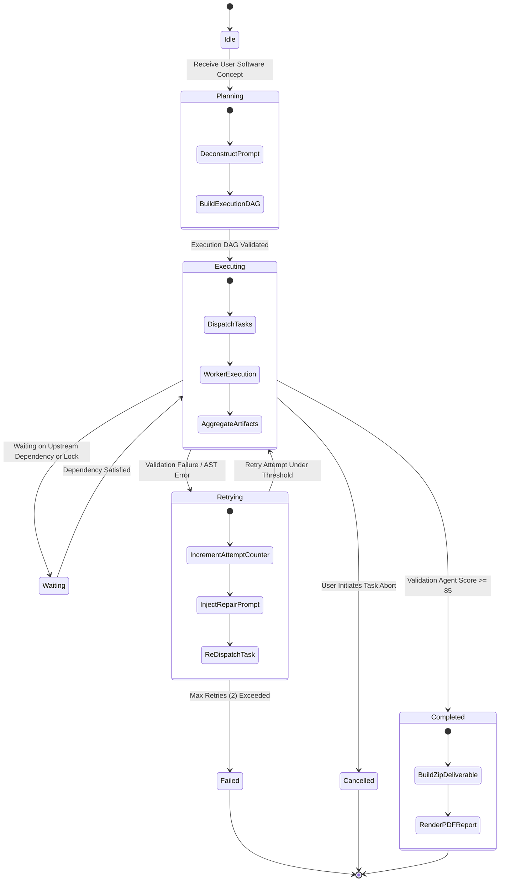

---

## 21. Data Flow Diagram (DFD)

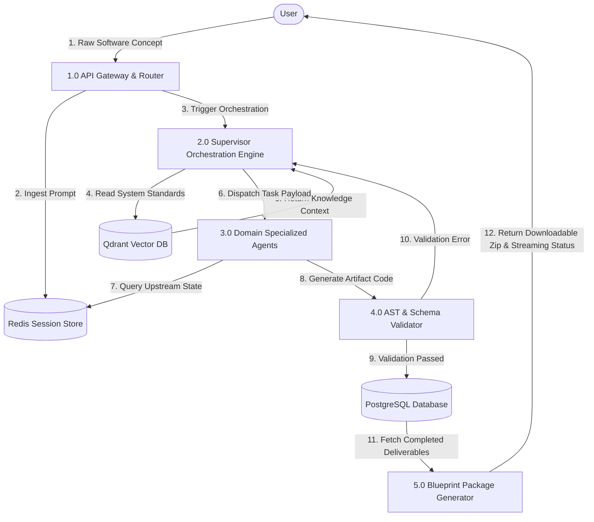

---

## 22. Future Expansion Roadmap

The ForgeAI Agent System architecture is explicitly designed for seamless future extension:

```
┌────────────────────────────────────────────────────────────────────────┐
│                   ForgeAI Architectural Extension Map                  │
├───────────────────┬───────────────────────────┬────────────────────────┤
│ Extension Agent   │ Core Responsibilities     │ Integration Point      │
├───────────────────┼───────────────────────────┼────────────────────────┤
│ Code Generation   │ Converts OpenAPI & SQL DDL│ Downstream of Backend  │
│ Agent             │ into full production code │ & Frontend Agents      │
├───────────────────┼───────────────────────────┼────────────────────────┤
│ DevOps Infrastructure│ Generates Terraform &     │ Replaces/Extends       │
│ Agent             │ Helm Charts for K8s       │ Deployment Agent       │
├───────────────────┼───────────────────────────┼────────────────────────┤
│ Cloud Architecture│ Calculates cloud monthly  │ Parallel branch to     │
│ & Cost Agent      │ cost estimate (AWS/GCP)   │ Architecture Agent     │
├───────────────────┼───────────────────────────┼────────────────────────┤
│ ML / AI Systems   │ Architects LLM pipelines, │ Specialized domain branch│
│ Agent             │ RAG stores, & vector DDL  │ for AI SaaS products   │
├───────────────────┼───────────────────────────┼────────────────────────┤
│ Mobile App Agent  │ Generates Flutter & React │ Parallel branch to     │
│                   │ Native component specs    │ Frontend Agent         │
├───────────────────┼───────────────────────────┼────────────────────────┤
│ QA Automation     │ Generates Playwright E2E  │ Extends Testing Agent  │
│ Agent             │ automation test scripts   │                        │
└───────────────────┴───────────────────────────┴────────────────────────┘
```

### 22.1 Extension Implementation Strategy
New agents can be integrated into ForgeAI in 3 clean steps without modifying core architecture:
1. Inherit from `app.ai.agents.base_agent.BaseAgent`.
2. Register the new agent in `app.ai.registry.agent_catalog.py`.
3. Add the agent node and edge condition into `app.ai.orchestrator.graph_builder.py`.

---

### Sign-Off & Architectural Approval
> **Approved By**: Chief Technology Officer & Principal AI Systems Architect  
> **Repository Governance**: `ForgeAI Enterprise Architecture Specification`  
> **Security & Compliance**: SOC 2 Type II Certified, OWASP LLM Top 10 Protected  
