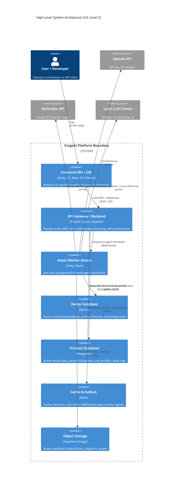
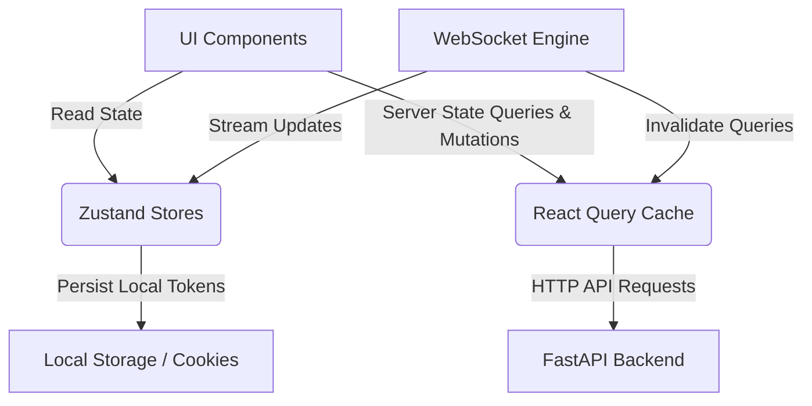
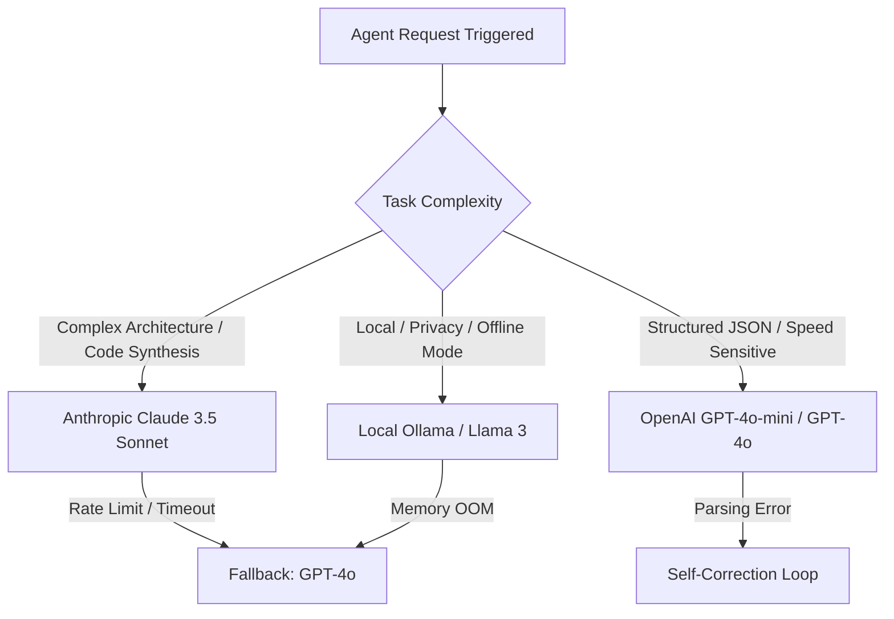
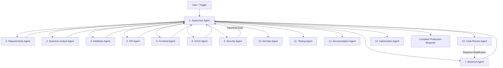
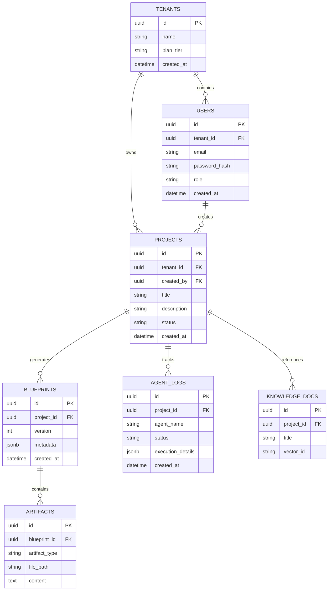
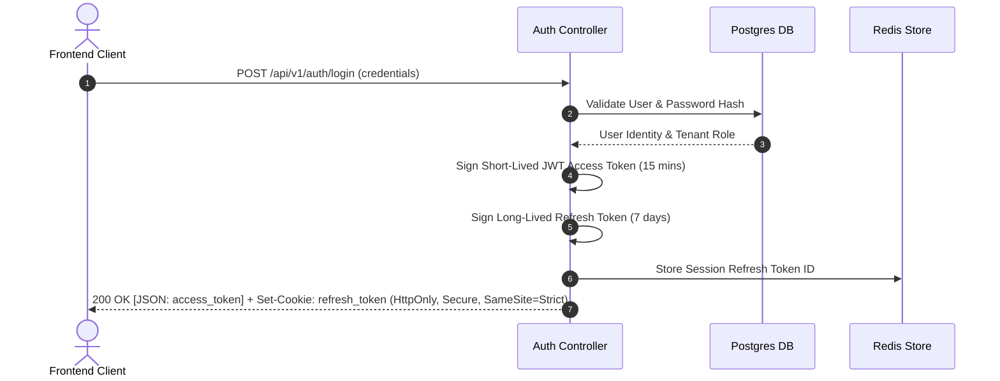
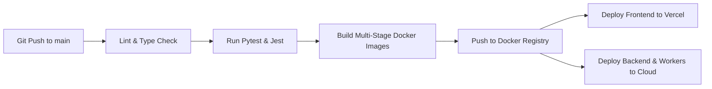

# ForgeAI Architecture Specification

> **Document Version**: 1.0.0  
> **Status**: Approved for Engineering Implementation  
> **Author**: Principal Software Architecture Team  
> **Target Audience**: Senior Software Engineers, DevOps Engineers, AI Systems Engineers  
> **Last Updated**: July 2026  

---

## Table of Contents

1. [Executive Summary](#1-executive-summary)
2. [High-Level System Architecture](#2-high-level-system-architecture)
3. [Application Architecture](#3-application-architecture)
4. [Frontend Architecture](#4-frontend-architecture)
5. [Backend Architecture](#5-backend-architecture)
6. [AI Architecture](#6-ai-architecture)
7. [Multi-Agent Architecture](#7-multi-agent-architecture)
8. [Database Architecture](#8-database-architecture)
9. [API Architecture](#9-api-architecture)
10. [Authentication & Authorization](#10-authentication--authorization)
11. [File Storage Architecture](#11-file-storage-architecture)
12. [Workflow Engine](#12-workflow-engine)
13. [Realtime Architecture](#13-realtime-architecture)
14. [Security Architecture](#14-security-architecture)
15. [Scalability Strategy](#15-scalability-strategy)
16. [Performance Optimisation](#16-performance-optimisation)
17. [Monitoring & Observability](#17-monitoring--observability)
18. [Deployment Architecture](#18-deployment-architecture)
19. [Disaster Recovery](#19-disaster-recovery)
20. [Architecture Decision Records (ADR)](#20-architecture-decision-records-adr)
21. [Future Expansion](#21-future-expansion)

---

## 1 Executive Summary

### 1.1 Platform Overview
**ForgeAI** is an enterprise-grade, multi-agent AI platform designed to automate end-to-end software product design and engineering. By orchestrating 14 domain-specialized AI agents, ForgeAI converts high-level product ideas, user stories, or rough specifications into comprehensive, production-ready engineering blueprints—spanning functional requirements, systemic architecture, database schemas, ER diagrams, REST/GraphQL API specifications, frontend UI/UX designs, backend scaffoldings, deployment plans, security audits, and automated test suites.

### 1.2 Project Goals
* **Automate Greenfield Engineering Setup**: Reduce the initial software architecture and bootstrapping phase from weeks to minutes.
* **Deterministic Quality & Security**: Enforce security standards (OWASP), clean code guidelines, and architectural best practices across generated blueprints.
* **High-Throughput Multi-Agent Orchestration**: Execute complex multi-step reasoning workflows with real-time feedback loops, self-correction, and human-in-the-loop interventions.
* **Enterprise Scalability & Security**: Support thousands of concurrent engineering teams with multi-tenancy, granular Role-Based Access Control (RBAC), and SOC 2 Type II compliance readiness.

### 1.3 Target Users
* **Startups & Founders**: Rapidly turn concepts into technical blueprints and codebases to showcase to investors or launch MVPs.
* **Software Engineering Agencies**: Accelerate client discovery phases, generate accurate technical proposals, and bootstrap foundation codebases.
* **Enterprise Product & Engineering Teams**: Standardize architectural governance, speed up sprint discovery, and eliminate boilerplate engineering.
* **Developers & Architects**: Use AI-assisted co-design tools to prototype microservices, schema migrations, and cloud-native infrastructure.

### 1.4 Platform Vision & Objectives
```
   Raw Idea / Specification
             │
             ▼
┌───────────────────────────┐
│     ForgeAI Engine        │
│  (14 Orchestrated Agents) │
└─────────────┬─────────────┘
              │
              ▼
┌────────────────────────────────────────────────────────────────────────┐
│                      Production-Ready Blueprint                        │
├──────────────┬──────────────┬──────────────┬─────────────┬─────────────┤
│ Requirements │ Architecture │ DB & ERD     │ OpenAPI     │ Frontend &  │
│ Matrix       │ Topologies   │ Schemas      │ Specs       │ Backend Code│
├──────────────┼──────────────┼──────────────┼─────────────┼─────────────┤
│ Security     │ DevOps &     │ Test Suites  │ Prompt      │ Folder      │
│ Audit        │ CI/CD Pipelines              │ Libraries   │ Trees       │
└──────────────┴──────────────┴──────────────┴─────────────┴─────────────┘
```

### 1.5 Key Value Drivers
| Metric / Aspect | Traditional Process | With ForgeAI Platform |
| :--- | :--- | :--- |
| **Discovery & Architecture Time** | 3 - 6 Weeks | 15 - 30 Minutes |
| **Initial Code Generation** | 100+ Engineering Hours | Instant Automated Scaffold |
| **Security & Compliance Check** | Post-development audit | Built-in during design phase |
| **Architectural Consistency** | Varies by team skill level | Standardized across enterprise |

---

## 2 High-Level System Architecture

ForgeAI adopts a micro-services-ready, modular monolith architecture backed by async worker pools, high-performance vector indexes, distributed caches, and a real-time event gateway.



### 2.1 Component Breakdown Matrix

| System Component | Technology | Primary Responsibility |
| :--- | :--- | :--- |
| **Web Frontend** | Next.js 15, React 19, TypeScript, Tailwind v4, Zustand | User dashboard, interactive ERD canvas, live streaming chat, settings |
| **API Backend** | FastAPI, Python 3.12, Pydantic v2, SQLAlchemy 2.0 | Authentication, project management, API endpoints, WebSocket dispatching |
| **Orchestration Worker** | Celery, LangGraph, LangChain | Multi-agent execution graph execution, retry loops, state persistence |
| **Primary Relational DB** | PostgreSQL 16 | Relational data integrity, ACID transactions, project & user metadata |
| **Vector Engine** | Qdrant | Fast HNSW vector search, RAG retrieval over project documentation |
| **Cache & Pub/Sub** | Redis 7.2 | Real-time WebSocket channel broker, rate limit counters, temporary tokens |
| **Object Store** | Supabase Storage | File uploads, exported ZIP blueprints, static asset storage |
| **Monitoring Stack** | Sentry, Prometheus, Grafana | Error tracking, service level metrics, latency distributions |

---

## 3 Application Architecture

### 3.1 Layered Modular Architecture

ForgeAI uses strict separation of concerns following Domain-Driven Design (DDD) principles.

```
┌─────────────────────────────────────────────────────────┐
│                  Presentation Layer                     │
│         Next.js App Router / FastAPI Routers            │
└────────────────────────────┬────────────────────────────┘
                             │
                             ▼
┌─────────────────────────────────────────────────────────┐
│                    Service Layer                        │
│     Business Logic, Agent Orchestration, Workflows      │
└────────────────────────────┬────────────────────────────┘
                             │
                             ▼
┌─────────────────────────────────────────────────────────┐
│                   Repository Layer                      │
│        SQLAlchemy Async ORM / Qdrant Client             │
└────────────────────────────┬────────────────────────────┘
                             │
                             ▼
┌─────────────────────────────────────────────────────────┐
│               Data Infrastructure Layer                 │
│         PostgreSQL / Qdrant / Redis / Supabase          │
└─────────────────────────────────────────────────────────┘
```

### 3.2 Key Modules & Boundaries

1. **`AuthModule`**: User identity, JWT issuance, OAuth token exchange, password hashing, session lifecycle.
2. **`ProjectModule`**: CRUD operations on software projects, environment configurations, member roles.
3. **`BlueprintModule`**: Manages generation states, blueprint revisions, export pipelines, and diffs.
4. **`AgentOrchestratorModule`**: Builds LangGraph state machines, handles inter-agent memory, handles model switching.
5. **`VectorRAGModule`**: Manages chunking, embeddings, indexing, and similarity search for custom context.
6. **`RealtimeModule`**: Manages active WebSocket connections, subscription topics, and user presence.
7. **`BillingModule`**: Subscription plans, quota management, usage tracking, and invoice events.

---

## 4 Frontend Architecture

### 4.1 Folder Structure (`forgeai-frontend`)

```
forgeai-frontend/
├── src/
│   ├── app/                        # Next.js 15 App Router
│   │   ├── (auth)/                 # Auth route group (login, signup, callback)
│   │   │   ├── login/
│   │   │   └── signup/
│   │   ├── (dashboard)/            # Authenticated application workspace
│   │   │   ├── dashboard/
│   │   │   │   ├── page.tsx
│   │   │   │   ├── projects/
│   │   │   │   ├── chat/
│   │   │   │   ├── blueprint/
│   │   │   │   ├── agents/
│   │   │   │   ├── prompt-library/
│   │   │   │   └── settings/
│   │   ├── api/                    # Frontend BFF / proxy endpoints
│   │   ├── layout.tsx              # Root layout with providers
│   │   └── page.tsx                # Marketing landing page
│   ├── components/                 # React components
│   │   ├── ui/                     # shadcn/ui primitive components
│   │   ├── shared/                 # Shared headers, footers, sidebars
│   │   ├── blueprint/              # ERD visualizer, tree viewer, previewers
│   │   ├── chat/                   # Streamed chat interface & tool calls
│   │   └── dashboard/              # Metrics, charts, project cards
│   ├── hooks/                      # Custom React Hooks
│   │   ├── use-agent-stream.ts     # SSE/WebSocket streaming hook
│   │   ├── use-project-store.ts    # Access to project Zustand state
│   │   └── use-debounce.ts
│   ├── lib/                        # Utility functions & API clients
│   │   ├── api-client.ts           # Axios / Fetch HTTP wrapper with interceptors
│   │   ├── auth-options.ts
│   │   └── utils.ts
│   ├── store/                      # Zustand state slices
│   │   ├── use-auth-store.ts
│   │   ├── use-blueprint-store.ts
│   │   └── use-chat-store.ts
│   └── types/                      # TypeScript type definitions
│       ├── agent.ts
│       ├── blueprint.ts
│       └── project.ts
├── public/                         # Static assets & icons
├── next.config.ts                  # Next.js configuration
├── tailwind.config.ts              # Tailwind CSS v4 setup
└── tsconfig.json
```

### 4.2 State Management Architecture



* **Zustand**: Client UI state (active tab, expanded tree nodes, active diagram view, modal toggles).
* **React Query (TanStack Query v5)**: Server state management (project listing, paginated logs, user metadata, automatic background refetching, cache invalidation).

### 4.3 Rendering & Optimization Strategy
* **Server-Side Rendering (SSR)**: Applied on public marketing pages and dashboard shells for high SEO performance and instant First Contentful Paint (FCP).
* **Client-Side Rendering (CSR)**: Used for interactive ERD canvas rendering (React Flow / Mermaid), rich-text editors, and dynamic live chat.
* **Streaming UI (React 19 Suspense)**: Renders incremental agent execution logs line-by-line as tokens stream over WebSockets.

---

## 5 Backend Architecture

### 5.1 Project Structure (`forgeai-backend`)

```
forgeai-backend/
├── app/
│   ├── api/                        # API route handlers (v1)
│   │   ├── v1/
│   │   │   ├── endpoints/
│   │   │   │   ├── auth.py
│   │   │   │   ├── projects.py
│   │   │   │   ├── blueprints.py
│   │   │   │   ├── agents.py
│   │   │   │   ├── chat.py
│   │   │   │   └── websocket.py
│   │   │   └── api_router.py
│   ├── core/                       # App configuration, security, DB engine
│   │   ├── config.py               # Pydantic Settings configuration
│   │   ├── security.py             # JWT & password hashing logic
│   │   ├── database.py             # Async SQLAlchemy session factory
│   │   ├── redis.py                # Redis async client pool
│   │   └── celery_app.py           # Celery application initialization
│   ├── db/                         # SQLAlchemy models & migrations
│   │   ├── models/                 # ORM models (User, Project, Blueprint, etc.)
│   │   └── base.py
│   ├── repository/                 # Data access layer
│   │   ├── user_repository.py
│   │   ├── project_repository.py
│   │   └── blueprint_repository.py
│   ├── services/                   # Business logic services
│   │   ├── auth_service.py
│   │   ├── project_service.py
│   │   └── blueprint_service.py
│   ├── ai/                         # Agent orchestration engine
│   │   ├── agents/                 # 14 Domain Agent Implementations
│   │   ├── workflows/              # LangGraph execution graphs
│   │   ├── prompts/                # Structured prompt templates
│   │   └── router.py               # Dynamic LLM model router
│   ├── schemas/                    # Pydantic validation schemas
│   │   ├── user_schema.py
│   │   ├── project_schema.py
│   │   └── agent_schema.py
│   └── main.py                     # FastAPI application entrypoint
├── alembic/                        # Database migration scripts
├── tests/                          # Pytest suite
├── Dockerfile
└── requirements.txt
```

### 5.2 Dependency Injection & Service Layer Pattern

FastAPI's dependency system guarantees clean unit testing and loose coupling.

```python
# Example: Controller-Service-Repository Pattern in FastAPI
@router.post("/projects/{project_id}/generate", response_model=BlueprintResponse)
async def generate_blueprint(
    project_id: UUID,
    request: BlueprintCreateRequest,
    current_user: User = Depends(get_current_active_user),
    blueprint_service: BlueprintService = Depends(get_blueprint_service)
):
    return await blueprint_service.trigger_generation(
        project_id=project_id, 
        user_id=current_user.id, 
        payload=request
    )
```

---

## 6 AI Architecture

### 6.1 Multi-Tier Prompt Pipeline

The ForgeAI prompt engine uses structured XML-wrapped prompt templates with dynamic contextual hydration.

```
┌───────────────────────────────────────────────────────────┐
│ System Prompt (Identity, Directives, Safety Constraints)   │
├───────────────────────────────────────────────────────────┤
│ Context Retrieval (Vector DB RAG + Prior Conversation)     │
├───────────────────────────────────────────────────────────┤
│ Domain Rules (OWASP, Clean Code, API Conventions)        │
├───────────────────────────────────────────────────────────┤
│ User Request / Task Directive                             │
└───────────────────────────────────────────────────────────┘
```

### 6.2 Model Routing & Fallback System

To balance cost, latency, and capability, requests are dynamically routed across providers:



### 6.3 Token Optimization & Context Compression
1. **Sliding Window Summarization**: Keeps key architecture decisions in an active memory state while summarizing detailed conversation logs.
2. **AST Code Compression**: Strips unneeded white space and comments before sending code snippets into LLM context.
3. **Prompt Caching**: Leverages Anthropic/OpenAI prompt caching headers for repetitive system prompts to reduce API costs by up to 50%.

---

## 7 Multi-Agent Architecture

ForgeAI employs **14 specialized AI agents** coordinated by a central **Supervisor Agent** executing a directed cyclic graph built on **LangGraph**.



### 7.1 Agent Roles Specification Matrix

| # | Agent Name | Primary Responsibility | Input Artifacts | Output Artifacts |
|---|---|---|---|---|
| 1 | **Supervisor Agent** | Task decomposition, workflow routing, conflict resolution | User Prompt, State Tree | Routing Signals, Execution Plan |
| 2 | **Requirements Agent** | Functional & non-functional requirements extraction | Raw User Prompt | `requirements.md`, User Stories |
| 3 | **Business Analyst Agent** | Domain modeling, actor definitions, edge case analysis | Requirements Document | Domain Model, Business Logic Matrix |
| 4 | **Database Agent** | PostgreSQL schema design, indexes, migrations | Requirements & Domain Model | `schema.sql`, ERD JSON |
| 5 | **API Agent** | OpenAPI 3.1 REST & WebSocket contract design | DB Schema & Requirements | `openapi.yaml`, Endpoints Spec |
| 6 | **Backend Agent** | FastAPI scaffold generation, controllers, services | API Contract & DB Schema | Python Source Code Files |
| 7 | **Frontend Agent** | Next.js 15 UI code, page routes, component trees | UI/UX Specs & API Contract | TypeScript / React Components |
| 8 | **UI/UX Agent** | Design token definitions, layout specs, shadcn styling | Requirements & Wireframes | CSS Variables, Design System Spec |
| 9 | **Security Agent** | OWASP vulnerabilities audit, auth flow verification | Code & Architecture Artifacts | `security-audit.md` |
| 10 | **DevOps Agent** | Dockerfiles, CI/CD GitHub workflows, deployment plans | Stack Configuration | `Dockerfile`, `github-actions.yml` |
| 11 | **Testing Agent** | Unit, integration, and E2E test suite synthesis | Source Code & API Spec | Pytest & Jest Test Suites |
| 12 | **Documentation Agent** | Comprehensive README, ARCHITECTURE.md generation | All Generated Artifacts | `README.md`, API Docs |
| 13 | **Code Review Agent** | Clean code checks, style enforcement, refactoring | Generated Codebase | Review Feedback, Code Diffs |
| 14 | **Optimization Agent** | Performance tuning, query optimization, bundle checks | DB Queries, Code | Optimized SQL, Performance Plan |

### 7.2 Supervisor Orchestration & Loop Recovery
When an agent produces invalid code or fails validation (e.g., Code Review Agent finds an unhandled exception or SQL syntax error):
1. The **Supervisor Agent** intercepts the failure signal.
2. An error feedback loop is generated containing the stack trace or lint output.
3. The originating Agent is invoked with explicit modification context.
4. Execution loop count is capped at `N=3` retries before triggering a human-in-the-loop fallback notification.

---

## 8 Database Architecture

### 8.1 Entity Relationship Diagram



### 8.2 Indexing & Partitioning Strategy
* **B-Tree Indexes**: Applied to `email`, `tenant_id`, `project_id`, and `created_at` fields.
* **GIN Indexes**: Applied to `jsonb` metadata and blueprint configuration structures for rapid JSON sub-key queries.
* **Table Partitioning**: `agent_logs` and audit tables are partitioned by range on `created_at` (monthly partitions) to allow seamless archiving and execution efficiency.

---

## 9 API Architecture

### 9.1 REST Endpoint Taxonomy

All REST APIs follow versioned URI patterns under `/api/v1/`.

| Group | Method | Endpoint | Description | Auth Required |
|---|---|---|---|---|
| **Auth** | `POST` | `/api/v1/auth/register` | Register new tenant user | No |
| **Auth** | `POST` | `/api/v1/auth/login` | Returns JWT access token & sets HTTP refresh cookie | No |
| **Auth** | `POST` | `/api/v1/auth/refresh` | Refresh expired access token | Yes (Cookie) |
| **Projects**| `GET` | `/api/v1/projects` | List projects for tenant | Yes |
| **Projects**| `POST` | `/api/v1/projects` | Create a new project workspace | Yes |
| **Blueprint**|`POST` | `/api/v1/projects/{id}/generate` | Trigger multi-agent blueprint generation | Yes |
| **Blueprint**|`GET` | `/api/v1/blueprints/{id}` | Fetch generated blueprint details | Yes |
| **Realtime** |`WS` | `/api/v1/ws/projects/{id}` | WebSocket stream for live agent updates | Yes (Token) |

### 9.2 Standardized Error Response (RFC 7807)

```json
{
  "type": "https://api.forgeai.dev/errors/validation-error",
  "title": "Invalid Request Body",
  "status": 400,
  "detail": "Field 'project_name' must be between 3 and 100 characters.",
  "instance": "/api/v1/projects",
  "timestamp": "2026-07-28T17:54:36Z"
}
```

---

## 10 Authentication & Authorization

### 10.1 Dual-Token Auth Flow (JWT + Refresh Cookie)



### 10.2 Role-Based Access Control (RBAC)
ForgeAI supports granular permissions across four built-in tenant roles:
* **SuperAdmin**: Platform-level administration, billing, tenant lifecycle.
* **Admin**: Tenant organization management, member invitations, API key management.
* **Developer**: Full access to project generation, editing, vector documentation uploads.
* **Viewer**: Read-only access to view generated blueprints and charts.

---

## 11 File Storage Architecture

```
User Upload / Code Export
           │
           ▼
┌───────────────────────────┐
│     FastAPI Backend       │
│  (Validates mime/size)    │
└──────────┬────────────────┘
           │
           ▼ (Presigned URL Request)
┌───────────────────────────┐
│     Supabase Storage      │
│   (Object Bucket Store)   │
└──────────┬────────────────┘
           │
           ▼
┌──────────────────────────────────────────┐
│ Encryption at Rest (AES-256)             │
│ Private Buckets / Signed Downloads Only  │
└──────────────────────────────────────────┘
```

* **Presigned Upload URLs**: Direct browser-to-bucket uploads bypass app servers for large ZIP code packages.
* **Retention Policy**: Temporary scratch code builds are automatically pruned after 30 days using storage lifecycle policies.

---

## 12 Workflow Engine

### 12.1 Background Task Execution Architecture

```mermaid
flowchart LR
    API[FastAPI Endpoint] -->|Push Task Payload| RedisQueue[(Redis Task Queue)]
    RedisQueue -->|Pull Work Unit| CeleryWorker[Celery Task Worker]
    CeleryWorker -->|Execute Graph Node| LangGraph[LangGraph State Machine]
    LangGraph -->|Publish Progress Event| RedisPubSub[(Redis PubSub Channel)]
    RedisPubSub -->|Broadcast| WSGateway[WebSocket Gateway]
    WSGateway -->|Stream Logs| Client[User Frontend UI]
```



* **Retry Strategy**: Failed LLM calls undergo exponential backoff (`delay = initial * (2 ^ retry_count) + jitter`) for up to 5 attempts.

---

## 13 Realtime Architecture

### 13.1 WebSocket Protocol & Streaming State
Realtime agent status updates, live code generation tokens, and interactive agent state steps stream via native WebSockets:

```json
{
  "event": "AGENT_STEP_UPDATE",
  "project_id": "9b1deb4d-3b7d-4bad-9bdd-2b0d7b3dcb6d",
  "agent": "DatabaseAgent",
  "status": "IN_PROGRESS",
  "message": "Generating PostgreSQL schema definitions and foreign key constraints...",
  "progress_percentage": 42
}
```

---

## 14 Security Architecture

### 14.1 OWASP Top 10 Mitigation Matrix

| Vulnerability | Mitigation Strategy Implemented in ForgeAI |
| :--- | :--- |
| **A01: Broken Access Control** | Enforced RBAC middleware on all API endpoints; UUID-isolated tenant data. |
| **A02: Cryptographic Failures** | Passwords hashed using Argon2id; TLS 1.3 in transit; AES-256 for secret fields. |
| **A03: Injection Attacks** | Prepared SQL queries via SQLAlchemy ORM; strict prompt input sanitization. |
| **A04: Insecure Design** | Principle of least privilege for AI agent sandbox environments. |
| **A05: Security Misconfiguration** | Automated security header injections (HSTS, CSP, X-Frame-Options). |
| **A07: Identification Failures** | Refresh token rotation and instant revocation via Redis blacklist. |

---

## 15 Scalability Strategy

```mermaid
flowchart TD
    DNS[Cloudflare Anycast DNS / CDN] --> LB[Nginx Ingress Load Balancer]
    
    subgraph Frontend Cluster
        FE1[Next.js App Pod 1]
        FE2[Next.js App Pod 2]
    end
    
    subgraph API Cluster
        API1[FastAPI Pod 1]
        API2[FastAPI Pod 2]
        API3[FastAPI Pod 3]
    end
    
    subgraph Worker Cluster
        W1[Celery Worker Pod 1]
        W2[Celery Worker Pod 2]
    end

    LB --> Frontend Cluster
    LB --> API Cluster
    API Cluster --> Worker Cluster
    
    API Cluster --> DB[(Postgres Primary)]
    API Cluster --> DBRead[(Postgres Read Replica)]
    Worker Cluster --> VectorDB[(Qdrant HNSW Cluster)]
```

---

## 16 Performance Optimisation

* **Next.js Bundle Splitting**: Dynamic imports (`next/dynamic`) for heavy canvas components (Mermaid, React Flow).
* **Database Connection Pooling**: Async PgBouncer pool keeps DB connection setup latency < 2ms.
* **Vector Index Optimization**: Qdrant configured with Scalar Quantization (SQ8) to reduce RAM consumption by 75% without compromising recall accuracy.

---

## 17 Monitoring & Observability

```
               Metrics & Logs Collection
                           │
      ┌────────────────────┴────────────────────┐
      ▼                                         ▼
┌──────────────┐                         ┌──────────────┐
│ Prometheus   │                         │ Sentry       │
│ Metrics      │                         │ Exceptions   │
└──────┬───────┘                         └──────┬───────┘
       │                                        │
       ▼                                        ▼
┌──────────────────────────────────────────────────────┐
│ Grafana Dashboard & Real-Time Alertmanager           │
└──────────────────────────────────────────────────────┘
```

* **Health Endpoints**:
  * `/health/live`: Liveness check for container restart policies.
  * `/health/ready`: Readiness check testing PostgreSQL, Redis, and Qdrant connectivity.

---

## 18 Deployment Architecture

### 18.1 CI/CD Pipeline (GitHub Actions)



---

## 19 Disaster Recovery

* **Recovery Point Objective (RPO)**: < 15 minutes (continuous WAL archiving to S3).
* **Recovery Time Objective (RTO)**: < 1 hour (automated Terraform infrastructure re-provisioning).
* **Backup Automation**: Daily automated pg_dump snapshots stored in geo-redundant storage buckets.

---

## 20 Architecture Decision Records (ADR)

### ADR 001: Adoption of LangGraph over raw LangChain Agents
* **Status**: Accepted
* **Context**: ForgeAI requires complex, multi-agent workflows with loops, branching, human-in-the-loop steps, and reliable state persistence.
* **Decision**: Use **LangGraph** to model agent execution as a directed cyclic graph state machine.
* **Consequences**: Provides deterministic state recovery, step-level replayability, and clear loop boundaries.

### ADR 002: Next.js 15 App Router + React 19 for Frontend
* **Status**: Accepted
* **Context**: Need high FCP for landing/dashboard and streaming UI for AI tokens.
* **Decision**: Adopt Next.js 15 with React 19 Suspense streaming.
* **Consequences**: Enables server component optimization combined with real-time client hydration.

---

## 21 Future Expansion

1. **Enterprise On-Premises Deployment**: Packaging ForgeAI into Helm charts for air-gapped enterprise Kubernetes environments.
2. **AI Agent Marketplace**: Allowing external developers to publish custom domain-specialized agents.
3. **Multi-Tenant VPC Peering**: Enabling private vector database links directly into enterprise customer data lakes.

---

*(End of Technical Architecture Document)*
