# ForgeAI Architecture Decision Records (ADRs)

This document serves as the official **Architecture Decision Records (ADR)** log for **ForgeAI**—an AI-powered software development platform designed to transform natural language project ideas into complete, production-ready software blueprints via a distributed multi-agent orchestrator.

---

# Architecture Decision Records (ADRs)

---

## ADR-001: Overall Architecture Style

- **ADR ID**: ADR-001
- **Title**: Selection of Event-Driven Microservices Architecture Style
- **Status**: Accepted
- **Date**: 2026-07-30
- **Context**: ForgeAI requires high-concurrency API handling, asynchronous multi-agent processing, real-time AI token streaming, and independent scalability across application tiers.
- **Problem Statement**: What top-level architectural style best supports high-throughput AI workflow generation while keeping API request layers decoupled from CPU/LLM-intensive execution?
- **Requirements**: Sub-100ms API response overhead, asynchronous workflow isolation, independent tier autoscaling, high availability (99.95%).
- **Options Considered**:
  - *Option 1: Monolithic Architecture*: Single application process handling web, API, and workflow generation. (Advantage: Simple initial deployment. Disadvantage: LLM bottlenecks block web traffic, poor resource scaling).
  - *Option 2: Pure Event-Driven Serverless*: AWS Lambda and EventBridge functions. (Advantage: Zero server management. Disadvantage: 15-min execution limit, cold starts, vendor lock-in).
  - *Option 3: Event-Driven Microservices Architecture*: Decoupled Next.js frontend, FastAPI API gateway, RabbitMQ/Celery workers, and LangGraph multi-agent engine on Kubernetes. (Advantage: Highly scalable, isolated failures, fine-grained container autoscaling. Disadvantage: Increased deployment and telemetry complexity).
- **Decision**: Adopt Option 3 (Event-Driven Microservices Architecture).
- **Rationale**: Decoupling ingress web handlers from long-running multi-agent workers via RabbitMQ ensures API endpoints remain responsive while background workers autoscale based on queue depth.
- **Trade-offs**: Operational complexity is increased in exchange for linear horizontal scalability and fault isolation.
- **Positive Consequences**: Complete isolation between user-facing APIs and heavy AI workflow execution.
- **Negative Consequences**: Distributed systems complexity requiring robust telemetry (OTel, Jaeger).
- **Risks**: Network latency across service boundaries.
- **Risk Mitigation**: Deploy microservices within the same AWS EKS cluster using local VPC networking and gRPC/REST.
- **Performance Impact**: Sub-35ms REST API latency; AI execution isolated from web thread pool.
- **Scalability Impact**: Independent scaling of API nodes (HPA) and Celery workers (KEDA).
- **Security Impact**: Network policies enforce strict ingress/egress boundaries between microservices.
- **Operational Impact**: Requires Kubernetes, Helm, and GitOps pipelines.
- **Cost Impact**: Optimized cloud spend via AWS Spot instances for background workers.
- **Future Review Criteria**: Evaluate service boundary splits if domain complexity increases.
- **Related Decisions**: ADR-002, ADR-008, ADR-016, ADR-018.

---

## ADR-002: Monolith vs Modular Monolith vs Microservices

- **ADR ID**: ADR-002
- **Title**: Decoupling Architecture via Microservices over Modular Monolith
- **Status**: Accepted
- **Date**: 2026-07-30
- **Context**: Evaluating code organization and deployment boundaries as the team scales.
- **Problem Statement**: Should ForgeAI be built as a monolithic repository/process or microservices?
- **Requirements**: Independent deployment cycles, multi-language support (Python for AI/Backend, TypeScript for Frontend), granular resource limits.
- **Options Considered**:
  - *Option 1: Monolithic Application*: Next.js handling both UI and heavy Python AI tasks via child processes. (Disadvantage: Language constraints, tight coupling).
  - *Option 2: Modular Monolith*: Single Python repository with distinct logical modules. (Advantage: Easy refactoring. Disadvantage: Unified deployment risk, shared runtime resources).
  - *Option 3: Polyglot Microservices*: Next.js frontend microservice + FastAPI backend microservice + Celery worker cluster. (Advantage: Optimal tech stack per service, independent deployments).
- **Decision**: Adopt Option 3 (Polyglot Microservices).
- **Rationale**: Enables Next.js to optimize SSR/UI rendering while FastAPI/Python handles AI workflows and Pydantic validation.
- **Trade-offs**: Requires container orchestrators and distributed tracing.
- **Positive Consequences**: Teams can deploy frontend and backend features independently without risk of cross-domain breakage.
- **Negative Consequences**: Multiple deployment pipelines to manage.
- **Risks**: Version mismatch between API gateway and client SDKs.
- **Risk Mitigation**: Enforce OpenAPI 3.0 contract testing in GitHub Actions CI.
- **Performance Impact**: Zero cross-language IPC overhead; native V8 runtime for frontend and Python 3.12 for AI.
- **Scalability Impact**: High flexibility in allocating compute resources to specific microservices.
- **Security Impact**: Microservice security groups limit attack surface per container.
- **Operational Impact**: Managed via Kubernetes manifests.
- **Cost Impact**: Neutral; offset by target pod autoscaling.
- **Future Review Criteria**: Re-evaluate if inter-service network overhead exceeds 5% of request time.
- **Related Decisions**: ADR-001, ADR-003, ADR-004.

---

## ADR-003: FastAPI as Backend Framework

- **ADR ID**: ADR-003
- **Title**: Adoption of FastAPI as Primary Python Backend Framework
- **Status**: Accepted
- **Date**: 2026-07-30
- **Context**: The backend API requires high concurrency, native async/await, automatic OpenAPI spec generation, and deep integration with Python AI SDKs (LangGraph, OpenAI, Anthropic).
- **Problem Statement**: Which Python backend framework should be selected?
- **Requirements**: Native async support, high RPS benchmark performance, automated OpenAPI validation, native Pydantic integration.
- **Options Considered**:
  - *Option 1: Django REST Framework*: Established framework. (Disadvantage: Synchronous ORM overhead, heavy boilerplate).
  - *Option 2: Flask*: Lightweight framework. (Disadvantage: Lacks native async, manual schema validation).
  - *Option 3: FastAPI*: Modern async Python framework built on Starlette and Pydantic. (Advantage: High performance, automatic OpenAPI specs, native async support).
- **Decision**: Adopt Option 3 (FastAPI).
- **Rationale**: FastAPI matches NodeJS/Go performance speeds in Python while seamlessly integrating with Pydantic schemas and Python AI libraries.
- **Trade-offs**: Requires async-aware database drivers (AsyncPG).
- **Positive Consequences**: Automatic documentation generation, sub-35ms API routing, zero schema parsing overhead.
- **Negative Consequences**: Must enforce strict async programming practices across backend developers.
- **Risks**: Blocking synchronous code introduced into async event loops.
- **Risk Mitigation**: Enforce Ruff/Flake8 linting rules to flag synchronous blocking calls.
- **Performance Impact**: High throughput (>1,000 RPS per pod) with sub-35ms execution time.
- **Scalability Impact**: Scales horizontally across EKS pods seamlessly.
- **Security Impact**: Built-in OAuth2 password flow and scope management.
- **Operational Impact**: Simple containerization with Uvicorn.
- **Cost Impact**: Reduced compute footprint due to high concurrency handling.
- **Future Review Criteria**: Evaluate python version upgrades (Python 3.13 free-threading).
- **Related Decisions**: ADR-001, ADR-014.

---

## ADR-004: Next.js as Frontend Framework

- **ADR ID**: ADR-004
- **Title**: Adoption of Next.js 14 for Frontend Web Application
- **Status**: Accepted
- **Date**: 2026-07-30
- **Context**: The user interface requires fast page loads, dynamic rendering, SEO optimization for public galleries, and real-time WebSocket/SSE token streaming.
- **Problem Statement**: Which frontend framework should be selected for ForgeAI?
- **Requirements**: Hybrid SSR/SSG/ISR support, TypeScript integration, edge CDN compatibility, fast initial page render.
- **Options Considered**:
  - *Option 1: Vite + React SPA*: Single page application. (Disadvantage: Slow initial page load, poor SEO for public blueprints).
  - *Option 2: Remix*: Full-stack React framework. (Disadvantage: Smaller ecosystem compared to Next.js).
  - *Option 3: Next.js 14 App Router*: React framework supporting Server Components, SSR, and Edge rendering. (Advantage: Excellent SEO, SSR performance, large community).
- **Decision**: Adopt Option 3 (Next.js 14 App Router).
- **Rationale**: Next.js provides unmatched hybrid rendering capabilities, native image optimization, and seamless integration with TailwindCSS and React.
- **Trade-offs**: Steeper learning curve around App Router server vs client component boundaries.
- **Positive Consequences**: FCP < 0.8s, TTI < 1.2s, automatic route-based code splitting.
- **Negative Consequences**: Larger Node.js build memory footprint during deployment.
- **Risks**: Server Component state confusion.
- **Risk Mitigation**: Establish clear component coding standards (place `'use client'` strictly where state/hooks are required).
- **Performance Impact**: Sub-150ms SSR page renders via V8 edge runtime.
- **Scalability Impact**: Horizontally autoscaled via EKS pod pools and Cloudflare CDN caching.
- **Security Impact**: Automatic XSS protection via React JSX escaping.
- **Operational Impact**: Containerized deployment via official Docker Node alpine images.
- **Cost Impact**: Reduced bandwidth cost via automatic Next/Image WebP conversion.
- **Future Review Criteria**: Evaluate Next.js minor/major updates.
- **Related Decisions**: ADR-005, ADR-012.

---

## ADR-005: TypeScript Adoption

- **ADR ID**: ADR-005
- **Title**: Enforcing Strict TypeScript across Frontend and Node Utilities
- **Status**: Accepted
- **Date**: 2026-07-30
- **Context**: Large frontend web applications suffer from runtime JavaScript type errors without static type checking.
- **Problem Statement**: Standardize on JavaScript vs TypeScript for frontend development.
- **Requirements**: Compile-time type safety, IDE autocompletion, shared API interfaces.
- **Options Considered**:
  - *Option 1: Plain JavaScript (ES6+)*: Faster initial coding. (Disadvantage: Frequent runtime type errors, difficult refactoring).
  - *Option 2: TypeScript with Strict Mode*: Static typing system. (Advantage: Catches 90%+ of type bugs at build time, self-documenting code).
- **Decision**: Adopt Option 2 (Strict TypeScript).
- **Rationale**: Eliminates runtime type errors and enables seamless API schema generation from OpenAPI models.
- **Trade-offs**: Slight compilation overhead in CI/CD pipeline.
- **Positive Consequences**: Massive reduction in production JavaScript runtime crashes.
- **Negative Consequences**: Developers must define interfaces for all data structures.
- **Risks**: Excessive use of `any` type bypassing safety checks.
- **Risk Mitigation**: Enable `@typescript-eslint/no-explicit-any` ESLint rule in strict build checks.
- **Performance Impact**: Zero runtime cost (TypeScript transpiles to clean JavaScript).
- **Scalability Impact**: Enhances developer productivity and maintainability as engineering team scales.
- **Security Impact**: Mitigates injection bugs through strict object type definitions.
- **Operational Impact**: Managed via standard `tsc` build step in GitHub Actions.
- **Cost Impact**: Reduced operational bug-fixing costs.
- **Future Review Criteria**: Maintain zero-any type compliance across builds.
- **Related Decisions**: ADR-004, ADR-014.

---

## ADR-006: PostgreSQL as Primary Database

- **ADR ID**: ADR-006
- **Title**: Adoption of PostgreSQL (AWS Aurora) as Primary Relational Store
- **Status**: Accepted
- **Date**: 2026-07-30
- **Context**: ForgeAI requires ACID compliance for billing and project metadata alongside native JSON support for multi-agent execution state.
- **Problem Statement**: Which primary database engine should be selected?
- **Requirements**: Relational integrity, ACID compliance, JSONB document querying, horizontal read replication, enterprise availability.
- **Options Considered**:
  - *Option 1: MongoDB*: NoSQL document store. (Disadvantage: Weak multi-table transaction guarantees).
  - *Option 2: MySQL / InnoDB*: Relational database. (Disadvantage: Inferior JSON querying capabilities compared to Postgres).
  - *Option 3: PostgreSQL 16 (AWS Aurora)*: Enterprise relational store with native JSONB support. (Advantage: Proven ACID engine, GIN indexing for JSONB, auto-scaling read replicas).
- **Decision**: Adopt Option 3 (PostgreSQL 16 on AWS Aurora).
- **Rationale**: Combines relational integrity for structured metadata with JSONB flexibility for dynamic multi-agent output state.
- **Trade-offs**: Write scaling requires careful pool management (PgBouncer).
- **Positive Consequences**: High data durability, flexible schema support, low read latency via Aurora replicas.
- **Negative Consequences**: Requires vacuum and index maintenance tuning.
- **Risks**: Connection pool exhaustion under high concurrency.
- **Risk Mitigation**: Deploy PgBouncer connection pooler operating in transaction mode.
- **Performance Impact**: Sub-10ms read query latency; sub-50ms write transaction latency.
- **Scalability Impact**: Auto-scaling read replicas handle up to 20,000 QPS.
- **Security Impact**: Native row-level security (RLS) and AWS KMS AES-256 storage encryption.
- **Operational Impact**: Managed via AWS Aurora Serverless v2.
- **Cost Impact**: Predictable billing with pay-per-capacity Aurora scaling.
- **Future Review Criteria**: Monitor storage growth and index bloat quarterly.
- **Related Decisions**: ADR-007, ADR-029.

---

## ADR-007: Redis as Cache Layer

- **ADR ID**: ADR-007
- **Title**: Adoption of Redis for In-Memory Caching and Session Management
- **Status**: Accepted
- **Date**: 2026-07-30
- **Context**: High-frequency operations (session lookups, rate limiting, semantic prompt caching) require sub-5ms latency.
- **Problem Statement**: Select an in-memory key-value data store.
- **Requirements**: Sub-5ms response time, high throughput (>30,000 OPS), pub/sub messaging, vector similarity search support.
- **Options Considered**:
  - *Option 1: Memcached*: Simple key-value store. (Disadvantage: Lacks data structures, pub/sub, and vector search).
  - *Option 2: Redis 7.x (AWS ElastiCache)*: Feature-rich in-memory data store. (Advantage: Advanced data structures, Pub/Sub, Redis Stack Vector Search).
- **Decision**: Adopt Option 2 (Redis 7.x on AWS ElastiCache).
- **Rationale**: Serves as a versatile multi-use component for HTTP caching, session state, sliding window rate limiters, and vector prompt matching.
- **Trade-offs**: In-memory storage cost requires aggressive LRU eviction policies.
- **Positive Consequences**: Drastically reduces primary database read load by over 80%.
- **Negative Consequences**: Memory footprint must be monitored closely to prevent OOM evictions.
- **Risks**: Unbounded memory growth from unexpired keys.
- **Risk Mitigation**: Enforce explicit TTL on all written keys and use `maxmemory-policy volatile-lru`.
- **Performance Impact**: Sub-3ms key retrieval latency.
- **Scalability Impact**: Cluster mode sharding allows scaling to terabytes of in-memory data.
- **Security Impact**: Password-authenticated Redis connections via TLS 1.3.
- **Operational Impact**: Fully managed via AWS ElastiCache.
- **Cost Impact**: High performance-to-cost ratio by offloading DB read load.
- **Future Review Criteria**: Track cache hit ratio target (>90%).
- **Related Decisions**: ADR-006, ADR-027, ADR-028.

---

## ADR-008: RabbitMQ + Celery for Background Jobs

- **ADR ID**: ADR-008
- **Title**: Selection of RabbitMQ Broker and Celery Worker Framework for Async Execution
- **Status**: Accepted
- **Date**: 2026-07-30
- **Context**: AI blueprint generation workflows are long-running (20s–60s) and must not execute on synchronous web API request threads.
- **Problem Statement**: Which asynchronous messaging and task processing framework should be adopted?
- **Requirements**: Reliable message delivery, message priority queuing, dead-lettering, task retries with backoff, Python native worker integration.
- **Options Considered**:
  - *Option 1: AWS SQS + Lambda*: Managed queue and serverless execution. (Disadvantage: Lambda 15-min limit, vendor lock-in, latency).
  - *Option 2: Redis + RQ*: Simple Python queue. (Disadvantage: Lacks message priority routing and advanced AMQP features).
  - *Option 3: RabbitMQ HA Broker + Celery Worker Pool*: Industrial AMQP message broker with Celery distributed task queue. (Advantage: Robust routing, priority queues, DLQ support, prefetch controls).
- **Decision**: Adopt Option 3 (RabbitMQ + Celery).
- **Rationale**: Industry-standard pairing for Python distributed computing with fine-grained worker concurrency control and AMQP topic exchange routing.
- **Trade-offs**: Requires managing RabbitMQ cluster state and Celery result backends.
- **Positive Consequences**: Complete isolation of heavy AI background tasks from HTTP API nodes.
- **Negative Consequences**: Requires monitoring queue message depths and worker prefork states.
- **Risks**: Worker memory leaks from long-running LLM processes.
- **Risk Mitigation**: Set Celery `worker_max_tasks_per_child = 100` to automatically recycle worker processes.
- **Performance Impact**: Worker prefork pools process 5,000+ tasks/min with sub-10ms queue dispatch latency.
- **Scalability Impact**: Autoscales worker pods via KEDA based on unacknowledged queue message metrics.
- **Security Impact**: AMQP TLS authentication with vhost access control.
- **Operational Impact**: Managed via Kubernetes StatefulSet for RabbitMQ and Deployment for Celery.
- **Cost Impact**: Enables using AWS Spot instances for Celery worker pods, cutting compute costs by 60%.
- **Future Review Criteria**: Monitor Dead Letter Queue rate (<0.01%).
- **Related Decisions**: ADR-001, ADR-016, ADR-036.

---

## ADR-009: LangGraph for AI Agent Orchestration

- **ADR ID**: ADR-009
- **Title**: Selection of LangGraph for State Machine Multi-Agent Orchestration
- **Status**: Accepted
- **Date**: 2026-07-30
- **Context**: ForgeAI requires complex, stateful multi-agent collaboration loops with cyclic graph transitions, tool calls, and state checkpointing.
- **Problem Statement**: Which framework should be selected to orchestrate multi-agent execution loops?
- **Requirements**: Stateful graph execution, support for cyclic workflows, human-in-the-loop inspection, state checkpointing, multi-provider LLM support.
- **Options Considered**:
  - *Option 1: AutoGen*: Multi-agent framework. (Disadvantage: Harder to enforce strict state machine graph boundaries).
  - *Option 2: Custom Python Async Loop*: Hand-built orchestration code. (Disadvantage: Massive maintenance overhead for state persistence and retries).
  - *Option 3: LangGraph*: Graph-based state machine orchestrator for agentic workflows. (Advantage: Built-in support for cycles, state persistence, branch parallelism, and clean LLM abstraction).
- **Decision**: Adopt Option 3 (LangGraph).
- **Rationale**: LangGraph provides explicit control over agent state transitions while supporting cyclic correction loops and parallel agent execution branches.
- **Trade-offs**: Dependency on the LangChain/LangGraph ecosystem.
- **Positive Consequences**: Standardized agent state graph representation; built-in state checkpointing for disaster recovery.
- **Negative Consequences**: Framework abstraction requires learning curve for custom state reducers.
- **Risks**: Potential breaking API changes in early framework releases.
- **Risk Mitigation**: Pin exact LangGraph version dependencies in PDM/Poetry lockfiles.
- **Performance Impact**: Negligible framework overhead (<5ms graph evaluation time).
- **Scalability Impact**: Stateless agent state serialization allows resuming execution across any worker pod.
- **Security Impact**: Enforces strict tool parameter validation via Pydantic.
- **Operational Impact**: Simplifies agent debugging via LangSmith integration.
- **Cost Impact**: Optimizes token usage by passing minimal required state to sub-agents.
- **Future Review Criteria**: Evaluate LangGraph major release upgrades annually.
- **Related Decisions**: ADR-010, ADR-011, ADR-037, ADR-038.

---

## ADR-010: Multi-Agent AI Architecture

- **ADR ID**: ADR-010
- **Title**: Adoption of Specialized Multi-Agent Domain Roles over Single Prompt Architecture
- **Status**: Accepted
- **Date**: 2026-07-30
- **Context**: Generating a complete software application blueprint exceeds the context and quality capabilities of a single LLM prompt execution.
- **Problem Statement**: Should software blueprints be generated via a single monolithic prompt or specialized multi-agent roles?
- **Requirements**: Production-grade code output, high architectural accuracy, complete schema definitions, AST syntax validity.
- **Options Considered**:
  - *Option 1: Single Monolithic Prompt*: Send user prompt to LLM and request entire project files in one response. (Disadvantage: High hallucination rate, context truncation, low code quality).
  - *Option 2: Specialized Multi-Agent Pipeline*: Divide workload among dedicated agents (Planner, Architect, DB Agent, Backend Agent, Frontend Agent, Testing Agent). (Advantage: High modular precision, focused agent prompts, parallel code generation).
- **Decision**: Adopt Option 2 (Specialized Multi-Agent Pipeline).
- **Rationale**: Micro-specialized prompts dramatically improve code syntax validity and system design quality while allowing parallel agent execution.
- **Trade-offs**: Multi-agent pipelines consume more total API tokens than single prompts.
- **Positive Consequences**: Higher quality blueprint output (>98% syntax validity success rate).
- **Negative Consequences**: Increased total workflow execution time if agents execute purely sequentially.
- **Risks**: Infinite feedback loops between agents during automated error correction.
- **Risk Mitigation**: Enforce strict maximum retry iteration limits (max 5 loops per agent step).
- **Performance Impact**: Parallel agent branch execution reduces overall generation latency by 45%.
- **Scalability Impact**: Individual agent tasks scale across worker pod pools efficiently.
- **Security Impact**: Security Agent validates generated code for vulnerabilities before synthesis completion.
- **Operational Impact**: Requires tracing individual agent execution spans via OpenTelemetry.
- **Cost Impact**: Slightly higher AI token cost offset by higher user blueprint satisfaction and retention.
- **Future Review Criteria**: Evaluate agent decomposition granularity as LLM context windows expand.
- **Related Decisions**: ADR-009, ADR-011, ADR-038.

---

## ADR-011: OpenAI + Anthropic Multi-Provider Strategy

- **ADR ID**: ADR-011
- **Title**: Multi-Provider LLM Abstraction Layer (OpenAI + Anthropic)
- **Status**: Accepted
- **Date**: 2026-07-30
- **Context**: Relying on a single AI provider introduces vendor lock-in, rate limit vulnerability, and single-point-of-failure outages.
- **Problem Statement**: Should ForgeAI bind exclusively to one LLM provider or implement a dynamic multi-provider routing engine?
- **Requirements**: 99.99% AI execution availability, automatic rate-limit failover, model cost optimization, task-based model selection.
- **Options Considered**:
  - *Option 1: OpenAI Exclusive*: Use GPT-4o for all tasks. (Disadvantage: Vulnerable to OpenAI downtime and rate limits).
  - *Option 2: Anthropic Exclusive*: Use Claude 3.5 Sonnet exclusively. (Disadvantage: Single provider vulnerability).
  - *Option 3: Multi-Provider Abstraction Engine*: Use OpenAI GPT-4o for architectural reasoning, Anthropic Claude 3.5 Sonnet for multi-file code generation, and Claude 3.5 Haiku / GPT-4o-mini for lightweight tasks, with dynamic fallback. (Advantage: Zero single-point-of-failure, optimal cost/performance ratio, high availability).
- **Decision**: Adopt Option 3 (Multi-Provider Strategy).
- **Rationale**: Maximizes operational resilience and leverages unique strengths of each frontier LLM while optimizing token costs.
- **Trade-offs**: Must maintain prompt compatibility layer across OpenAI and Anthropic API formats.
- **Positive Consequences**: Instant fallback during provider outages guarantees platform continuity.
- **Negative Consequences**: Must monitor rate-limit quotas across multiple API vendor portals.
- **Risks**: Slight output formatting variances between model families.
- **Risk Mitigation**: Enforce Pydantic structured output parsing on all LLM API responses regardless of provider.
- **Performance Impact**: Dynamic routing to faster models (Haiku) reduces lightweight step latency by 60%.
- **Scalability Impact**: Distributes request volume across multiple provider rate-limit quotas.
- **Security Impact**: Enforces zero data-retention agreements with both LLM vendors.
- **Operational Impact**: Tracked via Grafana AI dashboard provider latency panels.
- **Cost Impact**: Reduces token expenditure by 35% via task-based model tiering.
- **Future Review Criteria**: Evaluate emerging open-weight models (Llama 3, Mistral) semi-annually.
- **Related Decisions**: ADR-009, ADR-010, ADR-037.

---

## ADR-012: JWT + OAuth Authentication

- **ADR ID**: ADR-012
- **Title**: Standardizing Authentication on OAuth2 with Signed RSA-256 JWT Tokens
- **Status**: Accepted
- **Date**: 2026-07-30
- **Context**: The platform needs secure, stateless authentication supporting social logins (GitHub, Google) and enterprise single sign-on (SSO).
- **Problem Statement**: Select an enterprise authentication and session management pattern.
- **Requirements**: Stateless verification, high performance, cross-service propagation, OAuth2 compliance, HttpOnly cookie security.
- **Options Considered**:
  - *Option 1: Stateful Server Sessions*: Store session IDs in Redis/Postgres for every request. (Disadvantage: High DB/Redis read traffic on every API call).
  - *Option 2: Asymmetric RSA-256 JWT Tokens*: Issue short-lived access JWTs stored in HttpOnly cookies alongside refresh tokens. (Advantage: Stateless cryptographic verification at gateway tier, zero DB lookup required for authorization).
- **Decision**: Adopt Option 2 (Stateless RSA-256 JWT + OAuth2).
- **Rationale**: Enables instant local token verification at the FastAPI gateway without querying central databases, optimizing throughput.
- **Trade-offs**: Token revocation requires maintain a Redis-backed token blacklist for emergency session terminations.
- **Positive Consequences**: Zero database query overhead for user authentication on API requests.
- **Negative Consequences**: Requires managing RSA public/private key rotation pipelines.
- **Risks**: JWT theft if stored in insecure client storage.
- **Risk Mitigation**: Enforce `HttpOnly`, `SameSite=Strict`, and `Secure` cookie flags for token delivery.
- **Performance Impact**: Sub-1ms local CPU cryptographic token verification.
- **Scalability Impact**: Scales linearly across stateless API Gateway instances.
- **Security Impact**: RSA-256 asymmetric signing prevents token forgery even if public key is exposed.
- **Operational Impact**: Keys managed securely via AWS Secrets Manager.
- **Cost Impact**: Zero per-request external auth provider cost.
- **Future Review Criteria**: Audit auth protocol annually against OWASP security standards.
- **Related Decisions**: ADR-003, ADR-013, ADR-030.

---

## ADR-013: Role-Based Access Control (RBAC)

- **ADR ID**: ADR-013
- **Title**: Implementation of Fine-Grained Role-Based & Attribute-Based Access Control (RBAC/ABAC)
- **Status**: Accepted
- **Date**: 2026-07-30
- **Context**: Enterprise accounts require strict multi-tenant isolation, organization roles (Admin, Lead, Developer), and resource-level access grants.
- **Problem Statement**: How should authorization rules be defined and enforced across platform resources?
- **Requirements**: Multi-tenant isolation, role inheritance, project-level permission checks, audit logging of access denials.
- **Options Considered**:
  - *Option 1: Simple User/Admin Flag*: Hardcoded boolean role check. (Disadvantage: Inadequate for multi-tenant enterprise requirements).
  - *Option 2: Centralized RBAC/ABAC Policy Engine*: Declarative permission matrix integrated into FastAPI middleware. (Advantage: Flexible tenant boundaries, fine-grained project permissions, easily auditable).
- **Decision**: Adopt Option 2 (Declarative RBAC/ABAC Engine).
- **Rationale**: Ensures enterprise-grade security compliance and prevents cross-tenant data leakage.
- **Trade-offs**: Adds minor latency to request authorization checks.
- **Positive Consequences**: Strict isolation between organization accounts and project workspaces.
- **Negative Consequences**: Developers must define explicit permission guards on all new API endpoints.
- **Risks**: Overly permissive default access rules on new routes.
- **Risk Mitigation**: Require default-deny authorization middleware on all non-public FastAPI routes.
- **Performance Impact**: Sub-2ms permission resolution using Redis-cached user role matrices.
- **Scalability Impact**: Seamlessly accommodates complex enterprise organization hierarchies.
- **Security Impact**: Fully satisfies SOC2 and GDPR multi-tenant compliance requirements.
- **Operational Impact**: Tracked via Security Dashboard access-denial panels.
- **Cost Impact**: Neutral.
- **Future Review Criteria**: Expand ABAC attribute rules as enterprise compliance needs evolve.
- **Related Decisions**: ADR-012, ADR-030.

---

## ADR-014: REST API Design

- **ADR ID**: ADR-014
- **Title**: Standardizing External and Internal APIs on RESTful Design Principles with OpenAPI 3.0
- **Status**: Accepted
- **Date**: 2026-07-30
- **Context**: Inter-service and client-server communication must follow consistent, predictable network protocols and documentation standards.
- **Problem Statement**: Should the primary API interface utilize REST, GraphQL, or gRPC?
- **Requirements**: High developer usability, automatic client SDK generation, broad ecosystem tooling, clear caching boundaries.
- **Options Considered**:
  - *Option 1: GraphQL*: Single endpoint flexible query language. (Disadvantage: Complex caching, over-fetching risk, hard to rate-limit).
  - *Option 2: Pure gRPC*: High-performance Protobuf RPC. (Disadvantage: Browser client complexity for web app).
  - *Option 3: OpenAPI 3.0 RESTful HTTP APIs*: Standard JSON REST endpoints with explicit resource paths. (Advantage: Universal client compatibility, simple HTTP caching, native FastAPI auto-documentation).
- **Decision**: Adopt Option 3 (OpenAPI 3.0 RESTful APIs).
- **Rationale**: Offers optimal developer experience, native browser support, and seamless integration with FastAPI auto-generated OpenAPI schemas.
- **Trade-offs**: RPC protocols (gRPC) offer slightly higher raw serialization speed for internal service-to-service calls.
- **Positive Consequences**: Automatic generation of TypeScript client SDKs using `openapi-typescript-codegen`.
- **Negative Consequences**: Must maintain strict REST resource naming conventions.
- **Risks**: Over-fetching data on list endpoints.
- **Risk Mitigation**: Support field selection parameters (`?fields=id,name`) and cursor pagination on all list routes.
- **Performance Impact**: Sub-35ms gateway processing time with Brotli HTTP response compression.
- **Scalability Impact**: Leverages standard HTTP CDN edge caching.
- **Security Impact**: Standard HTTP status code reporting (401, 403, 429) simplifies edge WAF enforcement.
- **Operational Impact**: Integrated directly into Swagger/ReDoc endpoints.
- **Cost Impact**: Zero custom protocol tooling cost.
- **Future Review Criteria**: Consider gRPC for high-throughput internal microservice-to-microservice paths if volume doubles.
- **Related Decisions**: ADR-003, ADR-015.

---

## ADR-015: API Versioning Strategy

- **ADR ID**: ADR-015
- **Title**: Adoption of URI Path-Based API Versioning (`/api/v1/`)
- **Status**: Accepted
- **Date**: 2026-07-30
- **Context**: Updating backend API contracts must not break existing mobile/web client apps or third-party enterprise integrations.
- **Problem Statement**: Select an API versioning pattern (URI Path, Query Parameter, Accept Header).
- **Requirements**: Clear visibility, CDN caching compatibility, developer friendly, explicit deprecation path.
- **Options Considered**:
  - *Option 1: Header-Based Versioning*: `Accept: application/vnd.forgeai.v1+json`. (Disadvantage: Hidden version state, breaks simple browser testing, complex CDN caching).
  - *Option 2: Query Parameter Versioning*: `/api/projects?v=1`. (Disadvantage: Easily omitted by developers).
  - *Option 3: Explicit URI Path Versioning*: `/api/v1/projects`. (Advantage: Clear visibility, seamless CDN cache keys, intuitive developer usage).
- **Decision**: Adopt Option 3 (URI Path Versioning).
- **Rationale**: Industry standard offering unambiguous route boundaries and clean edge CDN caching.
- **Trade-offs**: Requires maintaining legacy route handlers during major version transitions.
- **Positive Consequences**: Zero ambiguity regarding API contract expectations.
- **Negative Consequences**: Codebase must support multiple version controllers during deprecation cycles.
- **Risks**: Abrupt breaking changes within a major version.
- **Risk Mitigation**: Require explicit architecture review board approval before making non-backwards-compatible schema edits within `v1`.
- **Performance Impact**: Zero routing latency penalty.
- **Scalability Impact**: Enables independent routing of `/v1/` and `/v2/` traffic to distinct Kubernetes pod deployments if needed.
- **Security Impact**: Allows applying specific security policies per API version.
- **Operational Impact**: Clear metrics tracking per version path in Prometheus.
- **Cost Impact**: Neutral.
- **Future Review Criteria**: Review `/v1/` deprecation schedule 6 months prior to `/v2/` launch.
- **Related Decisions**: ADR-014.

---

## ADR-016: Event-Driven Communication

- **ADR ID**: ADR-016
- **Title**: Adoption of AMQP Event-Driven Architecture for Asynchronous Service Communication
- **Status**: Accepted
- **Date**: 2026-07-30
- **Context**: Cross-microservice operations (workflow completion, email notifications, audit logging, billing updates) must execute asynchronously without blocking API request threads.
- **Problem Statement**: How should decoupled services communicate domain state changes?
- **Requirements**: Asynchronous dispatch, guaranteed message delivery, publish-subscribe capabilities, loose coupling.
- **Options Considered**:
  - *Option 1: Synchronous HTTP Webhooks*: Direct HTTP POST calls between internal microservices. (Disadvantage: Cascading failures, high latency, tight coupling).
  - *Option 2: AMQP Topic Exchanges (RabbitMQ)*: Asynchronous event publishing to topic exchanges with dedicated queue bindings. (Advantage: Instant non-blocking dispatch, resilient offline queuing, flexible pub-sub routing).
- **Decision**: Adopt Option 2 (AMQP Topic Exchanges via RabbitMQ).
- **Rationale**: Fully decouples event producers from consumers, eliminating cascading network failures and allowing worker queues to process events at their own pace.
- **Trade-offs**: Eventual consistency model requires careful UI handling (polling or WebSockets/SSE).
- **Positive Consequences**: Resilient platform failure boundaries; services can be offline without dropping messages.
- **Negative Consequences**: Debugging execution flows requires distributed tracing headers (`trace_id`).
- **Risks**: Out-of-order event consumption.
- **Risk Mitigation**: Include event sequence numbers and timestamps in all published JSON event payloads.
- **Performance Impact**: Sub-5ms event publishing latency.
- **Scalability Impact**: High horizontal scale for background event handlers.
- **Security Impact**: AMQP vhost isolation prevents unauthorized queue listening.
- **Operational Impact**: Monitored via Grafana RabbitMQ queue depth panels.
- **Cost Impact**: Lowers compute infrastructure costs via load smoothing.
- **Future Review Criteria**: Audit topic exchange topology bi-annually.
- **Related Decisions**: ADR-001, ADR-008.

---

## ADR-017: Docker Containerization

- **ADR ID**: ADR-017
- **Title**: Standardization on Multi-Stage OCI-Compliant Docker Container Images
- **Status**: Accepted
- **Date**: 2026-07-30
- **Context**: Deployments across local development, CI/CD testing, staging, and production Kubernetes clusters must remain byte-for-byte identical.
- **Problem Statement**: Standardize local and production application packaging format.
- **Requirements**: Minimal image footprint, fast build times, reproducible builds, vulnerability scanning compatibility.
- **Options Considered**:
  - *Option 1: VM Virtual Images (AMI)*: Complete OS virtual machine images. (Disadvantage: Slow boot time, massive image size, inefficient resource usage).
  - *Option 2: Standard Single-Stage Dockerfile*: Basic Docker packaging. (Disadvantage: Large image size containing build tools and compilers).
  - *Option 3: Multi-Stage Dockerfiles with Distroless/Alpine Bases*: Optimized container builds separating compile stages from final minimal runtime bases. (Advantage: Minimal container footprint <150MB, reduced CVE attack surface, rapid deployment pulls).
- **Decision**: Adopt Option 3 (Multi-Stage Dockerfiles).
- **Rationale**: Minimizes image size, speeds up K8s pod scaling pulls, and drastically reduces security vulnerability exposure.
- **Trade-offs**: Requires writing structured multi-stage Dockerfile build definitions.
- **Positive Consequences**: Rapid container startup times (<3 seconds) and smaller storage footprint in AWS ECR.
- **Negative Consequences**: Must explicitly copy compiled artifacts between build stages.
- **Risks**: Missing runtime dependencies in minimal distroless images.
- **Risk Mitigation**: Automated integration test execution inside container images during CI/CD builds.
- **Performance Impact**: Fast cold-start pod initialization.
- **Scalability Impact**: Rapid horizontal pod autoscaling deployment.
- **Security Impact**: Non-root container execution and minimal CVE footprint.
- **Operational Impact**: Standardized image lifecycle across all microservices.
- **Cost Impact**: Reduced storage costs in AWS Elastic Container Registry (ECR).
- **Future Review Criteria**: Continuous scanning via Trivy / AWS Inspector.
- **Related Decisions**: ADR-018, ADR-021.

---

## ADR-018: Kubernetes Orchestration

- **ADR ID**: ADR-018
- **Title**: Adoption of AWS Elastic Kubernetes Service (EKS) for Container Orchestration
- **Status**: Accepted
- **Date**: 2026-07-30
- **Context**: ForgeAI manages hundreds of microservice pods, auto-scalers, ingress routes, stateful stores, and telemetry daemons.
- **Problem Statement**: Select a container orchestration control plane.
- **Requirements**: Automated pod scheduling, rolling updates, self-healing restarts, horizontal/vertical autoscaling, multi-AZ resilience.
- **Options Considered**:
  - *Option 1: AWS ECS*: AWS proprietary container service. (Disadvantage: Vendor lock-in, limited ecosystem tooling compared to K8s).
  - *Option 2: Self-Managed Kubernetes on EC2*: Hand-built K8s control plane. (Disadvantage: Massive operational overhead managing etcd and master nodes).
  - *Option 3: Managed AWS EKS (Kubernetes 1.30+)*: Managed Kubernetes control plane. (Advantage: Industry standard, extensive ecosystem, declarative Helm deployment, seamless AWS integration).
- **Decision**: Adopt Option 3 (AWS Managed EKS).
- **Rationale**: Combines the power of open-source Kubernetes standards with AWS managed control plane reliability and automated security patching.
- **Trade-offs**: AWS EKS control plane incurs a fixed hourly management fee.
- **Positive Consequences**: Declarative GitOps management, seamless autoscaling via HPA/KEDA, high deployment reliability.
- **Negative Consequences**: Requires Kubernetes operational expertise within SRE team.
- **Risks**: Misconfigured resource requests/limits causing pod eviction cascades.
- **Risk Mitigation**: Enforce mandatory CPU/Memory requests and limits via Kyverno policy engine.
- **Performance Impact**: Efficient pod scheduling and high-density node utilization.
- **Scalability Impact**: Scales smoothly to 1,000+ container pods.
- **Security Impact**: Kubernetes RBAC integrated natively with AWS IAM via IRSA (IAM Roles for Service Accounts).
- **Operational Impact**: Managed via Helm charts and ArgoCD GitOps pipelines.
- **Cost Impact**: High resource efficiency offsets fixed control plane cost.
- **Future Review Criteria**: Evaluate annual Kubernetes minor version upgrades.
- **Related Decisions**: ADR-017, ADR-019, ADR-036.

---

## ADR-019: AWS Cloud Infrastructure

- **ADR ID**: ADR-019
- **Title**: Standardizing on Amazon Web Services (AWS) as Primary Cloud Provider
- **Status**: Accepted
- **Date**: 2026-07-30
- **Context**: ForgeAI requires enterprise cloud infrastructure supporting managed Kubernetes, managed PostgreSQL, distributed caching, object storage, and global networking.
- **Problem Statement**: Select a primary public cloud infrastructure provider.
- **Requirements**: Enterprise SLA guarantees, global region availability, comprehensive managed services, SOC2/ISO compliance.
- **Options Considered**:
  - *Option 1: Multi-Cloud (AWS + GCP)*: Split infrastructure across clouds. (Disadvantage: High networking ingress/egress costs, dual operational overhead).
  - *Option 2: AWS (Amazon Web Services)*: Market-leading cloud provider. (Advantage: Deep managed service portfolio [EKS, Aurora, ElastiCache, S3], global reach, mature Terraform providers).
- **Decision**: Adopt Option 2 (AWS as Primary Cloud).
- **Rationale**: AWS offers the most mature, reliable managed service ecosystem matching ForgeAI's exact technology stack.
- **Trade-offs**: Potential vendor lock-in for specific managed services (Aurora, S3 APIs).
- **Positive Consequences**: Single unified security perimeter, high network backbone speeds, simplified billing.
- **Negative Consequences**: Cross-region data transfer fees must be managed carefully.
- **Risks**: Single cloud provider outage.
- **Risk Mitigation**: Deploy multi-AZ infrastructure within primary region (us-east-1) with warm secondary region failover capabilities (eu-west-1).
- **Performance Impact**: Sub-1ms intra-VPC inter-service latencies.
- **Scalability Impact**: Virtually unlimited compute, storage, and database headroom.
- **Security Impact**: Comprehensive AWS IAM, KMS, GuardDuty, and WAF protection.
- **Operational Impact**: Single pane of administrative management.
- **Cost Impact**: Optimized via AWS Savings Plans and Reserved Instances.
- **Future Review Criteria**: Review cloud spend and provider capabilities annually.
- **Related Decisions**: ADR-018, ADR-020, ADR-022.

---

## ADR-020: AWS S3 Object Storage

- **ADR ID**: ADR-020
- **Title**: Adoption of AWS S3 for Code Repository Artifacts and Media Storage
- **Status**: Accepted
- **Date**: 2026-07-30
- **Context**: Generated software project blueprints, ZIP archives, raw prompt execution logs, and media assets require durable object storage.
- **Problem Statement**: Select a persistent object storage engine.
- **Requirements**: High durability (11 9s), unlimited capacity, presigned URL upload/download support, lifecycle retention rules.
- **Options Considered**:
  - *Option 1: Local Shared NFS / EFS Volume*: Mount shared filesystem to pods. (Disadvantage: Scaling limits, high cost, locking bottlenecks).
  - *Option 2: AWS S3 (Simple Storage Service)*: Managed object storage store. (Advantage: 99.999999999% durability, presigned URL support, automated lifecycle tiering).
- **Decision**: Adopt Option 2 (AWS S3).
- **Rationale**: Industry standard for object storage offering unmatched durability, direct browser presigned transfers, and automated lifecycle cost optimization.
- **Trade-offs**: Eventual consistency model for specific list operations (though strong read-after-write consistency is now standard).
- **Positive Consequences**: Direct client uploads bypass API Gateway nodes, preventing application server memory exhaustion.
- **Negative Consequences**: Must manage presigned URL signature expiry windows carefully.
- **Risks**: Misconfigured public access settings leading to data exposure.
- **Risk Mitigation**: Enable AWS S3 Block Public Access at account level; enforce KMS encryption on all buckets.
- **Performance Impact**: High parallel upload/download throughput using multipart chunking.
- **Scalability Impact**: Unlimited object storage growth.
- **Security Impact**: IAM bucket policies restrict access strictly to authorized service roles.
- **Operational Impact**: Fully managed with zero storage maintenance overhead.
- **Cost Impact**: Extremely low cost per GB; further optimized via S3 Standard-IA and Glacier lifecycle rules.
- **Future Review Criteria**: Audit bucket access policies quarterly.
- **Related Decisions**: ADR-019, ADR-027.

---

## ADR-021: GitHub Actions CI/CD

- **ADR ID**: ADR-021
- **Title**: Standardizing on GitHub Actions for Continuous Integration and Continuous Deployment
- **Status**: Accepted
- **Date**: 2026-07-30
- **Context**: Code changes must undergo automated testing, linting, security scanning, container building, and GitOps deployments on every pull request and merge.
- **Problem Statement**: Select a CI/CD automation platform.
- **Requirements**: Deep GitHub integration, parallel job execution, matrix builds, secure secret injection, fast runner startup.
- **Options Considered**:
  - *Option 1: Jenkins*: Self-hosted CI server. (Disadvantage: High plugin maintenance overhead, server management burden).
  - *Option 2: CircleCI*: Cloud CI service. (Disadvantage: External integration overhead compared to native GitHub actions).
  - *Option 3: GitHub Actions*: Native CI/CD workflow automation platform. (Advantage: Direct code repository integration, extensive marketplace, reusable workflows, matrix testing).
- **Decision**: Adopt Option 3 (GitHub Actions).
- **Rationale**: Seamlessly unifies repository management, code review, automated testing, container registry publishing, and K8s deployments.
- **Trade-offs**: Concurrent workflow execution limits on standard GitHub tier require self-hosted runners for heavy parallel builds.
- **Positive Consequences**: Fast developer feedback loops; automated quality gates block broken code from merging.
- **Negative Consequences**: Workflows defined via YAML require testing within Git commits.
- **Risks**: Compromised third-party GitHub Actions marketplace dependencies.
- **Risk Mitigation**: Pin all marketplace actions to explicit commit SHAs rather than mutable version tags.
- **Performance Impact**: Fast parallel build matrix execution.
- **Scalability Impact**: Auto-scaling self-hosted runner fleets for heavy build workloads.
- **Security Impact**: OIDC token exchange with AWS IAM eliminates long-lived AWS static credentials in CI.
- **Operational Impact**: Fully declarative workflow definitions version-controlled in `.github/workflows/`.
- **Cost Impact**: Included in GitHub Enterprise pricing tier.
- **Future Review Criteria**: Monitor build queue wait times and runner costs monthly.
- **Related Decisions**: ADR-005, ADR-017, ADR-022.

---

## ADR-022: Infrastructure as Code Strategy

- **ADR ID**: ADR-022
- **Title**: Provisioning Cloud Infrastructure via Terraform and Helm
- **Status**: Accepted
- **Date**: 2026-07-30
- **Context**: All AWS resources (VPCs, EKS clusters, Aurora DBs, Redis, S3) and Kubernetes manifests must be version-controlled, auditable, and reproducible.
- **Problem Statement**: Select an Infrastructure as Code (IaC) toolchain.
- **Requirements**: Declarative syntax, state drift detection, modular reusable code, strong provider ecosystem.
- **Options Considered**:
  - *Option 1: Manual AWS Console Setup*: Click-ops infrastructure creation. (Disadvantage: Unusable for enterprise, non-reproducible, error-prone, non-auditable).
  - *Option 2: AWS CloudFormation*: AWS proprietary IaC. (Disadvantage: Verbose JSON/YAML, vendor lock-in).
  - *Option 3: Terraform + Helm*: Declarative cloud provisioning (Terraform) paired with Kubernetes package management (Helm). (Advantage: Industry standard, cloud agnostic, state lock management, vast provider registry).
- **Decision**: Adopt Option 3 (Terraform + Helm).
- **Rationale**: Industry-standard pairing offering complete declarative control over cloud infrastructure and Kubernetes workload manifests.
- **Trade-offs**: Must manage Terraform state locks and remote state storage securely in S3/DynamoDB.
- **Positive Consequences**: Entire cloud environment can be provisioned or torn down reproducibly in automated pipelines.
- **Negative Consequences**: State file drift if manual edits occur in AWS console.
- **Risks**: Concurrent Terraform applies corrupting state.
- **Risk Mitigation**: Enforce remote state locking via AWS DynamoDB and restrict manual AWS console write permissions.
- **Performance Impact**: Rapid infrastructure deployment.
- **Scalability Impact**: Modular Terraform blueprints allow duplicating staging and production environments effortlessly.
- **Security Impact**: All infrastructure changes undergo pull-request code review before application.
- **Operational Impact**: GitOps workflows drive infrastructure updates.
- **Cost Impact**: Prevents orphaned or forgotten cloud resources through declarative tracking.
- **Future Review Criteria**: Audit Terraform provider versions quarterly.
- **Related Decisions**: ADR-018, ADR-019, ADR-021.

---

## ADR-023: Prometheus + Grafana Monitoring

- **ADR ID**: ADR-023
- **Title**: Standardizing Infrastructure & Application Metrics on Prometheus and Grafana
- **Status**: Accepted
- **Date**: 2026-07-30
- **Context**: Operational health requires real-time quantitative monitoring of HTTP RPS, latencies, CPU/RAM, DB connection pools, queue depths, and AI token spend.
- **Problem Statement**: Select a metrics collection and visualization control plane.
- **Requirements**: High-throughput time-series storage, PromQL query capabilities, custom dashboarding, automated alert rule evaluations.
- **Options Considered**:
  - *Option 1: Datadog / New Relic*: Commercial SaaS monitoring. (Disadvantage: High host/metric volume cost, vendor lock-in).
  - *Option 2: Prometheus + Thanos + Grafana Enterprise*: Open-source time-series monitoring stack with long-term storage and visualization. (Advantage: Native Kubernetes integration, PromQL flexibility, zero per-metric vendor cost, rich dashboard ecosystem).
- **Decision**: Adopt Option 2 (Prometheus + Thanos + Grafana).
- **Rationale**: De-facto cloud-native monitoring stack offering complete query power and cost-effective long-term metric retention.
- **Trade-offs**: SRE team responsible for managing Prometheus TSDB retention and Thanos storage.
- **Positive Consequences**: Unified operational dashboards across infrastructure, applications, queues, and AI workflows.
- **Negative Consequences**: Requires writing and maintaining custom PromQL alert expressions.
- **Risks**: High-cardinality metric labels causing Prometheus memory exhaustion.
- **Risk Mitigation**: Enforce strict metric labeling standards; block user IDs or dynamic UUIDs from metric label sets.
- **Performance Impact**: Ultra-low application overhead via lightweight Prometheus client scraping.
- **Scalability Impact**: Thanos sidecar integration enables long-term storage in AWS S3 and global multi-cluster querying.
- **Security Impact**: Grafana RBAC integrated with enterprise OAuth/SSO.
- **Operational Impact**: Managed via Prometheus-Operator Helm charts.
- **Cost Impact**: Saves up to 70% compared to commercial SaaS APM solutions.
- **Future Review Criteria**: Audit Prometheus metric cardinality monthly.
- **Related Decisions**: ADR-024, ADR-026, ADR-039.

---

## ADR-024: OpenTelemetry Distributed Tracing

- **ADR ID**: ADR-024
- **Title**: Adoption of OpenTelemetry Standards for Distributed Request Tracing
- **Status**: Accepted
- **Date**: 2026-07-30
- **Context**: Tracing requests across Next.js frontend, FastAPI API gateway, RabbitMQ queues, Celery workers, and external LLM APIs requires vendor-neutral tracing instrumentation.
- **Problem Statement**: Select a distributed tracing framework and protocol.
- **Requirements**: Open standard, multi-language support (Python, JS/TS), context propagation across network boundaries, low overhead.
- **Options Considered**:
  - *Option 1: Jaeger Native SDKs*: Jaeger proprietary SDKs. (Disadvantage: Deprecated in favor of OpenTelemetry).
  - *Option 2: OpenTelemetry (OTel) SDKs + OTel Collector + Jaeger Backend*: Vendor-agnostic telemetry framework. (Advantage: CNCF standard, automatic instrumentation libraries, unified context propagation via W3C Trace Context).
- **Decision**: Adopt Option 2 (OpenTelemetry Standard).
- **Rationale**: Prevents vendor lock-in while providing complete visibility into end-to-end multi-agent execution lifecycles.
- **Trade-offs**: Requires deploying and maintaining OpenTelemetry Collector daemons within Kubernetes.
- **Positive Consequences**: Seamless end-to-end request tracing across async queues and LLM API calls.
- **Negative Consequences**: Tracing full payloads increases network egress if sampling is unmanaged.
- **Risks**: Trace data overhead impacting application latency.
- **Risk Mitigation**: Implement probabilistic sampling (e.g., sample 10% of standard requests, 100% of errors/P1 workflows).
- **Performance Impact**: < 1.5ms overhead per traced request span using async background batch exporters.
- **Scalability Impact**: OTel Collector scales horizontally to handle millions of spans/sec.
- **Security Impact**: Automatic trace header scrubbing removes Authorization Bearer tokens from span metadata.
- **Operational Impact**: Traces visualizable directly within Grafana and Jaeger UI.
- **Cost Impact**: Managed trace storage in AWS S3 keeps storage costs minimal.
- **Future Review Criteria**: Audit OpenTelemetry collector memory usage quarterly.
- **Related Decisions**: ADR-023, ADR-026, ADR-039.

---

## ADR-025: Sentry Error Tracking

- **ADR ID**: ADR-025
- **Title**: Integration of Sentry for Real-Time Application Exception Tracking
- **Status**: Accepted
- **Date**: 2026-07-30
- **Context**: Real-time stack trace capture, release regression detection, and user impact grouping are critical for rapid bug triaging.
- **Problem Statement**: Select an application crash reporting and exception aggregation platform.
- **Requirements**: Automated stack trace capture, source map support, issue deduplication, release tracking, alert integration.
- **Options Considered**:
  - *Option 1: Raw Log Searching*: Rely solely on text searching in Loki logs. (Disadvantage: Slow root cause analysis, no stack unminification, no issue grouping).
  - *Option 2: Sentry Exception Tracking Platform*: Dedicated crash reporting suite. (Advantage: Intelligent exception fingerprinting, JavaScript source map unminification, Git commit release correlation).
- **Decision**: Adopt Option 2 (Sentry Integration).
- **Rationale**: Dramatically accelerates developer MTTR by providing unminified stack traces linked directly to specific Git commits.
- **Trade-offs**: Software subscription cost for Sentry SaaS (or operational overhead if self-hosted).
- **Positive Consequences**: Immediate notification of new runtime regressions post-deployment.
- **Negative Consequences**: Must upload JavaScript source maps to Sentry during CI/CD builds.
- **Risks**: Sensitive user PII or API tokens leaking into error stack traces.
- **Risk Mitigation**: Configure Sentry SDK `beforeSend` hooks to scrub passwords, auth tokens, and credit card numbers prior to transmission.
- **Performance Impact**: Asynchronous background exception reporting adds zero user-perceived latency.
- **Scalability Impact**: Handles high error volume spikes through SDK client-side rate limiting.
- **Security Impact**: Enterprise PII scrubbing rules enforced at SDK and server levels.
- **Operational Impact**: Alerts dispatched directly to Slack `#dev-errors` channel.
- **Cost Impact**: Moderate software expense offset by massive reduction in engineering debugging hours.
- **Future Review Criteria**: Evaluate exception volume quota usage monthly.
- **Related Decisions**: ADR-021, ADR-026, ADR-039.

---

## ADR-026: Centralized Logging Strategy

- **ADR ID**: ADR-026
- **Title**: Standardizing Structured JSON Logging via Promtail and Grafana Loki
- **Status**: Accepted
- **Date**: 2026-07-30
- **Context**: Searching log streams across hundreds of short-lived Kubernetes pods requires a high-efficiency log aggregation engine.
- **Problem Statement**: Select a centralized log storage and indexing architecture.
- **Requirements**: High-throughput log ingestion, structured JSON parsing, low index storage overhead, correlation with Prometheus metrics.
- **Options Considered**:
  - *Option 1: Elasticsearch / Logstash / Kibana (ELK)*: Full-text search engine stack. (Disadvantage: Massive RAM overhead, high storage cost for full-text indexes).
  - *Option 2: Promtail DaemonSet + Grafana Loki*: Label-indexed log aggregation system designed specifically for Kubernetes. (Advantage: Extremely lightweight, indexes labels rather than full text, native Grafana correlation, low S3 storage cost).
- **Decision**: Adopt Option 2 (Promtail + Grafana Loki).
- **Rationale**: Seamlessly integrates with Prometheus label metadata while reducing log storage costs by up to 80% compared to ELK.
- **Trade-offs**: Log line searches rely on label filtering before regex matching.
- **Positive Consequences**: Single line JSON logs correlated directly with Prometheus metrics using `trace_id` and `pod_name`.
- **Negative Consequences**: Requires developers to structure log outputs cleanly as JSON.
- **Risks**: Unstructured stdout text breaking log parser pipelines.
- **Risk Mitigation**: Enforce structlog (Python) and pino (Node.js) JSON logging libraries across all codebases.
- **Performance Impact**: Zero log-search overhead on application containers (Promtail reads pod stdout files).
- **Scalability Impact**: Loki stores compressed log chunks efficiently in AWS S3.
- **Security Impact**: Log sanitization scrubbers strip Authorization headers before indexing.
- **Operational Impact**: Fully managed via Loki Helm chart.
- **Cost Impact**: Cuts log storage expenditure by over 75% compared to Elasticsearch.
- **Future Review Criteria**: Audit log retention tier policies quarterly.
- **Related Decisions**: ADR-023, ADR-024, ADR-039.

---

## ADR-027: Caching Strategy

- **ADR ID**: ADR-027
- **Title**: Implementation of Multi-Tier Caching Architecture (Browser, CDN, API, Redis, DB Buffer)
- **Status**: Accepted
- **Date**: 2026-07-30
- **Context**: Reducing compute load, database IOPS, and third-party LLM token spend requires explicit caching policies across every system tier.
- **Problem Statement**: Define platform-wide caching rules and invalidation strategies.
- **Requirements**: Sub-5ms cache hits, event-driven invalidation, semantic vector caching for AI prompts, clear TTL hierarchies.
- **Options Considered**:
  - *Option 1: Single Database Query Cache*: Rely solely on database buffer pool. (Disadvantage: High load on DB server, high compute latency).
  - *Option 2: Tiered Multi-Level Caching Architecture*: Edge CDN (static assets), Redis (hot metadata/sessions), Semantic Vector Store (identical LLM prompts), PostgreSQL shared buffers. (Advantage: Offloads over 85% of read queries, cuts AI token spend by 30%, provides sub-5ms user response times).
- **Decision**: Adopt Option 2 (Tiered Multi-Level Caching).
- **Rationale**: Delivers optimal user responsiveness while protecting backend databases and LLM budgets from redundant processing.
- **Trade-offs**: Cache invalidation complexity ("hardest problem in computer science").
- **Positive Consequences**: Massive throughput capacity increases and reduced unit cost per user request.
- **Negative Consequences**: Potential stale data served if invalidation events are missed.
- **Risks**: Cache stampedes (thundering herd) during cache key expiry.
- **Risk Mitigation**: Implement Redis mutex locking (probabilistic early expiration / single-flight cache updates).
- **Performance Impact**: 85%+ cache hit ratio yields sub-35ms average platform API response times.
- **Scalability Impact**: Dramatically increases platform capacity limits without scaling database instances.
- **Security Impact**: Ensure user-specific cached responses include explicit tenant ID keys (`cache:tenant_id:entity_id`).
- **Operational Impact**: Tracked via Grafana Database & Cache Dashboard panels.
- **Cost Impact**: Reduces cloud compute and LLM API spend significantly.
- **Future Review Criteria**: Review cache hit ratios and TTL settings monthly.
- **Related Decisions**: ADR-007, ADR-011, ADR-034.

---

## ADR-028: Rate Limiting Strategy

- **ADR ID**: ADR-028
- **Title**: Adoption of Redis-Backed Sliding Window Rate Limiting Engine
- **Status**: Accepted
- **Date**: 2026-07-30
- **Context**: Protecting APIs and AI queues from denial-of-service abuse, web scrapers, and run-away loops requires strict tier-based rate limiting.
- **Problem Statement**: Select a rate-limiting algorithm and distribution mechanism.
- **Requirements**: Distributed enforcement across API pods, low processing latency, flexible tier limits (Guest, Dev, Enterprise), clear HTTP 429 reporting.
- **Options Considered**:
  - *Option 1: Fixed Window Counter*: Resets count at top of minute/hour. (Disadvantage: Traffic spikes at boundary windows can double allowed rate).
  - *Option 2: In-Memory Local Pod Limiter*: Local counter per container. (Disadvantage: Inconsistent enforcement as API pods scale horizontally).
  - *Option 3: Redis-Backed Sliding Window Log Algorithm*: Atomic Redis script evaluating exact request timestamps within a moving window. (Advantage: Smooth traffic shaping, accurate cross-pod enforcement, sub-2ms evaluation speed).
- **Decision**: Adopt Option 3 (Redis Sliding Window Limiter).
- **Rationale**: Guarantees precise rate enforcement across distributed API Gateway pod pools without traffic burst vulnerabilities.
- **Trade-offs**: Incurs one atomic Redis script evaluation per API request.
- **Positive Consequences**: Absolute platform protection against API flooding and resource exhaustion.
- **Negative Consequences**: Legitimate users hitting limits receive HTTP 429 responses.
- **Risks**: Redis outage locking out all API access.
- **Risk Mitigation**: Implement fail-open policy on rate-limiter middleware if Redis is unreachable, while firing critical PagerDuty alert.
- **Performance Impact**: Sub-2ms execution time per request via Lua script execution inside Redis.
- **Scalability Impact**: Enforces limits consistently regardless of API Gateway pod count.
- **Security Impact**: Mitigates brute-force attacks, credential stuffing, and API scraping.
- **Operational Impact**: Rate-limit hit rates tracked in Security Dashboard.
- **Cost Impact**: Prevents unexpected LLM API cost spikes from rogue client loops.
- **Future Review Criteria**: Audit tier rate-limit thresholds quarterly.
- **Related Decisions**: ADR-007, ADR-014, ADR-030.

---

## ADR-029: Database Backup & Disaster Recovery

- **ADR ID**: ADR-029
- **Title**: Automated Continuous Backup and Cross-Region Disaster Recovery Protocol
- **Status**: Accepted
- **Date**: 2026-07-30
- **Context**: Platform reliability demands zero data loss tolerance and rapid system restoration capabilities during cloud region failures or catastrophic data corruption.
- **Problem Statement**: Define database backup frequency, retention, RTO, and RPO objectives.
- **Requirements**: RTO < 15 minutes, RPO < 5 minutes, continuous Point-In-Time Recovery (PITR), cross-region snapshot replication, automated restore testing.
- **Options Considered**:
  - *Option 1: Daily Database Dumps*: Standard `pg_dump` crontab scripts to S3. (Disadvantage: RPO up to 24 hours, slow restore times, manual intervention).
  - *Option 2: AWS Aurora Continuous Storage Replication with PITR*: Automated continuous write-ahead log (WAL) archiving to S3 + cross-region snapshot copy. (Advantage: RPO < 5 minutes, RTO < 15 minutes, 35-day continuous PITR rollback window).
- **Decision**: Adopt Option 2 (AWS Aurora Continuous PITR & Cross-Region Sync).
- **Rationale**: Fully meets enterprise SLA reliability requirements with zero manual scripting burden.
- **Trade-offs**: AWS cross-region storage replication fees.
- **Positive Consequences**: Ability to restore database state to any exact second within the past 35 days.
- **Negative Consequences**: Additional AWS storage costs for cross-region snapshots.
- **Risks**: Un-tested backup recovery procedures failing during a real crisis.
- **Risk Mitigation**: Execute automated monthly DR restoration tests in an isolated sandbox staging environment.
- **Performance Impact**: Zero impact on primary database production query performance.
- **Scalability Impact**: Seamlessly handles terabytes of database storage.
- **Security Impact**: Backup snapshots encrypted via AWS KMS AES-256 keys.
- **Operational Impact**: Fully automated with CloudWatch alert triggers on backup failure.
- **Cost Impact**: Included in AWS Aurora storage management budget.
- **Future Review Criteria**: Test DR restoration scripts monthly.
- **Related Decisions**: ADR-006, ADR-019, ADR-033.

---

## ADR-030: Security Architecture

- **ADR ID**: ADR-030
- **Title**: Implementation of Comprehensive Zero-Trust Security Architecture
- **Status**: Accepted
- **Date**: 2026-07-30
- **Context**: Protecting enterprise customer source code blueprints, AI prompts, user credentials, and cloud infrastructure requires a defense-in-depth security framework.
- **Problem Statement**: Define the overall security posture and operational boundary rules for ForgeAI.
- **Requirements**: Zero-Trust network enforcement, prompt injection protection, secret sanitization, SOC2 compliance readiness.
- **Options Considered**:
  - *Option 1: Perimeter Security Model*: Trust all network traffic inside the internal VPC. (Disadvantage: High lateral movement risk if edge is breached).
  - *Option 2: Defense-in-Depth Zero-Trust Architecture*: Verify identity, authenticate, and authorize every request at every microservice layer; enforce mTLS/TLS 1.3 everywhere; isolate workloads via network policies. (Advantage: Maximum protection against internal and external threats, SOC2/GDPR compliance).
- **Decision**: Adopt Option 2 (Defense-in-Depth Zero-Trust Architecture).
- **Rationale**: Guarantees maximum data privacy and security isolation for enterprise SaaS clients.
- **Trade-offs**: Requires managing mTLS certificates and fine-grained IAM service roles.
- **Positive Consequences**: Minimizes breach blast radius; prevents lateral attacker movement.
- **Negative Consequences**: Additional developer overhead when introducing new inter-service endpoints.
- **Risks**: Overly restrictive network policies blocking legitimate microservice communication.
- **Risk Mitigation**: Maintain clear Kubernetes NetworkPolicy manifest templates in Git repositories.
- **Performance Impact**: Minimal latency overhead (<2ms) for TLS 1.3 cryptographic handshakes.
- **Scalability Impact**: Secure scaling without compromising tenant data boundaries.
- **Security Impact**: Achieves SOC2 Type II and ISO 27001 readiness.
- **Operational Impact**: Monitored via Grafana Security Dashboard panels.
- **Cost Impact**: Minor cost for AWS WAF rules and security monitoring daemons.
- **Future Review Criteria**: Conduct third-party penetration testing semi-annually.
- **Related Decisions**: ADR-012, ADR-013, ADR-031, ADR-032.

---

## ADR-031: Encryption Strategy

- **ADR ID**: ADR-031
- **Title**: Standardizing TLS 1.3 In-Transit and AWS KMS AES-256 At-Rest Encryption
- **Status**: Accepted
- **Date**: 2026-07-30
- **Context**: Protecting sensitive data (user tokens, project codebases, prompts, database records) across network links and storage volumes.
- **Problem Statement**: Select encryption protocols and key management frameworks across all data states.
- **Requirements**: Enforce TLS 1.3 for data in-transit; enforce AES-256 for data at-rest; automated key rotation; zero plain-text data on disk.
- **Options Considered**:
  - *Option 1: Default HTTP & Storage Encryption*: Un-enforced transport encryption, standard disk storage without dedicated keys. (Disadvantage: Fails compliance standards, vulnerable to eavesdropping and physical disk theft).
  - *Option 2: Comprehensive KMS-Backed Cryptographic Encryption*: TLS 1.3 strictly required for all ingress and inter-service HTTP/gRPC links; AWS KMS Customer Managed Keys (CMK) enforcing AES-256 encryption across RDS, Redis, S3, and EBS volumes with annual automatic key rotation. (Advantage: Complete data protection across all data states, enterprise compliance).
- **Decision**: Adopt Option 2 (KMS-Backed Encryption Engine).
- **Rationale**: Fulfills enterprise security standards and regulatory requirements (GDPR, SOC2, HIPAA).
- **Trade-offs**: Minor CPU overhead for cryptographic operations (hardware accelerated on modern CPUs).
- **Positive Consequences**: Total protection against eavesdropping, interception, and storage volume theft.
- **Negative Consequences**: Must manage KMS key policies and access grants carefully.
- **Risks**: Loss of KMS key rendering encrypted backups unrecoverable.
- **Risk Mitigation**: AWS managed KMS key policies prevent accidental deletion of active encryption keys.
- **Performance Impact**: Negligible latency impact (<1ms) due to hardware-assisted AES-NI instruction sets.
- **Scalability Impact**: Seamless scaling across AWS infrastructure.
- **Security Impact**: Complete cryptographic isolation of tenant data.
- **Operational Impact**: Key rotation managed automatically by AWS KMS.
- **Cost Impact**: Low per-key cost in AWS KMS.
- **Future Review Criteria**: Audit TLS cipher suites annually.
- **Related Decisions**: ADR-019, ADR-030, ADR-032.

---

## ADR-032: Secrets Management

- **ADR ID**: ADR-032
- **Title**: Centralized Secrets Management via AWS Secrets Manager and HashiCorp Vault
- **Status**: Accepted
- **Date**: 2026-07-30
- **Context**: Applications require access to database credentials, API keys (OpenAI, Anthropic, Stripe), and JWT private signing keys without hardcoding secrets in source code or container images.
- **Problem Statement**: How should sensitive configuration secrets be stored, injected, and rotated?
- **Requirements**: Zero plaintext secrets in Git, automated secret rotation, dynamic pod injection, strict audit logging of secret access.
- **Options Considered**:
  - *Option 1: Environment Variables in Kubernetes Manifests*: Plaintext base64 K8s Secrets. (Disadvantage: Insecure, accessible to anyone with K8s read access, non-auditable).
  - *Option 2: Centralized Managed Secrets Engine (AWS Secrets Manager / Vault)*: Encrypted secrets vault with Kubernetes Secrets Store CSI Driver integration, injecting secrets directly into container memory at pod startup. (Advantage: Dynamic secret rotation, zero plaintext on disk, complete access audit logging).
- **Decision**: Adopt Option 2 (Managed Secrets Engine + CSI Driver).
- **Rationale**: Eliminates secret sprawl and ensures credentials can be rotated automatically without application downtime.
- **Trade-offs**: Pod startup requires successful CSI driver secret fetch.
- **Positive Consequences**: Complete elimination of hardcoded API keys or plaintext credentials across repositories.
- **Negative Consequences**: Secret fetching adds ~200ms to cold pod initialization.
- **Risks**: Pod startup failure if secrets engine is unreachable.
- **Risk Mitigation**: Cache secrets locally in container pod memory post-startup with automatic background refresh.
- **Performance Impact**: Zero runtime request latency impact (secrets loaded at container startup).
- **Scalability Impact**: Scales across all Kubernetes clusters effortlessly.
- **Security Impact**: Fully satisfies SOC2 secrets management controls.
- **Operational Impact**: Secrets managed centrally via Terraform.
- **Cost Impact**: Minimal per-secret storage fee in AWS Secrets Manager.
- **Future Review Criteria**: Rotate all primary API keys semi-annually.
- **Related Decisions**: ADR-018, ADR-022, ADR-030.

---

## ADR-033: High Availability Strategy

- **ADR ID**: ADR-033
- **Title**: Multi-Availability Zone Active-Active Deployment for 99.95% Availability
- **Status**: Accepted
- **Date**: 2026-07-30
- **Context**: Core services must tolerate physical data center outages, hardware failures, and network partitions without user service disruption.
- **Problem Statement**: Define the platform high-availability (HA) topology.
- **Requirements**: 99.95% uptime SLA, zero single points of failure (SPOF), multi-AZ active-active routing, automated node recovery.
- **Options Considered**:
  - *Option 1: Single Availability Zone Deployment*: All nodes in one data center. (Disadvantage: Complete platform blackout if single AZ fails).
  - *Option 2: Multi-AZ Active-Active Deployment*: Distribute EKS worker nodes, ALB load balancers, Aurora DB replicas, and Redis nodes across 3 distinct AWS Availability Zones within a region. (Advantage: Seamless auto-failover during data center outages, achieving 99.95% availability).
- **Decision**: Adopt Option 2 (Multi-AZ Active-Active Topology).
- **Rationale**: Guarantees continuous platform operation even if an entire AWS physical data center goes offline.
- **Trade-offs**: Cross-AZ data transfer network charges.
- **Positive Consequences**: System automatically absorbs hardware and zone outages without human intervention.
- **Negative Consequences**: Cross-AZ network latency (0.5ms–1.5ms) between microservice calls.
- **Risks**: Region-wide AWS outage.
- **Risk Mitigation**: Maintain warm cross-region DR failover plan via Route53 Anycast DNS.
- **Performance Impact**: Minor cross-AZ network latency (<1.5ms).
- **Scalability Impact**: High regional capacity headroom across 3 zones.
- **Security Impact**: Uniform security group rules enforced across all AZ subnets.
- **Operational Impact**: Fully managed via EKS node groups and ALB target groups.
- **Cost Impact**: Moderate increase in cross-AZ network data fees.
- **Future Review Criteria**: Evaluate multi-region active-active deployment as global user base expands.
- **Related Decisions**: ADR-018, ADR-019, ADR-029.

---

## ADR-034: Scalability Strategy

- **ADR ID**: ADR-034
- **Title**: Elastic Horizontal Scale-Out Strategy across Application, Queue, and Database Layers
- **Status**: Accepted
- **Date**: 2026-07-30
- **Context**: Traffic loads fluctuate dramatically from baseline (200 RPS) to peak product launches (3,500+ RPS and 5,000+ concurrent AI tasks).
- **Problem Statement**: How should the architecture scale to support massive spikes without performance degradation?
- **Requirements**: Horizontal scale-out for stateless compute, event-driven queue scaling, database read replica scaling, sub-3-minute scaling response.
- **Options Considered**:
  - *Option 1: Vertical Scaling (Scale-Up)*: Resize EC2 instances to larger sizes. (Disadvantage: Hardware caps, downtime during resizing, expensive).
  - *Option 2: Dynamic Horizontal Scale-Out*: Scale container pod counts, background workers, and read replicas horizontally based on real-time metrics. (Advantage: Unlimited scaling headroom, cost-efficient, zero-downtime scaling).
- **Decision**: Adopt Option 2 (Dynamic Horizontal Scale-Out).
- **Rationale**: Aligns resource consumption directly with user demand while providing near-infinite platform growth headroom.
- **Trade-offs**: Requires stateless application design and distributed state management.
- **Positive Consequences**: Linear platform scaling capability capable of handling 50,000+ concurrent active users.
- **Negative Consequences**: Increased pod monitoring complexity during large scaling events.
- **Risks**: Downstream database connection exhaustion during massive compute pod scale-ups.
- **Risk Mitigation**: PgBouncer transaction pooling caps database backend connections regardless of pod count.
- **Performance Impact**: Consistent p95 latencies even during 10x traffic surges.
- **Scalability Impact**: Seamless horizontal scaling from 10 to 1,000+ container instances.
- **Security Impact**: Auto-scaled pods inherit standard IAM role permissions automatically.
- **Operational Impact**: Automated via Kubernetes HPA, KEDA, and Cluster Autoscaler.
- **Cost Impact**: Highly cost-effective; computes scale down automatically during off-peak hours.
- **Future Review Criteria**: Review scaling metrics thresholds monthly.
- **Related Decisions**: ADR-001, ADR-018, ADR-036.

---

## ADR-035: Load Balancing Strategy

- **ADR ID**: ADR-035
- **Title**: Multi-Layer Ingress Load Balancing via Cloudflare Anycast and AWS ALB
- **Status**: Accepted
- **Date**: 2026-07-30
- **Context**: Ingress traffic must be distributed cleanly across hundreds of application pods across 3 Availability Zones with SSL termination and path routing.
- **Problem Statement**: Select load balancing tools and routing algorithms.
- **Requirements**: Global latency-based routing, DDoS mitigation, Layer 7 path routing, health-check failover, HTTP/2 & WebSocket support.
- **Options Considered**:
  - *Option 1: Single Reverse Proxy Pod*: Nginx ingress controller pod on single node. (Disadvantage: Single point of failure, limited bandwidth capacity).
  - *Option 2: Dual Edge/Cloud Load Balancing (Cloudflare Anycast + AWS ALB)*: Cloudflare Anycast handling global edge DNS and WAF, forwarding to AWS Application Load Balancer (ALB) for multi-AZ pod routing. (Advantage: Global DDoS protection, SSL offloading, high bandwidth throughput, health-check target routing).
- **Decision**: Adopt Option 2 (Cloudflare + AWS ALB Architecture).
- **Rationale**: Combines edge security and global Anycast routing with AWS managed high-availability load balancing.
- **Trade-offs**: Dual load balancer management layers.
- **Positive Consequences**: Zero single points of failure for incoming client traffic; sub-15ms edge CDN response.
- **Negative Consequences**: AWS ALB target group health checks require 5-second polling intervals.
- **Risks**: Target group misconfiguration routing traffic to unhealthy pods.
- **Risk Mitigation**: Enforce HTTP `/health/ready` endpoint checks with aggressive failure thresholds (2 failures = unhealthy).
- **Performance Impact**: High parallel request handling with HTTP/2 multiplexing.
- **Scalability Impact**: Scales to millions of concurrent client connections seamlessly.
- **Security Impact**: Cloudflare edge WAF blocks malicious traffic before reaching AWS cloud boundary.
- **Operational Impact**: Managed via AWS ALB Controller in Kubernetes.
- **Cost Impact**: Standard AWS ALB hourly and LCU usage fees.
- **Future Review Criteria**: Audit load balancer target group metrics weekly.
- **Related Decisions**: ADR-004, ADR-018, ADR-019.

---

## ADR-036: Auto Scaling Strategy

- **ADR ID**: ADR-036
- **Title**: Metric-Driven Autoscaling Strategy using K8s HPA, KEDA, and Cluster Autoscaler
- **Status**: Accepted
- **Date**: 2026-07-30
- **Context**: Autoscaling must respond rapidly to different operational signals: CPU/RAM for API web servers, RabbitMQ queue depth for AI workers, and node capacity for Kubernetes worker nodes.
- **Problem Statement**: Select metrics and autoscaling controllers for heterogeneous workloads.
- **Requirements**: Sub-3-minute scaling response, zero pod thrashing (flapping), support for custom Prometheus/RabbitMQ metrics.
- **Options Considered**:
  - *Option 1: CPU-Only Standard HPA*: Scale pods strictly on CPU percentage. (Disadvantage: Completely ineffective for async queue workers where CPU may remain idle while 10,000 tasks back up in RabbitMQ).
  - *Option 2: Multi-Driver Metric Autoscaling Engine*: Kubernetes HPA for API nodes (CPU/RPS), KEDA for Celery workers (RabbitMQ queue depth metric `messages_unacknowledged`), and AWS Cluster Autoscaler for EC2 instance node provisioning. (Advantage: Precise workload scaling matching exact operational bottlenecks, rapid response).
- **Decision**: Adopt Option 2 (Multi-Driver Autoscaling Engine).
- **Rationale**: Guarantees async AI workers scale up instantly when queues build up, while API nodes scale based on incoming web traffic volume.
- **Trade-offs**: Requires running KEDA operator inside Kubernetes.
- **Positive Consequences**: Rapid scaling response prevents queue backlog growth and maintains API low latency.
- **Negative Consequences**: Must configure stabilization windows to prevent rapid scale-up/scale-down flapping.
- **Risks**: Cloud account instance quota limits blocking EC2 node scaling.
- **Risk Mitigation**: Set proactive EC2 vCPU limit alarms in AWS Service Quotas.
- **Performance Impact**: Pod scale-up completes within 45 seconds of metric threshold breach.
- **Scalability Impact**: Dynamic scaling from 10 to 200+ worker pods based on queue depth.
- **Security Impact**: Automated scaling operates entirely within Kubernetes RBAC boundaries.
- **Operational Impact**: Fully automated with scaling event annotations in Grafana.
- **Cost Impact**: Optimizes infrastructure bill by scaling compute down during low-traffic night hours.
- **Future Review Criteria**: Audit autoscaling threshold metrics monthly.
- **Related Decisions**: ADR-008, ADR-018, ADR-034.

---

## ADR-037: AI Prompt Management Strategy

- **ADR ID**: ADR-037
- **Title**: Version-Controlled System Prompt Registry with Structured Output Schemas
- **Status**: Accepted
- **Date**: 2026-07-30
- **Context**: AI system prompts are core platform business logic and require strict version control, prompt templates, and output schema validation.
- **Problem Statement**: How should AI prompts be authored, versioned, tested, and managed across environments?
- **Requirements**: Version control in Git, template variable injection, strict Pydantic JSON output validation, regression testing pipelines.
- **Options Considered**:
  - *Option 1: Dynamic Prompts in Database*: Store system prompts in database table editable via admin UI. (Disadvantage: Lacks code review, version control, and automated regression testing).
  - *Option 2: Version-Controlled Prompt Registry in Codebase*: Author prompts as versioned templates in application source code, validated via Pydantic schemas and unit-tested via synthetic LLM evaluation runs. (Advantage: Full Git history, peer review for prompt edits, automated CI/CD prompt regression testing).
- **Decision**: Adopt Option 2 (Version-Controlled Prompt Registry).
- **Rationale**: Treats prompts with the same architectural rigor as software code, preventing accidental prompt regressions from impacting production blueprint quality.
- **Trade-offs**: Updating a system prompt requires a Git commit and CI/CD deployment pipeline.
- **Positive Consequences**: Complete history of prompt iterations; automated syntax validation on generated outputs.
- **Negative Consequences**: Cannot edit prompts dynamically without deployment.
- **Risks**: Prompt changes causing unexpected downstream LLM parsing failures.
- **Risk Mitigation**: CI/CD runs automated synthetic LLM integration tests on prompt edits before merging.
- **Performance Impact**: Zero runtime template compilation overhead.
- **Scalability Impact**: Standardized prompt templates reduce output token consumption.
- **Security Impact**: Prevents unauthorized prompt tampering via Git access controls.
- **Operational Impact**: Tracked via prompt version tags in OpenTelemetry trace spans.
- **Cost Impact**: Prompt compression optimization cuts token spend by up to 25%.
- **Future Review Criteria**: Review prompt template performance and token efficiency monthly.
- **Related Decisions**: ADR-009, ADR-010, ADR-011.

---

## ADR-038: Blueprint Generation Pipeline

- **ADR ID**: ADR-038
- **Title**: Multi-Phase Verification Pipeline with Programmatic AST Code Validation
- **Status**: Accepted
- **Date**: 2026-07-30
- **Context**: Software blueprints generated by LLMs must compile, contain valid syntax, follow architectural standards, and be packaged reliably.
- **Problem Statement**: How to guarantee LLM-generated code files are syntactically valid before delivering ZIP packages to users?
- **Requirements**: Automated syntax parsing, AST validation, dependency tree resolution, self-correcting agent repair loops.
- **Options Considered**:
  - *Option 1: Raw Output Delivery*: Return generated text directly to users without validation. (Disadvantage: High failure rate with broken code syntax, broken imports, and invalid JSON).
  - *Option 2: Multi-Phase AST Verification Pipeline*: Pass all generated code blocks through language-specific Abstract Syntax Tree (AST) parsers (Python `ast`, TypeScript `esprima`). If syntax errors are found, trigger an automated correction loop back to the generating agent with specific syntax error line details. (Advantage: Near-100% syntactically valid blueprint outputs delivered to users).
- **Decision**: Adopt Option 2 (Multi-Phase AST Verification Pipeline).
- **Rationale**: Guarantees generated software blueprints are production-ready and compile cleanly, delivering a superior user experience.
- **Trade-offs**: AST parsing adds 200ms–500ms to workflow execution time.
- **Positive Consequences**: Blueprint code synthesis success rate exceeds 98%.
- **Negative Consequences**: Requires maintaining language AST parsers within worker containers.
- **Risks**: Agents failing to fix syntax errors after multiple correction loops.
- **Risk Mitigation**: Cap self-correction loops at max 3 retries; fallback to simplified template fallback if unresolvable.
- **Performance Impact**: Negligible validation time (<500ms) relative to multi-second LLM API generation calls.
- **Scalability Impact**: Runs in-memory within worker container pods.
- **Security Impact**: Verifies generated code against security vulnerability pattern rules before zipping.
- **Operational Impact**: Tracked via `forgeai_code_syntax_error_total` metric in Prometheus.
- **Cost Impact**: Saves user time and support overhead by eliminating broken output packages.
- **Future Review Criteria**: Expand AST verifier rules for new supported programming languages.
- **Related Decisions**: ADR-009, ADR-010, ADR-040.

---

## ADR-039: Observability Strategy

- **ADR ID**: ADR-039
- **Title**: Unified Observability Framework integrating Prometheus, Loki, Jaeger, and Sentry
- **Status**: Accepted
- **Date**: 2026-07-30
- **Context**: Operating a complex distributed AI platform requires real-time quantitative metrics, structured logs, end-to-end request traces, and crash reporting.
- **Problem Statement**: Define the platform-wide observability strategy and integration pattern.
- **Requirements**: Correlated telemetry using standard `trace_id` labels, single-pane-of-glass Grafana dashboards, automated alerting, sub-1.5% overhead.
- **Options Considered**:
  - *Option 1: Siloed Independent Tools*: Separate un-correlated monitoring systems. (Disadvantage: High MTTR during incidents, impossible to correlate logs with specific request traces).
  - *Option 2: Unified Telemetry Pipeline (Prometheus + Loki + Jaeger + Sentry via OpenTelemetry)*: Standardized trace context propagation (`traceparent`) linking metrics, logs, traces, and crash reports into unified Grafana dashboards. (Advantage: Rapid root-cause analysis, correlated telemetry, single-pane-of-glass operational visibility).
- **Decision**: Adopt Option 2 (Unified Observability Framework).
- **Rationale**: Reduces MTTD to <1 minute and MTTR to <15 minutes by providing instant correlation between metric spikes, log lines, and trace spans.
- **Trade-offs**: Requires strict enforcement of telemetry standards across all microservices.
- **Positive Consequences**: Unmatched operational visibility into multi-agent workflows, API performance, and infrastructure health.
- **Negative Consequences**: Data ingestion storage management for traces and logs.
- **Risks**: Telemetry volume overwhelming collector daemons during high-traffic spikes.
- **Risk Mitigation**: Deploy OpenTelemetry Collectors in HA DaemonSet configurations with persistent disk buffering.
- **Performance Impact**: < 1.5% CPU/Memory overhead; async background batching.
- **Scalability Impact**: Handles terabytes of operational telemetry efficiently via AWS S3 storage.
- **Security Impact**: Telemetry scrubbers automatically redact authorization tokens and user PII.
- **Operational Impact**: Integrated directly into SRE PagerDuty on-call alert workflows.
- **Cost Impact**: Highly cost-effective using open-source storage backends.
- **Future Review Criteria**: Audit telemetry ingestion costs and sampling rates quarterly.
- **Related Decisions**: ADR-023, ADR-024, ADR-025, ADR-026.

---

## ADR-040: Testing Strategy

- **ADR ID**: ADR-040
- **Title**: Comprehensive Testing Pyramid (Unit, Integration, AST, Load, and Synthetic AI Tests)
- **Status**: Accepted
- **Date**: 2026-07-30
- **Context**: Ensuring platform stability requires rigorous automated testing across software code, API endpoints, multi-agent workflows, and load performance.
- **Problem Statement**: Define the testing automation methodology and CI/CD quality gates.
- **Requirements**: >85% unit test coverage, automated API integration tests, AST syntax validation, automated k6 load tests, synthetic LLM evaluation runs.
- **Options Considered**:
  - *Option 1: Unit Testing Only*: Testing code functions in isolation. (Disadvantage: Misses integration bugs, API contract breaks, and LLM output parsing failures).
  - *Option 2: Multi-Tiered Testing Pyramid*: Unit tests (PyTest/Jest) + Integration tests (Testcontainers) + AST Syntax tests + Automated k6 load tests + Synthetic LLM evaluation runs in CI/CD. (Advantage: Total quality assurance catching bugs before production deployment).
- **Decision**: Adopt Option 2 (Multi-Tiered Testing Pyramid).
- **Rationale**: Guarantees application code, backend APIs, and non-deterministic AI workflow logic remain reliable and performant.
- **Trade-offs**: Increases CI/CD pipeline execution time by ~4 minutes.
- **Positive Consequences**: Production regression rate drops to near zero; high engineering deployment confidence.
- **Negative Consequences**: Must maintain synthetic test datasets and mock LLM response fixtures.
- **Risks**: Flaky integration tests blocking CI/CD pipelines.
- **Risk Mitigation**: Isolate integration test environments using ephemeral Testcontainers; automatically flag flaky tests for review.
- **Performance Impact**: Zero production impact.
- **Scalability Impact**: CI/CD runs test matrices in parallel across GitHub Actions runners.
- **Security Impact**: Security test suites verify RBAC boundaries automatically on every PR.
- **Operational Impact**: Test coverage reported to SonarQube / Codecov.
- **Cost Impact**: Low testing cost relative to the expense of production bug outages.
- **Future Review Criteria**: Review test suite execution duration monthly.
- **Related Decisions**: ADR-005, ADR-021, ADR-038.

---

## ADR-041: Documentation Strategy

- **ADR ID**: ADR-041
- **Title**: Documentation as Code via Markdown, C4 Architecture Diagrams, and OpenAPI Specs
- **Status**: Accepted
- **Date**: 2026-07-30
- **Context**: Software architecture, system designs, API specifications, and operational runbooks must remain accurate, version-controlled, and accessible.
- **Problem Statement**: How should technical documentation be authored, stored, and maintained?
- **Requirements**: Version-controlled alongside source code, automatic OpenAPI spec generation, standardized ADR log, executable architecture diagrams (Mermaid/C4).
- **Options Considered**:
  - *Option 1: Wiki / Confluence*: External wiki site. (Disadvantage: Becomes stale quickly, disconnected from code changes, lacks version control).
  - *Option 2: Documentation as Code in Git*: Author architecture docs, ADRs, and runbooks in Markdown within code repositories; use Mermaid/C4 for diagrams; auto-generate OpenAPI specs. (Advantage: Versioned with code, reviewed in PRs, always up-to-date, single source of truth).
- **Decision**: Adopt Option 2 (Documentation as Code).
- **Rationale**: Keeps technical documentation tightly coupled with codebase changes, ensuring architectural decision history is preserved for future engineers.
- **Trade-offs**: Developers must update Markdown documents during feature PRs.
- **Positive Consequences**: High documentation accuracy and maintainability.
- **Negative Consequences**: Requires enforcement during pull-request code reviews.
- **Risks**: PRs merged without updating corresponding documentation.
- **Risk Mitigation**: Mandate documentation updates in GitHub PR review checklists.
- **Performance Impact**: Zero runtime impact.
- **Scalability Impact**: Facilitates rapid onboarding of new engineering team members.
- **Security Impact**: Architecture security designs version-controlled and auditable.
- **Operational Impact**: Runbooks rendered cleanly in Git web interfaces.
- **Cost Impact**: Zero external documentation software cost.
- **Future Review Criteria**: Audit architecture documentation accuracy bi-annually.
- **Related Decisions**: ADR-014, ADR-021.

---

## ADR-042: Release Strategy

- **ADR ID**: ADR-042
- **Title**: Zero-Downtime Rolling Deployment with Automated Canary Releases
- **Status**: Accepted
- **Date**: 2026-07-30
- **Context**: Deploying new releases must not interrupt active user sessions, streaming AI workflows, or background Celery tasks.
- **Problem Statement**: Select a deployment release strategy for Kubernetes microservices.
- **Requirements**: Zero downtime, automated rollback on error rate spikes, canary testing, progressive traffic shifting.
- **Options Considered**:
  - *Option 1: Recreate Deployment (Downtime)*: Terminate all old pods before launching new pods. (Disadvantage: Disrupts active user requests and breaks long-running AI streaming calls).
  - *Option 2: Zero-Downtime Rolling Update with Canary Analysis*: Deploy new pod replicas alongside old ones (`maxSurge: 25%`, `maxUnavailable: 0%`); route 10% traffic to Canary pods; automatically roll back if error rate spikes > 1%. (Advantage: Zero user downtime, instant automated rollback on bad releases).
- **Decision**: Adopt Option 2 (Rolling Update with Canary Analysis).
- **Rationale**: Guarantees continuous platform availability during deployments and insulates users from deployment regressions.
- **Trade-offs**: Requires short-term extra compute capacity during pod rollout (`maxSurge`).
- **Positive Consequences**: Engineering team can deploy code changes to production multiple times per day safely.
- **Negative Consequences**: Database schema changes must remain backward-compatible across consecutive releases.
- **Risks**: Incompatible database migrations breaking active old pod versions during rolling updates.
- **Risk Mitigation**: Enforce 2-phase database migrations (Expand-Contract pattern: Add new column $\rightarrow$ Deploy code $\rightarrow$ Remove old column later).
- **Performance Impact**: Zero deployment latency disruption for active requests.
- **Scalability Impact**: Allows continuous continuous delivery at scale.
- **Security Impact**: Quick rollback capability limits breach exposure of bad code updates.
- **Operational Impact**: Managed via Argo Rollouts / Kubernetes Deployment controllers.
- **Cost Impact**: Minimal transient compute cost during pod surge deployment windows.
- **Future Review Criteria**: Evaluate progressive delivery automation semi-annually.
- **Related Decisions**: ADR-018, ADR-021, ADR-043.

---

## ADR-043: Feature Flag Strategy

- **ADR ID**: ADR-043
- **Title**: Adoption of Decoupled Feature Flagging for Dark Launching and Progressive Rollouts
- **Status**: Accepted
- **Date**: 2026-07-30
- **Context**: Decoupling code deployment from feature release allows dark launches, A/B testing of AI prompt models, and instant feature kill-switches.
- **Problem Statement**: Select a feature flag management engine.
- **Requirements**: Dynamic feature evaluation without redeployment, sub-2ms evaluation latency, user/tenant targeting rules, audit logging.
- **Options Considered**:
  - *Option 1: Static Environment Variables*: Enable/disable features via `ENV` flags. (Disadvantage: Requires full pod redeployment to toggle features).
  - *Option 2: Redis-Backed Feature Flag Engine*: Centralized flag evaluation engine stored in Redis with local pod in-memory caching. (Advantage: Instant real-time feature toggling, dynamic tenant targeting, instant emergency kill-switch capability).
- **Decision**: Adopt Option 2 (Redis-Backed Feature Flag Engine).
- **Rationale**: Gives product and operations teams instant control over feature availability without technical deployment overhead.
- **Trade-offs**: Developers must clean up obsolete feature flag conditional branches in code.
- **Positive Consequences**: Ability to disable buggy features in production instantly without redeploying code.
- **Negative Consequences**: Accumulation of technical debt if stale feature flags are not deleted.
- **Risks**: Code complexity from nested feature flag evaluation branches.
- **Risk Mitigation**: Schedule quarterly feature flag cleanup sprints to remove fully adopted flag branches.
- **Performance Impact**: Sub-1ms local pod in-memory flag evaluation time.
- **Scalability Impact**: High flexibility for targeted enterprise beta testing.
- **Security Impact**: Enables restricting experimental AI features strictly to internal test tenants.
- **Operational Impact**: Managed via simple administrative API dashboard.
- **Cost Impact**: Low operational cost.
- **Future Review Criteria**: Audit active feature flags quarterly; remove stale flags.
- **Related Decisions**: ADR-007, ADR-042.

---

## ADR-044: Dependency Management Strategy

- **ADR ID**: ADR-044
- **Title**: Strict Lockfile Pinning and Automated Vulnerability Scanning (Dependabot / Trivy)
- **Status**: Accepted
- **Date**: 2026-07-30
- **Context**: Third-party package dependencies (npm, PyPI) introduce supply-chain security risks and potential breaking change regressions if unmanaged.
- **Problem Statement**: How to manage third-party open-source code dependencies safely?
- **Requirements**: Reproducible builds, lockfile enforcement (`package-lock.json`, `poetry.lock`), automated CVE scanning, automated update pull-requests.
- **Options Considered**:
  - *Option 1: Floating Dependency Versions*: Use `^` or `*` version specifiers. (Disadvantage: Builds break unexpectedly when upstream packages release breaking updates).
  - *Option 2: Strict Lockfile Pinning + Automated CVE Scanning*: Lock exact dependency versions in version-controlled lockfiles; enforce strict lockfile CI checks; use Dependabot and Trivy to scan for vulnerabilities automatically. (Advantage: Guaranteed reproducible builds, proactive CVE remediation, zero surprise build breaks).
- **Decision**: Adopt Option 2 (Strict Lockfiles + Dependabot/Trivy).
- **Rationale**: Eliminates supply-chain build regressions and ensures high security posture against open-source vulnerabilities.
- **Trade-offs**: Engineering effort required to review and merge dependency update PRs.
- **Positive Consequences**: 100% reproducible builds across local, CI, and production environments.
- **Negative Consequences**: Periodic PR overhead for minor dependency updates.
- **Risks**: Malicious typosquatting packages merged into codebase.
- **Risk Mitigation**: Require security review for all newly added npm/PyPI dependencies.
- **Performance Impact**: Zero runtime impact.
- **Scalability Impact**: Consistent builds across expanding engineering team.
- **Security Impact**: Proactive automated protection against known CVE security flaws.
- **Operational Impact**: Dependabot submits weekly automated update PRs.
- **Cost Impact**: Included in standard GitHub security suite.
- **Future Review Criteria**: Audit dependency tree vulnerabilities weekly.
- **Related Decisions**: ADR-005, ADR-017, ADR-021.

---

## ADR-045: Long-Term Maintenance Strategy

- **ADR ID**: ADR-045
- **Title**: Establishing Architecture Governance, Quarterly Refactoring Sprints, and Tech Debt Budgeting
- **Status**: Accepted
- **Date**: 2026-07-30
- **Context**: Sustained rapid feature development leads to technical debt, architectural drift, and operational decay if not systematically managed.
- **Problem Statement**: How to ensure long-term architectural health, maintainability, and code quality over a multi-year product lifecycle?
- **Requirements**: Technical debt allocation budget (20% capacity), quarterly architecture review board meetings, automated metric linting, sunset policies.
- **Options Considered**:
  - *Option 1: Ad-Hoc Maintenance*: Address technical debt only when system failures occur. (Disadvantage: Rapid architectural decay, declining developer velocity, high outage risk).
  - *Option 2: Structured Architecture Governance Framework*: Reserve 20% of every engineering sprint for refactoring and tech debt; conduct quarterly Architecture Review Board (ARB) reviews; maintain active ADR logs; enforce deprecation policies. (Advantage: High long-term developer velocity, low operational maintenance overhead, healthy architecture).
- **Decision**: Adopt Option 2 (Structured Architecture Governance Framework).
- **Rationale**: Preserves platform engineering quality and developer productivity over the entire platform lifecycle.
- **Trade-offs**: Requires dedication of 20% engineering sprint capacity to non-feature technical work.
- **Positive Consequences**: Sustained high developer velocity, low platform bug defect rate, clear architecture evolution paths.
- **Negative Consequences**: Slightly lower short-term feature delivery velocity.
- **Risks**: Tech debt capacity hijacked for urgent product features.
- **Risk Mitigation**: Engineering leadership enforces strict protection of the 20% technical refactoring capacity budget.
- **Performance Impact**: Prevents performance degradation over time.
- **Scalability Impact**: Maintains system modularity allowing future component replacements.
- **Security Impact**: Continuous patching of legacy code paths.
- **Operational Impact**: Decreased production incident frequency.
- **Cost Impact**: Lowers total cost of ownership (TCO) over multi-year software lifecycle.
- **Future Review Criteria**: Review ARB governance metrics and tech debt budget adherence quarterly.
- **Related Decisions**: All ADRs (ADR-001 through ADR-044).

---

# Architecture Evolution Roadmap

```
+------------------------------------------------------------------------------------+
|                         ARCHITECTURE EVOLUTION ROADMAP                             |
+---------------------+-----------------------+------------------+-------------------+
| Phase 1: Launch     | Phase 2: Scale        | Phase 3: Global  | Phase 4: Autonomous|
| (Current - Year 1)  | (Year 1 - Year 2)     | (Year 2 - Year 3)| (Year 3+)         |
+---------------------+-----------------------+------------------+-------------------+
| - AWS EKS Single Reg| - Multi-Region Read   | - Multi-Region   | - Fine-Tuned Local|
| - Commercial LLMs   |   PostgreSQL Replicas |   Active-Active  |   Open-Weight LLMs|
| - Core Multi-Agent  | - Semantic Vector     | - Edge Compute   | - Autonomous Self-|
|   LangGraph Pipeline|   Cache Expansion     |   Rendering      |   Healing Workflows|
| - Basic RBAC/ABAC   | - Custom Model Router | - Dedicated Enterprise - On-Premises K8s  |
|                     |                       |   Single-Tenant  |   Deployment Packs|
+---------------------+-----------------------+------------------+-------------------+
```

---

# Decision Dependency Map

```mermaid
graph TD
    ADR001[ADR-001: Architecture Style] --> ADR002[ADR-002: Microservices]
    ADR001 --> ADR008[ADR-008: RabbitMQ + Celery]
    ADR001 --> ADR016[ADR-016: Event-Driven Comm]

    ADR002 --> ADR003[ADR-003: FastAPI Backend]
    ADR002 --> ADR004[ADR-004: Next.js Frontend]
    ADR004 --> ADR005[ADR-005: TypeScript Adoption]

    ADR003 --> ADR006[ADR-006: PostgreSQL DB]
    ADR003 --> ADR007[ADR-007: Redis Cache]
    ADR003 --> ADR012[ADR-012: JWT Auth]
    ADR003 --> ADR014[ADR-014: REST API Design]

    ADR008 --> ADR009[ADR-009: LangGraph AI Engine]
    ADR009 --> ADR010[ADR-010: Multi-Agent Arch]
    ADR010 --> ADR011[ADR-011: Multi-Provider LLMs]
    ADR010 --> ADR037[ADR-037: Prompt Management]
    ADR010 --> ADR038[ADR-038: Blueprint Pipeline]

    ADR017[ADR-017: Docker] --> ADR018[ADR-018: Kubernetes]
    ADR018 --> ADR019[ADR-019: AWS Cloud]
    ADR019 --> ADR020[ADR-020: AWS S3]
    ADR019 --> ADR022[ADR-022: Infrastructure as Code]

    ADR018 --> ADR034[ADR-034: Scalability Strategy]
    ADR018 --> ADR035[ADR-035: Load Balancing]
    ADR018 --> ADR036[ADR-036: Auto Scaling Strategy]

    ADR023[ADR-023: Prometheus/Grafana] --> ADR039[ADR-039: Observability]
    ADR024[ADR-024: OpenTelemetry] --> ADR039
    ADR025[ADR-025: Sentry] --> ADR039
    ADR026[ADR-026: Centralized Logging] --> ADR039

    ADR030[ADR-030: Security Architecture] --> ADR013[ADR-013: RBAC]
    ADR030 --> ADR031[ADR-031: Encryption Strategy]
    ADR030 --> ADR032[ADR-032: Secrets Management]

    ADR045[ADR-045: Maintenance Strategy] --> ADR040[ADR-040: Testing]
    ADR045 --> ADR041[ADR-041: Documentation]
    ADR045 --> ADR042[ADR-042: Release Strategy]
    ADR045 --> ADR043[ADR-043: Feature Flags]
    ADR045 --> ADR044[ADR-044: Dependency Mgmt]
```



---

# Architecture Principles Mapping

Mapping each Architecture Decision Record (ADR) to core enterprise engineering pillars:

| ADR ID | Decision Title | Scalability | Performance | Reliability | Security | Maintainability | Cost Opt | Dev Exp | Ops Excellence |
| :--- | :--- | :---: | :---: | :---: | :---: | :---: | :---: | :---: | :---: |
| **ADR-001** | Architecture Style | X | X | X | | X | | | X |
| **ADR-002** | Microservices Split | X | | | X | X | | X | |
| **ADR-003** | FastAPI Backend | | X | | | X | X | X | |
| **ADR-004** | Next.js Frontend | | X | | | X | | X | |
| **ADR-005** | TypeScript Adoption | | | X | X | X | | X | |
| **ADR-006** | PostgreSQL DB | X | X | X | X | | | | X |
| **ADR-007** | Redis Cache | X | X | | | | X | | |
| **ADR-008** | RabbitMQ + Celery | X | X | X | | | X | | X |
| **ADR-009** | LangGraph AI Engine | X | | X | | X | | X | |
| **ADR-010** | Multi-Agent AI Arch | | X | X | | X | | | X |
| **ADR-011** | Multi-Provider LLMs | | X | X | | | X | | X |
| **ADR-012** | JWT + OAuth Auth | X | X | | X | | | | |
| **ADR-013** | RBAC/ABAC Engine | | | | X | X | | | X |
| **ADR-014** | REST API Design | X | | | | X | | X | |
| **ADR-015** | API Versioning | | | X | | X | | X | |
| **ADR-016** | Event Communication | X | X | X | | X | | | |
| **ADR-017** | Docker Containers | | | X | X | X | | X | X |
| **ADR-018** | Kubernetes (EKS) | X | X | X | | | X | | X |
| **ADR-019** | AWS Cloud Platform | X | | X | X | | X | | X |
| **ADR-020** | AWS S3 Storage | X | X | X | X | | X | | |
| **ADR-021** | GitHub Actions CI | | | X | X | X | | X | X |
| **ADR-022** | Terraform + Helm IaC | | | X | X | X | | | X |
| **ADR-023** | Prometheus Metrics | | | X | | | X | | X |
| **ADR-024** | OpenTelemetry Trace | | X | X | | | | X | X |
| **ADR-025** | Sentry Crash Track | | | X | | X | | X | X |
| **ADR-026** | Loki Central Logging | | | X | | | X | | X |
| **ADR-027** | Multi-Tier Caching | X | X | | | | X | | |
| **ADR-028** | Rate Limiting Engine | X | | X | X | | X | | |
| **ADR-029** | DB Disaster Recovery | | | X | X | | | | X |
| **ADR-030** | Zero-Trust Security | | | X | X | | | | X |
| **ADR-031** | KMS & TLS Encryption | | | | X | | | | X |
| **ADR-032** | Secrets Vault Management| | | | X | X | | | X |
| **ADR-033** | Multi-AZ HA Topology | | | X | | | | | X |
| **ADR-034** | Horizontal Scalability | X | X | | | | X | | |
| **ADR-035** | Dual Load Balancing | X | X | X | X | | | | |
| **ADR-036** | Metric Autoscaling | X | X | | | | X | | X |
| **ADR-037** | Prompt Registry | | X | X | | X | X | X | |
| **ADR-038** | AST Code Pipeline | | | X | X | X | | X | |
| **ADR-039** | Unified Observability | | | X | | | | X | X |
| **ADR-040** | Testing Strategy | | | X | X | X | | X | |
| **ADR-041** | Doc as Code | | | | | X | | X | X |
| **ADR-042** | Rolling Releases | | | X | | | | X | X |
| **ADR-043** | Feature Flags | | | X | | X | | X | X |
| **ADR-044** | Lockfile Dependencies | | | X | X | X | | | X |
| **ADR-045** | Tech Debt Governance | X | X | X | X | X | X | X | X |

---

# Decision Validation Checklist

Architecture Review Board production-readiness verification checklist:

- [x] **ADR Completeness**: All 45 Architecture Decision Records defined following standard enterprise metadata templates.
- [x] **Scalability Validated**: Decoupled microservices architecture tested to scale horizontally up to 1,000+ API RPS and 200+ background Celery pods.
- [x] **Security Posture Certified**: Zero-Trust security model verified with mandatory TLS 1.3, KMS AES-256 encryption, OAuth2/JWT auth, and prompt injection defense.
- [x] **High Availability Assured**: Multi-AZ AWS EKS active-active topology guarantees 99.95% uptime SLA with automated failover.
- [x] **Observability Integrated**: OpenTelemetry distributed tracing correlated directly with Prometheus metrics and Loki JSON logs using unified `trace_id` headers.
- [x] **Disaster Recovery Tested**: Point-In-Time Recovery (PITR) and cross-region backups achieve RTO < 15 minutes and RPO < 5 minutes.
- [x] **AI Execution Reliability Guaranteed**: AST Syntax Verifier ensures generated code packages maintain >98% compile success rates.
- [x] **Governance Established**: Architecture Review Board (ARB) quarter refactoring process established with 20% dedicated engineering capacity.

---

# Enterprise Recommendations

50 governance recommendations for maintaining decision quality and architectural health throughout the lifecycle of ForgeAI:

### 1. Architecture Governance & ADR Lifecycle (1–10)
1. **Never Change Accepted ADRs**: Mark obsolete decisions as `Superseded` or `Deprecated` and link to a new ADR rather than editing past records.
2. **Mandate ADRs for Structural Changes**: Require a new ADR PR before introducing new database engines, message brokers, or external SaaS dependencies.
3. **Conduct Quarterly ARB Reviews**: Schedule quarterly Architecture Review Board meetings to audit decision health and tech debt budgets.
4. **Protect 20% Tech Debt Budget**: Dedicate 20% of every sprint capacity to technical debt remediation and architectural refactoring.
5. **Enforce Doc-as-Code**: Store all ADRs, C4 diagrams, and API specs directly within application source code repositories.
6. **Tie ADRs to Architecture Principles**: Verify every proposed architectural change against Scalability, Reliability, Security, and Maintainability pillars.
7. **Version Control Infrastructure Manifests**: Manage 100% of AWS infrastructure using Terraform and Kubernetes Helm manifests.
8. **Automate Architecture Compliance**: Use linters and policy engines (Kyverno, OPA) to enforce K8s pod resource limits and security rules.
9. **Maintain Active System Diagrams**: Update C4 model diagrams during pull-request reviews when microservice relationships evolve.
10. **Track Architectural Decision Dependencies**: Reference parent and child ADR IDs explicitly whenever making dependent design changes.

### 2. Multi-Agent & AI Pipeline Governance (11–20)
11. **Version Control System Prompts**: Store all system prompt templates in Git repositories with strict code review requirements.
12. **Enforce AST Syntax Validation**: Always run generated code outputs through programmatic AST syntax verifiers prior to client delivery.
13. **Cap Agent Self-Correction Loops**: Hard-limit multi-agent repair iteration loops to a maximum of 3 retries to prevent runaway API spend.
14. **Implement Semantic Prompt Caching**: Cache vector embeddings of identical prompts in Redis to cut token expenditure by 30%.
15. **Route Models by Complexity**: Send lightweight tasks to fast/cheap models and reserve frontier models for system architecture design.
16. **Sanitize AI Code Outputs**: Automatically scan generated code streams for hardcoded API keys or security vulnerability patterns.
17. **Track Token Unit Economics**: Log exact token spend tagged with `tenant_id` and `workflow_id` to monitor gross margins in real time.
18. **Enforce Zero-Data-Retention SLAs**: Require enterprise LLM API vendor contracts to guarantee zero prompt log retention for training.
19. **Monitor Time-to-First-Token (TTFT)**: Track initial token streaming latency across all LLM providers continuously.
20. **Maintain Multi-Provider LLM Failover**: Keep secondary LLM provider API routes warm and tested to survive vendor blackouts.

### 3. Security, Auth & Data Privacy (21–30)
21. **Enforce Zero-Trust Boundaries**: Authenticate and authorize every inter-service call regardless of internal network location.
22. **Use Short-Lived RSA-256 JWTs**: Issue access tokens with 15-minute expiration windows; enforce cryptographic RSA key validation.
23. **Sanitize Telemetry Data**: Strip passwords, authorization headers, and PII at the OpenTelemetry collector layer.
24. **Store Secrets in Vaults**: Inject API keys into pods at runtime via AWS Secrets Manager or HashiCorp Vault.
25. **Block Prompt Injections at Edge**: Run input validation classifiers at the API gateway layer to filter prompt jailbreak attempts.
26. **Issue Direct-to-S3 Presigned URLs**: Never proxy file uploads through core application servers.
27. **Enforce TLS 1.3 Everywhere**: Require TLS 1.3 for all HTTP, gRPC, and database connection links.
28. **Encrypt All Storage Volumes**: Mandate AWS KMS AES-256 encryption across RDS, Redis, S3, and EBS storage.
29. **Enforce Tenant Isolation in Queries**: Include `tenant_id` filters on 100% of database queries to prevent data leaks.
30. **Execute Penetration Tests Semi-Annually**: Engage external security auditors to perform penetration testing twice a year.

### 4. Scalability, Performance & Data (31–40)
31. **Keep API Nodes Stateless**: Store zero session state on API application containers to enable instant scaling.
32. **Use Event-Driven Worker Scaling**: Autoscale background Celery workers via KEDA based on RabbitMQ unacknowledged task queue depth.
33. **Pool DB Connections with PgBouncer**: Run PgBouncer in transaction mode to prevent PostgreSQL connection pool exhaustion.
34. **Offload Reads to Aurora Replicas**: Route read-only SQL queries to read replicas and reserve the primary DB for writes.
35. **Use Cursor-Based API Pagination**: Avoid SQL `OFFSET` scans on large database query lists.
36. **Compress Network Payloads**: Enforce Brotli/Gzip HTTP compression on all API responses > 1KB.
37. **Cache Hot Metadata in Redis**: Maintain an 85%+ cache hit ratio for user roles, organization state, and rate limits.
38. **Range-Partition Large Tables**: Partition high-volume database tables by date to optimize query pruning and archiving.
39. **Run Background Workers on Spot Instances**: Use AWS Spot node groups for Celery workers to reduce compute costs by 60%.
40. **Tune Linux Socket Buffers**: Adjust kernel TCP socket settings on ingress nodes to handle high-concurrency spikes.

### 5. Observability, Deployment & Operations (41–50)
41. **Propagate W3C Trace Headers**: Standardize `traceparent` propagation across HTTP, gRPC, and AMQP message boundaries.
42. **Correlate Telemetry via Trace IDs**: Embed `trace_id` values into all Prometheus metrics, Loki logs, and Sentry error reports.
43. **Focus Alerts on Golden Signals**: Base primary operational alerting on Latency, Traffic, Errors, and Saturation.
44. **Require Runbook Links in Alerts**: Include clickable troubleshooting runbook URLs inside all PagerDuty notifications.
45. **Deploy via Zero-Downtime Rolling Updates**: Set `maxSurge: 25%` and `maxUnavailable: 0%` during Kubernetes pod rollouts.
46. **Use Feature Flags for Dark Launches**: Decouple code deployment from feature release using dynamic Redis feature flags.
47. **Pin Dependencies to Lockfiles**: Commit exact dependency version lockfiles and scan weekly for CVE security vulnerabilities.
48. **Conduct Monthly Chaos Tests**: Inject network latency and pod terminations to verify self-healing system recovery.
49. **Execute Automated DR Restoration Tests**: Restore database backups to sandbox staging environments monthly to verify RTO/RPO SLAs.
50. **Maintain Blameless Postmortems**: Conduct formal root-cause analysis within 48 hours of any P1/P2 operational incident.
