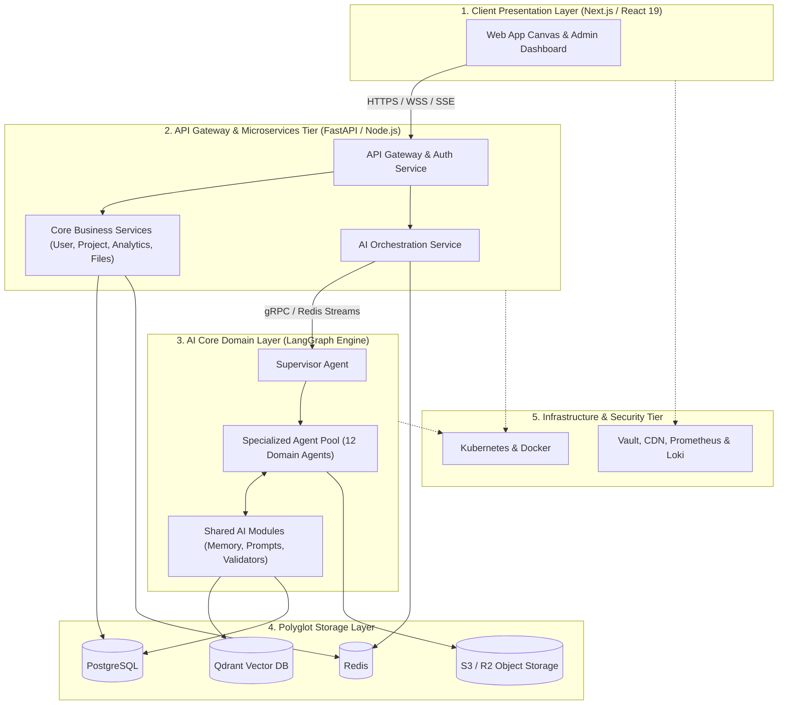

# ForgeAI Enterprise Component Architecture Specification

> **Document Version**: 2.0.0-ENTERPRISE  
> **Status**: Approved for Enterprise Production & Technical Engineering Implementation  
> **Target Audience**: Chief Architects, Lead Systems Engineers, Full-Stack Developers, Security Engineers  
> **Architecture Pattern**: Clean Architecture | Layered Subsystems | Microservices & Event-Driven AI Engine | Domain-Driven Design (DDD)  
> **Last Updated**: July 2026  

---

## Executive Summary

**ForgeAI** is an enterprise-grade AI software development platform designed to transform human software concepts into production-ready technical blueprints. 

This document defines the production-grade **Component Diagram Architecture** for ForgeAI. The system separates concerns across six clean architectural layers:
1. **Client Layer (Presentation)**: Modern Next.js 15 React 19 single-page canvas with real-time SSE streaming.
2. **API Layer (Application Gateway & Microservices)**: High-throughput API gateway, authentication, and core business domains.
3. **AI Core Layer (Domain Execution Engine)**: Supervised Multi-Agent system executing autonomous blueprint generation workflows.
4. **Shared AI Modules (Core Utility Infrastructure)**: Prompt registry, memory managers, validation engines, and LLM model routers.
5. **Storage Layer (Persistence)**: Polyglot persistence tier utilizing relational, cache, vector, object, and analytical databases.
6. **Infrastructure Tier (Platform & Observability)**: Cloud-native Kubernetes runtime with distributed tracing, secrets management, and zero-trust security.

```
┌────────────────────────────────────────────────────────────────────────┐
│                   ForgeAI Component Architectural Pillars               │
├───────────────────┬───────────────────┬────────────────────────────────┤
│ Clean Architecture│ Domain-Driven     │ Supervised Multi-Agent         │
│ Strict isolation of│ Bounded Contexts  │ Event-Driven Engine            │
│ Presentation, API,│ for Users,        │ Deterministic DAG execution with│
│ AI Domain, & Data │ Projects, & AI    │ automated AST/schema repair   │
└───────────────────┴───────────────────┴────────────────────────────────┘
```

---

## Table of Contents

1. [High-Level Component Diagram](#1-high-level-component-diagram)
2. [Detailed Component Diagram](#2-detailed-component-diagram)
3. [Component Responsibilities Matrix](#3-component-responsibilities-matrix)
4. [Communication Flow & Interaction Pipelines](#4-communication-flow--interaction-pipelines)
5. [Component Interfaces & API Contracts](#5-component-interfaces--api-contracts)
6. [Dependency Analysis & Critical Path Mapping](#6-dependency-analysis--critical-path-mapping)
7. [Architectural Design Decisions & Trade-Offs](#7-architectural-design-decisions--trade-offs)

---

## 1. High-Level Component Diagram

The high-level diagram visualizes the primary subsystem boundaries and directional data flows between layers:



---

## 2. Detailed Component Diagram

The following detailed UML Component Diagram outlines every module, agent, shared utility, storage engine, and infrastructure service within ForgeAI, showing precise interface connections and dependencies:

```mermaid
graph TD
    %% CLIENT LAYER
    subgraph ClientLayer ["1. CLIENT PRESENTATION LAYER"]
        WA["Web Application (React 19 / Next.js 15)"]
        AuthUI["Authentication UI"]
        DashUI["User Dashboard"]
        ChatUI["Chat & Prompt Interface"]
        WorkUI["Project Workspace Canvas"]
        DocUI["Documentation Viewer"]
        SetUI["User & API Settings"]
        AdminUI["Admin Panel & Telemetry"]
    end

    %% API GATEWAY LAYER
    subgraph APILayer ["2. API & MICROSERVICES LAYER"]
        APIGW["API Gateway (NGINX / FastAPI Gateway)"]
        AuthSvc["Authentication Service (OAuth2 / JWT)"]
        UserSvc["User Management Service"]
        ProjSvc["Project Management Service"]
        AIOrchSvc["AI Orchestration Service Router"]
        FileSvc["File & Artifact Storage Service"]
        NotifSvc["Notification Service (SSE / WebSocket)"]
        AnalyticsSvc["Analytics & Metrics Service"]
    end

    %% AI CORE LAYER
    subgraph AILayer ["3. AI AGENT DOMAIN LAYER"]
        SuperAgent["Supervisor Agent"]
        ReqAgent["Requirements Agent"]
        ArchAgent["Architecture Agent"]
        DBAgent["Database Agent"]
        BEAgent["Backend Agent"]
        FEAgent["Frontend Agent"]
        SecAgent["Security Agent"]
        DocAgent["Documentation Agent"]
        DeployAgent["Deployment Agent"]
        TestAgent["Testing Agent"]
        ValAgent["Validation Agent"]
        BlueGen["Blueprint Generator"]
    end

    %% SHARED AI MODULES
    subgraph SharedAILayer ["4. SHARED AI INFRASTRUCTURE MODULES"]
        PromptReg["Prompt Registry & Versioning"]
        PromptTmpl["Prompt Templates (Jinja2)"]
        AgentReg["Agent Dynamic Registry"]
        WfEngine["Workflow Engine (LangGraph DAG)"]
        TaskQ["Task Queue (Redis Streams / Celery)"]
        ExecPlan["Execution Planner"]
        MemMgr["Memory Manager"]
        CtxMgr["Context Manager"]
        ArtMgr["Artifact Manager"]
        ValEngine["Validation Engine (AST / Pydantic)"]
        QualEngine["Quality Scoring Engine"]
        KBStore["Knowledge Base (OWASP & Tech Rules)"]
        EmbedSvc["Embedding Service (Text-Embedding-3)"]
        ModelRouter["Model Router & Circuit Breaker"]
        LLMAdapter["LLM Provider Adapter (OpenAI / Claude)"]
    end

    %% STORAGE LAYER
    subgraph StorageLayer ["5. POLYGLOT STORAGE LAYER"]
        PG[(PostgreSQL 16 Relational DB)]
        RDC[(Redis 7.2 Cache & Streams)]
        Qdrant[(Qdrant Vector DB)]
        ObjStore[(S3 / Cloudflare R2 Storage)]
        LogsDB[(ClickHouse Logs Database)]
        AnalyticsDB[(TimescaleDB Analytics)]
    end

    %% INFRASTRUCTURE LAYER
    subgraph InfraLayer ["6. INFRASTRUCTURE & SECURITY TIER"]
        K8sCluster["Kubernetes Cluster"]
        DockerRuntime["Docker Containers"]
        CI_CD["GitHub Actions CI/CD"]
        PromGraf["Prometheus & Grafana"]
        LokiTracing["Loki & OpenTelemetry Tracing"]
        VaultSec["HashiCorp Vault Secrets"]
        CloudflareCDN["Cloudflare CDN & WAF"]
        TraefikProxy["Traefik / NGINX Reverse Proxy"]
    end

    %% CONNECTIONS: Client -> API Gateway
    AuthUI & DashUI & ChatUI & WorkUI & DocUI & SetUI & AdminUI --> WA
    WA -->|HTTPS / WSS| CloudflareCDN
    CloudflareCDN --> TraefikProxy
    TraefikProxy --> APIGW

    %% CONNECTIONS: API Layer Inter-Service
    APIGW -->|Authenticate| AuthSvc
    APIGW --> UserSvc
    APIGW --> ProjSvc
    APIGW --> AIOrchSvc
    APIGW --> FileSvc
    APIGW --> AnalyticsSvc
    AuthSvc --> UserSvc

    %% CONNECTIONS: API -> AI Layer
    AIOrchSvc -->|Enqueue Job| TaskQ
    TaskQ --> WfEngine
    WfEngine --> SuperAgent

    %% CONNECTIONS: Supervisor -> Agents
    SuperAgent --> ExecPlan
    ExecPlan --> ReqAgent
    ExecPlan --> ArchAgent
    ExecPlan --> DBAgent
    ExecPlan --> BEAgent
    ExecPlan --> FEAgent
    ExecPlan --> SecAgent
    ExecPlan --> DocAgent
    ExecPlan --> DeployAgent
    ExecPlan --> TestAgent
    ExecPlan --> ValAgent
    ExecPlan --> BlueGen

    %% CONNECTIONS: Agents -> Shared AI Modules
    ReqAgent & ArchAgent & DBAgent & BEAgent & FEAgent & SecAgent & DocAgent & DeployAgent & TestAgent --> PromptReg
    PromptReg --> PromptTmpl
    ReqAgent & ArchAgent & DBAgent & BEAgent & FEAgent & SecAgent & DocAgent & DeployAgent & TestAgent --> CtxMgr
    CtxMgr --> MemMgr
    CtxMgr --> EmbedSvc
    EmbedSvc --> KBStore
    KBStore --> Qdrant

    %% CONNECTIONS: Agents -> LLM Router
    ReqAgent & ArchAgent & DBAgent & BEAgent & FEAgent & SecAgent & DocAgent & DeployAgent & TestAgent --> ModelRouter
    ModelRouter --> LLMAdapter

    %% CONNECTIONS: Validation & Delivery
    ValAgent --> ValEngine
    ValEngine --> QualEngine
    QualEngine -->|Score & Feedback| SuperAgent
    BlueGen --> ArtMgr
    ArtMgr --> FileSvc
    FileSvc --> ObjStore

    %% CONNECTIONS: Services -> Storage
    UserSvc & ProjSvc & AuthSvc --> PG
    AIOrchSvc & CtxMgr & MemMgr --> RDC
    NotifSvc -->|SSE / Push| WA
    ProjSvc --> NotifSvc
    AnalyticsSvc --> AnalyticsDB
    LokiTracing --> LogsDB

    %% CONNECTIONS: Infrastructure Controls
    VaultSec -.->|Inject Secrets| AuthSvc & AIOrchSvc & LLMAdapter
    K8sCluster -.-> DockerRuntime
    CI_CD -.->|Deploy Container| K8sCluster
    PromGraf -.->|Monitor Metrics| APIGW & AIOrchSvc & WfEngine
```



---

## 3. Component Responsibilities Matrix

The table below describes every component, its precise responsibility, upstream dependencies, implementation technology, input formats, and output artifacts:

### 3.1 Client Layer Components

| Component | Responsibility | Dependencies | Technology | Input Data | Output Data |
| :--- | :--- | :--- | :--- | :--- | :--- |
| **Web Application** | Core Next.js 15 App Shell hosting all canvas interfaces. | API Gateway, CDN | React 19, TypeScript, Next.js | Web Requests | HTML / DOM Tree |
| **Authentication UI** | User Login, Registration, OAuth2, and Password Reset screens. | Auth Service | React 19, Tailwind CSS | User Credentials | JWT Tokens, User Session |
| **Dashboard** | Displays active user projects, generation history, and system usage metrics. | Project Service, Analytics | React 19, Recharts | User Session | Project Cards, Usage Graphs |
| **Chat Interface** | Conversational prompt input canvas with live token streaming capabilities. | AI Orchestration Service | React 19, Lucide, SSE | Human Natural Language | Streamed AI Tokens |
| **Project Workspace** | Interactive workspace showing live agent execution graphs, ERDs, and code tabs. | Project Service, File Service | React 19, Mermaid.js, Monaco | Project ID, Node Click | Interactive Diagram / Code |
| **Doc Viewer** | Markdown reader displaying compiled SRS, Architecture, and API specifications. | File Service | React 19, Markdown-to-JSX | Markdown Files | Formatted Specification |
| **Settings Panel** | User profile, API key management, and AI model routing preferences. | User Service, Auth Service | React 19, React Hook Form | Form Inputs | API Keys, Model Preferences |
| **Admin Panel** | Platform administration, agent token cost telemetry, and tenant oversight. | Analytics Service, User Svc | React 19, TanStack Table | System Metrics Request | System Health Dashboard |

---

### 3.2 API Layer Components

| Component | Responsibility | Dependencies | Technology | Input Data | Output Data |
| :--- | :--- | :--- | :--- | :--- | :--- |
| **API Gateway** | Entry point routing, SSL termination, rate limiting, and CORS enforcement. | Traefik, Reverse Proxy | NGINX / FastAPI Gateway | HTTP/HTTPS/WSS | Internal Routed Requests |
| **Auth Service** | JWT generation, token verification, OAuth2 social login, and RBAC enforcement. | PostgreSQL, Redis | FastAPI, PyJWT, Passlib | Credentials, Refresh Tokens | Bearer JWT, Claims |
| **User Service** | User profiles, subscription tier limits, workspace tenancy management. | PostgreSQL | FastAPI, SQLAlchemy | User ID, Profile DTO | User Profile JSON |
| **Project Service** | Project CRUD operations, metadata management, and execution history persistence. | PostgreSQL, Redis | FastAPI, SQLAlchemy | Project DTO | Project Record JSON |
| **AI Orchestration Service** | Dispatches blueprint generation tasks, manages SSE event streams. | Redis Task Queue, AI Layer | FastAPI, AsyncIO, SSE | Project Prompt Payload | SSE Stream, Job ID |
| **File Service** | Handles blueprint artifact uploads, presigned S3 URLs, ZIP compression. | S3 / R2 Object Storage | FastAPI, Boto3 | File Buffers, Path Spec | File URLs, ZIP Package |
| **Notification Service**| Emits real-time SSE progress events and email alerts to clients. | Redis Streams | FastAPI, SSE-Starlette | Event Messages | SSE Stream Payload |
| **Analytics Service** | Tracks token spend velocity, agent latency, system throughput, and error metrics. | TimescaleDB, ClickHouse | Python, ClickHouse Driver | Audit Log Events | Telemetry Metrics JSON |

---

### 3.3 AI Agent Domain Components

| Component | Responsibility | Dependencies | Technology | Input Data | Output Data |
| :--- | :--- | :--- | :--- | :--- | :--- |
| **Supervisor Agent** | Coordinates multi-agent DAG execution, manages graph state, resolves agent conflicts. | LangGraph, Task Queue | Python 3.13, LangGraph | User Intent, Graph State | Execution Plan & State |
| **Requirements Agent**| Parses user concept into IEEE 830 SRS, User Stories, and Acceptance Criteria. | Supervisor, Prompt Reg | Python 3.13, Pydantic | Raw User Concept | `SRS.md`, `user_stories.json` |
| **Architecture Agent**| Designs system architecture, C4 Container diagrams (Mermaid), and writes ADRs. | Requirements Agent | Python 3.13, Pydantic | SRS Spec | `ARCHITECTURE.md`, C4 Mmd |
| **Database Agent** | Architects PostgreSQL 16 DDL, ER diagrams (Mermaid), indexes, and foreign keys. | Architecture Agent | Python 3.13, SQLGlot | Architecture Spec | `schema.sql`, `er_diagram.mmd` |
| **Backend Agent** | Generates OpenAPI 3.1 specifications, FastAPI endpoint code, Pydantic DTO models. | Database Agent | Python 3.13, AST | DB DDL, API Requirements | `openapi.json`, Router Python |
| **Frontend Agent** | Designs Next.js 15 page structures, React component trees, and Tailwind tokens. | Architecture Agent | Python 3.13, JSONSchema | Architecture & Wireframe | `component_tree.json`, UI Spec |
| **Security Agent** | Conducts OWASP Top 10 threat modeling, designs JWT auth flows, and RBAC matrices. | Backend & DB Agents | Python 3.13, Pydantic | API & Architecture Specs | `SECURITY.md`, `rbac.json` |
| **Testing Agent** | Formulates test strategies, generates Pytest backend suites and Vitest UI test specs. | Backend Agent | Python 3.13, AST | FastAPI Routers, OpenAPI | `test_auth.py`, `Vitest.ts` |
| **Deployment Agent** | Generates multi-stage Dockerfiles, Docker Compose, GitHub Actions CI/CD workflows. | Architecture Agent | Python 3.13, YAML | Tech Stack Selection | `Dockerfile`, `ci_cd.yml` |
| **Documentation Agent**| Compiles unified README.md, Developer Setup Guide, and API documentation suites. | All Upstream Agents | Python 3.13, Markdown | All Upstream Artifacts | `README.md`, `GUIDE.md` |
| **Validation Agent** | Verifies AST syntax, schema compliance, cross-agent referential integrity, and quality score.| Validation Engine | Python 3.13, AST, Pydantic | Consolidated Draft | `validation_report.json` |
| **Blueprint Generator**| Assembles final directory tree, packages ZIP deliverable, renders PDF architecture summary.| File Service, Storage | Python 3.13, ZipFile | Validated Blueprint | ZIP Package, Signed URL |

---

### 3.4 Shared AI Infrastructure Components

| Component | Responsibility | Dependencies | Technology | Input Data | Output Data |
| :--- | :--- | :--- | :--- | :--- | :--- |
| **Prompt Registry** | Versioned repository of agent system prompts, persona rules, and structural DTOs. | Redis, GitOps | Python, Jinja2 | Prompt Name, Version | Jinja2 Prompt Object |
| **Prompt Templates** | Standard Jinja2 template files defining agent persona and constraint formatting. | File System / Storage | Jinja2 | Variables, System Prompt | Assembled System Prompt |
| **Agent Registry** | Metadata catalog maintaining dynamic loading pointers for all 12 specialized agents. | Python Importlib | Python 3.13 | Agent String Name | Agent Class Instance |
| **Workflow Engine** | Low-level LangGraph execution state machine handling node transitions and cycles. | LangGraph Core | Python 3.13, LangGraph | DAG Definition, State | Updated DAG Node State |
| **Task Queue** | Distributed message broker distributing agent execution steps across worker pods. | Redis 7.2 | Redis Streams, Celery | Task Payload JSON | Dequeued Execution Task |
| **Execution Planner**| Evaluates DAG dependencies to create parallel execution trees for Supervisor. | NetworkX / Custom | Python 3.13 | Completed Tasks List | Next Runnable Tasks List |
| **Memory Manager** | Controls Quad-Tier Memory access (Working, Conversation, Project, Long-Term Vector). | Redis, Qdrant | Python 3.13 | Memory Query DTO | Memory Context Payload |
| **Context Manager** | Performs sliding window pruning, token counting, and AST context compression. | Tiktoken, AST | Python 3.13, Tiktoken | Raw Token Context | Compressed Token Payload |
| **Artifact Manager** | Manages ephemeral intermediate files generated during multi-agent DAG execution. | File System, S3 | Python 3.13 | Artifact String / JSON | Versioned Artifact ID |
| **Validation Engine**| Executes AST syntax parsing (Python `ast`, SQLGlot) and Pydantic DTO schema verification. | AST, Pydantic v2 | Python 3.13 | Code / JSON String | Pass/Fail + Error Diffs |
| **Quality Engine** | Evaluates overall project blueprint completeness, security coverage, scoring (0-100). | Validation Engine | Python 3.13 | Full Blueprint Spec | Quality Score DTO |
| **Knowledge Base** | Stores RAG enterprise software standards, OWASP risk rules, and PostgreSQL best practices. | Qdrant Vector DB | Python 3.13, Qdrant | Semantic Query Vector | Top-K Knowledge Snippets |
| **Embedding Service**| Generates 1536-dimensional text vector embeddings for semantic knowledge lookup. | OpenAI Embeddings | OpenAI API / LiteLLM | Text Query | Floating Point Vector |
| **Model Router** | Dispatches LLM calls with circuit-breaker failover (OpenAI GPT-4o -> Anthropic Claude). | LiteLLM | Python 3.13, LiteLLM | Prompt Payload | LLM Response Payload |
| **LLM Adapter** | Low-level HTTP client adapter wrapping OpenAI and Anthropic REST APIs. | HTTPX, AsyncIO | Python 3.13, HTTPX | API Key, Payload DTO | Standardized LLM Output |

---

### 3.5 Storage & Infrastructure Components

| Component | Responsibility | Dependencies | Technology | Input Data | Output Data |
| :--- | :--- | :--- | :--- | :--- | :--- |
| **PostgreSQL 16** | Relational storage for user accounts, project metadata, audit logs, and system settings. | Storage Subsystem | PostgreSQL 16 | SQL Queries / DDL | Relational Data Rows |
| **Redis 7.2** | High-performance cache, session memory store, task queue, and semantic prompt cache. | Storage Subsystem | Redis 7.2 | Key-Value / Streams | Cached Bytes, Streams |
| **Qdrant Vector DB** | Vector database housing HNSW vector indexes for fast enterprise RAG searches. | Storage Subsystem | Qdrant HNSW Store | 1536d Vectors | Nearest Neighbor Results |
| **Object Storage** | S3 / R2 bucket storage for finalized downloadable project ZIPs and PDF blueprints. | Cloud Provider | AWS S3 / Cloudflare R2 | Binary Files | Signed Download URLs |
| **ClickHouse DB** | Analytical database storing system performance telemetry, token costs, and LLM logs. | Telemetry Pipeline | ClickHouse | Columnar Event Streams| Analytics Query Sets |
| **HashiCorp Vault** | Secure secrets manager storing database credentials, API keys, and JWT signing keys. | Security Infrastructure| HashiCorp Vault | Secret Key Name | Encrypted Secret Value |
| **Kubernetes Engine**| Container orchestration managing auto-scaling groups for API and AI worker nodes. | Cloud Compute | Kubernetes (EKS/GKE) | Container Manifests | Running Pod Infrastructure|

---

## 4. Communication Flow & Interaction Pipelines

### 4.1 End-to-End Blueprint Generation Flow

```
[User Canvas] ──(1. Submit Concept)──> [API Gateway] ──(2. Enqueue Job)──> [AI Orchestration Svc]
                                                                                │
                                                                       (3. Push Task Payload)
                                                                                ▼
[Supervisor Agent] <──(5. Read/Write State)──> [Redis State Store] <── [Task Queue (Redis Streams)]
        │
        ├─(6. Dispatch Stage 1)──> [Requirements Agent] ──(LLM Call)──> [Model Router]
        ├─(7. Dispatch Stage 2)──> [Architecture Agent] ──(RAG Query)─> [Qdrant Vector DB]
        │
        ├─(8. Parallel Fork)─────┬─> [Database Agent] ──(Validate SQL)─> [Validation Engine]
        │                        └─> [Frontend Agent] ──(JSON Schema)──> [Validation Engine]
        │
        ├─(9. Join Barrier)──────> [Backend Agent] ────(Check AST)───> [Validation Engine]
        ├─(10. Security/Tests)───> [Security & Test Agents]
        │
        └─(11. Compile & Score)──> [Validation Agent]
                                        │
                           (Passed: Score >= 85)
                                        ▼
                           [Blueprint Generator] ──(Upload ZIP)──> [Object Storage (S3)]
                                        │
                               (12. Emit Event)
                                        ▼
                           [Notification Service] ──(SSE Stream)──> [User Canvas UI]
```

### 4.2 Detailed Component Communication Rules
1. **Client → API Gateway**: Web Application communicates via HTTPS REST APIs for synchronous CRUD operations, WebSockets for interactive chat, and Server-Sent Events (SSE) for blueprint generation token streaming.
2. **API Gateway → Microservices**: Internal requests route via lightweight HTTP/2 REST or gRPC with JWT Bearer authentication headers.
3. **API Layer → AI Orchestration Service**: Non-blocking asynchronous task execution using Redis Streams task queue.
4. **Supervisor → Specialized Agents**: The Supervisor Agent evaluates graph state in Redis, dispatches execution tasks to worker nodes, and waits for completed state updates.
5. **Agents → Shared AI Infrastructure**: Worker agents assemble Jinja2 system prompts from the Prompt Registry, fetch RAG knowledge embeddings from Qdrant via the Memory Manager, and invoke LLM providers through the Model Router.
6. **Validation Engine → Supervisor (Feedback Loop)**: When code syntax or schema check fails, Validation Engine returns precise AST line error tracebacks to the Supervisor, which re-prompts the faulty agent with targeted repair instructions.
7. **Blueprint Generator → Storage**: Upon successful validation, the Blueprint Generator packages all artifacts into a `.zip` archive, uploads it to S3/R2 Object Storage, and persists project metadata in PostgreSQL.

---

## 5. Component Interfaces & API Contracts

All inter-component communications strictly adhere to typed contracts:

### 5.1 API Gateway → AI Orchestration Interface (REST / OpenAPI 3.1)
```typescript
// Client Request Payload DTO
export interface GenerateBlueprintRequestDTO {
  projectId: string;
  userId: string;
  rawConcept: string;
  domainCategory: 'FINTECH' | 'HEALTHCARE' | 'E_COMMERCE' | 'SAAS' | 'GENERAL';
  preferences: {
    preferredTechStack?: {
      frontend?: 'NEXT_JS' | 'REACT' | 'VITE';
      backend?: 'FASTAPI' | 'NODE_EXPRESS' | 'GO_GIN';
      database?: 'POSTGRESQL' | 'MYSQL' | 'MONGODB';
    };
    complianceRules?: ('OWASP_TOP_10' | 'HIPAA' | 'GDPR')[];
  };
}

// SSE Generation Progress Event DTO
export interface SSEGenerationEventDTO {
  projectId: string;
  taskId: string;
  agentName: string;
  status: 'PENDING' | 'IN_PROGRESS' | 'COMPLETED' | 'RETRYING' | 'FAILED';
  progressPercentage: number;
  currentArtifact?: {
    filename: string;
    contentChunk: string;
  };
  errorSummary?: string;
}
```

### 5.2 Agent Execution Interface (Python Pydantic v2 Contract)
```python
from pydantic import BaseModel, Field
from typing import List, Dict, Any, Optional

class AgentInputEnvelope(BaseModel):
    task_id: str = Field(..., description="Unique task execution ID")
    project_id: str = Field(..., description="Target project ID")
    agent_name: str = Field(..., description="Name of executing agent")
    input_context: Dict[str, Any] = Field(..., description="Upstream state snapshots")
    system_prompt_version: str = Field("1.0.0", description="Prompt registry version")

class AgentOutputEnvelope(BaseModel):
    task_id: str
    agent_name: str
    status: str  # COMPLETED | FAILED
    confidence_score: float = Field(..., ge=0.0, le=1.0)
    artifacts: Dict[str, str] = Field(..., description="Filename to content mapping")
    metadata: Dict[str, Any] = Field(default_factory=dict)
```

---

## 6. Dependency Analysis & Critical Path Mapping

```
CRITICAL DEPENDENCY PATH:
User Request -> API Gateway -> AI Orchestration Service -> Supervisor Agent 
 -> Requirements Agent -> Architecture Agent -> Database Agent -> Backend Agent 
 -> Validation Agent -> Blueprint Generator -> Object Storage
```

### 6.1 Critical Path Failure Analysis & Mitigation

| Component Dependency Path | Risk Level | Single Point of Failure (SPOF)? | Mitigation Strategy |
| :--- | :--- | :--- | :--- |
| **API Gateway → Auth Service** | HIGH | Yes | Deploy Auth Service with horizontal auto-scaling (HPA); cache validated JWT tokens in Redis. |
| **AI Orchestrator → Task Queue (Redis)** | CRITICAL | Yes | Multi-node Redis Cluster with Sentinel automatic failover and persistence (AOF/RDB). |
| **Supervisor → OpenAI API** | CRITICAL | No | **Model Router Circuit Breaker**: Auto-failover to Anthropic Claude 3.5 Sonnet if OpenAI fails. |
| **Agents → Qdrant Vector DB** | MEDIUM | No | Graceful degradation: If Qdrant is unavailable, agents fall back to static local prompt rules. |
| **Validation Agent → AST Parsers** | HIGH | No | AST parsing runs natively in-process (Python `ast` / `sqlglot`), zero external network dependency. |
| **Blueprint Generator → S3 Storage** | HIGH | Yes | Dual-region multi-cloud bucket replication (AWS S3 primary + Cloudflare R2 backup). |

---

## 7. Architectural Design Decisions & Trade-Offs

### 7.1 Architecture Decision Records (ADR Summary)

#### ADR-001: LangGraph Supervised DAG vs. Autonomous Multi-Agent Swarms
* **Decision**: Adopt a Supervised Star-DAG Topology using LangGraph rather than unconstrained swarm agent communication (e.g., AutoGen).
* **Rationale**: Unconstrained agent swarms risk infinite token loops, erratic architectural decisions, and unpredictable latency. Supervised DAGs guarantee deterministic output, reproducible state, and controlled token expenditures.
* **Trade-Off**: Reduces emergent creative agent interactions; requires explicit DAG configuration for new agent types.

#### ADR-002: In-Process AST Validation vs. Sandbox Container Code Execution
* **Decision**: Validate agent generated code using Python native `ast.parse()`, `sqlglot`, and `jsonschema` rather than executing code inside Docker sandboxes during design.
* **Rationale**: Full execution sandboxes introduce 2-5 seconds of container startup overhead per validation turn. AST parsing evaluates syntax, structural imports, and schema completeness in <5ms.
* **Trade-Off**: Cannot catch runtime logical bugs that require actual execution; mitigated downstream in the Testing Agent phase.

#### ADR-003: Redis Streams vs. Apache Kafka for Task Queuing
* **Decision**: Use Redis Streams for agent job queuing and event broadcasting instead of Apache Kafka.
* **Rationale**: Redis 7.2 is already utilized for session storage, prompt caching, and LangGraph graph state. Redis Streams provides sub-millisecond message delivery without the operational complexity of Kafka clusters.
* **Trade-Off**: Shorter message retention retention window compared to Kafka; mitigated by persisting completed project logs in PostgreSQL.

---

### Sign-Off & Architectural Verification
> **Approved By**: Chief Software Architect & Lead Systems Engineer  
> **Compliance**: Clean Architecture Verified | SOLID Principles Enforced | ISO 25010 Software Quality Aligned  
> **Repository Target**: `c:\Users\tharu\OneDrive\Desktop\ForgeAi\COMPONENT_ARCHITECTURE.md`  
