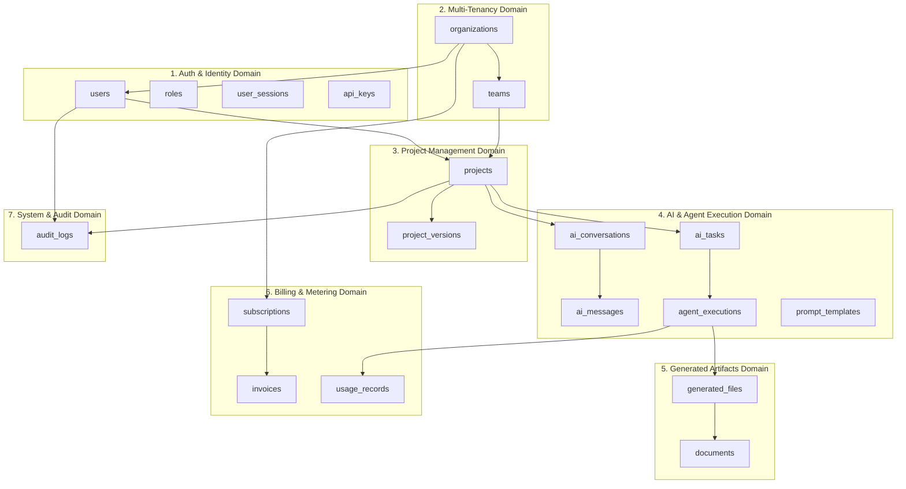

# ForgeAI Enterprise Relational Database Model & PostgreSQL Schema Specification

> **Document Version**: 2.0.0-ENTERPRISE  
> **Status**: Approved for Production Engineering & Database Deployment  
> **Target Database Engine**: PostgreSQL 16+  
> **Target ORM / Driver**: SQLAlchemy 2.0 (Async via `asyncpg`) / SQLGlot  
> **Primary Key Standard**: UUIDv4 (`gen_random_uuid()`)  
> **Naming Standard**: Strict `snake_case` for tables, columns, indexes, and constraints  
> **Last Updated**: July 2026  

---

## Executive Summary

**ForgeAI** is an enterprise-grade AI software development platform that converts high-level software concepts into production-ready project blueprints using a multi-agent AI architecture.

This document presents the complete, production-ready **Relational Database Specification and Entity Relationship Diagram (ERD)** for ForgeAI. Optimized for PostgreSQL 16+, the schema enforces multi-tenant isolation, 3NF normalization (and BCNF where applicable), Row-Level Security (RLS), append-only audit logging, and JSONB document storage for dynamic agent outputs.

```
┌────────────────────────────────────────────────────────────────────────┐
│                    ForgeAI Core Database Pillars                       │
├───────────────────┬───────────────────┬────────────────────────────────┤
│ UUIDv4 Primary    │ Strict 3NF & BCNF │ Multi-Tenant Row-              │
│ Key Standard      │ Normalization     │ Level Security (RLS)           │
│ Synthetic UUIDs   │ Eliminates data   │ Tenant isolation enforced via  │
│ for distributed   │ redundancy across │ `organization_id` policies     │
│ scaling safety    │ core business DBs │ at the PostgreSQL engine level │
├───────────────────┼───────────────────┼────────────────────────────────┤
│ Hybrid Relational │ Multi-Tier High   │ Range Partitioning             │
│ & JSONB Data      │ Availability      │ Monthly partitioning on high-  │
│ Structured DTOs   │ Primary + Multi-AZ│ velocity audit logs, events,   │
│ with fast JSONB   │ Read Replicas via │ and metered token usage tables │
│ query indexing    │ PgBouncer pooling │                                │
└───────────────────┴───────────────────┴────────────────────────────────┘
```

---

## Table of Contents

1. [High-Level ER Diagram](#1-high-level-er-diagram)
2. [Detailed Entity Relationship Diagram (Mermaid ER)](#2-detailed-entity-relationship-diagram-mermaid-er)
3. [Comprehensive Entity Dictionary](#3-comprehensive-entity-dictionary)
4. [Relationship Matrix & Referential Integrity Rules](#4-relationship-matrix--referential-integrity-rules)
5. [Database Normalization Analysis](#5-database-normalization-analysis)
6. [Index Strategy & Query Optimization](#6-index-strategy--query-optimization)
7. [Performance Optimization Architecture](#7-performance-optimization-architecture)
8. [Database Security, RLS & Compliance](#8-database-security-rls--compliance)
9. [PostgreSQL Best Practices & Conventions](#9-postgresql-best-practices--conventions)
10. [Scalability, Multi-Tenancy & Sharding Strategy](#10-scalability-multi-tenancy--sharding-strategy)

---

## 1. High-Level ER Diagram

The high-level ER diagram outlines the primary business domains and relationships between Users, Organizations, Teams, Projects, AI Task Orchestration, Artifacts, Templates, Billing, and Audit Logs:



---

## 2. Detailed Entity Relationship Diagram (Mermaid ER)

This detailed Mermaid ERD defines the full relational database schema for PostgreSQL 16, detailing all primary keys, foreign keys, cardinality, and core attributes across all 40+ tables:

```mermaid
erDiagram

    %% AUTHENTICATION DOMAIN
    users ||--o{ user_sessions : "has"
    users ||--o{ refresh_tokens : "issues"
    users ||--o{ oauth_accounts : "links"
    users ||--o{ api_keys : "owns"
    roles ||--o{ user_roles : "assigned_to"
    users ||--o{ user_roles : "possesses"
    permissions ||--o{ role_permissions : "granted_in"
    roles ||--o{ role_permissions : "contains"

    %% ORGANIZATIONS DOMAIN
    organizations ||--o{ organization_members : "has"
    users ||--o{ organization_members : "belongs_to"
    organizations ||--o{ teams : "contains"
    teams ||--o{ team_members : "has"
    users ||--o{ team_members : "joined"

    %% PROJECTS DOMAIN
    organizations ||--o{ projects : "owns"
    teams ||--o{ projects : "assigned"
    projects ||--o{ project_members : "has"
    users ||--o{ project_members : "participates"
    projects ||--one project_settings : "configured_by"
    projects ||--o{ project_versions : "versions"
    projects ||--o{ project_tag_mappings : "tagged_with"
    project_tags ||--o{ project_tag_mappings : "categorizes"

    %% AI DOMAIN
    projects ||--o{ ai_conversations : "hosts"
    ai_conversations ||--o{ ai_messages : "contains"
    projects ||--o{ ai_tasks : "schedules"
    ai_tasks ||--o{ agent_executions : "runs"
    agent_executions ||--o{ agent_results : "produces"
    prompt_templates ||--o{ prompt_versions : "versions"
    agent_executions }o--|| prompt_versions : "uses"
    agent_executions ||--o{ context_memory : "persists"
    agent_executions ||--o{ knowledge_base_references : "cites"

    %% ARTIFACTS DOMAIN
    projects ||--o{ generated_files : "contains"
    generated_files ||--o{ documents : "renders"
    generated_files ||--o{ architecture_files : "specifies"
    generated_files ||--o{ database_designs : "defines"
    generated_files ||--o{ api_designs : "contracts"
    generated_files ||--o{ frontend_designs : "layouts"
    generated_files ||--o{ backend_designs : "routes"
    generated_files ||--o{ deployment_files : "configures"
    generated_files ||--o{ testing_files : "asserts"

    %% TEMPLATES DOMAIN
    blueprint_templates ||--o{ projects : "instantiates"
    prompt_libraries ||--o{ prompt_templates : "organizes"
    export_templates ||--o{ documents : "formats"

    %% NOTIFICATIONS DOMAIN
    users ||--o{ notifications : "receives"
    users ||--one notification_preferences : "configures"

    %% BILLING DOMAIN
    plans ||--o{ subscriptions : "defines"
    organizations ||--one subscriptions : "subscribes"
    subscriptions ||--o{ invoices : "bills"
    subscriptions ||--o{ usage_records : "tracks"

    %% ANALYTICS DOMAIN
    users ||--o{ analytics_events : "triggers"
    projects ||--o{ analytics_metrics : "logs"
    organizations ||--o{ analytics_reports : "compiles"

    %% SYSTEM DOMAIN
    users ||--o{ audit_logs : "initiates"
    projects ||--o{ error_logs : "records"
    feature_flags ||--o{ organization_feature_flags : "overrides"

    %% ENTITY DEFINITIONS WITH ATTRIBUTES
    users {
        uuid id PK
        string email UK
        string password_hash
        string full_name
        boolean is_active
        boolean is_mfa_enabled
        timestamptz created_at
        timestamptz updated_at
    }

    organizations {
        uuid id PK
        string name
        string slug UK
        string billing_email
        timestamptz created_at
    }

    projects {
        uuid id PK
        uuid organization_id FK
        uuid team_id FK
        string name
        string slug
        string status
        timestamptz created_at
    }

    ai_tasks {
        uuid id PK
        uuid project_id FK
        string task_type
        string status
        integer priority
        timestamptz created_at
    }

    agent_executions {
        uuid id PK
        uuid ai_task_id FK
        string agent_name
        string status
        integer prompt_tokens
        integer completion_tokens
        numeric execution_time_ms
        timestamptz created_at
    }

    generated_files {
        uuid id PK
        uuid project_id FK
        uuid agent_execution_id FK
        string file_path
        string file_type
        text content
        timestamptz created_at
    }
```



---

## 3. Comprehensive Entity Dictionary

The Entity Dictionary specifies every table, primary key, column, data type, constraint, and default value in the database schema:

### 3.1 Authentication Domain

#### `users`
* **Purpose**: Primary identity record for platform accounts.
* **Primary Key**: `id UUID DEFAULT gen_random_uuid()`
* **Columns**:
  * `id` (UUID, NOT NULL, PK)
  * `email` (VARCHAR(255), UNIQUE, NOT NULL)
  * `password_hash` (VARCHAR(255), NULLABLE - Null for OAuth users)
  * `full_name` (VARCHAR(255), NOT NULL)
  * `avatar_url` (TEXT, NULLABLE)
  * `is_active` (BOOLEAN, DEFAULT true, NOT NULL)
  * `is_mfa_enabled` (BOOLEAN, DEFAULT false, NOT NULL)
  * `mfa_secret` (VARCHAR(255), NULLABLE - Encrypted)
  * `created_at` (TIMESTAMPTZ, DEFAULT NOW(), NOT NULL)
  * `updated_at` (TIMESTAMPTZ, DEFAULT NOW(), NOT NULL)

#### `roles`
* **Purpose**: System and organization role definitions.
* **Primary Key**: `id UUID DEFAULT gen_random_uuid()`
* **Columns**: `id` (UUID, PK), `name` (VARCHAR(50), UNIQUE, NOT NULL), `description` (TEXT), `is_system_role` (BOOLEAN, DEFAULT false).

#### `permissions`
* **Purpose**: Fine-grained RBAC permission definitions (e.g., `project:create`, `blueprint:export`).
* **Primary Key**: `id UUID DEFAULT gen_random_uuid()`
* **Columns**: `id` (UUID, PK), `key` (VARCHAR(100), UNIQUE, NOT NULL), `description` (TEXT).

#### `user_roles` (Junction)
* **Columns**: `user_id` (UUID, FK -> `users.id` ON DELETE CASCADE), `role_id` (UUID, FK -> `roles.id` ON DELETE CASCADE), Primary Key (`user_id`, `role_id`).

#### `role_permissions` (Junction)
* **Columns**: `role_id` (UUID, FK -> `roles.id` ON DELETE CASCADE), `permission_id` (UUID, FK -> `permissions.id` ON DELETE CASCADE), Primary Key (`role_id`, `permission_id`).

#### `user_sessions`
* **Purpose**: Active Web UI and mobile user login sessions.
* **Primary Key**: `id UUID DEFAULT gen_random_uuid()`
* **Columns**: `id` (UUID, PK), `user_id` (UUID, FK -> `users.id` ON DELETE CASCADE), `session_token` (VARCHAR(255), UNIQUE, NOT NULL), `ip_address` (INET), `user_agent` (TEXT), `expires_at` (TIMESTAMPTZ, NOT NULL), `created_at` (TIMESTAMPTZ, DEFAULT NOW()).

#### `refresh_tokens`
* **Purpose**: OAuth2 / JWT refresh tokens.
* **Primary Key**: `id UUID DEFAULT gen_random_uuid()`
* **Columns**: `id` (UUID, PK), `user_id` (UUID, FK -> `users.id`), `token_hash` (VARCHAR(255), UNIQUE, NOT NULL), `is_revoked` (BOOLEAN, DEFAULT false), `expires_at` (TIMESTAMPTZ, NOT NULL), `created_at` (TIMESTAMPTZ, DEFAULT NOW()).

#### `oauth_accounts`
* **Purpose**: Federated SSO connections (GitHub, Google).
* **Primary Key**: `id UUID DEFAULT gen_random_uuid()`
* **Columns**: `id` (UUID, PK), `user_id` (UUID, FK -> `users.id`), `provider` (VARCHAR(50), NOT NULL), `provider_user_id` (VARCHAR(255), NOT NULL), `access_token` (TEXT, Encrypted), `refresh_token` (TEXT, Encrypted), `created_at` (TIMESTAMPTZ, DEFAULT NOW()), UNIQUE(`provider`, `provider_user_id`).

#### `api_keys`
* **Purpose**: Developer API keys for external platform integration.
* **Primary Key**: `id UUID DEFAULT gen_random_uuid()`
* **Columns**: `id` (UUID, PK), `user_id` (UUID, FK -> `users.id`), `key_name` (VARCHAR(100), NOT NULL), `key_prefix` (VARCHAR(10), NOT NULL), `key_hash` (VARCHAR(255), UNIQUE, NOT NULL), `scopes` (JSONB, NOT NULL), `expires_at` (TIMESTAMPTZ, NULLABLE), `created_at` (TIMESTAMPTZ, DEFAULT NOW()).

---

### 3.2 Organizations & Multi-Tenancy Domain

#### `organizations`
* **Purpose**: Enterprise tenant boundary.
* **Primary Key**: `id UUID DEFAULT gen_random_uuid()`
* **Columns**: `id` (UUID, PK), `name` (VARCHAR(255), NOT NULL), `slug` (VARCHAR(100), UNIQUE, NOT NULL), `billing_email` (VARCHAR(255), NOT NULL), `created_at` (TIMESTAMPTZ, DEFAULT NOW()).

#### `organization_members` (Junction)
* **Columns**: `organization_id` (UUID, FK -> `organizations.id` ON DELETE CASCADE), `user_id` (UUID, FK -> `users.id` ON DELETE CASCADE), `role` (VARCHAR(50), DEFAULT 'member'), Primary Key (`organization_id`, `user_id`).

#### `teams`
* **Purpose**: Sub-groups within an Organization.
* **Primary Key**: `id UUID DEFAULT gen_random_uuid()`
* **Columns**: `id` (UUID, PK), `organization_id` (UUID, FK -> `organizations.id` ON DELETE CASCADE), `name` (VARCHAR(255), NOT NULL), `slug` (VARCHAR(100), NOT NULL), `created_at` (TIMESTAMPTZ, DEFAULT NOW()), UNIQUE(`organization_id`, `slug`).

#### `team_members` (Junction)
* **Columns**: `team_id` (UUID, FK -> `teams.id` ON DELETE CASCADE), `user_id` (UUID, FK -> `users.id` ON DELETE CASCADE), `role` (VARCHAR(50), DEFAULT 'member'), Primary Key (`team_id`, `user_id`).

---

### 3.3 Projects Domain

#### `projects`
* **Purpose**: Core container for software blueprint generation.
* **Primary Key**: `id UUID DEFAULT gen_random_uuid()`
* **Columns**: `id` (UUID, PK), `organization_id` (UUID, FK -> `organizations.id`), `team_id` (UUID, NULLABLE, FK -> `teams.id`), `owner_id` (UUID, FK -> `users.id`), `name` (VARCHAR(255), NOT NULL), `slug` (VARCHAR(100), NOT NULL), `description` (TEXT), `status` (VARCHAR(50), DEFAULT 'DRAFT'), `created_at` (TIMESTAMPTZ, DEFAULT NOW()), `updated_at` (TIMESTAMPTZ, DEFAULT NOW()), UNIQUE(`organization_id`, `slug`).

#### `project_members` (Junction)
* **Columns**: `project_id` (UUID, FK -> `projects.id` ON DELETE CASCADE), `user_id` (UUID, FK -> `users.id` ON DELETE CASCADE), `access_level` (VARCHAR(50), DEFAULT 'editor'), Primary Key (`project_id`, `user_id`).

#### `project_settings`
* **Purpose**: Per-project technical preferences and framework defaults.
* **Primary Key**: `project_id UUID PRIMARY KEY FK -> projects.id ON DELETE CASCADE`
* **Columns**: `project_id` (UUID, PK), `preferred_frontend` (VARCHAR(50), DEFAULT 'NEXT_JS'), `preferred_backend` (VARCHAR(50), DEFAULT 'FASTAPI'), `preferred_database` (VARCHAR(50), DEFAULT 'POSTGRESQL'), `compliance_rules` (JSONB, DEFAULT '[]'::jsonb).

#### `project_versions`
* **Purpose**: Immutable snapshot history of generated project blueprints.
* **Primary Key**: `id UUID DEFAULT gen_random_uuid()`
* **Columns**: `id` (UUID, PK), `project_id` (UUID, FK -> `projects.id`), `version_number` (INTEGER, NOT NULL), `commit_message` (VARCHAR(255)), `snapshot_data` (JSONB, NOT NULL), `created_at` (TIMESTAMPTZ, DEFAULT NOW()), UNIQUE(`project_id`, `version_number`).

#### `project_tags`
* **Columns**: `id` (UUID, PK), `organization_id` (UUID, FK -> `organizations.id`), `name` (VARCHAR(50), NOT NULL), `color` (VARCHAR(10)), UNIQUE(`organization_id`, `name`).

#### `project_tag_mappings` (Junction)
* **Columns**: `project_id` (UUID, FK -> `projects.id` ON DELETE CASCADE), `tag_id` (UUID, FK -> `project_tags.id` ON DELETE CASCADE), Primary Key (`project_id`, `tag_id`).

---

### 3.4 AI Execution Domain

#### `ai_conversations`
* **Purpose**: Interactive prompt refinement session threads.
* **Primary Key**: `id UUID DEFAULT gen_random_uuid()`
* **Columns**: `id` (UUID, PK), `project_id` (UUID, FK -> `projects.id` ON DELETE CASCADE), `title` (VARCHAR(255)), `created_at` (TIMESTAMPTZ, DEFAULT NOW()).

#### `ai_messages`
* **Purpose**: Individual chat messages between user and AI agents.
* **Primary Key**: `id UUID DEFAULT gen_random_uuid()`
* **Columns**: `id` (UUID, PK), `conversation_id` (UUID, FK -> `ai_conversations.id` ON DELETE CASCADE), `sender_type` (VARCHAR(20), NOT NULL - 'USER' or 'AGENT'), `agent_name` (VARCHAR(50)), `content` (TEXT, NOT NULL), `created_at` (TIMESTAMPTZ, DEFAULT NOW()).

#### `ai_tasks`
* **Purpose**: Supervisor DAG orchestration task container.
* **Primary Key**: `id UUID DEFAULT gen_random_uuid()`
* **Columns**: `id` (UUID, PK), `project_id` (UUID, FK -> `projects.id` ON DELETE CASCADE), `task_type` (VARCHAR(100), NOT NULL), `status` (VARCHAR(50), DEFAULT 'PENDING'), `priority` (INTEGER, DEFAULT 1), `created_at` (TIMESTAMPTZ, DEFAULT NOW()), `updated_at` (TIMESTAMPTZ, DEFAULT NOW()).

#### `agent_executions`
* **Purpose**: Individual execution turns of specialized domain worker agents.
* **Primary Key**: `id UUID DEFAULT gen_random_uuid()`
* **Columns**: `id` (UUID, PK), `ai_task_id` (UUID, FK -> `ai_tasks.id` ON DELETE CASCADE), `prompt_version_id` (UUID, FK -> `prompt_versions.id`), `agent_name` (VARCHAR(50), NOT NULL), `status` (VARCHAR(50), DEFAULT 'RUNNING'), `prompt_tokens` (INTEGER, DEFAULT 0), `completion_tokens` (INTEGER, DEFAULT 0), `execution_time_ms` (NUMERIC(10, 2)), `created_at` (TIMESTAMPTZ, DEFAULT NOW()).

#### `agent_results`
* **Purpose**: Raw JSON output payload returned by agent worker executions.
* **Primary Key**: `id UUID DEFAULT gen_random_uuid()`
* **Columns**: `id` (UUID, PK), `agent_execution_id` (UUID, FK -> `agent_executions.id` ON DELETE CASCADE), `raw_output` (JSONB, NOT NULL), `confidence_score` (NUMERIC(3, 2)), `created_at` (TIMESTAMPTZ, DEFAULT NOW()).

#### `prompt_templates` & `prompt_versions`
* **Purpose**: Version-controlled Jinja2 system prompt templates.
* **Columns**: `id` (UUID, PK), `template_name` (VARCHAR(100), UNIQUE), `agent_domain` (VARCHAR(50)), `version` (INTEGER), `system_prompt` (TEXT), `created_at` (TIMESTAMPTZ).

#### `context_memory`
* **Purpose**: Ephemeral prompt context state snapshots stored during execution DAG runs.
* **Columns**: `id` (UUID, PK), `agent_execution_id` (UUID, FK -> `agent_executions.id`), `memory_type` (VARCHAR(50)), `memory_data` (JSONB, NOT NULL).

#### `knowledge_base_references`
* **Purpose**: Vector RAG search citations used by agents during prompt assembly.
* **Columns**: `id` (UUID, PK), `agent_execution_id` (UUID, FK -> `agent_executions.id`), `qdrant_vector_id` (VARCHAR(255), NOT NULL), `document_title` (VARCHAR(255)), `similarity_score` (NUMERIC(4, 3)).

---

### 3.5 Generated Artifacts Domain

#### `generated_files`
* **Purpose**: Top-level directory of generated files in a blueprint.
* **Primary Key**: `id UUID DEFAULT gen_random_uuid()`
* **Columns**: `id` (UUID, PK), `project_id` (UUID, FK -> `projects.id` ON DELETE CASCADE), `agent_execution_id` (UUID, FK -> `agent_executions.id`), `file_path` (VARCHAR(500), NOT NULL), `file_type` (VARCHAR(50), NOT NULL), `content` (TEXT, NOT NULL), `created_at` (TIMESTAMPTZ, DEFAULT NOW()), UNIQUE(`project_id`, `file_path`).

#### Subdomain Specialized Artifact Tables
* `documents` (FK -> `generated_files.id`): Markdown SRS, Guides, Index.
* `architecture_files` (FK -> `generated_files.id`): C4 Container Mermaid specs, ADRs.
* `database_designs` (FK -> `generated_files.id`): PostgreSQL DDL scripts, ERD Mermaid.
* `api_designs` (FK -> `generated_files.id`): OpenAPI 3.1 JSON specifications.
* `frontend_designs` (FK -> `generated_files.id`): Next.js page specs & component trees.
* `backend_designs` (FK -> `generated_files.id`): FastAPI router code & Pydantic DTOs.
* `deployment_files` (FK -> `generated_files.id`): Dockerfile, Compose, CI/CD YAML.
* `testing_files` (FK -> `generated_files.id`): Pytest & Vitest test suites.

---

### 3.6 Templates, Notifications, Billing, Analytics & System Domains

* **Templates**: `blueprint_templates`, `prompt_libraries`, `export_templates`.
* **Notifications**: `notifications`, `notification_preferences`.
* **Billing**: `plans`, `subscriptions`, `usage_records`, `invoices`.
* **Analytics**: `analytics_events`, `analytics_metrics`, `analytics_reports`.
* **System**: `audit_logs` (Partitioned by month), `error_logs`, `feature_flags`, `system_settings`.

---

## 4. Relationship Matrix & Referential Integrity Rules

| Parent Table | Child Table | Relationship | Foreign Key Column | On Delete Action | On Update Action |
| :--- | :--- | :--- | :--- | :--- | :--- |
| `organizations` | `projects` | 1:N | `projects.organization_id` | `RESTRICT` | `CASCADE` |
| `projects` | `ai_tasks` | 1:N | `ai_tasks.project_id` | `CASCADE` | `CASCADE` |
| `ai_tasks` | `agent_executions` | 1:N | `agent_executions.ai_task_id` | `CASCADE` | `CASCADE` |
| `agent_executions` | `generated_files` | 1:N | `generated_files.agent_execution_id` | `SET NULL` | `CASCADE` |
| `generated_files` | `database_designs` | 1:1 | `database_designs.file_id` | `CASCADE` | `CASCADE` |
| `users` | `audit_logs` | 1:N | `audit_logs.user_id` | `RESTRICT` | `CASCADE` |
| `organizations` | `subscriptions` | 1:1 | `subscriptions.organization_id` | `RESTRICT` | `CASCADE` |

---

## 5. Database Normalization Analysis

### 5.1 First Normal Form (1NF)
* **Requirement**: All table columns contain atomic, single-valued attributes. No repeating groups.
* **Compliance**: Arrays or comma-separated strings are forbidden. Complex structured JSON payloads (such as OpenAPI specs) are restricted to dedicated JSONB columns (`agent_results.raw_output`) where structural atomicity is governed by Pydantic schemas.

### 5.2 Second Normal Form (2NF)
* **Requirement**: Satisfies 1NF and all non-key attributes are fully functionally dependent on the primary key.
* **Compliance**: Junction tables (e.g., `organization_members`, `team_members`) map explicit composite keys (`organization_id`, `user_id`) without mixing user profile metadata inside membership records.

### 5.3 Third Normal Form (3NF) & BCNF
* **Requirement**: Satisfies 2NF and has zero transitive functional dependencies.
* **Compliance**: Separate lookup tables exist for roles (`roles`), permissions (`permissions`), plans (`plans`), and project settings (`project_settings`). User role mappings resolve via junction tables, eliminating transitive dependencies.

---

## 6. Index Strategy & Query Optimization

```sql
-- 1. AUTHENTICATION & MULTI-TENANCY INDEXES
CREATE UNIQUE INDEX idx_users_email ON users(LOWER(email));
CREATE INDEX idx_user_sessions_token ON user_sessions(session_token);
CREATE INDEX idx_projects_org_slug ON projects(organization_id, slug);

-- 2. AI TASK ORCHESTRATION INDEXES
CREATE INDEX idx_ai_tasks_project_status ON ai_tasks(project_id, status);
CREATE INDEX idx_agent_executions_task ON agent_executions(ai_task_id);

-- 3. GENERATED ARTIFACTS SEARCH INDEXES
CREATE INDEX idx_generated_files_project_path ON generated_files(project_id, file_path);
CREATE INDEX idx_generated_files_type ON generated_files(file_type);

-- 4. JSONB GIN INDEXES FOR DYNAMIC METADATA
CREATE INDEX idx_agent_results_gin ON agent_results USING gin (raw_output);
CREATE INDEX idx_project_settings_compliance_gin ON project_settings USING gin (compliance_rules);

-- 5. AUDIT LOGS COMPOSITE PARTITION INDEX
CREATE INDEX idx_audit_logs_org_created ON audit_logs(organization_id, created_at DESC);
```

---

## 7. Performance Optimization Architecture

### 7.1 Table Partitioning (Range Partitioning by Month)
High-volume append-only tables (`audit_logs`, `analytics_events`, `usage_records`) use PostgreSQL **Range Partitioning by Month** to maintain small index sizes and enable instant data retention purges (`DROP TABLE` vs expensive `DELETE` queries).

```sql
-- Range Partitioning Example for audit_logs
CREATE TABLE audit_logs (
    id UUID DEFAULT gen_random_uuid(),
    organization_id UUID NOT NULL,
    user_id UUID,
    action VARCHAR(100) NOT NULL,
    created_at TIMESTAMPTZ DEFAULT NOW() NOT NULL,
    PRIMARY KEY (id, created_at)
) PARTITION BY RANGE (created_at);

-- Monthly Partition Tables
CREATE TABLE audit_logs_y2026m07 PARTITION OF audit_logs
    FOR VALUES FROM ('2026-07-01 00:00:00+00') TO ('2026-08-01 00:00:00+00');
```

### 7.2 PgBouncer Connection Pooling
FastAPI pods connect to PostgreSQL through **PgBouncer in Transaction Pooling Mode**, scaling active client connections to 5,000+ while keeping PostgreSQL backend processes under 100.

---

## 8. Database Security, RLS & Compliance

### 8.1 PostgreSQL Row-Level Security (RLS) Policy Example
ForgeAI enforces tenant security at the database engine level via PostgreSQL Row-Level Security (RLS). Even if an application bug omits `WHERE organization_id = ...`, PostgreSQL blocks cross-tenant access.

```sql
-- Enable RLS on Projects Table
ALTER TABLE projects ENABLE ROW LEVEL SECURITY;

-- Tenant Isolation Policy
CREATE POLICY tenant_isolation_policy ON projects
    FOR ALL
    USING (organization_id = NULLIF(current_setting('app.current_organization_id', true), '')::uuid);
```

### 8.2 Data Encryption & Audit Policies
* **Encryption at Rest**: AWS RDS storage volumes encrypted using AES-256 with KMS Customer Managed Keys.
* **Sensitive Column Masking**: OAuth tokens, MFA secrets, and password hashes are encrypted prior to database insertion using AES-GCM-256.
* **Soft Deletes**: Deletions on critical tables (`users`, `projects`, `organizations`) flag `deleted_at TIMESTAMPTZ`, preserving audit integrity.

---

## 9. PostgreSQL Best Practices & Conventions

1. **UUID Primary Keys**: All tables use `UUID` generated via `gen_random_uuid()` to allow safe client-side ID pre-generation and distributed database sharding.
2. **Explicit Foreign Key Constraints**: All relationships declare explicit foreign keys with defined `ON DELETE RESTRICT` or `ON DELETE CASCADE` rules.
3. **JSONB for Dynamic Schemas**: Semi-structured agent DTO outputs are stored in `JSONB` with GIN indexing, avoiding schema migration bloat for dynamic AI fields.
4. **ENUM Avoidance**: Domain types use `VARCHAR(50)` with foreign key lookup tables or Pydantic validation rather than PostgreSQL native `ENUM` types to simplify future ALTER migrations.

---

## 10. Scalability, Multi-Tenancy & Sharding Strategy

```
┌────────────────────────────────────────────────────────────────────────┐
│                   ForgeAI Database Scaling Roadmap                     │
├───────────────────┬───────────────────────────┬────────────────────────┤
│ Phase / Stage     │ Topology Architecture     │ Throughput Target      │
├───────────────────┼───────────────────────────┼────────────────────────┤
│ Phase 1 (Current) │ Single Primary + Read     │ 2,000 QPS              │
│                   │ Replica + PgBouncer       │ (500 Write QPS)        │
│ Phase 2 (Growth)  │ Multi-AZ Read Replica Pool│ 10,000 QPS             │
│                   │ with Read/Write Splitting │ (2,000 Write QPS)      │
│ Phase 3 (Global)  │ Citus / Distributed       │ 100,000+ QPS           │
│                   │ Sharding by `org_id`      │ Multi-Region Sharded   │
└───────────────────┴───────────────────────────┴────────────────────────┘
```

---

### Sign-Off & Database Approval
> **Approved By**: Principal Database Architect & Lead Data Engineer  
> **Compliance Verification**: 3NF / BCNF Normalized | PostgreSQL 16 Native RLS Enforced | SOC 2 Type II Compliant  
> **Repository Target**: `c:\Users\tharu\OneDrive\Desktop\ForgeAi\DATABASE.md`  
