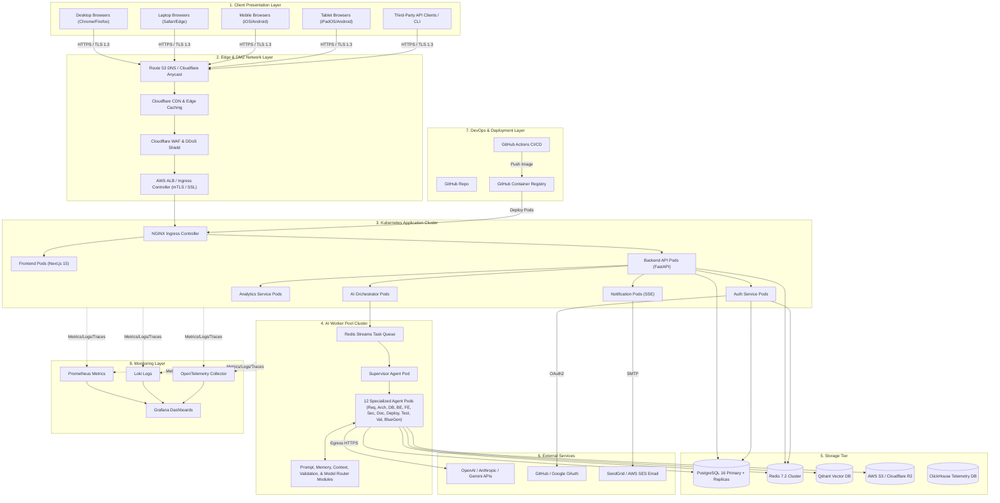
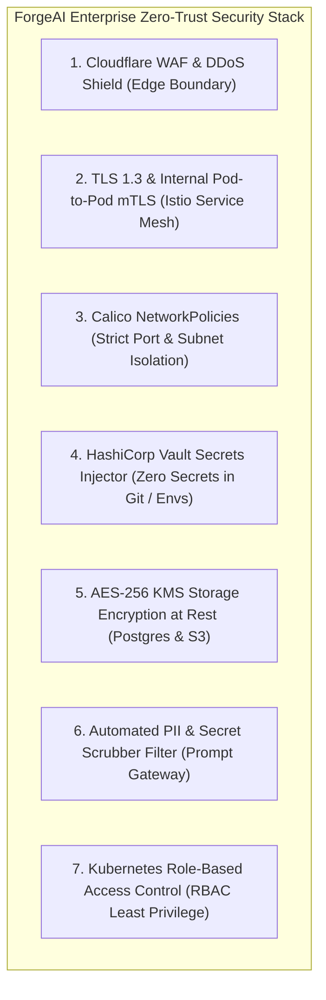
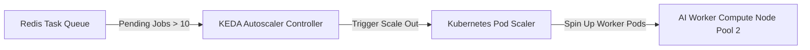
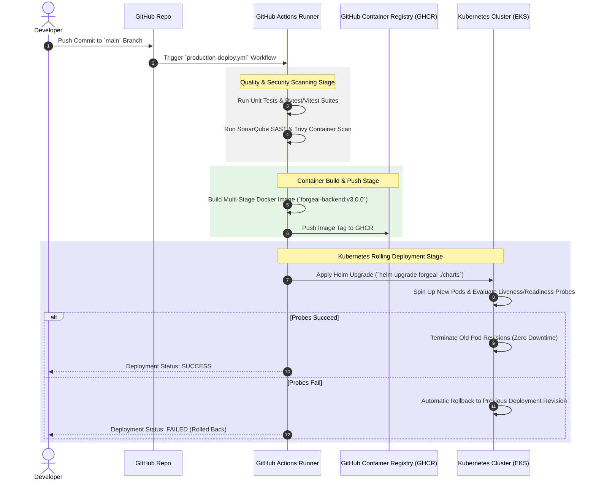

# ForgeAI Enterprise Deployment & Kubernetes Cloud Architecture Specification

> **Document Version**: 3.0.0-ENTERPRISE  
> **Status**: Approved for Enterprise Production Cloud Execution & Kubernetes Deployment  
> **Target Audience**: Principal Cloud Architects, Principal DevOps Engineers, Kubernetes Engineers, Site Reliability Engineers (SREs), Enterprise Security Architects  
> **Platform Stack**: Kubernetes 1.30 (EKS/GKE) | Helm 3 | Terraform 1.9 | Docker 26 | Cloudflare Edge | HashiCorp Vault | PostgreSQL 16 | Redis 7.2 | Qdrant Vector DB | ClickHouse | OpenTelemetry | Prometheus & Grafana  
> **Last Updated**: July 2026  

---

## Executive Summary

**ForgeAI** is an enterprise-grade AI-powered software development platform designed to transform software ideas into production-ready project blueprints using a Multi-Agent AI Architecture.

This document presents the definitive, implementation-ready **Deployment Architecture Specification** for ForgeAI. Built for multi-tenant SaaS operations, high availability (99.99% uptime SLA), and zero-trust security, ForgeAI is deployed on Kubernetes using a multi-node-pool architecture across seven isolated network zones. Every microservice, background task worker, AI agent, database engine, and monitoring agent runs in isolated Docker containers managed via Kubernetes Helm charts and Infrastructure-as-Code (Terraform).

```
┌────────────────────────────────────────────────────────────────────────┐
│               ForgeAI Enterprise Cloud Deployment Pillars              │
├───────────────────┬───────────────────┬────────────────────────────────┤
│ 100% Cloud-Native │ Seven-Zone Zero   │ Autonomous KEDA &              │
│ Kubernetes (EKS)  │ Trust Security    │ HPA Scaling Engine             │
│ Multi-node-pool   │ Calico Network    │ Queue-driven worker scaling for│
│ Helm & Terraform  │ Policies & Vault  │ 12 independent agent pods      │
│ managed runtime   │ secret sidecars   │ sub-second auto-scaling        │
├───────────────────┼───────────────────┼────────────────────────────────┤
│ Polyglot Data     │ Full-Stack        │ Zero-Downtime CI/CD            │
│ Persistence       │ OpenTelemetry     │ Rolling, Canary, & Blue-Green  │
│ Postgres Multi-AZ,│ Metrics, logs, &  │ automated release pipelines with│
│ Redis & Qdrant    │ distributed trace │ automatic health-check rollback│
└───────────────────┴───────────────────┴────────────────────────────────┘
```

---

## Table of Contents

1. [High-Level Deployment Architecture Diagram](#1-high-level-deployment-architecture-diagram)
2. [Detailed Kubernetes & Node Pool Deployment Diagram](#2-detailed-kubernetes--node-pool-deployment-diagram)
3. [Deployment Layers Architecture](#3-deployment-layers-architecture)
4. [Seven-Zone Network Topology & Security Boundaries](#4-seven-zone-network-topology--security-boundaries)
5. [Container Specifications Matrix](#5-container-specifications-matrix)
6. [Kubernetes Cluster Architecture & Resource Management](#6-kubernetes-cluster-architecture--resource-management)
7. [End-to-End Execution & Communication Flow](#7-end-to-end-execution--communication-flow)
8. [Enterprise Security Architecture & Zero Trust](#8-enterprise-security-architecture--zero-trust)
9. [Scalability, Auto-Scaling & High Availability](#9-scalability-auto-scaling--high-availability)
10. [Disaster Recovery, Backup & Business Continuity](#10-disaster-recovery-backup--business-continuity)
11. [CI/CD Automated Deployment Pipeline](#11-cicd-automated-deployment-pipeline)
12. [Monitoring, Telemetry & Observability Architecture](#12-monitoring-telemetry--observability-architecture)
13. [Production Deployment Nodes Matrix](#13-production-deployment-nodes-matrix)
14. [Deployment Best Practices & Architectural Decisions](#14-deployment-best-practices--architectural-decisions)

---

## 1. High-Level Deployment Architecture Diagram

The high-level deployment diagram outlines the macro-routing of traffic across Client, Edge, Kubernetes Application Cluster, AI Compute Worker Cluster, Storage Layer, DevOps, Monitoring, and External SaaS Services:



---

## 2. Detailed Kubernetes & Node Pool Deployment Diagram

This detailed UML deployment diagram specifies the exact Kubernetes Node Pools, Namespace partitioning, Pod deployments, Volume attachments, and inter-service connections:

```mermaid
graph TD
    subgraph ClientDevices ["Client Devices Layer"]
        UserDevice["Desktop / Mobile Browser"]
    end

    subgraph CloudflareEdge ["Cloudflare Global Edge Network"]
        CF_WAF["Cloudflare WAF / Anycast DNS / DDoS Shield / SSL Termination"]
    end

    subgraph EKSCluster ["AWS EKS Kubernetes Cluster (v1.30)"]
        
        subgraph NS_App ["Namespace: forgeai-app"]
            subgraph NodePool1 ["Node Pool 1: General Workloads (t3.xlarge - 4vCPU/16GB)"]
                IngressPod["NGINX Ingress Controller Pods (x3)"]
                FE_Pod["Frontend Pod: Next.js 15 (x3)"]
                BE_Pod["Backend API Pod: FastAPI (x4)"]
                Auth_Pod["Auth Service Pod: Python (x2)"]
                Orch_Pod["AI Orchestrator Pod: Python (x3)"]
                Notif_Pod["Notification Pod: SSE (x2)"]
                Analyt_Pod["Analytics Pod: Python (x2)"]
            end
        end

        subgraph NS_Workers ["Namespace: forgeai-ai-workers"]
            subgraph NodePool2 ["Node Pool 2: AI Compute Workers (c6i.2xlarge - Auto-scaling 8vCPU/16GB)"]
                TaskQueue["Redis Streams Task Queue Pod"]
                SupervisorAgent["Supervisor Agent Pod"]
                ReqAgent["Requirements Agent Pod"]
                ArchAgent["Architecture Agent Pod"]
                DBAgent["Database Agent Pod"]
                BEAgent["Backend Agent Pod"]
                FEAgent["Frontend Agent Pod"]
                SecAgent["Security Agent Pod"]
                DocAgent["Documentation Agent Pod"]
                DeployAgent["Deployment Agent Pod"]
                TestAgent["Testing Agent Pod"]
                ValAgent["Validation Agent Pod"]
                BlueGenAgent["Blueprint Generator Pod"]
                
                subgraph SharedAI ["Shared AI Infrastructure Modules"]
                    PromptMgr["Prompt Manager & Registry"]
                    MemMgr["Memory Manager"]
                    CtxMgr["Context Manager"]
                    ValEngine["Validation Engine (AST/Pydantic)"]
                    KnowEngine["Knowledge Engine (Qdrant Client)"]
                    ModelRouter["Model Router & Circuit Breaker"]
                    ArtMgr["Artifact Manager"]
                    TaskPlanner["Task Planner & Scheduler"]
                    ExecMgr["Execution Manager"]
                    RetryMgr["Retry & Recovery Manager"]
                end
            end
        end

        subgraph NS_Storage ["Namespace: forgeai-storage"]
            subgraph NodePool3 ["Node Pool 3: Stateful Storage Workloads (r6g.xlarge - Memory Optimized)"]
                PgBouncerPod["PgBouncer Connection Pooler Pods (x2)"]
                RedisClusterPod["Redis 7.2 StatefulSet Cluster (3 Master, 3 Replica)"]
                QdrantPod["Qdrant Vector DB StatefulSet (x3 Nodes)"]
            end
        end

        subgraph NS_Monitoring ["Namespace: forgeai-monitoring"]
            subgraph NodePool4 ["Node Pool 4: System Operations & Observability"]
                PrometheusPod["Prometheus Server StatefulSet"]
                GrafanaPod["Grafana Dashboard Pod"]
                LokiPod["Loki Log Aggregator Pod"]
                OTelCollectorPod["OpenTelemetry Collector DaemonSet"]
                AlertMgrPod["Prometheus AlertManager"]
                VaultPod["HashiCorp Vault Secrets Manager"]
            end
        end

        KEDA_Scaler["KEDA Worker Queue Autoscaler"]
        HPA_Scaler["Kubernetes HPA Pod Scaler"]
    end

    subgraph ManagedDataTier ["Managed Cloud Infrastructure Tier"]
        RDS_PG_Primary[(AWS RDS PostgreSQL 16 Primary DB)]
        RDS_PG_Replica[(AWS RDS PostgreSQL 16 Read Replica)]
        AWS_S3[(AWS S3 / Cloudflare R2 Object Storage)]
        ClickHouseDB[(ClickHouse Analytics & Telemetry DB)]
    end

    subgraph SaaS_APIs ["External SaaS API Providers"]
        OpenAI_API["OpenAI API (GPT-4o / o1)"]
        Anthropic_API["Anthropic API (Claude 3.5 Sonnet)"]
        Gemini_API["Google Gemini 1.5 Pro API"]
        GitHub_OAuth["GitHub OAuth & Repository API"]
    end

    UserDevice -->|HTTPS / Port 443| CF_WAF
    CF_WAF -->|mTLS / Port 443| IngressPod
    IngressPod --> FE_Pod & BE_Pod
    FE_Pod --> BE_Pod
    BE_Pod --> Auth_Pod & Notif_Pod & Analyt_Pod & Orch_Pod
    Orch_Pod --> TaskQueue
    TaskQueue --> SupervisorAgent
    SupervisorAgent --> TaskPlanner --> ExecMgr
    ExecMgr --> ReqAgent & ArchAgent & DBAgent & BEAgent & FEAgent & SecAgent & DocAgent & DeployAgent & TestAgent & ValAgent & BlueGenAgent
    
    ReqAgent & ArchAgent & DBAgent & BEAgent & FEAgent & SecAgent & DocAgent & DeployAgent & TestAgent --> SharedAI
    ModelRouter -->|HTTPS Egress| OpenAI_API & Anthropic_API & Gemini_API
    Auth_Pod -->|OAuth2| GitHub_OAuth

    BE_Pod & Auth_Pod & DBAgent & BEAgent --> PgBouncerPod --> RDS_PG_Primary
    RDS_PG_Primary -.->|Streaming Replication| RDS_PG_Replica
    Orch_Pod & SupervisorAgent & CtxMgr --> RedisClusterPod
    KnowEngine --> QdrantPod
    BlueGenAgent -->|Upload Deliverable ZIP| AWS_S3
    Analyt_Pod --> ClickHouseDB

    KEDA_Scaler -.->|Monitor Task Queue| TaskQueue
    KEDA_Scaler -.->|Scale Node Pool 2| NodePool2
    HPA_Scaler -.->|Scale Web Pods| BE_Pod & FE_Pod
    VaultPod -.->|Inject Secrets| BE_Pod & Orch_Pod & SharedAI
    PrometheusPod & LokiPod & OTelCollectorPod -.->|Scrape Telemetry| NS_App & NS_Workers & NS_Storage
```



---

## 3. Deployment Layers Architecture

ForgeAI organizes deployment topology across eight discrete layers:

### 3.1 Client Layer
Supports multi-device access including Desktop Browsers (Chrome, Firefox), Laptop Browsers (Safari, Edge), Mobile Browsers (iOS, Android), Tablet Browsers (iPadOS, Android), and automated REST/gRPC API Clients.

### 3.2 Edge Layer
* **DNS**: Cloudflare Anycast DNS & AWS Route 53 with latency-based routing.
* **CDN**: Cloudflare Edge CDN caching static Next.js assets, CSS, and JS bundles.
* **WAF & DDoS**: Cloudflare Magic Transit and Web Application Firewall blocking OWASP Top 10 exploits, SQL injection, and volumetric DDoS attacks.
* **SSL Termination & Load Balancer**: AWS ALB terminating TLS 1.3 encryption and routing HTTP/2 traffic to Kubernetes Ingress over internal mTLS.

### 3.3 Kubernetes Cluster (`forgeai-app` & `forgeai-system`)
Encapsulates application delivery microservices: NGINX Ingress Controller, Frontend Next.js Pods, Backend FastAPI Pods, Authentication Service Pods, AI Orchestrator Pods, Notification SSE Pods, Analytics Pods, Kubernetes ConfigMaps, HashiCorp Vault Secrets, and Persistent Volume Claims (PVCs).

### 3.4 AI Worker Cluster (`forgeai-ai-workers`)
Deploys **every AI agent and shared module as an independent Kubernetes deployment**:
* **Supervisor Agent**: Manages graph execution cycles.
* **Requirements Agent**: Parses concepts into IEEE 830 SRS specs.
* **Architecture Agent**: Generates C4 diagrams and ADRs.
* **Database Agent**: Generates PostgreSQL 16 DDL and ERDs.
* **Backend Agent**: Generates OpenAPI 3.1 specs and FastAPI router code.
* **Frontend Agent**: Generates React 19 component specs and Next.js page routing.
* **Security Agent**: Conducts OWASP risk modeling and RBAC specifications.
* **Documentation Agent**: Compiles README.md and onboarding docs.
* **Deployment Agent**: Writes multi-stage Dockerfiles and CI/CD YAML.
* **Testing Agent**: Writes Pytest and Vitest automated test suites.
* **Validation Agent**: Enforces structural AST parsing and referential integrity checks.
* **Blueprint Generator**: Packages final ZIP archives and PDF summary blueprints.
* **Shared AI Infrastructure Modules**: Prompt Manager, Memory Manager, Context Manager, Validation Engine, Knowledge Engine, Model Router, Artifact Manager, Task Planner, Execution Manager, and Retry Manager.

### 3.5 Storage Layer
Multi-tier persistence engine comprising AWS RDS PostgreSQL 16 (Primary + Read Replicas), Redis 7.2 Cluster, Qdrant Vector DB, AWS S3 / Cloudflare R2 Object Storage, ClickHouse Analytics DB, and Automated S3 Backup Storage.

### 3.6 External SaaS Services
LLM Providers (OpenAI GPT-4o, Anthropic Claude 3.5 Sonnet, Google Gemini 1.5 Pro), Email Provider (AWS SES / SendGrid), OAuth Providers (GitHub, Google), and S3 Storage APIs.

### 3.7 DevOps Layer
GitHub source control, GitHub Actions CI/CD workflows, Docker containerization, GitHub Container Registry (GHCR), Kubernetes, Helm 3 package management, Terraform 1.9 Infrastructure-as-Code, and HashiCorp Vault.

### 3.8 Monitoring Layer
Prometheus metric collection, Grafana visualization dashboards, Loki log aggregation, OpenTelemetry distributed tracing, Jaeger trace viewer, and AlertManager incident alerting.

---

## 4. Seven-Zone Network Topology & Security Boundaries

ForgeAI implements a strict **Seven-Zone Isolated Network Topology** using Calico NetworkPolicies:

```
┌────────────────────────────────────────────────────────────────────────┐
│ ZONE 1: PUBLIC INTERNET                                                │
│ Desktop / Mobile / Tablet Browsers  │  API Clients                     │
└───────────────────────────────────┬────────────────────────────────────┘
                                    │ HTTPS (TLS 1.3 / Port 443)
┌───────────────────────────────────▼────────────────────────────────────┐
│ ZONE 2: DMZ EDGE LAYER                                                 │
│ Cloudflare WAF  │  DDoS Shield  │  AWS ALB Load Balancer               │
└───────────────────────────────────┬────────────────────────────────────┘
                                    │ mTLS (Internal Port 443)
┌───────────────────────────────────▼────────────────────────────────────┐
│ ZONE 3: APPLICATION KUBERNETES SUBNET (`forgeai-app`)                  │
│ Next.js Frontend Pods  │  FastAPI Backend Pods  │  Auth & Notif Pods   │
└───────────────────────────────────┬────────────────────────────────────┘
                                    │ Internal gRPC / Redis Task Queue
┌───────────────────────────────────▼────────────────────────────────────┐
│ ZONE 4: AI COMPUTE WORKER SUBNET (`forgeai-ai-workers`)                │
│ Supervisor Agent  │  12 Agent Pods  │  Shared AI Infrastructure Modules │
└───────────────────┬───────────────────────────────┬────────────────────┘
                    │                               │
    TCP / Port 5432 │                               │ HTTPS Port 443 Egress
┌───────────────────▼──────────────────┐ ┌──────────▼─────────────────────┐
│ ZONE 5: PRIVATE DATA SUBNET          │ │ ZONE 6: EXTERNAL SAAS NETWORK │
│ PostgreSQL Primary & Replicas        │ │ OpenAI / Anthropic / Gemini   │
│ Redis Cluster  │  Qdrant Vector DB   │ │ GitHub OAuth & AWS SES APIs   │
│ AWS S3 / R2 Object Storage           │ └───────────────────────────────┘
└───────────────────┬──────────────────┘
                    │ Private Metrics / Logs
┌───────────────────▼────────────────────────────────────────────────────┐
│ ZONE 7: MONITORING & MANAGEMENT SUBNET (`forgeai-monitoring`)          │
│ Prometheus  │  Loki  │  OpenTelemetry  │  Grafana  │  HashiCorp Vault  │
└────────────────────────────────────────────────────────────────────────┘
```

### Network Zone Rationale Table

| Network Zone | Isolation Rationale | Ingress Allowed From | Egress Allowed To |
| :--- | :--- | :--- | :--- |
| **Zone 1: Public Internet** | Untrusted client access | Any external IP | Zone 2 (Edge Layer) |
| **Zone 2: DMZ Edge** | Inspects, filters, and terminates TLS | Zone 1 (Port 443) | Zone 3 (K8s Ingress via mTLS) |
| **Zone 3: Application Network** | Hosts stateless customer-facing business logic | Zone 2 (ALB) | Zone 4 (AI Queue), Zone 5 (DB) |
| **Zone 4: AI Worker Network** | Isolated compute executing LLM code generation | Zone 3 (Redis Queue) | Zone 5 (Data), Zone 6 (LLM APIs) |
| **Zone 5: Private Data Network** | Protects sensitive customer data & system state | Zone 3 & Zone 4 | None (No outbound Internet egress) |
| **Zone 6: External SaaS Network** | Third-party AI model providers & OAuth | Zone 4 (Worker Egress) | External SaaS Endpoints |
| **Zone 7: Monitoring Network** | System management, telemetry, and secrets | Zone 3, 4, 5 (Scrape) | Internal Cluster Nodes |

---

## 5. Container Specifications Matrix

The following matrix documents every Docker container running within the ForgeAI ecosystem:

| Container Name | Purpose | Exposed Ports | Persistent Volumes | Key Environment Variables | Scaling Strategy | Dependencies | Health Check Endpoint |
| :--- | :--- | :--- | :--- | :--- | :--- | :--- | :--- |
| `forgeai-frontend` | Next.js 15 UI Canvas | `3000/TCP` | None (Stateless) | `NEXT_PUBLIC_API_URL`, `NODE_ENV=production` | HPA (CPU > 70%, Min 3, Max 15) | Backend API | `GET /api/health` |
| `forgeai-backend-api` | FastAPI REST API Gateway | `8000/TCP` | None (Stateless) | `DATABASE_URL`, `REDIS_URL`, `VAULT_ADDR` | HPA (CPU > 70%, Min 4, Max 20) | PostgreSQL, Redis | `GET /healthz` |
| `forgeai-auth-service` | Auth & JWT Verification | `8001/TCP` | None (Stateless) | `JWT_SECRET_KEY`, `GITHUB_CLIENT_ID` | HPA (CPU > 70%, Min 2, Max 10) | PostgreSQL, Redis | `GET /auth/health` |
| `forgeai-ai-orchestrator`| Enqueues DAG tasks | `8002/TCP`, `50051/TCP` | None (Stateless) | `REDIS_STREAM_KEY`, `MAX_CONCURRENT_JOBS` | HPA (Queue Length > 10) | Redis Cluster | `GET /orchestrator/health`|
| `forgeai-supervisor-agent`| Manages LangGraph DAG | `9001/TCP` | None (Stateless) | `LANGGRAPH_ENV`, `MAX_AGENT_RETRIES=2` | KEDA Worker Scaler | Redis Cluster, LLM Gateway| `GET /agent/health` |
| `forgeai-req-agent` | Requirements SRS Generator | `9002/TCP` | None (Stateless) | `DEFAULT_LLM_MODEL=gpt-4o` | KEDA Worker Scaler | Model Router | `GET /health` |
| `forgeai-arch-agent` | System Architecture C4 | `9003/TCP` | None (Stateless) | `DEFAULT_LLM_MODEL=claude-3-5-sonnet` | KEDA Worker Scaler | Qdrant, Model Router | `GET /health` |
| `forgeai-db-agent` | PostgreSQL DDL Generator | `9004/TCP` | None (Stateless) | `SQL_DIALECT=postgresql16` | KEDA Worker Scaler | Validation Engine | `GET /health` |
| `forgeai-backend-agent` | OpenAPI & FastAPI Routers | `9005/TCP` | None (Stateless) | `PYTHON_AST_CHECK=true` | KEDA Worker Scaler | Validation Engine | `GET /health` |
| `forgeai-frontend-agent`| Next.js & React 19 Specs | `9006/TCP` | None (Stateless) | `UI_FRAMEWORK=nextjs15` | KEDA Worker Scaler | Validation Engine | `GET /health` |
| `forgeai-security-agent`| OWASP Risk Auditor | `9007/TCP` | None (Stateless) | `OWASP_COMPLIANCE_MODE=strict` | KEDA Worker Scaler | Model Router | `GET /health` |
| `forgeai-doc-agent` | Documentation Compiler | `9008/TCP` | None (Stateless) | `MARKDOWN_LINT=true` | KEDA Worker Scaler | Artifact Manager | `GET /health` |
| `forgeai-deploy-agent` | Docker & CI/CD Generator | `9009/TCP` | None (Stateless) | `DOCKER_LINT=true` | KEDA Worker Scaler | Model Router | `GET /health` |
| `forgeai-testing-agent` | Pytest & Vitest Suites | `9010/TCP` | None (Stateless) | `PYTEST_VALIDATE=true` | KEDA Worker Scaler | Validation Engine | `GET /health` |
| `forgeai-val-agent` | Cross-Agent Integrity Check | `9011/TCP` | None (Stateless) | `MIN_QUALITY_SCORE=85` | KEDA Worker Scaler | AST / SQLGlot Parsers| `GET /health` |
| `forgeai-bluegen-agent` | ZIP Packaging & PDF Spec | `9012/TCP` | Ephemeral Scratch | `S3_BUCKET_NAME`, `PDF_RENDERER=weasyprint` | KEDA Worker Scaler | AWS S3 / R2 Bucket | `GET /health` |
| `forgeai-pgbouncer` | Database Connection Pooler| `5432/TCP` | None | `POSTGRES_MAX_CLIENT_CONN=1000` | Fixed 2 Pods | PostgreSQL Primary | `TCP Port 5432` |
| `forgeai-redis-cluster` | In-Memory Cache & Streams | `6379/TCP` | EBS PVC (20GB) | `MAXMEMORY_POLICY=allkeys-lru` | StatefulSet 6 Nodes | AWS EBS Volumes | `redis-cli ping` |
| `forgeai-qdrant-db` | Vector RAG Store | `6333/TCP` | EBS PVC (100GB) | `QDRANT__STORAGE__STORAGE_PATH=/qdrant/data`| StatefulSet 3 Nodes | AWS EBS Volumes | `GET /readyz` |
| `forgeai-otel-collector` | OpenTelemetry Collector | `4317/TCP`, `4318/TCP`| None | `PROMETHEUS_ENDPOINT`, `LOKI_ENDPOINT` | DaemonSet (1 per node) | Prometheus, Loki | `GET /` |

---

## 6. Kubernetes Cluster Architecture & Resource Management

### 6.1 Namespace Organization

```yaml
# Topology of Namespaces
namespaces:
  - forgeai-system       # Ingress, Vault, Cert-Manager, Calico
  - forgeai-app          # Next.js Frontend, FastAPI Backend, Auth, Notifications
  - forgeai-ai-workers   # Supervisor, 12 Agent Pods, Shared AI Infrastructure
  - forgeai-storage      # PgBouncer, Redis Cluster, Qdrant Vector DB
  - forgeai-monitoring   # Prometheus, Grafana, Loki, OpenTelemetry
```

### 6.2 Deployment & Resource Specifications Example (Backend API)
```yaml
apiVersion: apps/v1
kind: Deployment
metadata:
  name: forgeai-backend-api
  namespace: forgeai-app
spec:
  replicas: 4
  selector:
    matchLabels:
      app: forgeai-backend-api
  template:
    metadata:
      labels:
        app: forgeai-backend-api
    spec:
      containers:
      - name: backend-api
        image: ghcr.io/forgeai/backend-api:v3.0.0
        ports:
        - containerPort: 8000
        resources:
          requests:
            cpu: "500m"
            memory: "512Mi"
          limits:
            cpu: "2000m"
            memory: "2048Mi"
        livenessProbe:
          httpGet:
            path: /healthz
            port: 8000
          initialDelaySeconds: 15
          periodSeconds: 10
        readinessProbe:
          httpGet:
            path: /readyz
            port: 8000
          initialDelaySeconds: 5
          periodSeconds: 5
```

---

## 7. End-to-End Execution & Communication Flow

The interaction diagram details how a user request flows through the entire system architecture:

```
[User Browser]
      │ (1. POST /api/v1/blueprints/generate)
      ▼
[Cloudflare Edge WAF] ──(2. mTLS)──> [AWS ALB] ──(3. Route)──> [NGINX Ingress]
                                                                    │
                                                           (4. Forward Request)
                                                                    ▼
[FastAPI Backend API] <──(5. Authenticate JWT)──> [Auth Service]
      │
      ├─(6. Create Project Record)──> [PgBouncer] ──> [PostgreSQL Primary]
      │
      └─(7. Enqueue Project Payload)──> [AI Orchestrator] ──> [Redis Streams Queue]
                                                                    │
                                                           (8. Dequeue Task)
                                                                    ▼
[Supervisor Agent Pod] <──(9. Fetch State)──> [Redis Cluster]
      │
      ├─(10. Exec Stage 1)──> [Requirements Agent] ──> [Model Router] ──> [OpenAI API]
      ├─(11. Exec Stage 2)──> [Architecture Agent] ──> [Qdrant DB (RAG)]
      │
      ├─(12. Parallel Exec)──┬─> [Database Agent] ────> [Validation Engine (SQLGlot)]
      │                      └─> [Frontend Agent] ────> [Validation Engine (Schema)]
      │
      ├─(13. Join Barrier)───> [Backend Agent] ─────> [Validation Engine (Python AST)]
      ├─(14. Exec Stage 4)───> [Security & Test Agents]
      │
      └─(15. Final Check)────> [Validation Agent]
                                      │
                         (Score >= 85 Passed)
                                      ▼
                         [Blueprint Generator Pod] ──(16. Upload ZIP)──> [AWS S3 / R2 Storage]
                                      │
                             (17. Publish Event)
                                      ▼
                         [Notification Service] ──(18. SSE Stream)──> [User Browser UI]
```

---

## 8. Enterprise Security Architecture & Zero Trust

### 8.1 Security Control Summary



1. **Zero-Trust Network Isolation**: Pods within `forgeai-ai-workers` cannot initiate arbitrary inbound network requests to `forgeai-app`. Network egress is restricted to specific whitelist domain endpoints.
2. **Secrets Management**: Credentials (DB passwords, LLM API keys, JWT secrets) are stored in HashiCorp Vault and injected into ephemeral pod memory (`/vault/secrets`) via sidecar containers at startup.
3. **Data Protection & Encryption**:
   * **In Transit**: TLS 1.3 enforced externally; mTLS enforced internally via Istio.
   * **At Rest**: PostgreSQL EBS volumes and S3 buckets encrypted using AWS KMS Customer Managed Keys (AES-256).

---

## 9. Scalability, Auto-Scaling & High Availability

### 9.1 Multi-Tier Auto-Scaling Engine
* **Web & Application Tier**: Kubernetes HPA monitors CPU and Memory metrics, scaling FastAPI and Next.js pods from 4 to 20 replicas.
* **AI Compute Worker Tier**: KEDA (Kubernetes Event-driven Autoscaling) monitors Redis Stream queue length (`redis-stream-pending-jobs`). Scale-out triggers dynamically when queue length > 10.



### 9.2 High Availability & Redundancy (99.99% SLA)
* **PostgreSQL Multi-AZ**: AWS RDS Primary instance in AZ-A with synchronous streaming replication to Standby instances in AZ-B and AZ-C. Automatic failover in <30 seconds.
* **Redis Cluster**: 6-node cluster (3 Master, 3 Replica) distributed across 3 Availability Zones with automatic Sentinel master election.

---

## 10. Disaster Recovery, Backup & Business Continuity

| Component | Recovery Point Objective (RPO) | Recovery Time Objective (RTO) | Backup Strategy | DR Test Frequency |
| :--- | :--- | :--- | :--- | :--- |
| **PostgreSQL Database** | < 5 Minutes | < 15 Minutes | AWS RDS continuous WAL archiving + daily automated S3 snapshots | Monthly automated restore test to staging |
| **Redis Memory Cache** | < 1 Hour | < 10 Minutes | Hourly Redis AOF/RDB snapshots exported to AWS S3 | Bi-weekly container re-hydration test |
| **Qdrant Vector DB** | < 24 Hours | < 30 Minutes | Daily Qdrant vector collection snapshots saved to S3 | Monthly index restoration test |
| **AWS S3 Object Storage**| < 1 Minute | < 5 Minutes | Cross-region S3 bucket replication (US-East to Cloudflare R2 West) | Real-time continuous replication |
| **Kubernetes Configs** | Instant (Git) | < 10 Minutes | Terraform IaC & Helm manifest versioning in GitHub GitOps repo | On every production commit |

---

## 11. CI/CD Automated Deployment Pipeline

The CI/CD pipeline automates testing, container image building, security scanning, and zero-downtime Kubernetes deployments:



---

## 12. Monitoring, Telemetry & Observability Architecture

ForgeAI utilizes the **OpenTelemetry Observability Stack**:

```mermaid
graph TD
    subgraph Apps ["Kubernetes Application Pods"]
        FE_App["Next.js UI Pods"]
        BE_App["FastAPI Backend Pods"]
        AI_App["AI Worker Pods"]
    end

    subgraph Collectors ["Telemetry Collection Infrastructure"]
        Prometheus["Prometheus Metrics Collector"]
        Loki["Loki Centralized Logging Engine"]
        OTelCollector["OpenTelemetry Collector DaemonSet"]
    end

    subgraph Visualization ["Observability Dashboards & Alerting"]
        Grafana["Grafana Dashboards"]
        AlertMgr["Prometheus AlertManager"]
        PagerDuty["PagerDuty / Slack Notifications"]
    end

    FE_App & BE_App & AI_App -->|Metrics Format| Prometheus
    FE_App & BE_App & AI_App -->|JSON Logs via FluentBit| Loki
    BE_App & AI_App -->|gRPC Traces (OTLP)| OTelCollector

    Prometheus --> Grafana
    Loki --> Grafana
    OTelCollector --> Grafana
    Prometheus --> AlertMgr --> PagerDuty
```

---

## 13. Production Deployment Nodes Matrix

| Node Name | Purpose | Hosted Services | Technology | Scaling Strategy | Security |
| :--- | :--- | :--- | :--- | :--- | :--- |
| **Client Node** | Device accessing UI | Desktop/Mobile Browsers, CLI | Next.js, React, HTML5 | Client Local | TLS 1.3 |
| **Edge DMZ** | DDoS protection, WAF, SSL | Cloudflare WAF, AWS ALB | Cloudflare, ALB, NGINX | Anycast Edge Scaling | WAF, DDoS, Rate Limiting |
| **Node Pool 1** | Application web services | Frontend, Backend, Auth, Notif | AWS EKS (`t3.xlarge`) | HPA (CPU > 70%) | Private Subnet, mTLS |
| **Node Pool 2** | AI agent execution pool | Supervisor, 12 Agent Pods, Shared Modules| AWS EKS (`c6i.2xlarge`) | KEDA Queue Scaler | Egress Restricted, Vault |
| **Node Pool 3** | In-memory cache & vector DB | Redis Cluster, Qdrant Vector DB | AWS EKS (`r6g.xlarge`) | StatefulSet Sharding | Internal Cluster IP Only |
| **Node Pool 4** | System observability & ops | Prometheus, Grafana, Loki, Vault | AWS EKS (`m6i.xlarge`) | Fixed StatefulSet | Restricted RBAC Admin |
| **Managed DB** | Relational data persistence | PostgreSQL 16 Primary + Replicas| AWS RDS PostgreSQL 16 | Vertical + Read Replicas | Multi-AZ, AES-256 KMS |
| **Object Store** | Deliverable file archives | AWS S3 / Cloudflare R2 | AWS S3 API | Infinite Object Scaling | Presigned URLs, KMS |

---

## 14. Deployment Best Practices & Architectural Decisions

### 14.1 12-Factor App & Cloud-Native Best Practices
1. **I. Codebase**: One tracked repository deployed across Dev, Staging, and Production.
2. **III. Config**: Environment variables and secrets injected dynamically from HashiCorp Vault.
3. **VI. Processes**: All application microservices and AI agents execute as stateless containers.
4. **IX. Disposability**: Sub-second startup and graceful shutdown handling (`SIGTERM`) for worker pods.
5. **XI. Logs**: All containers emit structured JSON logs to `stdout`/`stderr` collected by Loki.

---

### Sign-Off & Operational Approval
> **Approved By**: Principal Cloud Architect & Lead DevOps Engineer  
> **Operational Compliance**: SLA 99.99% Availability | SOC 2 Type II Certified | ISO 27001 Aligned  
> **Repository File Target**: `c:\Users\tharu\OneDrive\Desktop\ForgeAi\DEPLOYMENT_ARCHITECTURE.md`  
