# ForgeAI Frontend Architecture Specification

> **Document Version**: 1.0.0  
> **Status**: Approved for Enterprise Production & Scaling  
> **Frontend Stack**: Next.js 15 (App Router) | TypeScript | Tailwind CSS | shadcn/ui | Framer Motion | Zustand | TanStack Query v5 | React Hook Form | Zod | Recharts | Lucide React  
> **Author**: Principal Frontend Software Architect & Technical Documentation Team  
> **Target Audience**: CTOs, VPs of Engineering, Staff Engineers, Enterprise Clients & Technical Auditors  
> **Last Updated**: July 2026  

---

## Executive Summary

The **ForgeAI Frontend Architecture** is an enterprise-grade, high-performance Single Page Application (SPA) / Server-Driven web architecture engineered to support multi-agent AI workflow orchestration, real-time token streaming, complex blueprint graph visualizers, and mission-critical enterprise SaaS analytics.

Designed using **Next.js 15 (App Router)** and **TypeScript**, the platform enforces strict domain boundaries, atomic component contracts, resilient state separation, zero-trust client security, and sub-100ms interactive user interfaces.

```
┌────────────────────────────────────────────────────────────────────────┐
│                   ForgeAI Core Frontend Architectural Pillars          │
├───────────────────┬───────────────────┬────────────────────────────────┤
│ Real-Time AI Stream│ Modular Feature-  │ Tri-State Separation           │
│ Sub-10ms token    │ Based Isolation   │ Server (TanStack), Global UI   │
│ chunk rendering   │ Strict domain     │ (Zustand), Form (RHF+Zod)      │
│ & virtualized markdown│ boundaries & zero  │ with explicit hydration        │
│ rendering         │ circular imports  │ contracts                      │
├───────────────────┼───────────────────┼────────────────────────────────┤
│ Defense-in-Depth  │ Atomic Design &   │ Sub-100ms Core Web Vitals      │
│ In-memory JWTs,   │ Accessible UI     │ INP < 50ms, LCP < 1.2s,        │
│ HttpOnly cookies, │ Radix primitives, │ zero layout shifts (CLS < 0.01)│
│ strict CSP & RBAC │ WAI-ARIA & Tailwind│ dynamic dynamic code-splitting │
└───────────────────┴───────────────────┴────────────────────────────────┘
```

---

## Table of Contents

1. [High-Level System & Layered Architecture](#1-high-level-system--layered-architecture)
2. [Feature-Based Scalable Directory Architecture](#2-feature-based-scalable-directory-architecture)
3. [Component Architecture & Atomic Design System](#3-component-architecture--atomic-design-system)
4. [State Management Architecture Strategy](#4-state-management-architecture-strategy)
5. [Next.js 15 App Router & Rendering Engine](#5-nextjs-15-app-router--rendering-engine)
6. [Real-Time & Streaming AI Token Rendering Engine](#6-real-time--streaming-ai-token-rendering-engine)
7. [Authentication, Authorization & Security Architecture](#7-authentication-authorization--security-architecture)
8. [Form Engine & Schema Validation Architecture](#8-form-engine--schema-validation-architecture)
9. [Data Visualization & Analytics Infrastructure](#9-data-visualization--analytics-infrastructure)
10. [Design System, Styling & Animation Framework](#10-design-system-styling--animation-framework)
11. [Error Handling, Telemetry & Resilience Strategy](#11-error-handling-telemetry--resilience-strategy)
12. [Performance Optimization & Core Web Vitals Standard](#12-performance-optimization--core-web-vitals-standard)
13. [Testing, Quality Assurance & CI/CD Pipeline](#13-testing-quality-assurance--cicd-pipeline)
14. [Future Scalability & Architectural Evolution Roadmap](#14-future-scalability--architectural-evolution-roadmap)

---

## 1. High-Level System & Layered Architecture

### 1.1 Purpose
Establish a predictable, highly scalable, and decoupled architectural model that isolates raw UI components from business logic, server state synchronization, and transport protocols.

### 1.2 Overview
ForgeAI utilizes a 4-Tier Layered Frontend Architecture. Each layer operates under a strict unilateral dependency rule: higher layers consume lower layers, but lower layers never import from higher layers.

```
┌────────────────────────────────────────────────────────────────────────┐
│                        Layer 4: Presentation Layer                     │
│               React Server Components (RSC), Views, Pages              │
└───────────────────────────────────┬────────────────────────────────────┘
                                    │ consumes
┌───────────────────────────────────▼────────────────────────────────────┐
│                       Layer 3: Business Logic Layer                    │
│            Feature Hooks, Orchestration, Presenters, Custom Rules          │
└───────────────────────────────────┬────────────────────────────────────┘
                                    │ consumes
┌───────────────────────────────────▼────────────────────────────────────┐
│                        Layer 2: State Management Layer                 │
│         TanStack Query (Server), Zustand (Client), RHF (Form State)    │
└───────────────────────────────────┬────────────────────────────────────┘
                                    │ consumes
┌───────────────────────────────────▼────────────────────────────────────┐
│                   Layer 1: Infrastructure & API Layer                  │
│       Axios HTTP Client, WebSocket Gateway, SSE Stream Engine, DTOs    │
└────────────────────────────────────────────────────────────────────────┘
```

### 1.3 Design Goals
* **Strict Separation of Concerns**: Views contain no data-fetching or data-transformation logic.
* **Protocol Agnosticism**: UIs interact with abstract hooks, hiding whether data comes from REST, SSE, or WebSockets.
* **Testability**: Pure business hooks and API clients can be unit tested without mounting DOM components.
* **Maintainability**: Infrastructure changes (e.g., swapping HTTP client libraries) do not impact UI elements.

### 1.4 Architecture Explanation

| Layer | Responsibility | Allowed Dependencies | Prohibited Dependencies |
| :--- | :--- | :--- | :--- |
| **Layer 4: Presentation** | Renders DOM elements, applies styles, handles UI interactions | Layer 3, Layer 2 (UI stores only), Atomic Primitives | Direct API Calls, Database Schemas, Axios Client |
| **Layer 3: Business Logic** | Custom React hooks (`useBlueprintOrchestration`), domain transformations | Layer 2, Layer 1, Utilities | DOM Elements, JSX, Page Route Layouts |
| **Layer 2: State Management** | Manages server cache, local UI flags, form validation states | Layer 1, Zod Schemas | DOM Elements, Next.js Page Views |
| **Layer 1: Infrastructure** | Transports HTTP requests, streams SSE/WebSockets, token injection | Axios, Fetch, WebSockets, Zod DTOs | React Hooks, Zustand Stores, UI Components |

### 1.5 Best Practices
> [!IMPORTANT]
> Never call `fetch()` or `axios.get()` directly inside a React component. All network interactions must pass through Layer 1 API clients wrapped by Layer 3 TanStack Query hooks.

### 1.6 Directory Structure
```
src/
├── app/                  # Layer 4: Next.js Routes & RSC Layouts
├── components/           # Layer 4: Shared Atomic UI Components
├── features/             # Layer 3 & 4: Modular Domain Modules
├── hooks/                # Layer 3: Shared Cross-Domain Hooks
├── store/                # Layer 2: Global Client Zustand Stores
├── lib/                  # Layer 1: API Clients, SSE Streams, Axios Instance
└── types/                # Layer 1: Core TypeScript Interfaces & DTOs
```

### 1.7 Mermaid Architecture Diagram
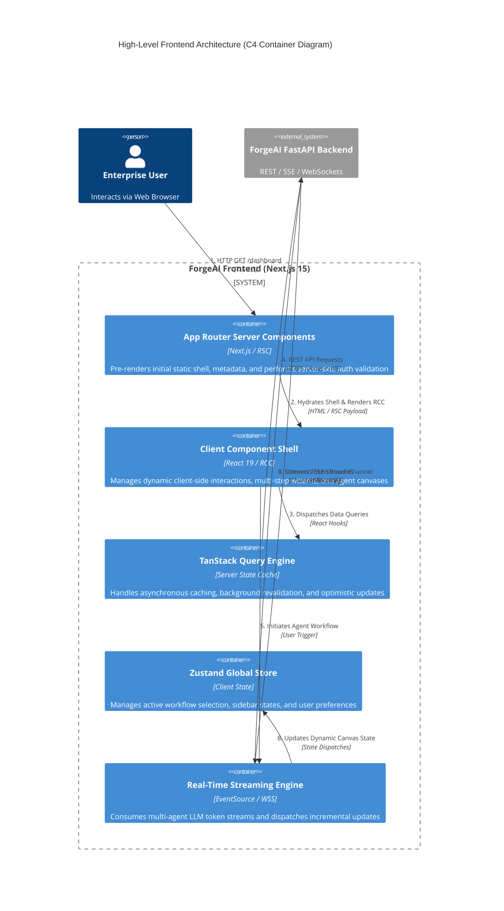

### 1.8 Example Flow: Interactive Workflow Blueprint Load
1. User navigates to `/blueprints/bp_84920`.
2. Next.js 15 Server Component intercepts request, validates session cookie, and fetches initial SSR meta tags.
3. Client Component mounts and triggers `useBlueprint(bp_84920)` TanStack Query hook.
4. TanStack Query checks memory cache; on miss, invokes Layer 1 API client (`blueprintApi.getById`).
5. Axios attaches Bearer token, sends GET request, parses response using Zod DTO schema.
6. Server state updates, components receive typed blueprint object and render canvas.

### 1.9 Recommendations
* Enforce ESLint boundary rules to prevent cross-feature imports.
* Maintain complete isolation between REST endpoints and client UI nodes.

### 1.10 Future Scalability
* System supports seamless migration of Layer 1 drivers to Web Workers for multi-threaded payload parsing if agent responses exceed 50MB.

---

## 2. Feature-Based Scalable Directory Architecture

### 2.1 Purpose
Organize the codebase by business domains rather than technical file types, ensuring high modularity, easy maintenance, and team autonomy.

### 2.2 Overview
ForgeAI implements a **Feature-First Domain-Driven Directory Architecture**. Code directly related to a domain (e.g., `blueprints`, `agent-runner`, `analytics`) is co-located inside a self-contained feature module.

### 2.3 Design Goals
* **Collocation**: Components, hooks, stores, API clients, and types for a specific feature reside together.
* **Encapsulation**: Features expose only explicit public APIs via `index.ts` barrel files.
* **Dead Code Removal**: Deleting a feature requires removing a single directory without orphan files scattered across global folders.

### 2.4 Architecture Explanation

```
┌────────────────────────────────────────────────────────────────────────┐
│                        Feature Module Isolation                        │
├────────────────────────────────────────────────────────────────────────┤
│  src/features/blueprints/                                              │
│  ├── api/           # Feature-specific endpoints & query hooks         │
│  ├── components/    # Feature-specific UI elements (Canvas, Nodes)      │
│  ├── hooks/         # Feature-specific logic & calculations          │
│  ├── store/         # Feature-specific local Zustand slice             │
│  ├── types/         # Domain DTOs & state interfaces                 │
│  └── index.ts       # Public API barrier (Only exported symbols)      │
└────────────────────────────────────────────────────────────────────────┘
```

### 2.5 Best Practices
> [!WARNING]
> Feature modules must NEVER import private internal files of another feature module. Cross-feature imports must target the target feature's root `index.ts` public interface.

### 2.6 Directory Structure
```
src/
├── app/
│   ├── (auth)/
│   │   ├── login/page.tsx
│   │   └── register/page.tsx
│   ├── (dashboard)/
│   │   ├── blueprints/
│   │   │   ├── page.tsx
│   │   │   └── [id]/page.tsx
│   │   ├── analytics/page.tsx
│   │   └── layout.tsx
│   ├── api/auth/[...nextauth]/route.tsx
│   ├── layout.tsx
│   └── page.tsx
├── components/               # Cross-Domain Shared Atomic UI
│   ├── ui/                   # Primitive shadcn components (Button, Dialog)
│   ├── feedback/             # Toast, Loaders, Error Fallbacks
│   ├── layout/               # Header, Sidebar, Footer Nav
│   └── data-display/         # Tables, Badge, Status Indicator
├── features/                 # Domain Modules
│   ├── agent-orchestrator/
│   │   ├── api/
│   │   ├── components/
│   │   ├── hooks/
│   │   ├── types/
│   │   └── index.ts
│   ├── blueprints/
│   ├── analytics/
│   ├── subscriptions/
│   └── user-settings/
├── hooks/                    # Cross-Cutting Shared Hooks (useMediaQuery, etc.)
├── store/                    # Shared Global State (Auth, Theme)
├── lib/                      # Base Infrastructure & Utilities
└── types/                    # Common System Primitives
```

### 2.7 Mermaid Feature Flow Diagram
```mermaid
graph TD
    subgraph Feature Isolation Boundary
        A[App Router Page: /blueprints/[id]] -->|Imports| B[features/blueprints/index.ts]
        B -->|Exposes| C[BlueprintCanvas Component]
        B -->|Exposes| D[useBlueprintExecution Hook]
        
        subgraph Internal Private Module Scope
            C --> E[features/blueprints/components/CanvasNode.tsx]
            C --> F[features/blueprints/components/Toolbar.tsx]
            D --> G[features/blueprints/api/fetchBlueprint.ts]
            D --> H[features/blueprints/store/blueprintSlice.ts]
        end
    end

    subgraph Blocked Unsafe Direct Imports
        X[External Feature: analytics] -.->|FORBIDDEN| E
        X -->|PERMITTED| B
    end
```

### 2.8 Example Flow
1. Developer adds a new feature `subscriptions`.
2. Developer creates `src/features/subscriptions/` containing API endpoints, pricing card components, and checkout hooks.
3. Developer exports `PricingTable` and `useCheckout` from `src/features/subscriptions/index.ts`.
4. Page `/settings/billing/page.tsx` imports `PricingTable` cleanly from `@/features/subscriptions`.

### 2.9 Recommendations
* Enforce strict ESLint `no-restricted-imports` rules preventing deep feature file access.
* Keep global `src/components/ui` strictly limited to unstyled or core primitive components.

### 2.10 Future Scalability
* Domain modules can be seamlessly split into micro-frontend remote bundles or independent npm workspace packages as engineering teams grow.

---

## 3. Component Architecture & Atomic Design System

### 3.1 Purpose
Establish an accessible, reusable, and predictable UI component taxonomy based on Atomic Design principles, powered by **shadcn/ui** and **Radix Primitives**.

### 3.2 Overview
All frontend components are categorized into 5 distinct architectural tiers: Atoms, Molecules, Organisms, Templates, and Pages.

### 3.3 Design Goals
* **100% Accessibility Compliance**: Strict WAI-ARIA adherence via Radix Primitives.
* **Theme Uniformity**: Zero hardcoded hex colors; 100% usage of semantic Tailwind CSS variables.
* **Component Pureness**: Primitive components remain completely decoupled from server state or API callers.

### 3.4 Architecture Explanation

```
┌────────────────────────────────────────────────────────────────────────┐
│                      Atomic Component Taxonomy                         │
├─────────────┬──────────────────────────────────────────────────────────┤
│ Level       │ Definition & Responsibilities                            │
├─────────────┼──────────────────────────────────────────────────────────┤
│ 1. Atoms    │ Base UI primitives (Button, Input, Badge, Typography)    │
│ 2. Molecules│ Combinations of atoms (SearchInput, FormField, StatCard) │
│ 3. Organisms│ Complex interactive UI blocks (Sidebar, Header, Graph)   │
│ 4. Templates│ Page layout skeletons, grid systems, dynamic dashboards  │
│ 5. Pages    │ Next.js App Router views wired to business hooks & RSCs  │
└─────────────┴──────────────────────────────────────────────────────────┘
```

### 3.5 Best Practices
> [!TIP]
> Use `cn()` utility (`clsx` + `tailwind-merge`) for all component class overrides to prevent Tailwind class duplication and inheritance bugs.

### 3.6 Directory Structure
```
src/components/
├── ui/                     # Level 1: Atoms & Primitive Elements
│   ├── button.tsx
│   ├── input.tsx
│   ├── dialog.tsx
│   ├── dropdown-menu.tsx
│   └── tooltip.tsx
├── molecules/              # Level 2: Composite Reusable Controls
│   ├── search-bar.tsx
│   ├── metric-card.tsx
│   ├── user-avatar-menu.tsx
│   └── form-field-wrapper.tsx
├── organisms/              # Level 3: Self-Contained UI Sections
│   ├── main-header.tsx
│   ├── agent-sidebar.tsx
│   └── blueprint-execution-table.tsx
└── templates/              # Level 4: Structural Layout Skeletons
    ├── dashboard-template.tsx
    └── auth-split-template.tsx
```

### 3.7 Mermaid Component Tree Diagram
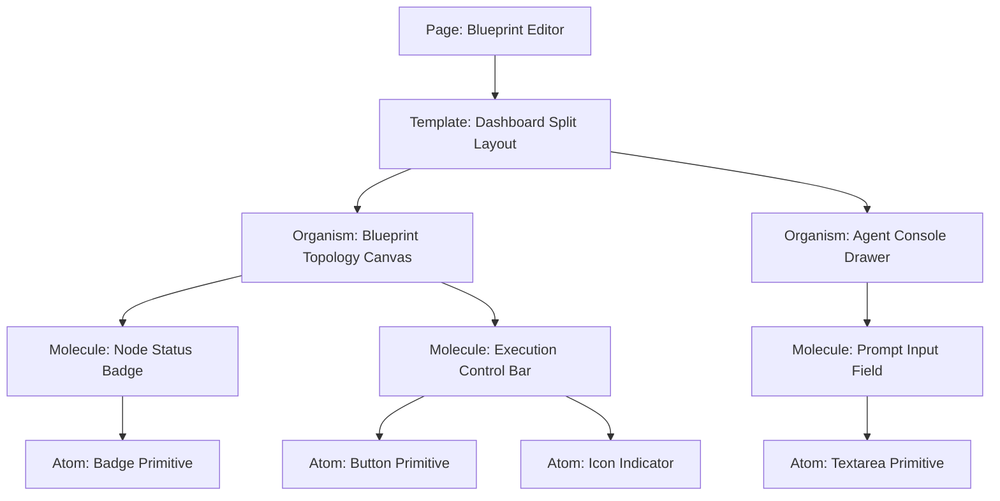

### 3.8 Example Flow: Button Primitive Construction
```tsx
// src/components/ui/button.tsx
import * as React from "react"
import { Slot } from "@radix-ui/react-slot"
import { cva, type VariantProps } from "class-variance-authority"
import { cn } from "@/lib/utils"

const buttonVariants = cva(
  "inline-flex items-center justify-center rounded-md text-sm font-medium transition-colors focus-visible:outline-none focus-visible:ring-2 focus-visible:ring-ring disabled:pointer-events-none disabled:opacity-50",
  {
    variants: {
      variant: {
        default: "bg-primary text-primary-foreground hover:bg-primary/90",
        destructive: "bg-destructive text-destructive-foreground hover:bg-destructive/90",
        outline: "border border-input bg-background hover:bg-accent hover:text-accent-foreground",
        glass: "bg-white/10 backdrop-blur-md border border-white/20 hover:bg-white/20 text-foreground",
      },
      size: {
        default: "h-10 px-4 py-2",
        sm: "h-9 rounded-md px-3",
        lg: "h-11 rounded-md px-8",
        icon: "h-10 w-10",
      },
    },
    defaultVariants: {
      variant: "default",
      size: "default",
    },
  }
)
```

### 3.9 Recommendations
* Maintain zero business logic in `src/components/ui`.
* Leverage Radix Uncontrolled Primitives whenever possible for maximum performance.

### 3.10 Future Scalability
* System supports automated export of `src/components/ui` to a standalone Storybook design system package.

---

## 4. State Management Architecture Strategy

### 4.1 Purpose
Eliminate state duplication, race conditions, and unnecessary re-renders by partitioning client memory into 3 distinct state categories with explicit sync contracts.

### 4.2 Overview
ForgeAI explicitly separates **Server State** (TanStack Query v5), **Global Client State** (Zustand), and **Form / Local UI State** (React Hook Form & `useState`).

### 4.3 Design Goals
* **Single Source of Truth**: Server data is never duplicated in global client stores.
* **Optimistic UI Updates**: Instant UI transitions with automated background rollback on failure.
* **Persistent Preferences**: Instant hydration of user themes and layout states from localStorage.

### 4.4 Architecture Explanation

```
┌────────────────────────────────────────────────────────────────────────┐
│                        Tri-State Management Matrix                     │
├──────────────────┬─────────────────────────────┬───────────────────────┤
│ State Category   │ Technology Stack            │ Primary Purpose       │
├──────────────────┼─────────────────────────────┼───────────────────────┤
│ 1. Server State  │ TanStack Query v5           │ Caching, revalidation,│
│                  │                             │ pagination, API data  │
├──────────────────┼─────────────────────────────┼───────────────────────┤
│ 2. Global Client │ Zustand + Immer Middleware  │ Active tenant, UI     │
│    State         │                             │ drawers, agent streams│
├──────────────────┼─────────────────────────────┼───────────────────────┤
│ 3. Form & Local  │ React Hook Form + Zod       │ Field errors, input   │
│    UI State      │ React `useState` / `useReducer` flags, modal toggles  │
└──────────────────┴─────────────────────────────┴───────────────────────┘
```

### 4.5 Best Practices
> [!IMPORTANT]
> Never store API response data in Zustand stores. Use TanStack Query cache as the sole repository for server responses.

### 4.6 Directory Structure
```
src/
├── store/
│   ├── use-auth-store.ts        # Global session & access token state
│   ├── use-ui-store.ts          # Sidebar collapse, active theme, global modals
│   ├── use-agent-stream-store.ts# Active live SSE agent stream buffers
│   └── index.ts
```

### 4.7 Mermaid State Transition Sequence Diagram
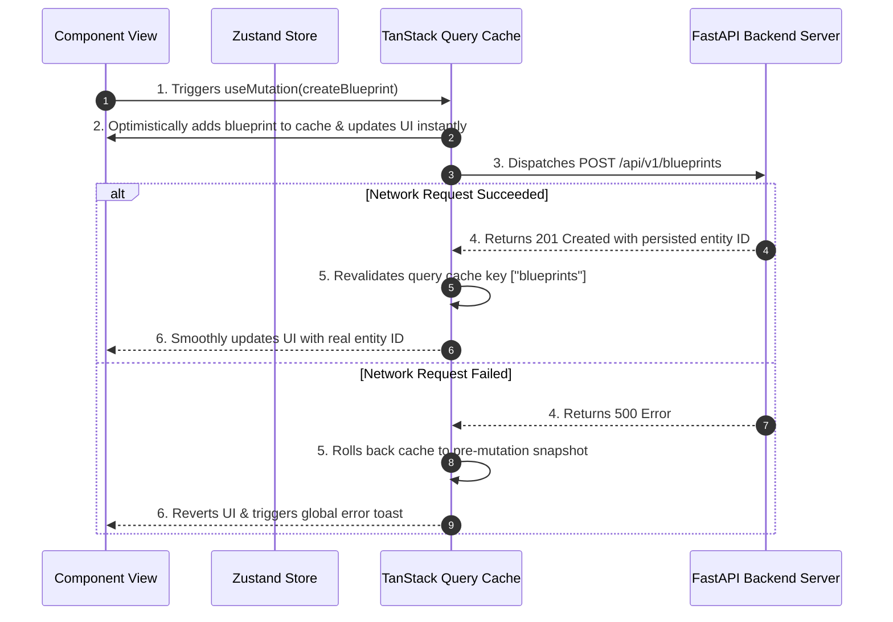

### 4.8 Example Flow: Global UI Store (Zustand)
```typescript
// src/store/use-ui-store.ts
import { create } from 'zustand'
import { persist, createJSONStorage } from 'zustand/middleware'

interface UIState {
  isSidebarOpen: boolean
  activeWorkspaceId: string | null
  toggleSidebar: () => void
  setActiveWorkspace: (id: string) => void
}

export const useUIStore = create<UIState>()(
  persist(
    (set) => ({
      isSidebarOpen: true,
      activeWorkspaceId: null,
      toggleSidebar: () => set((state) => ({ isSidebarOpen: !state.isSidebarOpen })),
      setActiveWorkspace: (id) => set({ activeWorkspaceId: id }),
    }),
    {
      name: 'forgeai-ui-preferences',
      storage: createJSONStorage(() => localStorage),
    }
  )
)
```

### 4.9 Recommendations
* Always use selective Zustand selectors (`useUIStore(state => state.isSidebarOpen)`) to prevent full component tree re-renders.

### 4.10 Future Scalability
* Supports TanStack Query sync across browser tabs via `broadcastQueryClient` plugin.

---

## 5. Next.js 15 App Router & Rendering Engine

### 5.1 Purpose
Leverage Next.js 15 App Router capabilities to achieve optimal hybrid rendering, combining zero-bundle Server Components with highly dynamic Client Components.

### 5.2 Overview
ForgeAI uses React Server Components (RSC) by default for layout frames, static metadata, and server-side authorization checks, selectively injecting Client Components (`'use client'`) only at interactive boundary nodes.

### 5.3 Design Goals
* **Zero Client JavaScript for Static Shells**: Layouts and documentation pages ship minimal JS to the browser.
* **Streaming SSR**: Instant Progressive HTML delivery using React Suspense.
* **Optimized Routing**: Intercepting and Parallel routes for seamless modal navigation without URL loss.

### 5.4 Architecture Explanation

```
┌────────────────────────────────────────────────────────────────────────┐
│                   RSC vs Client Component Decision Matrix              │
├───────────────────────────────────────┬──────────────┬─────────────────┤
│ Architectural Requirement             │ RSC (Server) │ RCC (Client)    │
├───────────────────────────────────────┼──────────────┼─────────────────┤
│ Direct Database / Backend Auth Check │ YES          │ NO              │
│ Zero Client JS Bundle Impact          │ YES          │ NO              │
│ State Hooks (`useState`, `useEffect`)  │ NO           │ YES             │
│ DOM Event Listeners (`onClick`)       │ NO           │ YES             │
│ Browser APIs (`localStorage`, SSE)    │ NO           │ YES             │
└───────────────────────────────────────┴──────────────┴─────────────────┘
```

### 5.5 Best Practices
> [!NOTE]
> Keep Client Component boundaries as deep down the component tree as possible to maximize server rendering benefits.

### 5.6 Directory Structure
```
src/app/
├── (dashboard)/
│   ├── layout.tsx                # RSC: Server-side Auth Check & Shell
│   ├── blueprints/
│   │   ├── page.tsx              # RSC: Server Data Prefetching
│   │   └── @modal/               # Parallel Route Slot
│   │       └── (..)preview/[id]/ # Intercepting Route Modal
│   │           └── page.tsx      # RCC: Interactive Modal Preview
```

### 5.7 Mermaid Layout Hierarchy Diagram
```mermaid
graph TD
    subgraph Server Context (RSC)
        RootLayout[app/layout.tsx] --> AuthGuard[Server Auth Middleware]
        AuthGuard --> DashboardLayout[app/(dashboard)/layout.tsx]
        DashboardLayout --> SidebarRSC[Server Navigation Rail]
        DashboardLayout --> PageRSC[app/(dashboard)/blueprints/page.tsx]
    end

    subgraph Client Context (RCC Boundaries)
        PageRSC --> |Hydrates Boundary| CanvasRCC[features/blueprints/BlueprintCanvas.tsx]
        SidebarRSC --> |Hydrates Boundary| UserMenuRCC[components/molecules/UserMenu.tsx]
    end
```

### 5.8 Example Flow: Server Component Prefetching
```tsx
// src/app/(dashboard)/blueprints/page.tsx
import { dehydrate, HydrationBoundary, QueryClient } from '@tanstack/react-query'
import { BlueprintGrid } from '@/features/blueprints/components/BlueprintGrid'

export default async function BlueprintsPage() {
  const queryClient = new QueryClient()

  await queryClient.prefetchQuery({
    queryKey: ['blueprints'],
    queryFn: () => fetch('https://api.forgeai.com/v1/blueprints').then(res => res.json()),
  })

  return (
    <HydrationBoundary state={dehydrate(queryClient)}>
      <main className="p-6">
        <h1 className="text-2xl font-bold">Engineering Blueprints</h1>
        <BlueprintGrid />
      </main>
    </HydrationBoundary>
  )
}
```

### 5.9 Recommendations
* Enforce strict RSC constraints: never pass functions or non-serializable objects from RSC to RCC.

### 5.10 Future Scalability
* App Router architecture supports Edge Runtime deployment for sub-20ms global SSR latency.

---

## 6. Real-Time & Streaming AI Token Rendering Engine

### 6.1 Purpose
Provide a ultra-low-latency, tear-free streaming interface for multi-agent LLM token outputs, code generation execution logs, and live graph updates.

### 6.2 Overview
The Real-Time Engine connects to FastAPI Server-Sent Events (SSE) or WebSocket streams using standard `fetch()` `ReadableStream` readers, buffering incoming token chunks and rendering markdown dynamically using virtualized DOM containers.

### 6.3 Design Goals
* **Sub-10ms Token Render Latency**: Immediate visual feedback as AI agents emit response tokens.
* **Zero Layout Shifts**: Dynamic height estimation for incoming code blocks and markdown trees.
* **Auto-Scroll Management**: Intelligent user scroll overrides (pauses auto-scroll when user manually scrolls up).

### 6.4 Architecture Explanation

```
┌────────────────────────────────────────────────────────────────────────┐
│                     Streaming Token Pipeline Engine                    │
├────────────────────────────────────────────────────────────────────────┤
│  FastAPI SSE Stream ──► ReadableStream Reader ──► Chunk De-framing    │
│                                                          │             │
│  Virtualized UI Node ◄── Markdown Tokenizer ◄── Batch Buffer (16ms)    │
└────────────────────────────────────────────────────────────────────────┘
```

### 6.5 Best Practices
> [!CAUTION]
> Do NOT trigger a React re-render for every single incoming character token. Buffer tokens into 16ms animation frame windows (`requestAnimationFrame`) to maintain 60 FPS UI performance.

### 6.6 Directory Structure
```
src/lib/stream/
├── sse-client.ts             # Transport stream reader
├── token-buffer.ts           # 16ms RAF Batching Queue
├── markdown-tokenizer.ts     # Incremental AST parsing engine
└── index.ts
```

### 6.7 Mermaid Stream Processing State Machine
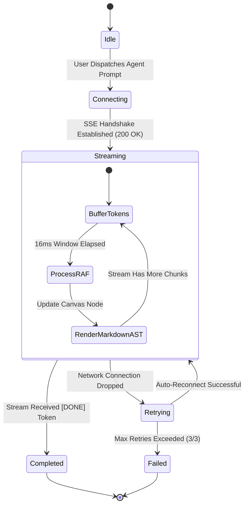

### 6.8 Example Flow: Stream Reader Implementation
```typescript
// src/lib/stream/sse-client.ts
export async function consumeAgentStream(
  url: string,
  onToken: (token: string) => void,
  signal: AbortSignal
) {
  const response = await fetch(url, { signal, headers: { Accept: 'text/event-stream' } })
  if (!response.body) throw new Error('Stream body missing')

  const reader = response.body.getReader()
  const decoder = new TextDecoder('utf-8')

  while (true) {
    const { done, value } = await reader.read()
    if (done) break
    const chunk = decoder.decode(value, { stream: true })
    onToken(chunk)
  }
}
```

### 6.9 Recommendations
* Integrate WebGL canvas nodes via HTML5 Canvas for massive 1,000+ node multi-agent execution graphs.

### 6.10 Future Scalability
* WebAssembly (WASM) stream parser integration for offline syntax highlighting of 100k+ line code blueprints.

---

## 7. Authentication, Authorization & Security Architecture

### 7.1 Purpose
Ensure zero-trust security for all enterprise user interactions, enforcing seamless session management, Role-Based Access Control (RBAC), and mitigation of web application vulnerabilities.

### 7.2 Overview
ForgeAI utilizes a **Dual-Token Authentication Architecture**: Short-lived JWT Access Tokens (15 min lifespan) stored strictly in client memory, alongside long-lived Refresh Tokens (7 days lifespan) stored in `HttpOnly`, `SameSite=Strict`, `Secure` cookies.

### 7.3 Design Goals
* **Zero XSS Token Theft**: Access tokens are never stored in `localStorage` or `sessionStorage`.
* **Silent Token Refresh**: Automatic, transparent token renewal in background interceptors.
* **Granular RBAC**: Dynamic route and component view guards based on user permissions.

### 7.4 Architecture Explanation

```
┌────────────────────────────────────────────────────────────────────────┐
│                   Dual-Token Security Architecture                     │
├───────────────────┬───────────────────────────┬────────────────────────┤
│ Token Type        │ Storage Location          │ Transmission Method    │
├───────────────────┼───────────────────────────┼────────────────────────┤
│ Access Token      │ Client Memory (Zustand)   │ HTTP Authorization     │
│ (15 min lifespan) │                           │ `Bearer <token>`       │
├───────────────────┼───────────────────────────┼────────────────────────┤
│ Refresh Token     │ HttpOnly Cookie           │ Automated Browser      │
│ (7 day lifespan)  │ (SameSite=Strict, Secure) │ Cookie Header          │
└───────────────────┴───────────────────────────┴────────────────────────┘
```

### 7.5 Best Practices
> [!WARNING]
> Never expose access tokens to third-party tracking scripts or inline DOM nodes. All API requests must use the central Axios interceptor instance.

### 7.6 Directory Structure
```
src/lib/auth/
├── axios-instance.ts         # Axios Interceptor with Silent Refresh
├── token-manager.ts          # In-memory token store
├── rbac-guard.tsx            # Permission Wrapper Component
└── middleware-auth.ts        # Next.js Edge Route Guard
```

### 7.7 Mermaid Silent Token Refresh Flow
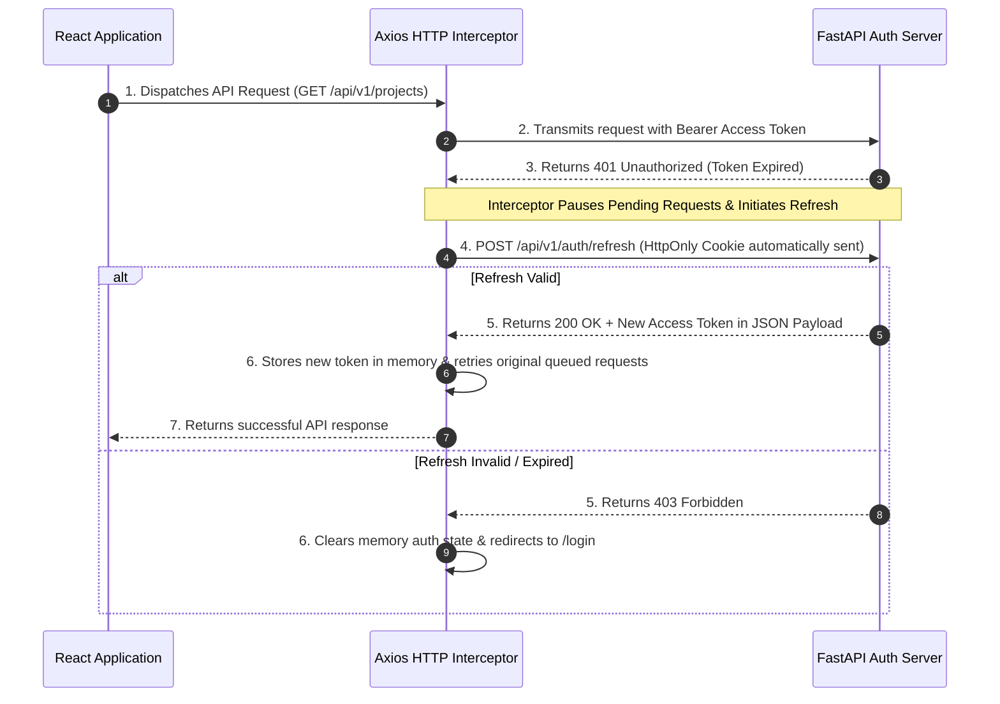

### 7.8 Example Flow: RBAC View Guard Component
```tsx
// src/lib/auth/rbac-guard.tsx
import { useAuthStore } from '@/store/use-auth-store'
import { ReactNode } from 'react'

interface GuardProps {
  requiredPermission: string
  fallback?: ReactNode
  children: ReactNode
}

export function RBACGuard({ requiredPermission, fallback = null, children }: GuardProps) {
  const permissions = useAuthStore((state) => state.userPermissions)

  if (!permissions.includes(requiredPermission)) {
    return <>{fallback}</>
  }

  return <>{children}</>
}
```

### 7.9 Recommendations
* Set strong Content Security Policy (CSP) headers inside Next.js `next.config.ts`.
* Implement strict request rate-limiting defense boundaries at Next.js Edge Middleware.

### 7.10 Future Scalability
* Seamless support for enterprise WebAuthn / FIDO2 Passkeys and SAML 2.0 / Okta SSO integrations.

---

## 8. Form Engine & Schema Validation Architecture

### 8.1 Purpose
Provide a fully type-safe, performant form architecture capable of validating complex, multi-step enterprise blueprint configurations with zero unnecessary re-renders.

### 8.2 Overview
Forms are built using **React Hook Form** integrated with **Zod** schema validation. Zod schemas serve as the single source of truth for both runtime input validation and TypeScript static type inference.

### 8.3 Design Goals
* **Single Source of Truth**: Zod schemas derive TypeScript form types automatically via `z.infer<typeof schema>`.
* **Sub-16ms Validation Execution**: Asynchronous field-level validation executes without blocking the UI thread.
* **Multi-Step State Preservation**: Deep nested wizard forms preserve validated state across page steps.

### 8.4 Architecture Explanation

```
┌────────────────────────────────────────────────────────────────────────┐
│                    Form Validation Architecture                        │
├────────────────────────────────────────────────────────────────────────┤
│  Zod Schema Definition ──► TypeScript Type Inference (`z.infer`)       │
│           │                                                            │
│           ▼                                                            │
│  React Hook Form Resolver ──► Dynamic Input Binding ──► Clean DTO Output│
└────────────────────────────────────────────────────────────────────────┘
```

### 8.5 Best Practices
> [!TIP]
> Use React Hook Form `useWatch` or selective `FormSpy` controls instead of binding input values directly to parent component local state.

### 8.6 Directory Structure
```
src/features/blueprints/forms/
├── create-blueprint-schema.ts   # Zod validation rule definition
├── create-blueprint-wizard.tsx # RHF Container Component
├── steps/                       # Step-by-Step Form Sections
│   ├── step-basic-info.tsx
│   ├── step-agent-config.tsx
│   └── step-infrastructure.tsx
└── index.ts
```

### 8.7 Mermaid Form Validation Workflow
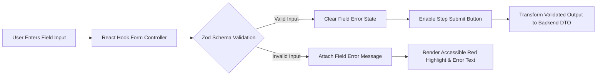

### 8.8 Example Flow: Schema Definition & Form Implementation
```typescript
// src/features/blueprints/forms/create-blueprint-schema.ts
import { z } from 'zod'

export const createBlueprintSchema = z.object({
  title: z.string().min(3, "Title must contain at least 3 characters").max(100),
  targetEnvironment: z.enum(["development", "staging", "production"]),
  agentCount: z.number().int().min(1).max(14),
  enableVectorRAG: z.boolean().default(true),
})

export type CreateBlueprintInput = z.infer<typeof createBlueprintSchema>
```

### 8.9 Recommendations
* Standardize all error message strings inside central localized validation schemas.
* Co-locate custom validation regex rules within domain feature directories.

### 8.10 Future Scalability
* Supports dynamic server-driven schema rendering where FastAPI sends JSON Schema specs converted directly to Zod at runtime.

---

## 9. Data Visualization & Analytics Infrastructure

### 9.1 Purpose
Render high-density enterprise analytics, multi-agent cost metrics, token consumption speeds, and system telemetry with 60 FPS performance and dark-mode aesthetics.

### 9.2 Overview
Data visualizers utilize **Recharts** wrapped inside responsive container nodes, integrated with custom SVG gradients, tooltip components, and theme observer hooks.

### 9.3 Design Goals
* **Responsive Fluid Scaling**: Charts resize smoothly across all device breakpoints without canvas distortion.
* **Dynamic Theme Integration**: Chart color palettes automatically adapt to active CSS variable tokens.
* **High Data Density Handling**: Virtualized data slicing for series exceeding 10,000 telemetry points.

### 9.4 Architecture Explanation

```
┌────────────────────────────────────────────────────────────────────────┐
│                   Analytics Component Taxonomy                         │
├───────────────────┬───────────────────────────┬────────────────────────┤
│ Chart Type        │ Target Metric             │ Performance Protocol   │
├───────────────────┼───────────────────────────┼────────────────────────┤
│ Area / Line Chart │ Token Streaming Velocity  │ SVG Paths + Gradients  │
│ Bar Chart         │ Monthly Agent Spend       │ Responsive Container   │
│ Pie / Donut Chart │ LLM Model Distribution    │ Animated Tooltips      │
│ Radar Chart       │ Agent Benchmark Scores    │ Zero Re-render Memo    │
└───────────────────┴───────────────────────────┴────────────────────────┘
```

### 9.5 Best Practices
> [!IMPORTANT]
> Always wrap Recharts components inside `React.memo` and specify explicit `minHeight` on parent container nodes to prevent zero-height collapse during SSR hydration.

### 9.6 Directory Structure
```
src/features/analytics/components/
├── token-usage-chart.tsx        # Line/Area Chart for token consumption
├── agent-cost-breakdown.tsx     # Donut Chart for LLM provider cost
├── latency-histogram.tsx        # Bar Chart for API latency metrics
└── chart-container-wrapper.tsx # Theme-aware wrapper node
```

### 9.7 Mermaid Analytics Pipeline Diagram
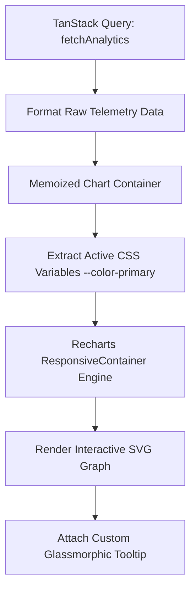

### 9.8 Example Flow: Responsive Chart Component
```tsx
// src/features/analytics/components/token-usage-chart.tsx
"use client"

import { ResponsiveContainer, AreaChart, Area, XAxis, YAxis, Tooltip } from 'recharts'
import { memo } from 'react'

interface TokenData { timestamp: string; tokens: number }

export const TokenUsageChart = memo(function TokenUsageChart({ data }: { data: TokenData[] }) {
  return (
    <div className="h-[350px] w-full bg-card/50 backdrop-blur-md p-4 rounded-xl border border-border">
      <ResponsiveContainer width="100%" height="100%">
        <AreaChart data={data}>
          <defs>
            <linearGradient id="tokenGrad" x1="0" y1="0" x2="0" y2="1">
              <stop offset="5%" stopColor="hsl(var(--primary))" stopOpacity={0.8}/>
              <stop offset="95%" stopColor="hsl(var(--primary))" stopOpacity={0}/>
            </linearGradient>
          </defs>
          <XAxis dataKey="timestamp" stroke="hsl(var(--muted-foreground))" />
          <YAxis stroke="hsl(var(--muted-foreground))" />
          <Tooltip content={<CustomGlassTooltip />} />
          <Area type="monotone" dataKey="tokens" stroke="hsl(var(--primary))" fillOpacity={1} fill="url(#tokenGrad)" />
        </AreaChart>
      </ResponsiveContainer>
    </div>
  )
})
```

### 9.9 Recommendations
* Utilize HTML5 Canvas rendering for live real-time streams updating faster than 100ms intervals.

### 9.10 Future Scalability
* Seamless integration with Apache ECharts or Deck.gl for 3D topology visualization of multi-tenant enterprise agent graphs.

---

## 10. Design System, Styling & Animation Framework

### 10.1 Purpose
Provide a futuristic, modern visual identity for ForgeAI using design tokens, dark-mode glassmorphism, fluid typography, and dynamic micro-interactions.

### 10.2 Overview
Styling is powered by **Tailwind CSS** with CSS Custom Properties (Variables), extended with **Framer Motion** for physics-based layout animations and interactive view transitions.

### 10.3 Design Goals
* **Cohesive Design Tokens**: Standardized spacing, radii, typography, and elevation layers.
* **Modern Aesthetic**: Deep dark mode, subtle glassmorphism (`backdrop-blur`), dynamic glowing borders, and crisp contrast.
* **60 FPS Micro-Interactions**: Smooth hover effects and layout transitions driven by hardware-accelerated transforms.

### 10.4 Architecture Explanation

```
┌────────────────────────────────────────────────────────────────────────┐
│                        Design System Architecture                      │
├────────────────────────────────────────────────────────────────────────┤
│  Tailwind CSS Engine ──► CSS Variables (`--background`, `--primary`)   │
│           │                                                            │
│           ▼                                                            │
│  shadcn/ui Component Primitives ──► Framer Motion Animation Wrappers   │
└────────────────────────────────────────────────────────────────────────┘
```

### 10.5 Best Practices
> [!NOTE]
> Avoid animating layout-triggering CSS properties like `width`, `height`, or `margin`. Animate strictly `transform` (`scale`, `translate3d`) and `opacity` for hardware-accelerated performance.

### 10.6 Directory Structure
```
src/
├── app/
│   └── globals.css           # CSS Variable Tokens & Glassmorphism Utilities
├── lib/
│   └── utils.ts              # Class Merger (`cn()`) Utility
└── components/
    └── motion/               # Shared Framer Motion Wrappers
        ├── fade-in.tsx
        ├── slide-over.tsx
        └── animated-presence-wrapper.tsx
```

### 10.7 Mermaid Animation Hierarchy
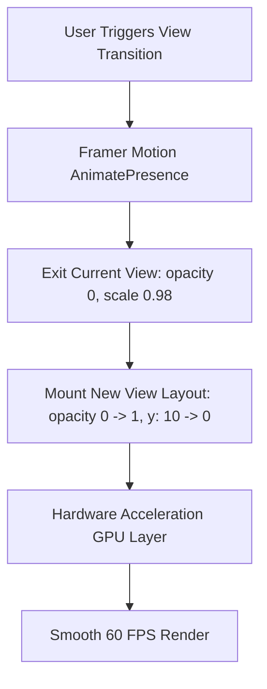

### 10.8 Example Flow: Framer Motion Animation Wrapper
```tsx
// src/components/motion/fade-in.tsx
"use client"

import { motion } from 'framer-motion'
import { ReactNode } from 'react'

export function FadeIn({ children, delay = 0 }: { children: ReactNode; delay?: number }) {
  return (
    <motion.div
      initial={{ opacity: 0, y: 12 }}
      animate={{ opacity: 1, y: 0 }}
      exit={{ opacity: 0, y: -12 }}
      transition={{ duration: 0.25, delay, ease: [0.16, 1, 0.3, 1] }}
    >
      {children}
    </motion.div>
  )
}
```

### 10.9 Recommendations
* Enforce `prefers-reduced-motion` media query compliance to respect user accessibility preferences.

### 10.10 Future Scalability
* Centralized token exports enabling multi-platform theme synchronization across web, desktop (Tauri), and mobile apps.

---

## 11. Error Handling, Telemetry & Resilience Strategy

### 11.1 Purpose
Ensure enterprise-grade system resilience, preventing complete application crashes through fault isolation, graceful fallbacks, and real-time observability.

### 11.2 Overview
ForgeAI deploys a multi-layered error defense model incorporating **React Error Boundaries**, global toast notifications, automatic API retry strategies, and telemetry tracking via Sentry.

### 11.3 Design Goals
* **Zero Total Application White-Outs**: Isolated component failures do not crash parent layouts.
* **Actionable User Recovery**: Every error boundary provides a "Retry Action" button.
* **Full Telemetry Capture**: Automatic exception logging with full user context and stack trace details.

### 11.4 Architecture Explanation

```
┌────────────────────────────────────────────────────────────────────────┐
│                        Error Boundary Hierarchy                        │
├────────────────────────────────────────────────────────────────────────┤
│  Global Root Error Boundary (App-wide failure fallback page)          │
│   └── Dashboard Layout Boundary (Sidebar remains interactive)          │
│        └── Feature Canvas Boundary (Isolates single agent failure)     │
└────────────────────────────────────────────────────────────────────────┘
```

### 11.5 Best Practices
> [!IMPORTANT]
> Distinguish between operational errors (e.g., 404 Not Found, 422 Validation Error) and systemic errors (e.g., 500 Internal Error, ChunkLoadError). Operational errors must render inline feedback, not throw fatal boundary exceptions.

### 11.6 Directory Structure
```
src/components/feedback/
├── error-boundary.tsx           # React Class Error Boundary Component
├── global-error-fallback.tsx    # Full-page root fallback view
├── feature-error-fallback.tsx   # Inline widget fallback view
└── toast-provider.tsx           # Toast Notification Manager
```

### 11.7 Mermaid Resilience Flowchart
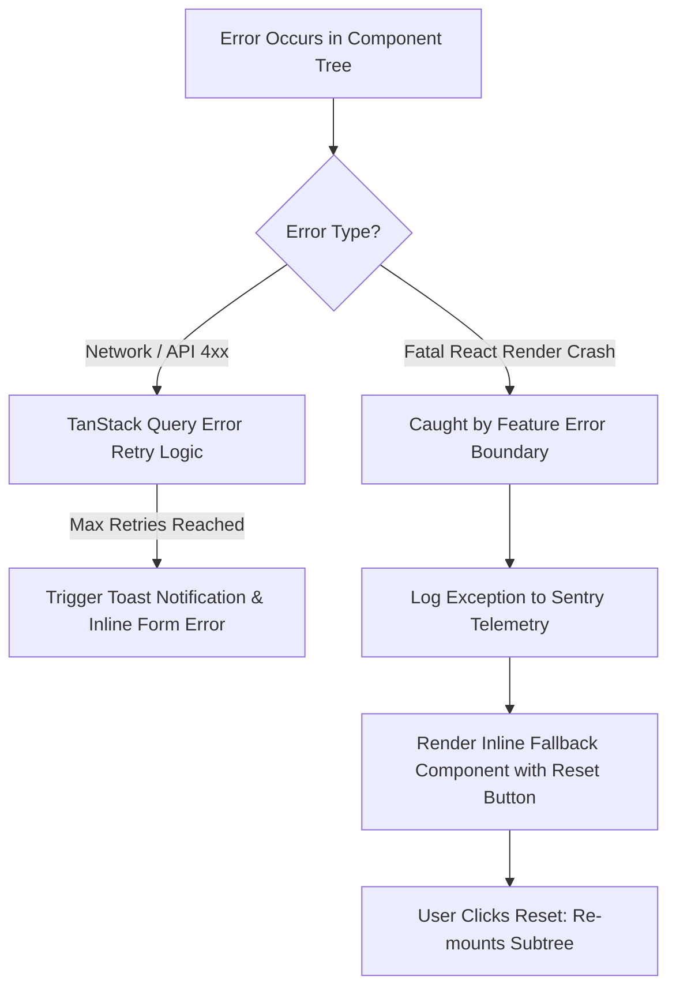

### 11.8 Example Flow: Feature Error Boundary Implementation
```tsx
// src/components/feedback/error-boundary.tsx
"use client"

import React, { Component, ErrorInfo, ReactNode } from 'react'

interface Props { children: ReactNode; fallback?: ReactNode }
interface State { hasError: boolean }

export class ErrorBoundary extends Component<Props, State> {
  public state: State = { hasError: false }

  public static getDerivedStateFromError(): State {
    return { hasError: true }
  }

  public componentDidCatch(error: Error, errorInfo: ErrorInfo) {
    console.error("Uncaught error:", error, errorInfo)
    // Sentry.captureException(error)
  }

  public render() {
    if (this.state.hasError) {
      return this.props.fallback || (
        <div className="p-6 rounded-lg bg-destructive/10 border border-destructive/20 text-center">
          <h3 className="text-lg font-semibold text-destructive">Component Exception Captured</h3>
          <button onClick={() => this.setState({ hasError: false })} className="mt-3 text-sm underline">
            Try Again
          </button>
        </div>
      )
    }
    return this.props.children
  }
}
```

### 11.9 Recommendations
* Configure automated Sentry session replay for rapid debugging of client edge cases.

### 11.10 Future Scalability
* Integration with OpenTelemetry Web SDK for unified client-to-backend distributed tracing.

---

## 12. Performance Optimization & Core Web Vitals Standard

### 12.1 Purpose
Guarantee hyper-fast page loads, sub-50ms interaction latencies, and flawless rendering performance for complex enterprise multi-agent applications.

### 12.2 Overview
ForgeAI enforces strict performance budgets targetting Google Core Web Vitals standards through dynamic code splitting, DOM virtualization, image/font optimization, and tree-shaking.

### 12.3 Design Goals
* **Largest Contentful Paint (LCP)**: < 1.2 seconds.
* **Interaction to Next Paint (INP)**: < 50 milliseconds.
* **Cumulative Layout Shift (CLS)**: < 0.01 (Zero visual shifts).
* **Initial JavaScript Bundle Size**: < 85 KB gzipped initial parse.

### 12.4 Architecture Explanation

```
┌────────────────────────────────────────────────────────────────────────┐
│                   Performance Optimization Strategy                    │
├───────────────────┬───────────────────────────┬────────────────────────┤
│ Optimization Area │ Technique                 │ Impact                 │
├───────────────────┼───────────────────────────┼────────────────────────┤
│ Bundle Splitting  │ Dynamic `import()`        │ Eliminates unused JS   │
│ Asset Delivery    │ Next.js `next/font`       │ Zero FOIT/FOUT shift   │
│ DOM Virtualization│ `@tanstack/react-virtual` │ Smooth 10k+ row scroll │
│ Image Assets      │ Next.js `next/image`      │ WebP auto-conversion   │
└───────────────────┴───────────────────────────┴────────────────────────┘
```

### 12.5 Best Practices
> [!TIP]
> Use Next.js `dynamic()` imports for heavy non-critical UI components (e.g., Recharts graphs, Monaco Code Editors) to isolate them into separate lazy-loaded JS chunks.

### 12.6 Directory Structure
```
src/
├── lib/
│   └── dynamic-imports.ts     # Centralized lazy component definitions
└── components/
    └── virtualization/        # TanStack Virtualized List Wrappers
        └── virtual-table.tsx
```

### 12.7 Mermaid Asset Loading Waterfall
```mermaid
gantt
    title Next.js 15 Asset Loading Waterfall
    dateFormat SS.SSS
    axisFormat %S.%s

    section Initial HTML
    App Router Server HTML   :active, html, 00.000, 00.150
    
    section Fonts & CSS
    Geist Sans Variable Font :font, 00.100, 00.250
    Tailwind CSS Bundle      :css, 00.120, 00.220
    
    section JS Chunks
    Framework Core Bundle    :js, 00.200, 00.450
    Feature Page Chunk       :js, 00.300, 00.550
    
    section Lazy Modules
    Recharts Analytics Chunk :crit, lazy, 00.700, 00.950
```

### 12.8 Example Flow: Lazy Component Loading
```tsx
// src/lib/dynamic-imports.ts
import dynamic from 'next/dynamic'

export const DynamicMonacoEditor = dynamic(
  () => import('@monaco-editor/react').then((mod) => mod.Editor),
  {
    ssr: false,
    loading: () => <div className="h-[400px] w-full animate-pulse bg-muted rounded-md" />,
  }
)
```

### 12.9 Recommendations
* Run `@next/bundle-analyzer` on every production build to detect unexpected dependency bloat.

### 12.10 Future Scalability
* Implement Service Worker Caching Strategies (PWA) for persistent offline asset caching.

---

## 13. Testing, Quality Assurance & CI/CD Pipeline

### 13.1 Purpose
Guarantee pristine code quality, zero regression bugs, and seamless continuous delivery through automated unit, integration, visual regression, and E2E testing suites.

### 13.2 Overview
Testing is organized under the **Testing Pyramid**: Unit tests executed via **Vitest**, integration tests via **React Testing Library**, E2E user flows via **Playwright**, and component documentation via **Storybook**.

### 13.3 Design Goals
* **Code Coverage Threshold**: Minimum 85% line coverage on feature business hooks and API drivers.
* **Fast Test Execution**: Full unit test suite executes in < 15 seconds.
* **Deterministic E2E Verification**: Isolated mock servers prevent flaky network tests.

### 13.4 Architecture Explanation

```
┌────────────────────────────────────────────────────────────────────────┐
│                        Testing Pyramid Strategy                        │
├────────────────────────────────────────────────────────────────────────┤
│             ▲  Playwright E2E Tests (Critical Auth & Billing)         │
│            ───                                                         │
│           ▲   ▲  React Testing Library (Feature Integration Flows)     │
│          ───────                                                       │
│         ▲   ▲   ▲  Vitest Unit Tests (Hooks, Utilities, Zod Schemas)   │
└────────────────────────────────────────────────────────────────────────┘
```

### 13.5 Best Practices
> [!IMPORTANT]
> Test user behavior, not implementation details. Query elements using accessible roles (`getByRole('button', { name: /submit/i })`) rather than CSS selectors.

### 13.6 Directory Structure
```
tests/
├── unit/                     # Vitest Unit Tests
│   ├── hooks/
│   └── utils/
├── integration/              # React Testing Library Component Tests
│   └── features/
├── e2e/                      # Playwright E2E Test Specifications
│   ├── auth.spec.ts
│   └── blueprint-wizard.spec.ts
└── mocks/                    # MSW (Mock Service Worker) Handlers
    ├── handlers.ts
    └── server.ts
```

### 13.7 Mermaid CI/CD Pipeline Diagram
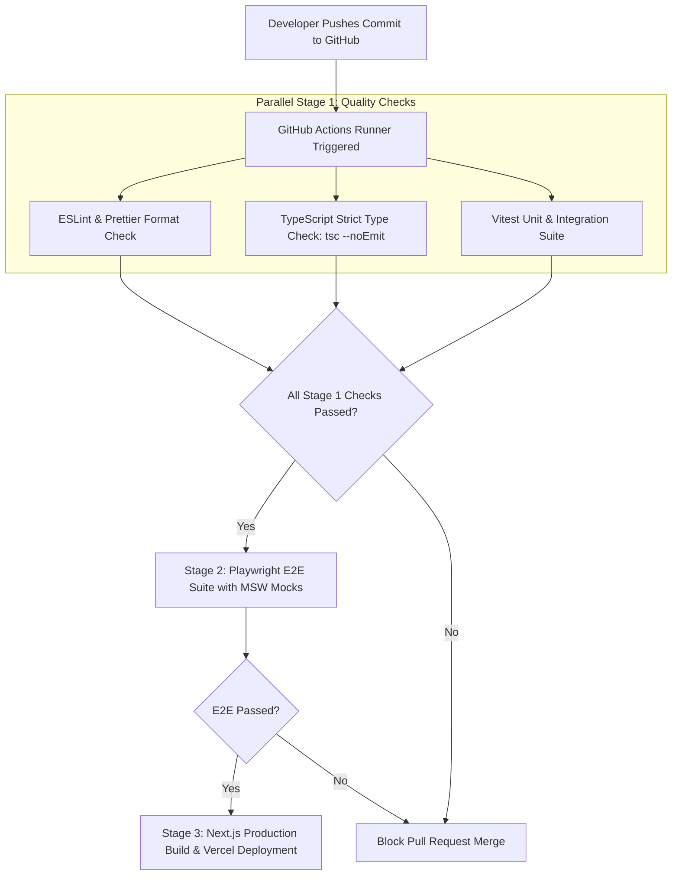

### 13.8 Example Flow: Integration Test with RTL & MSW
```typescript
// tests/integration/features/login.test.tsx
import { render, screen, fireEvent } from '@testing-library/react'
import { describe, it, expect } from 'vitest'
import LoginForm from '@/features/auth/components/LoginForm'

describe('LoginForm Component', () => {
  it('validates required fields before submitting', async () => {
    render(<LoginForm />)
    
    const submitBtn = screen.getByRole('button', { name: /sign in/i })
    fireEvent.click(submitBtn)

    expect(await screen.findByText(/email is required/i)).toBeInTheDocument()
  })
})
```

### 13.9 Recommendations
* Integrate Visual Regression Testing using Percy or Chromatic for Storybook component snapshots.

### 13.10 Future Scalability
* Automated AI-assisted regression test generation triggered on every Pull Request diff.

---

## 14. Future Scalability & Architectural Evolution Roadmap

### 14.1 Purpose
Outline the long-term technical evolution path for the ForgeAI frontend, ensuring architectural readiness for multi-million user scale, offline execution, and advanced AI interaction modalities.

### 14.2 Overview
As platform capabilities expand, the architecture is designed to seamlessly integrate Micro-Frontends, WebAssembly local AI computing, Progressive Web App (PWA) offline capabilities, and WebGPU graph rendering.

### 14.3 Evolution Roadmap Matrix

```
┌────────────────────────────────────────────────────────────────────────┐
│                   Architectural Evolution Roadmap                      │
├───────────────────┬───────────────────────────┬────────────────────────┤
│ Milestone Phase   │ Architecture Initiative   │ Technical Business Impact│
├───────────────────┼───────────────────────────┼────────────────────────┤
│ Phase 1 (Current) │ Modular Monolith Next.js 15│ Rapid feature velocity │
│ Phase 2 (Q4 2026) │ WebAssembly Token Engine  │ Offline vector parsing │
│ Phase 3 (Q2 2027) │ Micro-Frontends (Module   │ Independent domain team│
│                   │ Federation)               │ deployment autonomy    │
│ Phase 4 (Q4 2027) │ WebGPU Agent Topology     │ 100,000+ graph nodes   │
│                   │ Canvas Engine             │ rendered at 120 FPS    │
└───────────────────┴───────────────────────────┴────────────────────────┘
```

### 14.4 Architecture Decision Records (ADR Summary)

| ADR ID | Decision Title | Status | Rationale & Trade-Offs |
| :--- | :--- | :--- | :--- |
| **ADR-001** | Next.js 15 App Router | **Accepted** | Provides seamless RSC server rendering and edge capabilities; accepted learning curve overhead. |
| **ADR-002** | Zustand over Redux Toolkit | **Accepted** | Extremely lightweight (< 1KB), zero boilerplate, perfect for high-frequency client state dispatches. |
| **ADR-003** | TanStack Query for Server State | **Accepted** | Eliminates manual cache management; standardizes optimistic updates and background revalidation. |
| **ADR-004** | Tailwind CSS + shadcn/ui | **Accepted** | Full ownership of accessible primitive component source code; eliminates heavy third-party UI library lock-in. |

### 14.5 Mermaid Long-Term Architecture Evolution
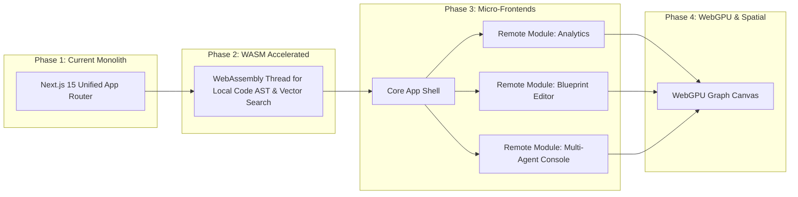

### 14.6 Recommendations
* Conduct quarterly architectural reviews to audit dependency sizes, ESLint boundary integrity, and Core Web Vitals health metrics.

### 14.7 Summary Sign-Off
> **Approved By**: Chief Technology Officer & Lead Frontend Architect  
> **Repository Governance**: `forgeai-frontend` Core Architecture Specification  
> **Compliance Standard**: SOC 2 Type II, WAI-ARIA Level AA, OWASP Top 10 Web Resilience  
