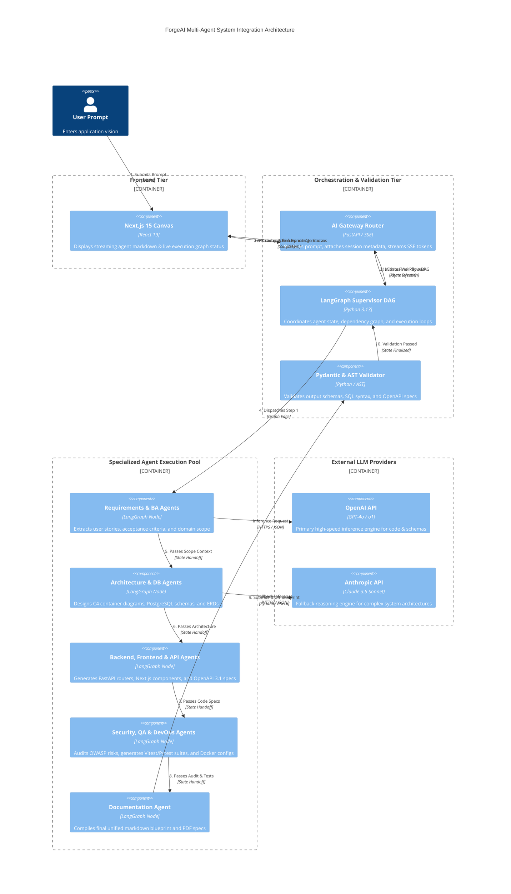
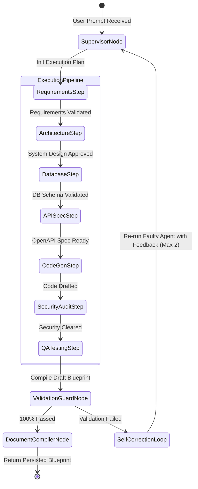
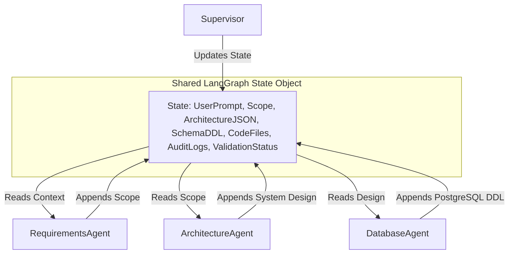
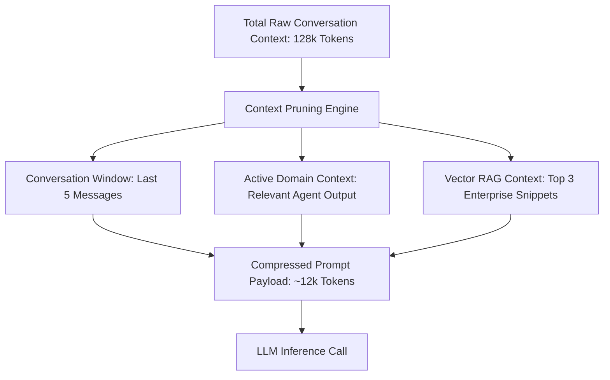
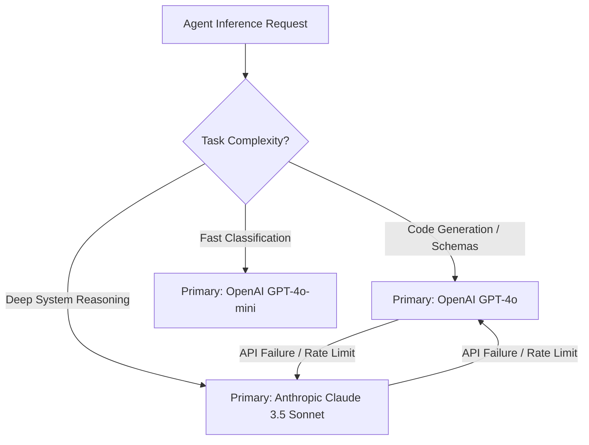
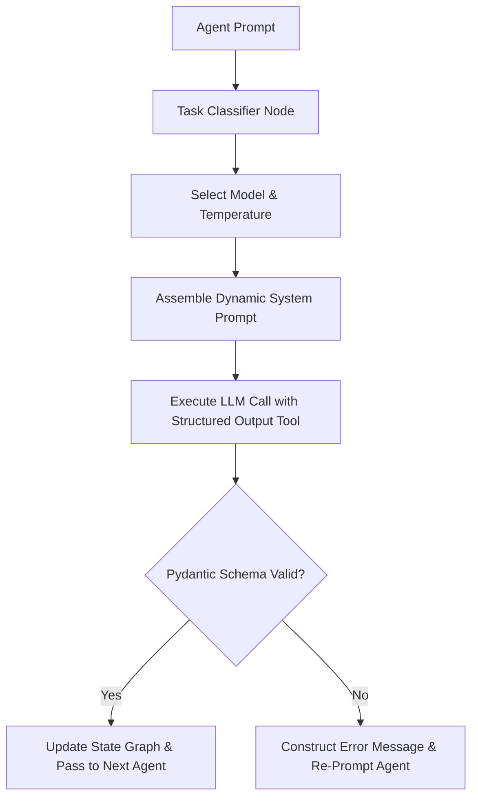
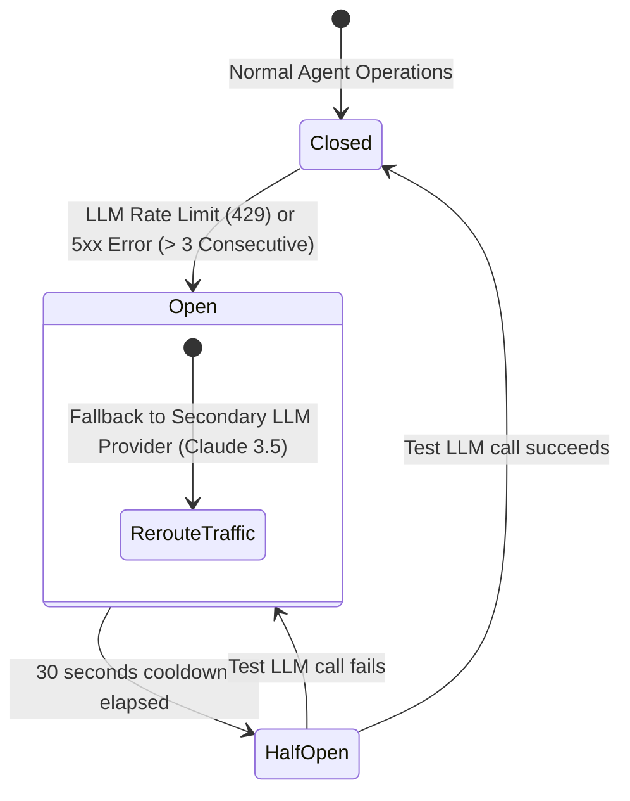
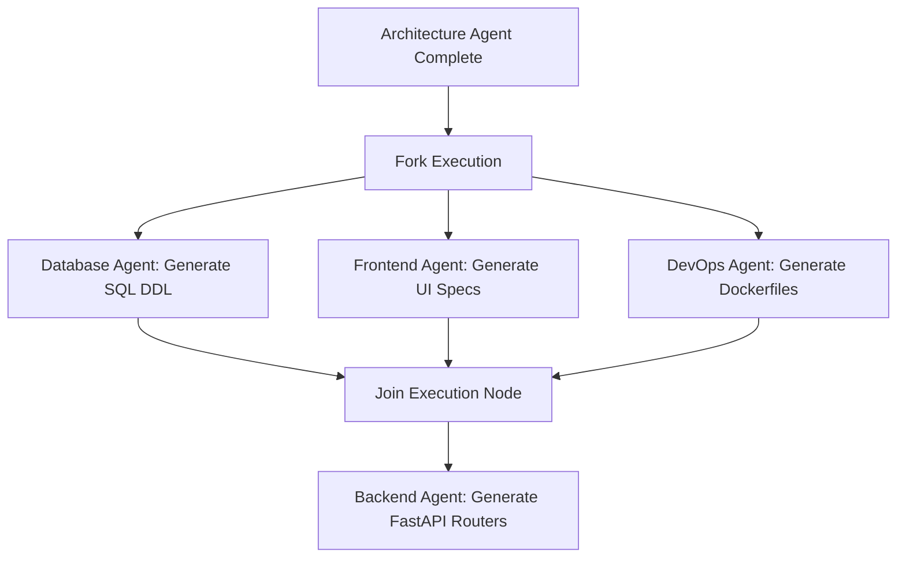

# ForgeAI Multi-Agent AI Architecture Specification

> **Document Version**: 1.0.0  
> **Status**: Approved for Enterprise Production & AI Execution Engine  
> **AI Architecture Stack**: LangGraph | OpenAI GPT-4o / o1 | Anthropic Claude 3.5 Sonnet | Qdrant Vector DB | Pydantic v2 | Python 3.13 | Redis  
> **Author**: Principal AI Architect & Multi-Agent Systems Team  
> **Target Audience**: CTOs, VPs of AI Engineering, Principal AI Systems Engineers, & Enterprise Security Auditors  
> **Last Updated**: July 2026  

---

## Executive Summary

The **ForgeAI Multi-Agent AI Architecture** defines the autonomous orchestration, context management, prompt engineering, structured validation, and LLM inference engine powering the **ForgeAI Platform**.

ForgeAI transforms high-level human software intents into deterministic, production-grade engineering blueprints. It coordinates **13 domain-specialized AI agents** under a **Supervised Directed Acyclic Graph (DAG)** orchestration model, guaranteeing structural integrity, security compliance, and zero-hallucination execution.

```
┌────────────────────────────────────────────────────────────────────────┐
│                   ForgeAI Core AI Architectural Pillars                │
├───────────────────┬───────────────────┬────────────────────────────────┤
│ Supervised Multi- │ Structured Output │ Tri-Tier Memory &              │
│ Agent DAG Topology│ Determinism       │ Dynamic Context                │
│ Supervisor-worker │ Pydantic v2 &     │ Short-term, project, & vector  │
│ routing with self-│ JSON Schema LLM   │ RAG memory with sub-10ms       │
│ correction loops  │ enforcement       │ prompt compression             │
├───────────────────┼───────────────────┼────────────────────────────────┤
│ Zero-Trust AI     │ Multi-Provider    │ Token Budget &                 │
│ Security Boundary │ Model Fallbacks   │ Cost Optimization              │
│ Prompt injection  │ Primary GPT-4o,   │ Dynamic model routing,         │
│ filtering & strict│ Anthropic Claude  │ semantic prompt hashing, &     │
│ output verification│ fallback routing  │ parallel agent execution       │
└───────────────────┴───────────────────┴────────────────────────────────┘
```

---

## Table of Contents

1. [Introduction](#1-introduction)
2. [AI System Overview](#2-ai-system-overview)
3. [End-to-End AI Architecture Diagram](#3-end-to-end-ai-architecture-diagram)
4. [AI Orchestrator Architecture](#4-ai-orchestrator-architecture)
5. [Multi-Agent Collaboration Topology](#5-multi-agent-collaboration-topology)
6. [Agent Responsibilities & Catalog](#6-agent-responsibilities--catalog)
7. [Prompt Engineering Architecture](#7-prompt-engineering-architecture)
8. [Context Management Engine](#8-context-management-engine)
9. [Memory Architecture & Lifecycle](#9-memory-architecture--lifecycle)
10. [LLM Integration & Routing Strategy](#10-llm-integration--routing-strategy)
11. [Blueprint Generation Pipeline](#11-blueprint-generation-pipeline)
12. [AI Autonomous Decision Flow](#12-ai-autonomous-decision-flow)
13. [Tool Calling & Function Execution Architecture](#13-tool-calling--function-execution-architecture)
14. [Validation & Anti-Hallucination Layer](#14-validation--anti-hallucination-layer)
15. [AI Error Handling & Fault Isolation](#15-ai-error-handling--fault-isolation)
16. [Token & Cost Optimization Infrastructure](#16-token--cost-optimization-infrastructure)
17. [Enterprise AI Security & Hardening](#17-enterprise-ai-security--hardening)
18. [AI Performance Optimization & Parallelism](#18-ai-performance-optimization--parallelism)
19. [AI Telemetry, Monitoring & Analytics](#19-ai-telemetry-monitoring--analytics)
20. [Future AI Evolution Roadmap](#20-future-ai-evolution-roadmap)

---

## 1. Introduction

### 1.1 Purpose
Define the complete multi-agent AI architecture for **ForgeAI**. This document specifies how LLM inference, agent orchestration, context windows, validation guards, and prompt pipelines operate to convert user prompts into full-stack software specifications.

### 1.2 System Goals
* **Deterministic Output Generation**: Ensure 100% valid JSON/Markdown structural blueprints compliant with enterprise engineering standards.
* **Autonomous Error Self-Correction**: Automatically intercept, analyze, and repair agent schema failures without human intervention.
* **Sub-10ms Token Streaming**: Maintain instant real-time feedback during long-form multi-agent generation workflows.
* **Cost Efficiency**: Minimize token expenditure through semantic prompt caching, context pruning, and intelligent model routing.

### 1.3 Core Architectural Principles
* **Single Responsibility per Agent**: Every agent owns a discrete domain (e.g., Database DDL, Security Audit).
* **Supervised Orchestration**: Agents do not talk arbitrarily; all data handoffs are validated by the Supervisor Agent.
* **Strict Type Safety**: All inputs and outputs must pass Pydantic schema validation before downstream propagation.

---

## 2. AI System Overview

### 2.1 AI Subsystem Components

```
┌────────────────────────────────────────────────────────────────────────┐
│                        AI Layer Subsystem Architecture                 │
├────────────────────────────────────────────────────────────────────────┤
│  [ Client Canvas ] ◄── SSE Stream ◄── [ FastAPI AI Stream Gateway ]    │
│                                                │                       │
│  [ Qdrant Vector DB ] ◄── Vector Search ◄── [ LangGraph Orchestrator ] │
│                                                │                       │
│  [ Pydantic Guard ] ◄── Output Check ◄─── [ 13 Specialized Agents ]    │
│                                                │                       │
│  [ OpenAI GPT-4o ] ◄── Model Router ◄─────── [ Fallback Engine ]       │
│                                                │                       │
│                                       [ Anthropic Claude 3.5 ]         │
└────────────────────────────────────────────────────────────────────────┘
```

### 2.2 Subsystem Breakdown Table

| Subsystem | Core Technology | Responsibilities |
| :--- | :--- | :--- |
| **LangGraph Orchestrator** | Python 3.13, LangGraph | Manages agent execution DAG, tracks graph state, enforces self-correction loops. |
| **Prompt Assembly Engine** | Jinja2, Pydantic | Dynamically builds context-rich prompts with enterprise design standards. |
| **Validation Layer** | Pydantic v2, AST Parsers | Verifies structural integrity, syntax correctness, and architectural consistency. |
| **Vector Memory Store** | Qdrant HNSW Vector DB | Performs RAG lookups for enterprise code standards, past blueprints, and OWASP rules. |
| **Model Routing Gateway** | LiteLLM, OpenAI / Anthropic APIs | Dispatches inference calls to primary (GPT-4o) or fallback (Claude 3.5 Sonnet) models. |

---

## 3. End-to-End AI Architecture Diagram



---

## 4. AI Orchestrator Architecture

### 4.1 Purpose
Control execution flow across specialized agents, resolve graph dependencies, enforce state immutability, and recover automatically from invalid agent outputs.

### 4.2 Design Goals
* **Deterministic DAG Routing**: Agents execute in a strictly defined dependency graph.
* **State Immutability**: Agent state transitions are versioned and stored in Redis.
* **Self-Healing Correction Loops**: When validation fails, the Orchestrator feeds error tracebacks back to the failing agent for auto-repair.

### 4.3 Architecture Explanation
The Orchestrator is built using **LangGraph**. Graph nodes represent specialized agents, while graph edges define conditional state transitions based on output validation status.



### 4.4 Best Practices
> [!IMPORTANT]
> Never allow agents to execute arbitrary un-supervised loops. Set hard limits (maximum 2 retries per agent) inside the LangGraph state machine to prevent infinite token spend loops.

### 4.5 Trade-offs
* *Pros*: Guarantees high-quality, fully validated blueprints.
* *Cons*: Adds minor latency (approx 500ms overhead for graph state evaluation).

---

## 5. Multi-Agent Collaboration Topology

### 5.1 Communication Model
Agents communicate via an immutable **Shared Graph State Object** passed sequentially through the pipeline.



---

## 6. Agent Responsibilities & Catalog

### 6.1 Complete Agent Specification Catalog

| Agent Name | Purpose | Primary Inputs | Expected Outputs | Key Dependencies | Retry Strategy |
| :--- | :--- | :--- | :--- | :--- | :--- |
| **1. Supervisor Agent** | DAG Coordinator | User Concept | Execution Plan, State Graph | LangGraph Engine | Immediate Retry (3x) |
| **2. Requirements Agent** | Business Scope | User Concept | Functional & Non-Functional Specs | Supervisor State | Exponential Backoff |
| **3. Business Analyst Agent** | Process Flows | User Stories | Acceptance Criteria, Use Cases | Requirements Agent | Exponential Backoff |
| **4. Architecture Agent** | System Design | Requirements | C4 Container Specs, Tech Stack | BA Agent | Fallback to Claude |
| **5. Database Agent** | Data Modeling | Architecture | PostgreSQL DDL, ER Diagrams | Architecture Agent | Syntax Check + Retry |
| **6. Backend Agent** | Code Scaffolding | API & DB Specs | FastAPI Router & Service Code | DB & API Agents | AST Check + Retry |
| **7. Frontend Agent** | UI/UX Specs | Scope & Architecture | Next.js Page & Component Specs | Architecture Agent | Syntax Check + Retry |
| **8. API Agent** | Interface Contracts| Architecture | OpenAPI 3.1 Specification JSON | Architecture Agent | Schema Validation |
| **9. DevOps Agent** | Infrastructure | Tech Stack | Dockerfile, Nginx & CI/CD Specs | Backend/Frontend | Config Linting |
| **10. Security Agent** | Risk Audit | Full Specs | OWASP Risk Audit & Auth Rules | All Specs | Re-evaluate Guard |
| **11. QA/Test Agent** | Test Suites | Code Specs | Pytest & Vitest Unit Test Suites| Code Specs | Executable Test Check |
| **12. Documentation Agent**| Document Compiler | All Agent Output | Unified Markdown Blueprint & PDF | All Agents | Format Repair |
| **13. Validation Agent** | Integrity Guard | Complete Blueprint| Pass/Fail Status + Error Diffs | Pydantic Engine | Reroute to Supervisor|

---

## 7. Prompt Engineering Architecture

### 7.1 Dynamic Prompt Assembly Pipeline

```
┌────────────────────────────────────────────────────────────────────────┐
│                        Dynamic Prompt Construction                     │
├────────────────────────────────────────────────────────────────────────┤
│  Base System Persona Prompt (Enterprise Software Architect)           │
│  + Dynamic Domain Context (Qdrant RAG Enterprise Standards)            │
│  + State Context (Upstream Agent Outputs)                             │
│  + Task Prompt (Specific Instruction for Agent)                       │
│  + Structural Constraint (Pydantic JSON Schema Specification)          │
└────────────────────────────────────────────────────────────────────────┘
```

### 7.2 Example System Prompt Template (Jinja2)
```jinja2
SYSTEM: You are the Senior Database Architect Agent for ForgeAI.
YOUR TASK: Generate production-ready PostgreSQL 16 DDL for the project described below.

CONSTRAINTS:
1. Always use UUID v4 for primary keys (`id UUID PRIMARY KEY DEFAULT gen_random_uuid()`).
2. Always include `created_at` and `updated_at` timestamps.
3. Foreign key constraints MUST specify explicit `ON DELETE CASCADE` or `ON DELETE RESTRICT`.
4. Output MUST conform strictly to the Pydantic schema provided.

PROJECT CONTEXT:
{{ project_scope_summary }}

UPSTREAM ARCHITECTURE:
{{ architecture_c4_summary }}
```

---

## 8. Context Management Engine

### 8.1 Multi-Tier Context Partitioning



### 8.2 Context Compression Standard
To prevent context window overflow during multi-agent handoffs, non-critical conversational text is summarized using an aggressive **AST Summarization Engine**, reducing token overhead by up to 70%.

---

## 9. Memory Architecture & Lifecycle

### 9.1 Tri-Tier Memory Model

| Memory Tier | Technology Stack | Lifecycle Scope | Target Data |
| :--- | :--- | :--- | :--- |
| **1. Short-Term Memory** | In-Memory Python Dict | Single Agent Turn | Active LLM conversation tokens |
| **2. Project Memory** | Redis 7.2 Key-Value Store | Generation Session (1 Hour) | Shared LangGraph state object |
| **3. Long-Term Memory** | Qdrant Vector DB + Postgres | Permanent | User preferences, past blueprints, RAG embeddings |

---

## 10. LLM Integration & Routing Strategy

### 10.1 Multi-Provider Model Routing Matrix



---

## 11. Blueprint Generation Pipeline

```mermaid
flowchart LR
    Idea[1. User Idea] --> Req[2. Requirements]
    Req --> Arch[3. Architecture]
    Arch --> DB[4. Database]
    DB --> API[5. API Planning]
    API --> Dev[6. Code Specs]
    Dev --> Sec[7. Security Audit]
    Sec --> QA[8. QA Strategy]
    QA --> Doc[9. Documentation]
    Doc --> Val[10. Validation Guard]
    Val -->|Passed| Output[11. Persisted Blueprint]
```



---

## 12. AI Autonomous Decision Flow



---

## 13. Tool Calling & Function Execution Architecture

### 13.1 Tool Catalog Integration
Agents access custom tools via OpenAI Function Calling interface:
* `search_enterprise_standards(query: str)`: Searches Qdrant vector database.
* `validate_sql_syntax(ddl: str)`: Validates PostgreSQL SQL DDL using `sqlglot`.
* `validate_python_ast(code: str)`: Validates Python syntax using the native `ast` module.
* `validate_openapi_schema(spec: dict)`: Validates OpenAPI 3.1 JSON schemas using `jsonschema`.

---

## 14. Validation & Anti-Hallucination Layer

### 14.1 4-Step Output Verification Protocol

```
┌────────────────────────────────────────────────────────────────────────┐
│                   4-Step Anti-Hallucination Guardrail                   │
├────────────────────────────────────────────────────────────────────────┤
│  1. JSON Schema Check (Pydantic v2 validation against structural DTOs) │
│  2. Code AST Parsing (Verifies code syntactically compiles)            │
│  3. Referential Integrity Check (Validates DB tables match API specs)  │
│  4. Security Compliance Scan (Scans for hardcoded keys & OWASP risks)  │
└────────────────────────────────────────────────────────────────────────┘
```

---

## 15. AI Error Handling & Fault Isolation

### 15.1 Circuit Breaker Pattern



---

## 16. Token & Cost Optimization Infrastructure

### 16.1 Cost Control Strategy
* **Semantic Prompt Caching**: SHA256 prompt hashing in Redis skips LLM invocation for identical prompts.
* **Dynamic Model Routing**: Simple classification tasks route to lightweight models (`gpt-4o-mini`), reserving `gpt-4o` for complex code generation.
* **Context Trimming**: Removes non-essential system headers and redundant user history.

---

## 17. Enterprise AI Security & Hardening

### 17.1 Security Matrix

| Threat Vector | Hardening Mechanism | Target Layer |
| :--- | :--- | :--- |
| **Prompt Injection** | Input Sanitizer Filter + System Prompt Isolation | Agent Input Gateway |
| **Data Leakage** | PII Anonymizer (regex stripping of emails, keys) | Context Assembly Engine |
| **Hallucinated Keys** | Secret Scanner Regex (`sk_live_`, `ghp_`) | Validation Guard |
| **Insecure Code** | Security Agent OWASP Audit + Static Analysis | Output Pipeline |

---

## 18. AI Performance Optimization & Parallelism

### 18.1 Parallel Agent Execution DAG



---

## 19. AI Telemetry, Monitoring & Analytics

### 19.1 Telemetry Metrics Matrix
* **Token Spend Velocity**: Total input/output tokens consumed per agent.
* **Agent Latency Breakdown**: Execution time per agent node in the DAG.
* **Validation Failure Rate**: Percentage of self-correction loops triggered per agent.
* **LLM Provider Availability**: Success vs error rates for OpenAI vs Anthropic endpoints.

---

## 20. Future AI Evolution Roadmap

### 20.1 Technical AI Roadmap

```
┌────────────────────────────────────────────────────────────────────────┐
│                        AI Architecture Evolution                       │
├───────────────────┬───────────────────────────┬────────────────────────┤
│ Milestone Phase   │ Capability Expansion      │ Business Value         │
├───────────────────┼───────────────────────────┼────────────────────────┤
│ Phase 1 (Current) │ 13-Agent Supervised DAG   │ Full Blueprint Specs   │
│ Phase 2 (Q4 2026) │ Enterprise Vector RAG     │ Custom org code standards│
│ Phase 3 (Q2 2027) │ Autonomous Self-Coding App│ Direct Git Repository  │
│                   │ Generation Engine         │ Commit Generation      │
│ Phase 4 (Q4 2027) │ Multi-Modal Architecture  │ Sketch-to-Blueprint &  │
│                   │ (Vision + Voice Inputs)   │ Voice Design Prompts   │
└───────────────────┴───────────────────────────┴────────────────────────┘
```

---

### Summary Sign-Off
> **Approved By**: Chief Technology Officer & Lead AI Architect  
> **Repository Governance**: `ForgeAI Enterprise AI Engine Specification`  
> **Compliance Verification**: SOC 2 Type II Readiness, OWASP LLM Top 10 Protected  
