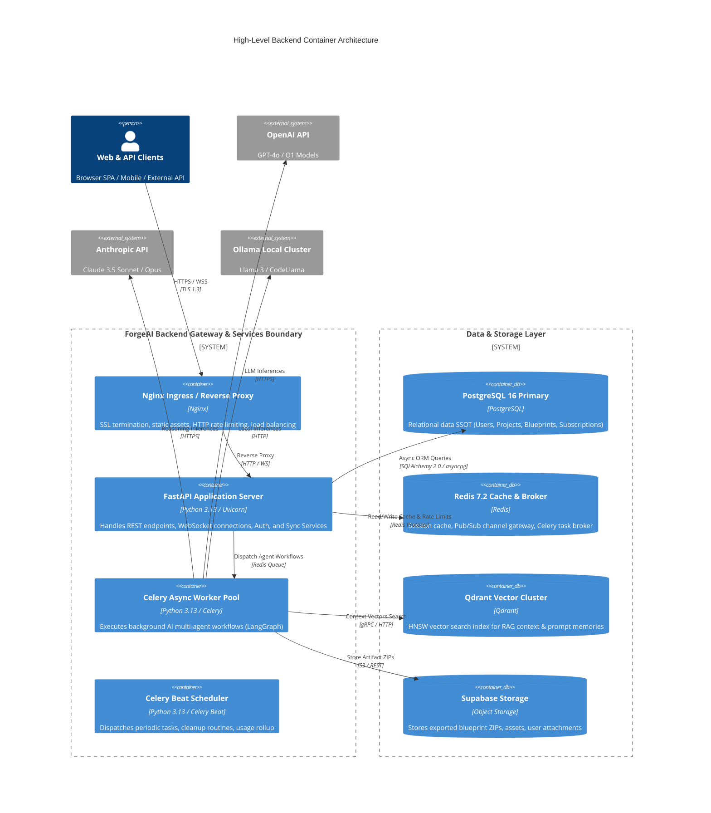
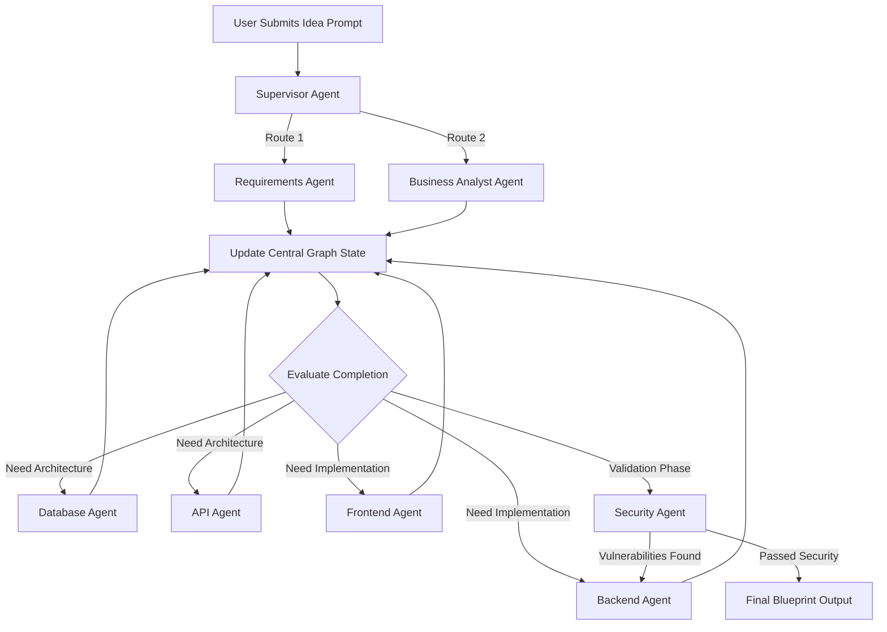
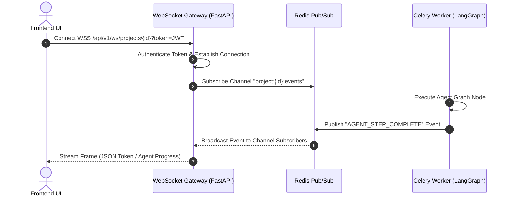

# ForgeAI Backend Architecture Specification

> **Document Version**: 1.0.0  
> **Status**: Approved for Engineering Implementation  
> **Backend Stack**: Python 3.13 | FastAPI | Pydantic v2 | SQLAlchemy 2.0 Async | Celery | Redis | Qdrant  
> **Author**: Principal Backend Software Architect  
> **Target Audience**: Backend Engineers, AI Systems Engineers, DevOps Engineers  
> **Last Updated**: July 2026  

---

## Table of Contents

1. [Executive Summary](#1-executive-summary)
2. [High-Level Backend Architecture](#2-high-level-backend-architecture)
3. [Folder Structure](#3-folder-structure)
4. [Layered Architecture](#4-layered-architecture)
5. [Request Lifecycle](#5-request-lifecycle)
6. [Module Architecture](#6-module-architecture)
7. [Dependency Injection Strategy](#7-dependency-injection-strategy)
8. [Database Integration](#8-database-integration)
9. [AI Service Architecture](#9-ai-service-architecture)
10. [Background Processing](#10-background-processing)
11. [WebSocket Architecture](#11-websocket-architecture)
12. [Error Handling](#12-error-handling)
13. [Security Architecture](#13-security-architecture)
14. [Performance Optimisation](#14-performance-optimisation)
15. [Monitoring & Observability](#15-monitoring--observability)
16. [Testing Strategy](#16-testing-strategy)
17. [Deployment & Infrastructure](#17-deployment--infrastructure)
18. [Future Expansion Roadmap](#18-future-expansion-roadmap)

---

## 1 Executive Summary

### 1.1 Backend Philosophy
The **ForgeAI Backend** is designed as a cloud-native, async-first, domain-partitioned modular monolith. Built using **Python 3.13**, **FastAPI**, **Pydantic v2**, and **SQLAlchemy 2.0 Async**, the system achieves maximum I/O concurrency required for streaming AI token outputs, managing complex multi-agent execution graphs, and serving high-frequency real-time WebSocket signals.

### 1.2 Core Architectural Principles

```
┌────────────────────────────────────────────────────────────────────────┐
│                      ForgeAI Core Architectural Pillars                │
├───────────────────┬───────────────────┬────────────────────────────────┤
│ Async Non-Blocking│ Strict Domain     │ Immutable Auditability         │
│ Python 3.13 asyncio│ Clean separation of│ All state changes & LLM runs   │
│ for maximum throughput│ controllers/services│ are versioned & tracked       │
├───────────────────┼───────────────────┼────────────────────────────────┤
│ Resilient AI      │ Multi-Tier Cache  │ Defense in Depth Security      │
│ Model failovers & │ Redis L1/L2 cache │ OAuth2, JWT + HttpOnly refresh,│
│ token optimization│ for sub-10ms reads│ RBAC, rate-limiting, pgcrypto  │
└───────────────────┴───────────────────┴────────────────────────────────┘
```

---

## 2 High-Level Backend Architecture



---

## 3 Folder Structure

```
forgeai-backend/
├── app/
│   ├── api/                        # Presentation & API Router Layer
│   │   ├── v1/
│   │   │   ├── endpoints/
│   │   │   │   ├── auth.py         # Login, Register, OAuth, Refresh endpoints
│   │   │   │   ├── users.py        # User profile & account management
│   │   │   │   ├── orgs.py         # Multi-tenant Organization & Team management
│   │   │   │   ├── projects.py     # Project workspaces & document CRUD
│   │   │   │   ├── blueprints.py   # Blueprint trigger, versioning & exports
│   │   │   │   ├── agents.py       # Agent registration & execution status
│   │   │   │   ├── chat.py         # Conversational chat threads
│   │   │   │   ├── websocket.py    # WSS connection gateway & realtime stream
│   │   │   │   ├── billing.py      # Stripe webhooks & subscription quotas
│   │   │   │   └── analytics.py    # Usage metrics & operational analytics
│   │   │   └── api_router.py       # Master v1 API Router aggregation
│   │   └── deps.py                 # FastAPI Dependency Injection providers
│   ├── core/                       # Core Infrastructure & Configuration
│   │   ├── config.py               # Pydantic Settings v2 environment parser
│   │   ├── security.py             # JWT issuance, password hashing (Argon2id)
│   │   ├── database.py             # SQLAlchemy Async Engine & session maker
│   │   ├── redis.py                # Async Redis connection pool & helpers
│   │   ├── celery_app.py           # Celery application & queue definition
│   │   └── logging.py              # Structlog JSON logger configuration
│   ├── db/                         # Database ORM & Migrations
│   │   ├── models/                 # SQLAlchemy ORM Data Models (36 tables)
│   │   │   ├── user.py
│   │   │   ├── project.py
│   │   │   ├── blueprint.py
│   │   │   ├── agent.py
│   │   │   ├── usage.py
│   │   │   └── billing.py
│   │   ├── base.py                 # Declarative Base metadata definition
│   │   └── schema.sql              # Clean DDL reference script
│   ├── repository/                 # Data Access Layer (Repositories)
│   │   ├── base_repository.py      # Generic CRUD Async Repository
│   │   ├── user_repository.py      # Custom User queries
│   │   ├── project_repository.py   # Project queries
│   │   ├── blueprint_repository.py # Blueprint & artifact queries
│   │   └── agent_repository.py     # Agent run & model usage queries
│   ├── services/                   # Business Logic Service Layer
│   │   ├── auth_service.py         # Auth business rules & OAuth handling
│   │   ├── project_service.py      # Workspace management & permissions
│   │   ├── blueprint_service.py    # Orchestrates generation workflow triggers
│   │   ├── storage_service.py      # Supabase object storage client
│   │   └── billing_service.py      # Stripe billing event handling
│   ├── ai/                         # AI & Multi-Agent Engine (LangGraph)
│   │   ├── agents/                 # 14 Domain Agent Implementations
│   │   │   ├── supervisor.py       # Supervisor Agent (Coordinator)
│   │   │   ├── requirements.py     # Requirements Agent
│   │   │   ├── database_agent.py   # Database Agent
│   │   │   ├── api_agent.py        # API Agent
│   │   │   └── security_agent.py   # Security Agent
│   │   ├── workflows/              # LangGraph Execution Graph definitions
│   │   │   ├── blueprint_graph.py  # Full multi-agent blueprint state graph
│   │   │   └── chat_graph.py       # Realtime chat assistant graph
│   │   ├── prompts/                # Structured XML Prompt Templates
│   │   ├── router.py               # Model Router (OpenAI / Claude / Ollama)
│   │   └── rag.py                  # Qdrant Vector DB Client & Embeddings
│   ├── schemas/                    # Pydantic Input/Output Validation Schemas
│   │   ├── user_schema.py
│   │   ├── project_schema.py
│   │   ├── blueprint_schema.py
│   │   └── chat_schema.py
│   └── main.py                     # FastAPI Application Initialization
├── alembic/                        # Database Migration Scripts
├── tests/                          # Automated Pytest Suite
│   ├── unit/
│   ├── integration/
│   └── api/
├── Dockerfile                      # Production Multi-Stage Dockerfile
├── docker-compose.yml              # Local Development Infrastructure
└── requirements.txt                # Python Dependencies
```

---

## 4 Layered Architecture

ForgeAI implements strict separation of concerns through clean software layering:

```
┌────────────────────────────────────────────────────────┐
│                   Presentation Layer                   │
│        FastAPI Endpoints / WebSockets / Webhooks       │
└───────────────────────────┬────────────────────────────┘
                            │ (Pydantic Request Schemas)
                            ▼
┌────────────────────────────────────────────────────────┐
│                     Service Layer                      │
│     Business Logic, Agent Orchestration, Stripe Rules   │
└───────────────────────────┬────────────────────────────┘
                            │ (Domain DTOs)
                            ▼
┌────────────────────────────────────────────────────────┐
│                    Repository Layer                    │
│   SQLAlchemy 2.0 Async Queries / Qdrant Client / Redis │
└───────────────────────────┬────────────────────────────┘
                            │ (Raw Queries / API Payload)
                            ▼
┌────────────────────────────────────────────────────────┐
│                  Data Storage Layer                    │
│    PostgreSQL 16 / Redis / Qdrant / Supabase Storage   │
└────────────────────────────────────────────────────────┘
```

---

## 5 Request Lifecycle

### 5.1 End-to-End Sequence Diagram

```mermaid
sequenceDiagram
    autonumber
    actor Client as Frontend Client
    participant Gateway as Nginx Ingress
    participant Auth as Auth Middleware (FastAPI)
    participant Endpoint as Projects Controller
    participant Service as Project Service
    participant Repo as Project Repository
    participant DB as PostgreSQL DB
    participant Cache as Redis Store

    Client->>Gateway: POST /api/v1/projects (Payload + Bearer Token)
    Gateway->>Auth: Forward Request
    Auth->>Auth: Validate JWT Signature & Claims
    Auth->>Cache: Verify Token Revocation Status
    Cache-->>Auth: Token Valid
    Auth->>Endpoint: Inject `current_user` Dependency
    Endpoint->>Endpoint: Validate Pydantic `ProjectCreate` Schema
    Endpoint->>Service: Call `project_service.create_project(user, payload)`
    Service->>Service: Enforce Organization Quota & Perms
    Service->>Repo: Call `project_repo.create(data)`
    Repo->>DB: `INSERT INTO projects (...) VALUES (...)`
    DB-->>Repo: Return Inserted Record
    Service->>Cache: Invalidate Organization Project List Cache
    Service-->>Endpoint: Return Project Entity DTO
    Endpoint-->>Gateway: HTTP 201 Created (JSON Response)
    Gateway-->>Client: Return Response
```



---

## 6 Module Architecture

Each backend module operates as a self-contained domain:
1. **`AuthModule`**: Handles user registration, Argon2id password verification, JWT issuance, refresh token rotation in Redis, and Google/GitHub OAuth code exchange.
2. **`ProjectModule`**: Manages organization workspaces, project CRUD, folder trees, and rich-text document specifications.
3. **`BlueprintModule`**: Triggers async LangGraph execution flows via Celery, fetches generated code artifacts, manages versioning, and packages exports into ZIP archives.
4. **`AIOrchestrationModule`**: Houses the 14 agent implementations, handles prompt XML assembly, queries Qdrant vectors for context, and streams tokens over WebSockets.
5. **`BillingModule`**: Processes Stripe webhooks (`customer.subscription.created`, `invoice.payment_succeeded`), enforces quota limits, and updates organization subscription state.

---

## 7 Dependency Injection Strategy

FastAPI's dependency injection system decouples business logic from infrastructure components.

```python
# app/api/deps.py - Core Dependency Providers
from fastapi import Depends, HTTPException, status
from fastapi.security import OAuth2PasswordBearer
from sqlalchemy.ext.asyncio import AsyncSession
from app.core.database import get_db_session
from app.core.security import verify_access_token
from app.repository.user_repository import UserRepository
from app.services.auth_service import AuthService

oauth2_scheme = OAuth2PasswordBearer(tokenUrl="/api/v1/auth/login")

async def get_current_user(
    token: str = Depends(oauth2_scheme),
    session: AsyncSession = Depends(get_db_session)
):
    payload = verify_access_token(token)
    user_repo = UserRepository(session)
    user = await user_repo.get_by_id(payload.sub)
    if not user or not user.is_active:
        raise HTTPException(status_code=status.HTTP_401_UNAUTHORIZED, detail="Invalid token")
    return user
```

---

## 8 Database Integration

### 8.1 Async SQLAlchemy 2.0 Connection Setup
ForgeAI utilizes `asyncpg` with PostgreSQL for non-blocking database queries.

```python
# app/core/database.py
from sqlalchemy.ext.asyncio import create_async_engine, AsyncSession, async_sessionmaker
from app.core.config import settings

engine = create_async_engine(
    settings.DATABASE_URL,
    echo=settings.DEBUG,
    pool_size=20,
    max_overflow=10,
    pool_pre_ping=True
)

AsyncSessionFactory = async_sessionmaker(
    engine, 
    autoflush=False, 
    expire_on_commit=False, 
    class_=AsyncSession
)

async def get_db_session():
    async with AsyncSessionFactory() as session:
        try:
            yield session
            await session.commit()
        except Exception:
            await session.rollback()
            raise
```

---

## 9 AI Service Architecture

### 9.1 Multi-Agent LangGraph State Machine



### 9.2 Fallback Model Routing Matrix

```python
# app/ai/router.py - Model Routing & Fallback System
class LLMRouter:
    def __init__(self, openai_client, claude_client, ollama_client):
        self.openai = openai_client
        self.claude = claude_client
        self.ollama = ollama_client

    async def generate(self, prompt: str, task_complexity: str = "high"):
        if task_complexity == "high":
            try:
                return await self.claude.generate(prompt, model="claude-3-5-sonnet-20241022")
            except Exception as e:
                # Fallback to OpenAI GPT-4o on Claude timeout/rate-limit
                return await self.openai.generate(prompt, model="gpt-4o")
        else:
            return await self.openai.generate(prompt, model="gpt-4o-mini")
```

---

## 10 Background Processing

### 10.1 Celery Queue Architecture
Tasks are segregated into dedicated queues to prevent long-running AI generation jobs from starving critical notifications.

```
Celery Task Router
       │
       ├──> "ai_high_priority"  (Live User Chat & Fast Agents)
       ├──> "blueprints"         (Heavy Multi-Agent Code Generation)
       ├──> "notifications"      (Emails, Webhooks, Slack Alerts)
       └──> "analytics"          (Token usage rollups, metric calculations)
```

---

## 11 WebSocket Architecture



---

## 12 Error Handling

### 12.1 Standardized Exception Hierarchy

All application exceptions inherit from a base `ForgeAIException` class that produces RFC 7807 compliant error bodies.

```python
# app/core/exceptions.py
class ForgeAIException(Exception):
    def __init__(self, message: str, status_code: int = 400, error_code: str = "BAD_REQUEST"):
        self.message = message
        self.status_code = status_code
        self.error_code = error_code

class ResourceNotFoundException(ForgeAIException):
    def __init__(self, resource_name: str, resource_id: str):
        super().__init__(
            message=f"{resource_name} with ID '{resource_id}' was not found.",
            status_code=404,
            error_code="RESOURCE_NOT_FOUND"
        )
```

---

## 13 Security Architecture

1. **Password Security**: Passwords hashed using **Argon2id** (`time_cost=3`, `memory_cost=65536`, `parallelism=4`).
2. **Rate Limiting**: Distributed Sliding Window Rate Limiting enforced in Redis (e.g., 60 req/min for standard APIs, 5 req/min for auth login).
3. **Database Secrets**: Sensitive values stored encrypted in PostgreSQL using `pgcrypto`.

---

## 14 Performance Optimisation

* **Redis Caching Strategy**: Hot organization metadata and prompt templates cached in Redis with a 15-minute TTL.
* **SQL Query Optimizations**: Explicit use of `joinedload()` and `selectinload()` on SQLAlchemy queries to eliminate $N+1$ query issues.

---

## 15 Monitoring & Observability

```
FastAPI / Celery App
        │
        ├──> Prometheus Metrics Exporter (/metrics) ──> Prometheus Server ──> Grafana
        ├──> Structlog JSON Logs (stdout) ──────────> Logtail / ELK Stack
        └──> Sentry SDK Integrations ──────────────> Sentry Dashboard
```

* **Health Check Endpoints**:
  * `/health/live`: Container liveness probe.
  * `/health/ready`: Validates DB, Redis, and Qdrant network connectivity.

---

## 16 Testing Strategy

* **Unit Tests**: Test business logic services and Pydantic schemas in isolation (Pytest + Mock).
* **Integration Tests**: Test async SQLAlchemy repository methods against a real PostgreSQL container.
* **API Tests**: Validate full request/response cycles using `httpx.AsyncClient` against FastAPI.

---

## 17 Deployment & Infrastructure

Multi-stage Dockerfile for minimized production container footprint:

```dockerfile
# Dockerfile
FROM python:3.13-slim as builder

WORKDIR /app
RUN apt-get update && apt-get install -y build-essential libpq-dev

COPY requirements.txt .
RUN pip install --no-cache-dir --user -r requirements.txt

FROM python:3.13-slim as runner
WORKDIR /app

COPY --from=builder /root/.local /root/.local
COPY . .

ENV PATH=/root/.local/bin:$PATH
EXPOSE 8000

CMD ["uvicorn", "app.main:app", "--host", "0.0.0.0", "--port", "8000", "--workers", "4"]
```

---

## 18 Future Expansion Roadmap

1. **gRPC Internal Services**: Migrating internal agent-to-agent communication to gRPC for micro-second latency.
2. **Kafka Event Stream**: Replacing Redis Pub/Sub with Apache Kafka for immutable event stream persistence across microservices.

---

*(End of Backend Architecture Document)*
