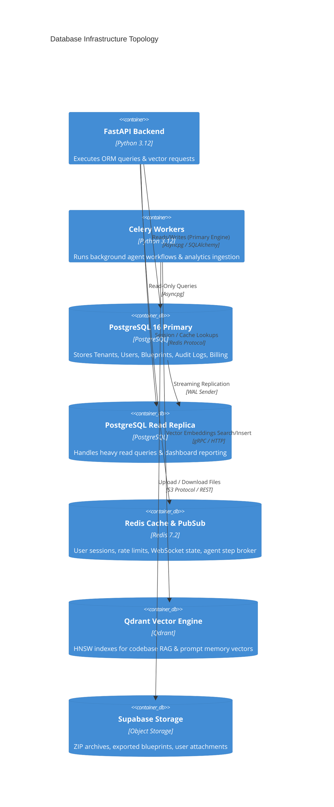
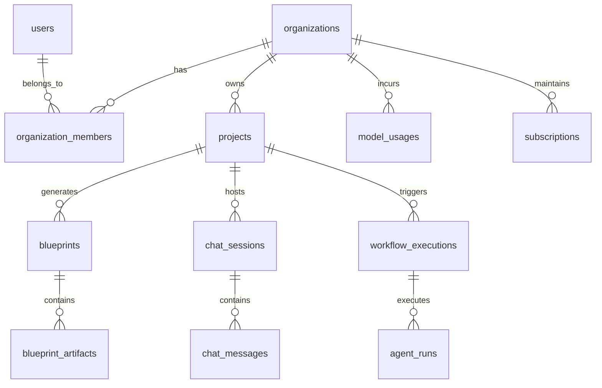
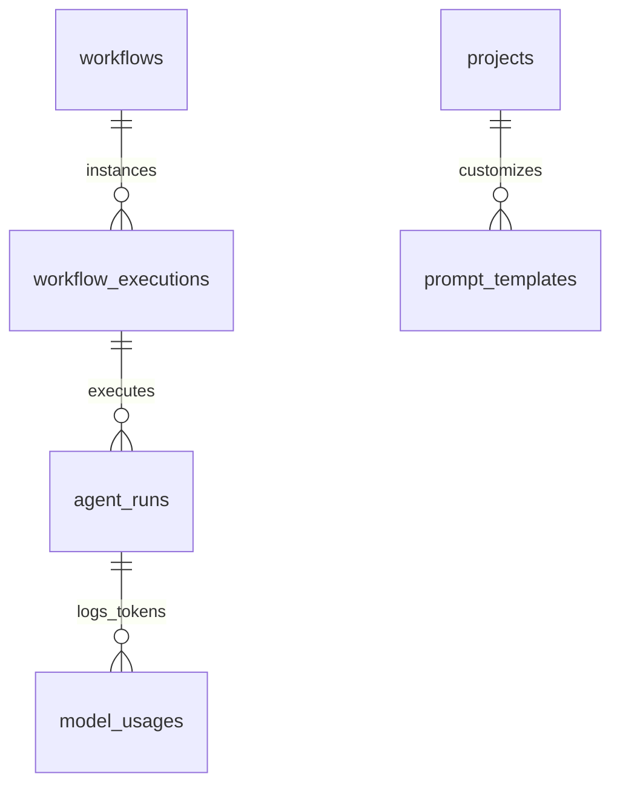

# ForgeAI Database Specification & Architecture

> **Document Version**: 1.0.0  
> **Target Database Engine**: PostgreSQL 16+  
> **ORM Layer**: SQLAlchemy 2.0 (Async Engine via `asyncpg`)  
> **Caching Layer**: Redis 7.2 (Pub/Sub & Key-Value Cache)  
> **Vector Database**: Qdrant 1.9+ (HNSW Vector Indexing)  
> **Object Storage**: Supabase Storage  
> **Author**: Principal Database Architect  
> **Last Updated**: July 2026  

---

## Table of Contents

1. [Executive Overview](#1-executive-overview)
2. [Database Architecture](#2-database-architecture)
3. [Entity Classification](#3-entity-classification)
4. [Complete Entity List](#4-complete-entity-list)
5. [Detailed Table Definitions](#5-detailed-table-definitions)
6. [Relationships & ER Diagrams](#6-relationships--er-diagrams)
7. [Data Dictionary](#7-data-dictionary)
8. [Index Strategy](#8-index-strategy)
9. [Constraints & Integrity Rules](#9-constraints--integrity-rules)
10. [Transactions & Concurrency Control](#10-transactions--concurrency-control)
11. [AI Data Model](#11-ai-data-model)
12. [File Storage Model](#12-file-storage-model)
13. [Analytics Model](#13-analytics-model)
14. [Audit System](#14-audit-system)
15. [Billing & Metered Usage Model](#15-billing--metered-usage-model)
16. [Security & Encryption Architecture](#16-security--encryption-architecture)
17. [Performance Optimisation Strategy](#17-performance-optimisation-strategy)
18. [Backup & High Availability Strategy](#18-backup--high-availability-strategy)
19. [Migration Strategy](#19-migration-strategy)
20. [Future Expansion Roadmap](#20-future-expansion-roadmap)
21. [Deliverables Summary](#21-deliverables-summary)

---

## 1 Executive Overview

### 1.1 Database Philosophy
The database architecture for **ForgeAI** is built on five core principles:
1. **Relational Integrity First**: Core tenant data, user identities, project hierarchies, and billing states strictly adhere to Third Normal Form (3NF) to prevent data anomalies.
2. **Hybrid Storage Topology**: Relational data lives in PostgreSQL, high-throughput context vectors live in Qdrant, transient state and rate limits live in Redis, and binary artifacts live in Supabase Storage.
3. **Immutability for Auditability**: Critical logs (audit, activity, LLM token usages, blueprint revisions) are append-only. Updates to historical generated blueprints spawn new immutable versions.
4. **Multi-Tenant Isolation**: Strict logical separation using `organization_id` foreign key constraints and row-level access patterns across every business table.
5. **AI Token Metering Precision**: Granular tracking of prompt, completion, and cached token consumption tied to specific agent runs, models, and organizations.

### 1.2 Scalability Goals
* **Concurrent Active Connections**: 5,000+ simultaneous connections handled via PgBouncer connection pooling.
* **Storage Capacity**: Scalable up to 10+ TB relational data via PostgreSQL table partitioning (range partitioning on log/metric tables by month).
* **Query Latency**: 99th percentile (p99) read latency < 10ms for cached data, < 25ms for indexed relational queries.
* **Write Throughput**: Support up to 2,000 writes/sec during peak multi-agent generation workflows.

---

## 2 Database Architecture

### 2.1 Multi-Store Communication Topography

ForgeAI uses PostgreSQL as the single source of truth (SSOT) for metadata, with Redis handling caching/realtime signals, Qdrant storing semantic embeddings, and Supabase Storage holding generated files.



---

## 3 Entity Classification

The schema is divided into 9 core business domains:

```
┌────────────────────────────────────────────────────────────────────────┐
│                        ForgeAI Data Domains                            │
├───────────────────┬───────────────────┬────────────────────────────────┤
│ 1. Auth & Identity│ 2. Multi-Tenancy  │ 3. Project Management          │
│ Users, Sessions,  │ Organizations,    │ Projects, Folders,             │
│ OAuth, MFA        │ Teams, Members    │ Documents, Members             │
├───────────────────┼───────────────────┼────────────────────────────────┤
│ 4. AI & Agents    │ 5. Blueprints     │ 6. Storage & Knowledge         │
│ Agents, Runs,     │ Blueprints, ERDs, │ Files, Versions,               │
│ Prompts, Memory   │ OpenAPI, Scaffolds│ Knowledge Docs, Vectors        │
├───────────────────┼───────────────────┼────────────────────────────────┤
│ 7. Billing        │ 8. Audit & Logs   │ 9. System & Config             │
│ Subscriptions,    │ Activity, Audit,  │ Settings, Notifications,       │
│ Invoices, Quotas  │ Security Logs     │ Feedback                       │
└───────────────────┴───────────────────┴────────────────────────────────┘
```

---

## 4 Complete Entity List

Below is the complete list of 34 database entities across all domains:

| # | Entity Name | Table Name | Business Purpose |
|---|---|---|---|
| 1 | Organization | `organizations` | Tenant isolation container for enterprise teams |
| 2 | User | `users` | User credentials, profiles, global role |
| 3 | User Session | `user_sessions` | Refresh token lifecycle & device session state |
| 4 | OAuth Account | `oauth_accounts` | Federated authentication (Google, GitHub) |
| 5 | Organization Member | `organization_members` | Organization-level user roles (Owner, Admin, Member) |
| 6 | Team | `teams` | Sub-groups within an organization |
| 7 | Team Member | `team_members` | Mapping of users to functional teams |
| 8 | Project | `projects` | Core software project container |
| 9 | Project Member | `project_members` | Granular user access controls per project |
| 10 | Folder | `folders` | Hierarchical tree structure for project assets |
| 11 | Document | `documents` | Rich-text project specifications & PRDs |
| 12 | Blueprint | `blueprints` | Top-level generated software blueprint container |
| 13 | Blueprint Version | `blueprint_versions` | Immutable historical snapshot of a blueprint |
| 14 | Blueprint Artifact | `blueprint_artifacts` | Individual generated code/spec file |
| 15 | ER Diagram | `er_diagrams` | Visual entity-relationship graph metadata |
| 16 | API Specification | `api_specifications` | OpenAPI 3.1 endpoint schemas & path contracts |
| 17 | AI Agent | `ai_agents` | Registration metadata for the 14 AI agents |
| 18 | Agent Run | `agent_runs` | Individual execution trace of an agent |
| 19 | Workflow | `workflows` | Pre-configured multi-agent graph pipelines |
| 20 | Workflow Execution | `workflow_executions` | Historical/active run of a complete workflow |
| 21 | Chat Session | `chat_sessions` | Conversational context thread with AI agents |
| 22 | Chat Message | `chat_messages` | Streamed user/assistant chat messages & tool calls |
| 23 | Prompt Template | `prompt_templates` | Reusable prompt library entries |
| 24 | Model Usage | `model_usages` | Metered LLM token consumption & cost ledger |
| 25 | File | `files` | Supabase object storage reference metadata |
| 26 | File Version | `file_versions` | Version control for uploaded/generated files |
| 27 | Knowledge Base | `knowledge_bases` | Vector collection configuration for RAG |
| 28 | Knowledge Document | `knowledge_documents` | File indexing status for Qdrant vector search |
| 29 | Subscription Plan | `subscription_plans` | Tier definitions, prices, feature quotas |
| 30 | Subscription | `subscriptions` | Active organization billing subscription |
| 31 | Invoice | `invoices` | Historical billing receipts and Stripe invoices |
| 32 | Activity Log | `activity_logs` | Operational events for dashboard feed |
| 33 | Audit Log | `audit_logs` | Compliance-grade immutable access/mutation log |
| 34 | Security Log | `security_logs` | Security alerts, failed auth, rate limit flags |
| 35 | Notification | `notifications` | User notifications & alerts feed |
| 36 | System Setting | `system_settings` | Platform key-value configuration overrides |

---

## 5 Detailed Table Definitions

### 5.1 `users`
**Purpose**: Primary identity table for authentication and user attributes.

```sql
CREATE TABLE users (
    id UUID PRIMARY KEY DEFAULT gen_random_uuid(),
    email VARCHAR(255) NOT NULL UNIQUE,
    password_hash VARCHAR(255) NULL,
    full_name VARCHAR(150) NOT NULL,
    avatar_url TEXT NULL,
    is_active BOOLEAN NOT NULL DEFAULT TRUE,
    is_superuser BOOLEAN NOT NULL DEFAULT FALSE,
    email_verified BOOLEAN NOT NULL DEFAULT FALSE,
    mfa_enabled BOOLEAN NOT NULL DEFAULT FALSE,
    mfa_secret VARCHAR(100) NULL,
    created_at TIMESTAMPTZ NOT NULL DEFAULT CURRENT_TIMESTAMP,
    updated_at TIMESTAMPTZ NOT NULL DEFAULT CURRENT_TIMESTAMP
);

CREATE INDEX idx_users_email ON users(email);
CREATE INDEX idx_users_is_active ON users(is_active);
```

### 5.2 `organizations`
**Purpose**: Tenant container establishing multi-tenant boundary.

```sql
CREATE TABLE organizations (
    id UUID PRIMARY KEY DEFAULT gen_random_uuid(),
    name VARCHAR(200) NOT NULL,
    slug VARCHAR(100) NOT NULL UNIQUE,
    logo_url TEXT NULL,
    plan_tier VARCHAR(50) NOT NULL DEFAULT 'free',
    billing_email VARCHAR(255) NOT NULL,
    created_at TIMESTAMPTZ NOT NULL DEFAULT CURRENT_TIMESTAMP,
    updated_at TIMESTAMPTZ NOT NULL DEFAULT CURRENT_TIMESTAMP
);

CREATE INDEX idx_organizations_slug ON organizations(slug);
```

### 5.3 `organization_members`
**Purpose**: User membership and roles within an organization.

```sql
CREATE TABLE organization_members (
    id UUID PRIMARY KEY DEFAULT gen_random_uuid(),
    organization_id UUID NOT NULL REFERENCES organizations(id) ON DELETE CASCADE,
    user_id UUID NOT NULL REFERENCES users(id) ON DELETE CASCADE,
    role VARCHAR(50) NOT NULL DEFAULT 'member', -- owner, admin, member, viewer
    created_at TIMESTAMPTZ NOT NULL DEFAULT CURRENT_TIMESTAMP,
    CONSTRAINT uq_org_user UNIQUE (organization_id, user_id)
);

CREATE INDEX idx_org_members_user ON organization_members(user_id);
```

### 5.4 `projects`
**Purpose**: Software project workspace container.

```sql
CREATE TABLE projects (
    id UUID PRIMARY KEY DEFAULT gen_random_uuid(),
    organization_id UUID NOT NULL REFERENCES organizations(id) ON DELETE CASCADE,
    created_by UUID NOT NULL REFERENCES users(id) ON DELETE RESTRICT,
    name VARCHAR(200) NOT NULL,
    slug VARCHAR(100) NOT NULL,
    description TEXT NULL,
    repository_url TEXT NULL,
    tech_stack JSONB NOT NULL DEFAULT '{}'::jsonb,
    status VARCHAR(50) NOT NULL DEFAULT 'active', -- active, archived, generating
    created_at TIMESTAMPTZ NOT NULL DEFAULT CURRENT_TIMESTAMP,
    updated_at TIMESTAMPTZ NOT NULL DEFAULT CURRENT_TIMESTAMP,
    CONSTRAINT uq_org_project_slug UNIQUE (organization_id, slug)
);

CREATE INDEX idx_projects_org ON projects(organization_id);
CREATE INDEX idx_projects_status ON projects(status);
```

### 5.5 `blueprints`
**Purpose**: Generated software design package container.

```sql
CREATE TABLE blueprints (
    id UUID PRIMARY KEY DEFAULT gen_random_uuid(),
    project_id UUID NOT NULL REFERENCES projects(id) ON DELETE CASCADE,
    current_version INT NOT NULL DEFAULT 1,
    title VARCHAR(250) NOT NULL,
    summary TEXT NULL,
    status VARCHAR(50) NOT NULL DEFAULT 'draft', -- draft, completed, failed
    metadata JSONB NOT NULL DEFAULT '{}'::jsonb,
    created_at TIMESTAMPTZ NOT NULL DEFAULT CURRENT_TIMESTAMP,
    updated_at TIMESTAMPTZ NOT NULL DEFAULT CURRENT_TIMESTAMP
);

CREATE INDEX idx_blueprints_project ON blueprints(project_id);
```

### 5.6 `blueprint_artifacts`
**Purpose**: Individual generated code, spec, or diagram file inside a blueprint version.

```sql
CREATE TABLE blueprint_artifacts (
    id UUID PRIMARY KEY DEFAULT gen_random_uuid(),
    blueprint_id UUID NOT NULL REFERENCES blueprints(id) ON DELETE CASCADE,
    version INT NOT NULL DEFAULT 1,
    artifact_type VARCHAR(100) NOT NULL, -- requirements, erd, openapi, frontend, backend, security
    file_path VARCHAR(500) NOT NULL,
    content TEXT NOT NULL,
    language VARCHAR(50) NOT NULL DEFAULT 'text',
    file_size_bytes INT NOT NULL DEFAULT 0,
    created_at TIMESTAMPTZ NOT NULL DEFAULT CURRENT_TIMESTAMP
);

CREATE INDEX idx_artifacts_blueprint ON blueprint_artifacts(blueprint_id, version);
CREATE INDEX idx_artifacts_type ON blueprint_artifacts(artifact_type);
```

### 5.7 `agent_runs`
**Purpose**: Traces execution of individual AI agents.

```sql
CREATE TABLE agent_runs (
    id UUID PRIMARY KEY DEFAULT gen_random_uuid(),
    workflow_execution_id UUID NULL,
    agent_name VARCHAR(100) NOT NULL,
    model_name VARCHAR(100) NOT NULL,
    status VARCHAR(50) NOT NULL DEFAULT 'pending', -- pending, running, completed, failed
    input_payload JSONB NOT NULL,
    output_payload JSONB NULL,
    error_message TEXT NULL,
    retry_count INT NOT NULL DEFAULT 0,
    execution_time_ms INT NULL,
    created_at TIMESTAMPTZ NOT NULL DEFAULT CURRENT_TIMESTAMP,
    updated_at TIMESTAMPTZ NOT NULL DEFAULT CURRENT_TIMESTAMP
);

CREATE INDEX idx_agent_runs_status ON agent_runs(status);
CREATE INDEX idx_agent_runs_workflow ON agent_runs(workflow_execution_id);
```

### 5.8 `model_usages`
**Purpose**: Fine-grained LLM token metering for cost control and quota enforcement.

```sql
CREATE TABLE model_usages (
    id UUID PRIMARY KEY DEFAULT gen_random_uuid(),
    organization_id UUID NOT NULL REFERENCES organizations(id) ON DELETE CASCADE,
    agent_run_id UUID NULL REFERENCES agent_runs(id) ON DELETE SET NULL,
    user_id UUID NULL REFERENCES users(id) ON DELETE SET NULL,
    provider VARCHAR(50) NOT NULL, -- openai, anthropic, ollama
    model_name VARCHAR(100) NOT NULL,
    prompt_tokens INT NOT NULL DEFAULT 0,
    completion_tokens INT NOT NULL DEFAULT 0,
    cached_tokens INT NOT NULL DEFAULT 0,
    estimated_cost_usd NUMERIC(10, 6) NOT NULL DEFAULT 0.000000,
    created_at TIMESTAMPTZ NOT NULL DEFAULT CURRENT_TIMESTAMP
) PARTITION BY RANGE (created_at);

CREATE INDEX idx_model_usages_org ON model_usages(organization_id, created_at);
```

---

## 6 Relationships & ER Diagrams



### 6.1 Cascade Deletion Policies Matrix

| Parent Table | Child Table | Foreign Key Column | On Delete Rule | Business Justification |
|---|---|---|---|---|
| `organizations` | `projects` | `organization_id` | `CASCADE` | Deleting org purges all workspace projects. |
| `projects` | `blueprints` | `project_id` | `CASCADE` | Blueprints belong strictly to project lifecycle. |
| `blueprints` | `blueprint_artifacts` | `blueprint_id` | `CASCADE` | Artifacts cannot exist without parent blueprint. |
| `users` | `projects` | `created_by` | `RESTRICT` | Prevents orphan projects if user account is removed. |
| `agent_runs` | `model_usages` | `agent_run_id` | `SET NULL` | Retains financial usage records even if run log is purged. |

---

## 7 Data Dictionary

Below is the dictionary entry for key operational columns:

| Table | Column | Data Type | Constraint | Business Meaning |
|---|---|---|---|---|
| `users` | `email` | `VARCHAR(255)` | `NOT NULL UNIQUE` | Normalized primary contact & login ID |
| `users` | `password_hash` | `VARCHAR(255)` | `NULL` | Argon2id salted hash (NULL for OAuth-only users) |
| `projects` | `tech_stack` | `JSONB` | `NOT NULL` | Config object defining DB, UI, API framework preferences |
| `blueprint_artifacts`| `content` | `TEXT` | `NOT NULL` | Raw generated code, Markdown, SQL, or YAML text |
| `model_usages` | `estimated_cost_usd`| `NUMERIC(10,6)`| `NOT NULL` | Calculated USD cost based on token rate cards |
| `subscriptions` | `status` | `VARCHAR(50)` | `NOT NULL` | Active Stripe status (`active`, `past_due`, `canceled`) |

---

## 8 Index Strategy

### 8.1 Index Classification Matrix

```sql
-- 1. B-Tree Indexes for Foreign Keys & Fast Lookups
CREATE INDEX idx_projects_org_created ON projects(organization_id, created_at DESC);
CREATE INDEX idx_chat_messages_session ON chat_messages(session_id, created_at ASC);

-- 2. GIN Indexes for JSONB Payload Queries
CREATE INDEX idx_projects_tech_stack_gin ON projects USING GIN (tech_stack);
CREATE INDEX idx_agent_runs_input_gin ON agent_runs USING GIN (input_payload);

-- 3. Partial Indexes for High-Frequency Filters
CREATE INDEX idx_active_subscriptions ON subscriptions(organization_id) WHERE status = 'active';
CREATE INDEX idx_pending_agent_runs ON agent_runs(created_at) WHERE status = 'pending';
```

---

## 9 Constraints & Integrity Rules

```sql
-- Check Constraint on Plan Tiers
ALTER TABLE organizations ADD CONSTRAINT chk_plan_tier 
CHECK (plan_tier IN ('free', 'pro', 'enterprise'));

-- Check Constraint on Agent Run Execution Status
ALTER TABLE agent_runs ADD CONSTRAINT chk_agent_run_status 
CHECK (status IN ('pending', 'running', 'completed', 'failed', 'cancelled'));

-- Positive Token Usage Constraint
ALTER TABLE model_usages ADD CONSTRAINT chk_positive_tokens 
CHECK (prompt_tokens >= 0 AND completion_tokens >= 0 AND cached_tokens >= 0);
```

---

## 10 Transactions & Concurrency Control

ForgeAI utilizes PostgreSQL **Read Committed** as default isolation, upgrading to **Repeatable Read** during multi-agent blueprint state generation to prevent phantom reads.

```sql
-- Atomic Blueprint Snapshot Generation
BEGIN ISOLATION LEVEL REPEATABLE READ;

-- 1. Lock Blueprint Header Row
SELECT id, current_version FROM blueprints WHERE id = '9b1deb4d-3b7d-4bad-9bdd-2b0d7b3dcb6d' FOR UPDATE;

-- 2. Increment Version Number
UPDATE blueprints SET current_version = current_version + 1, updated_at = CURRENT_TIMESTAMP WHERE id = '9b1deb4d-3b7d-4bad-9bdd-2b0d7b3dcb6d';

-- 3. Insert Generated Artifacts under New Version
INSERT INTO blueprint_artifacts (blueprint_id, version, artifact_type, file_path, content)
VALUES ('9b1deb4d-3b7d-4bad-9bdd-2b0d7b3dcb6d', 2, 'schema', 'schema.sql', 'CREATE TABLE ...');

COMMIT;
```

---

## 11 AI Data Model

Specialized tables tracking LLM execution graphs, agent runs, prompt libraries, and conversation memory.



### 11.1 Prompt Template Entity
```sql
CREATE TABLE prompt_templates (
    id UUID PRIMARY KEY DEFAULT gen_random_uuid(),
    organization_id UUID NULL REFERENCES organizations(id) ON DELETE CASCADE,
    agent_name VARCHAR(100) NOT NULL,
    version INT NOT NULL DEFAULT 1,
    system_prompt TEXT NOT NULL,
    user_prompt_template TEXT NOT NULL,
    is_active BOOLEAN NOT NULL DEFAULT TRUE,
    created_at TIMESTAMPTZ NOT NULL DEFAULT CURRENT_TIMESTAMP
);
```

---

## 12 File Storage Model

Mapping object references in Supabase Storage with local relational metadata.

```sql
CREATE TABLE files (
    id UUID PRIMARY KEY DEFAULT gen_random_uuid(),
    organization_id UUID NOT NULL REFERENCES organizations(id) ON DELETE CASCADE,
    project_id UUID NULL REFERENCES projects(id) ON DELETE CASCADE,
    uploaded_by UUID NOT NULL REFERENCES users(id) ON DELETE RESTRICT,
    bucket_name VARCHAR(100) NOT NULL DEFAULT 'project-artifacts',
    storage_path VARCHAR(500) NOT NULL UNIQUE,
    file_name VARCHAR(255) NOT NULL,
    mime_type VARCHAR(100) NOT NULL,
    size_bytes BIGINT NOT NULL,
    checksum_sha256 VARCHAR(64) NOT NULL,
    created_at TIMESTAMPTZ NOT NULL DEFAULT CURRENT_TIMESTAMP
);
```

---

## 13 Analytics Model

```sql
CREATE TABLE user_activities (
    id UUID PRIMARY KEY DEFAULT gen_random_uuid(),
    organization_id UUID NOT NULL REFERENCES organizations(id) ON DELETE CASCADE,
    user_id UUID NULL REFERENCES users(id) ON DELETE SET NULL,
    event_type VARCHAR(100) NOT NULL, -- page_view, blueprint_generated, export_downloaded
    properties JSONB NOT NULL DEFAULT '{}'::jsonb,
    ip_address INET NULL,
    user_agent TEXT NULL,
    created_at TIMESTAMPTZ NOT NULL DEFAULT CURRENT_TIMESTAMP
) PARTITION BY RANGE (created_at);
```

---

## 14 Audit System

Immutable audit log table tracking system mutation events for security compliance (SOC2 / ISO 27001).

```sql
CREATE TABLE audit_logs (
    id UUID PRIMARY KEY DEFAULT gen_random_uuid(),
    organization_id UUID NOT NULL REFERENCES organizations(id) ON DELETE CASCADE,
    actor_id UUID NULL REFERENCES users(id) ON DELETE SET NULL,
    action VARCHAR(100) NOT NULL, -- USER_INVITED, ROLE_MUTATED, BLUEPRINT_DELETED
    entity_type VARCHAR(100) NOT NULL,
    entity_id UUID NOT NULL,
    old_values JSONB NULL,
    new_values JSONB NULL,
    ip_address INET NULL,
    created_at TIMESTAMPTZ NOT NULL DEFAULT CURRENT_TIMESTAMP
) PARTITION BY RANGE (created_at);
```

---

## 15 Billing Model

```sql
CREATE TABLE subscriptions (
    id UUID PRIMARY KEY DEFAULT gen_random_uuid(),
    organization_id UUID NOT NULL UNIQUE REFERENCES organizations(id) ON DELETE CASCADE,
    stripe_customer_id VARCHAR(100) NOT NULL UNIQUE,
    stripe_subscription_id VARCHAR(100) NULL UNIQUE,
    plan_id VARCHAR(50) NOT NULL DEFAULT 'free',
    status VARCHAR(50) NOT NULL DEFAULT 'active', -- active, trialing, past_due, canceled
    current_period_start TIMESTAMPTZ NOT NULL,
    current_period_end TIMESTAMPTZ NOT NULL,
    cancel_at_period_end BOOLEAN NOT NULL DEFAULT FALSE,
    created_at TIMESTAMPTZ NOT NULL DEFAULT CURRENT_TIMESTAMP,
    updated_at TIMESTAMPTZ NOT NULL DEFAULT CURRENT_TIMESTAMP
);
```

---

## 16 Security

* **Sensitive Data Encryption**: Column-level encryption via PostgreSQL `pgcrypto` (`pgp_sym_encrypt`) for MFA secrets and external OAuth tokens.
* **PII Protection**: User email and names stored with restricted access views; logs omit raw prompts when GDPR compliance flags are enabled.

---

## 17 Performance Optimisation

1. **Table Partitioning Strategy**: Range partitioning on `model_usages`, `user_activities`, `audit_logs`, and `security_logs` by month.
2. **Materialized Views for Dashboard Metrics**:
   ```sql
   CREATE MATERIALIZED VIEW mv_org_monthly_usage AS
   SELECT 
       organization_id,
       date_trunc('month', created_at) AS usage_month,
       SUM(prompt_tokens) AS total_prompt_tokens,
       SUM(completion_tokens) AS total_completion_tokens,
       SUM(estimated_cost_usd) AS total_cost_usd
   FROM model_usages
   GROUP BY organization_id, date_trunc('month', created_at);

   CREATE UNIQUE INDEX idx_mv_org_usage ON mv_org_monthly_usage(organization_id, usage_month);
   ```

---

## 18 Backup Strategy

* **Point-in-Time Recovery (PITR)**: Continuous PostgreSQL Write-Ahead Logging (WAL) pushed to cloud storage bucket (15-minute RPO).
* **Full Snapshots**: Automated daily base backups taken at 02:00 UTC with 30-day retention.

---

## 19 Migration Strategy

Managed via **Alembic** (SQLAlchemy migration engine).
* **Zero-Downtime Rule**: Adding columns must be nullable or have default values. Renaming/deleting columns follows a two-phase deprecation cycle.

---

## 20 Future Expansion Roadmap

1. **Row-Level Security (RLS)**: Enable native PostgreSQL RLS policies (`CREATE POLICY org_isolation_policy ON projects ...`) for native multi-tenant enforcement.
2. **Global Read Replicas**: Deploying regional read replicas for low-latency dashboard rendering in US, EU, and APAC.

---

## 21 Deliverables Summary

1. `DATABASE.md` Specification Document (this file)
2. `schema.sql` Complete DDL Script
3. Complete Entity & Relationship Diagrams (Mermaid)

---

*(End of Database Specification Document)*
