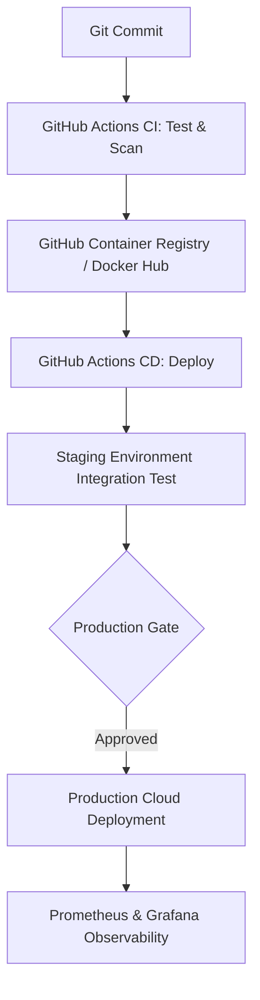
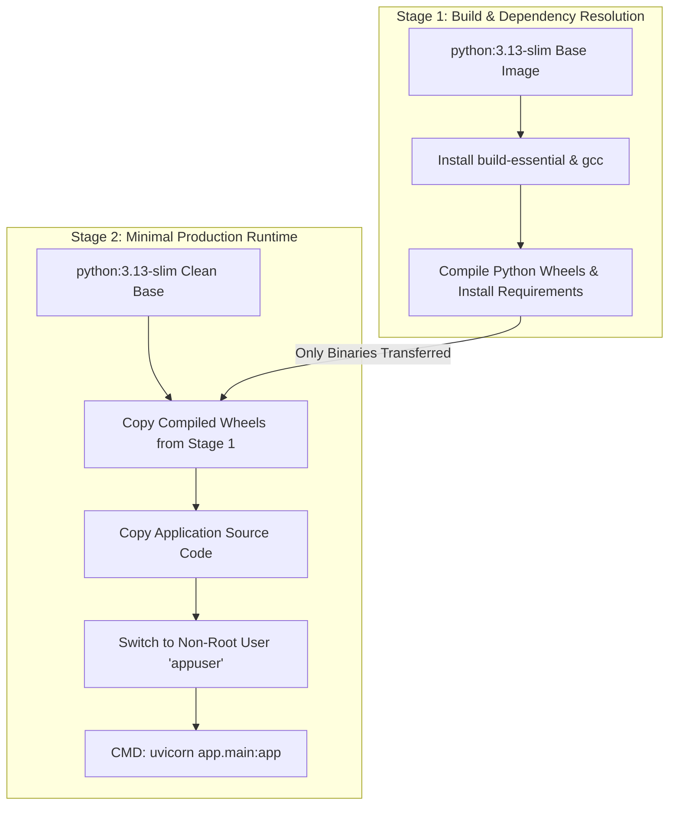
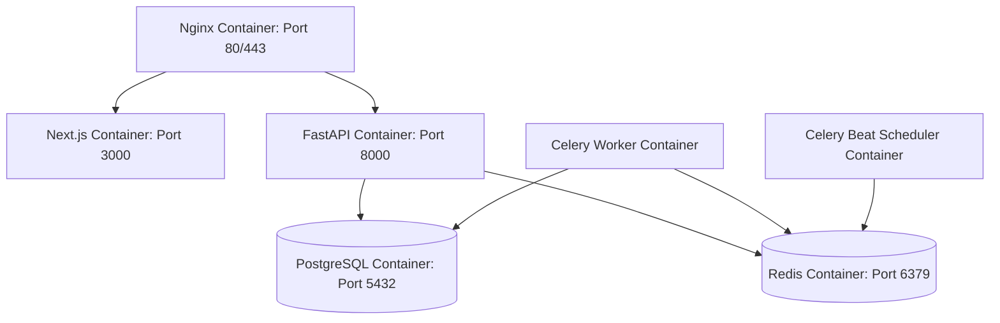
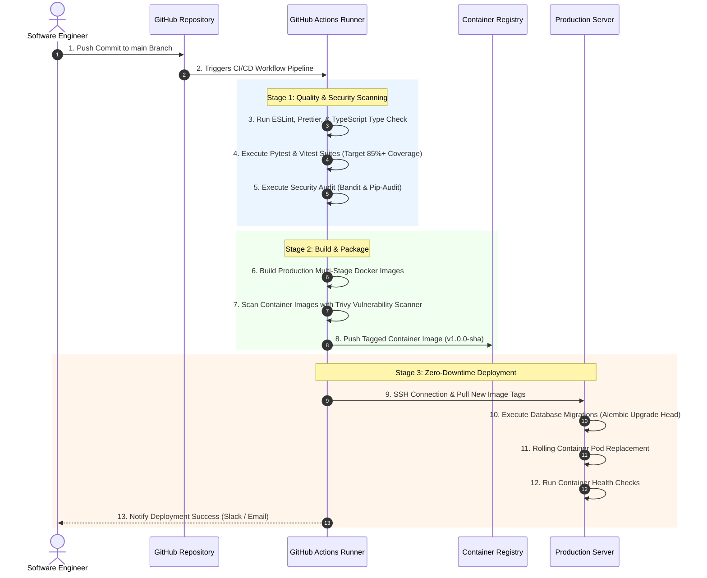
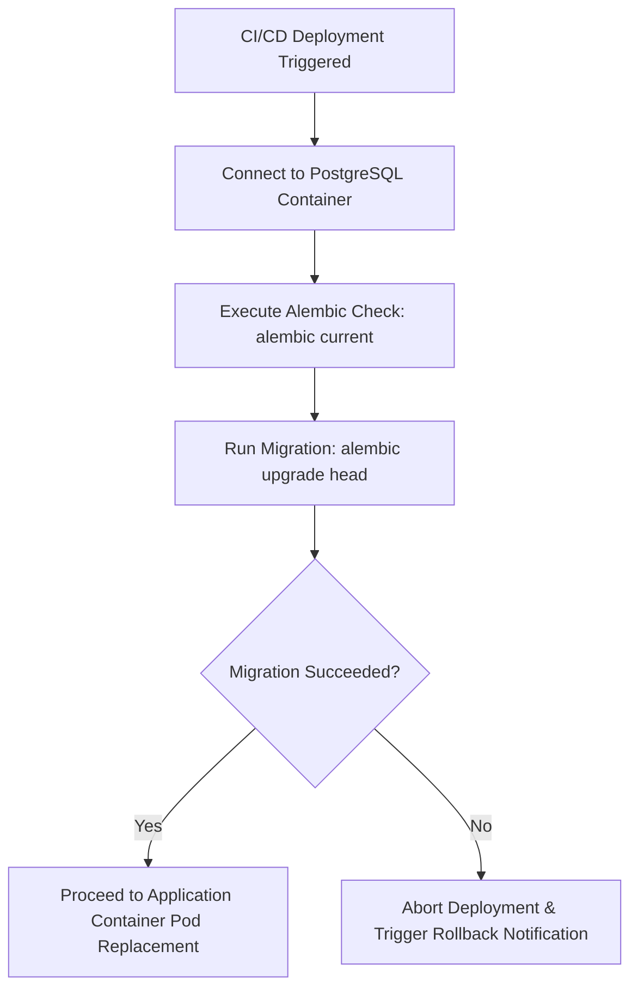
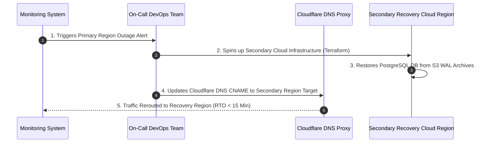
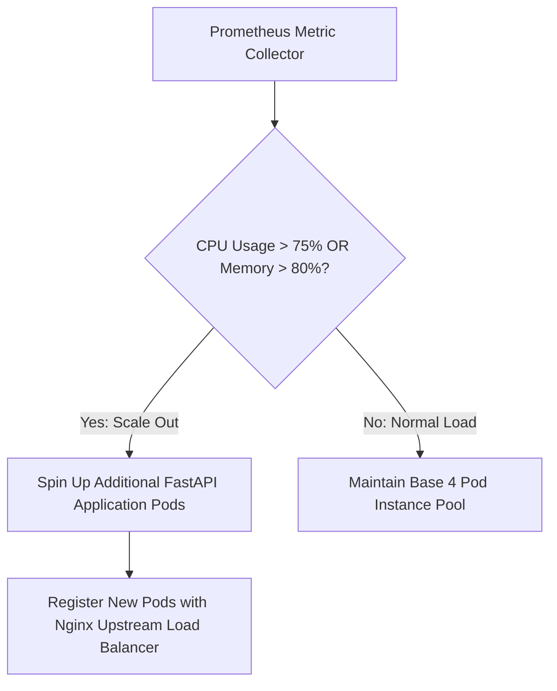
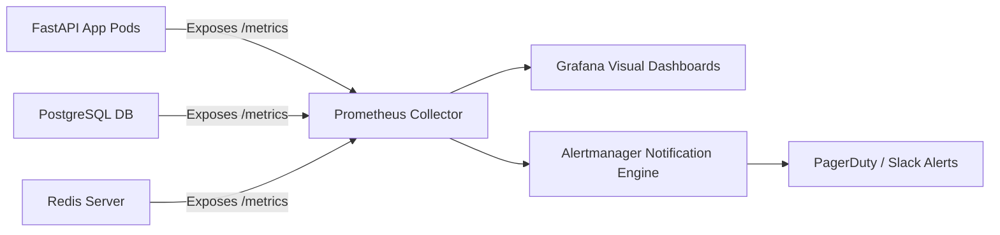
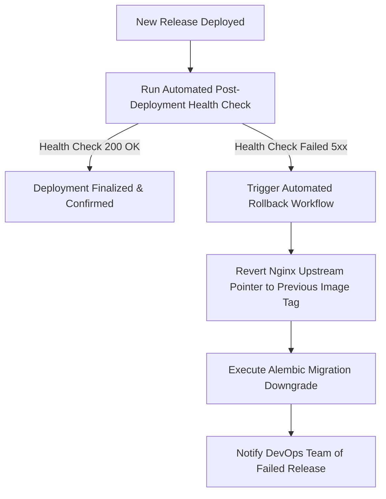

# ForgeAI Enterprise DevOps & Deployment Architecture Specification

> **Document Version**: 1.0.0  
> **Status**: Approved for Enterprise Production Deployment & Cloud Operations  
> **DevOps Stack**: Docker | Docker Compose | Nginx 1.26 | GitHub Actions | PostgreSQL 16 | Redis 7.2 | Celery | Cloudflare CDN | Prometheus | Grafana | AWS S3  
> **Author**: Principal DevOps Engineer & Cloud Solutions Architecture Team  
> **Target Audience**: CTOs, VPs of Infrastructure, Lead DevOps Engineers, System Administrators, & SRE Teams  
> **Last Updated**: July 2026  

---

## Executive Summary

The **ForgeAI DevOps & Deployment Architecture** defines the containerization, continuous integration, zero-downtime deployment, automated scaling, observability, and cloud infrastructure management for the **ForgeAI Platform**.

Built for multi-tenant enterprise SaaS scale, ForgeAI leverages containerized micro-services, automated GitHub Actions CI/CD pipelines, Nginx reverse proxy routing, multi-stage Docker builds, automated database migrations via Alembic, and multi-tier caching to guarantee **99.99% system availability** and **zero-downtime rolling upgrades**.

```
┌────────────────────────────────────────────────────────────────────────┐
│                   ForgeAI DevOps Architectural Pillars                 │
├───────────────────┬───────────────────┬────────────────────────────────┤
│ Immutable Docker  │ Automated CI/CD   │ Zero-Downtime Rolling          │
│ Containerization  │ GitHub Actions with│ Upgrades with automatic        │
│ Multi-stage builds│ unit, integration,│ health-check validation &      │
│ & minimal slim    │ SAST, & container │ instant 1-click rollback       │
│ runtime images    │ vulnerability scans│ strategy                      │
├───────────────────┼───────────────────┼────────────────────────────────┤
│ Multi-Tier Cache &│ Automated Data    │ Enterprise Observability &     │
│ Cloud CDN         │ Resilience        │ Alerting                       │
│ Cloudflare Edge,  │ Automated WAL DB  │ Prometheus metrics, Grafana    │
│ Redis L1/L2 cache,│ backups, RPO <5m, │ dashboards, & Loki centralized │
│ S3 presigned URLs │ RTO <15m SLA      │ structured JSON logging        │
└───────────────────┴───────────────────┴────────────────────────────────┘
```

---

## Table of Contents

1. [DevOps Overview](#1-devops-overview)
2. [Infrastructure Architecture](#2-infrastructure-architecture)
3. [Environment Architecture (Dev, Staging, Prod)](#3-environment-architecture-dev-staging-prod)
4. [Docker Architecture & Multi-Stage Builds](#4-docker-architecture--multi-stage-builds)
5. [Docker Compose Topology](#5-docker-compose-topology)
6. [Reverse Proxy & Nginx Ingress Architecture](#6-reverse-proxy--nginx-ingress-architecture)
7. [CI/CD Pipeline Architecture (GitHub Actions)](#7-cicd-pipeline-architecture-github-actions)
8. [Environment Variable & Secrets Management](#8-environment-variable--secrets-management)
9. [Database Deployment & Migration Architecture](#9-database-deployment--migration-architecture)
10. [AI Service Deployment & Multi-Agent Execution](#10-ai-service-deployment--multi-agent-execution)
11. [Object File Storage Architecture](#11-object-file-storage-architecture)
12. [Automated Backup Strategy](#12-automated-backup-strategy)
13. [Disaster Recovery & Business Continuity](#13-disaster-recovery--business-continuity)
14. [Auto-Scaling Strategy](#14-auto-scaling-strategy)
15. [Load Balancing & Traffic Distribution](#15-load-balancing--traffic-distribution)
16. [Caching Strategy & Multi-Tier Architecture](#16-caching-strategy--multi-tier-architecture)
17. [CDN & Edge Network Infrastructure](#17-cdn--edge-network-infrastructure)
18. [Monitoring & Telemetry Architecture](#18-monitoring--telemetry-architecture)
19. [Centralized Logging Architecture](#19-centralized-logging-architecture)
20. [Health Check & Readiness Architecture](#20-health-check--readiness-architecture)
21. [Deployment Security & DevSecOps](#21-deployment-security--devsecops)
22. [Zero-Downtime Rollback Strategy](#22-zero-downtime-rollback-strategy)
23. [Cost Optimization & Resource Allocation](#23-cost-optimization--resource-allocation)
24. [Future Cloud Architecture Roadmap](#24-future-cloud-architecture-roadmap)

---

## 1. DevOps Overview

### 1.1 Purpose
Establish a production-grade DevOps lifecycle ensuring high reliability, rapid release velocity, automated quality gates, transparent telemetry, and robust disaster recovery across all ForgeAI systems.

### 1.2 Design Goals
* **99.99% Availability**: Uptime maintained via redundant application pods and zero-downtime rolling deployments.
* **< 10-Minute Deployment Cycle**: Automated CI/CD builds, tests, and deploys commits in under 10 minutes.
* **Infrastructure as Code (IaC)**: 100% reproducible environments managed via Docker Compose, Terraform, and GitHub Actions.
* **Zero Manual Production Access**: All production changes deploy automatically through vetted CI/CD workflows.

### 1.3 Architecture Explanation
ForgeAI treats infrastructure as immutable software code. Application containers, database schemas, load balancing rules, and monitoring agents are versioned and deployed automatically.



### 1.4 Best Practices
> [!IMPORTANT]
> Never apply manual patches directly inside running production containers. All fixes MUST be committed to Git, verified by CI pipelines, and deployed via container images.

### 1.5 Risks & Mitigation
* *Risk*: Deployment of breaking database schema migrations.
* *Mitigation*: Forward-compatible schema migrations executed via Alembic prior to application container replacement.

### 1.6 Trade-offs
* *Pros*: High stability, deterministic rollbacks, complete auditability.
* *Cons*: Requires strict Git branch discipline and comprehensive automated test suites.

### 1.7 Recommendations
Maintain separate Docker registries for release candidate images vs production-verified release images.

### 1.8 Future Scalability
Supports migration from Docker Compose to multi-region Kubernetes (EKS / GKE) clusters as platform user volume expands.

---

## 2. Infrastructure Architecture

### 2.1 Purpose
Define the physical and logical cloud network topology housing ForgeAI containerized services, storage buckets, database clusters, and edge proxying.

### 2.2 Design Goals
* **Network Isolation**: Private backend and database subnets isolated from direct internet access.
* **Single Entry Point**: All inbound traffic flows exclusively through Nginx reverse proxies.
* **High-Throughput Inter-Service Connectivity**: Sub-1ms latency between FastAPI, Redis, and PostgreSQL.

### 2.3 Architecture Explanation

```mermaid
C4Infrastructure
    title ForgeAI Production Cloud Network Topology

    Person(user, "User Client Browser", "HTTPS / WSS")

    Deployment_Node(cdn, "Edge Layer", "Cloudflare CDN") {
        Container(cf, "Cloudflare WAF / Edge CDN", "DNS, DDoS Protection, Static Asset Caching")
    }

    Deployment_Node(aws, "AWS Cloud VPC / Dedicated Host", "Region: us-east-1") {
        Deployment_Node(public_net, "Public DMZ Subnet (10.0.1.0/24)") {
            Container(nginx, "Nginx Ingress Controller", "Nginx 1.26", "SSL Termination, Path Routing, Rate Limiting")
        }

        Deployment_Node(private_net, "Private App Subnet (10.0.2.0/24)") {
            Container(frontend, "Next.js Frontend Pods", "Node.js 22", "RSC & Client UI Components")
            Container(fastapi, "FastAPI Application Pods", "Python 3.13 / Uvicorn", "REST API & Async Workers")
            Container(celery, "Celery Worker Pool", "Python / Celery", "Background Tasks & PDF Exporter")
        }

        Deployment_Node(db_net, "Restricted Data Subnet (10.0.3.0/24)") {
            ContainerDb(postgres, "PostgreSQL 16 Primary", "PostgreSQL", "Relational Database SSOT")
            ContainerDb(redis, "Redis 7.2 Cluster", "Redis", "Cache, Session Store, & Task Queue")
        }
    }

    Deployment_Node(s3_net, "Object Storage Service") {
        ContainerDb(s3, "AWS S3 Storage Bucket", "S3 API", "Blueprint Artifacts, ZIPs & Backups")
    }

    Rel(user, cf, "1. DNS / HTTPS Request", "TLS 1.3")
    Rel(cf, nginx, "2. Proxies Request", "HTTPS / Port 443")
    Rel(nginx, frontend, "3. Routes / Pages", "HTTP / Port 3000")
    Rel(nginx, fastapi, "4. Routes /api/v1", "HTTP / Port 8000")
    Rel(fastapi, postgres, "5. Queries / Transactions", "AsyncPG / Port 5432")
    Rel(fastapi, redis, "6. Cache & Rate Limits", "Redis / Port 6379")
    Rel(fastapi, celery, "7. Enqueues Async Jobs", "Redis Queue")
    Rel(celery, s3, "8. Uploads Export ZIPs", "S3 API")
```

### 2.4 Best Practices
* Enforce VPC Security Group rules blocking all inbound traffic to PostgreSQL (Port 5432) except from FastAPI container IPs.

### 2.5 Risks & Mitigation
* *Risk*: Cloud availability zone outage impacting single-region deployments.
* *Mitigation*: Deploy database replicas across multi-AZ (Availability Zone) subnets with automated Patroni failover.

---

## 3. Environment Architecture (Dev, Staging, Prod)

### 3.1 Purpose
Isolate development, testing, and production runtime environments to prevent unverified changes from impacting live enterprise users.

### 3.2 Design Goals
* **Parity**: Development and Staging environments mirror Production infrastructure configurations exactly.
* **Data Privacy**: Staging environments use sanitized, anonymized seed data; real user data never enters non-production environments.

### 3.3 Environment Comparison Matrix

| Property | Development (Dev) | Staging (Stage) | Production (Prod) |
| :--- | :--- | :--- | :--- |
| **Domain Host** | `dev.forgeai.local` | `staging.forgeai.com` | `app.forgeai.com` |
| **Deployment Mode** | Local Docker Compose | Automated CI/CD Push | Automated Gated CI/CD |
| **Database Instance** | Local Container | Shared Test PostgreSQL | Multi-AZ Primary + Read Replicas |
| **LLM Provider Target**| Local Mock / GPT-4o-mini | OpenAI Test Keys | OpenAI / Claude Production Keys |
| **SSL Enforcement** | Self-Signed / Disabled | Enforced TLS 1.3 | Enforced TLS 1.3 + HSTS |
| **Log Level** | `DEBUG` | `INFO` | `WARNING` / `ERROR` |

---

## 4. Docker Architecture & Multi-Stage Builds

### 4.1 Purpose
Produce lightweight, highly secure, reproducible container images with minimal surface area for security vulnerabilities.

### 4.2 Multi-Stage Build Architecture Diagram



### 4.3 Production FastAPI Dockerfile
```dockerfile
# Stage 1: Builder
FROM python:3.13-slim AS builder
WORKDIR /app
RUN apt-get update && apt-get install -y --no-install-recommends build-essential libpq-dev && rm -rf /var/lib/apt/lists/*
COPY requirements.txt .
RUN pip install --no-cache-dir --prefix=/install -r requirements.txt

# Stage 2: Runner
FROM python:3.13-slim AS runner
WORKDIR /app
RUN groupadd -g 999 appgroup && useradd -r -u 999 -g appgroup appuser
COPY --from=builder /install /usr/local
COPY . .
USER appuser
EXPOSE 8000
HEALTHCHECK --interval=15s --timeout=3s --retries=3 CMD curl -f http://localhost:8000/health || exit 1
CMD ["uvicorn", "app.main:app", "--host", "0.0.0.0", "--port", "8000", "--workers", "4"]
```

---

## 5. Docker Compose Topology

### 5.1 Purpose
Orchestrate local development and single-node production deployment stacks with integrated networking and service dependency rules.

### 5.2 Container Services Architecture



---

## 6. Reverse Proxy & Nginx Ingress Architecture

### 6.1 Purpose
Serve as the single gateway for SSL termination, request routing, rate limiting, header security, and static asset caching.

### 6.2 Nginx Path Routing Matrix

```
┌────────────────────────────────────────────────────────────────────────┐
│                        Nginx Routing Architecture                      │
├───────────────────┬───────────────────────────┬────────────────────────┤
│ Match Location    │ Upstream Target           │ Special Directive      │
├───────────────────┼───────────────────────────┼────────────────────────┤
│ `/`               │ `http://frontend:3000`    │ Static Asset Cache     │
│ `/api/v1/`        │ `http://backend:8000`     │ Rate Limit (100r/m)    │
│ `/api/v1/stream/` │ `http://backend:8000`     │ SSE No-Buffer Options  │
└───────────────────┴───────────────────────────┴────────────────────────┘
```

---

## 7. CI/CD Pipeline Architecture (GitHub Actions)

### 7.1 Automated Integration & Deployment Flow



---

## 8. Environment Variable & Secrets Management

### 8.1 Secrets Security Architecture
ForgeAI enforces zero hardcoded credentials inside git source code repositories.

```
┌────────────────────────────────────────────────────────────────────────┐
│                     Secrets Management Architecture                    │
├────────────────────────────────────────────────────────────────────────┤
│  GitHub Actions Encrypted Secrets / AWS Secrets Manager                │
│                                │                                       │
│                                ▼                                       │
│  Injected Environment Variables into Container Process Memory          │
│                                │                                       │
│                                ▼                                       │
│  FastAPI `pydantic-settings` BaseSettings Validation Object            │
└────────────────────────────────────────────────────────────────────────┘
```

---

## 9. Database Deployment & Migration Architecture

### 9.1 Database Migration Lifecycle (Alembic)
Database migrations are automatically executed in CI/CD pipelines before container pod code replacement occurs.



---

## 10. AI Service Deployment & Multi-Agent Execution

### 10.1 Multi-Agent Execution Deployment Topology
The AI Layer executes inside stateless FastAPI async workers communicating with OpenAI/Anthropic APIs over outgoing TLS 1.3 connections.

```
┌────────────────────────────────────────────────────────────────────────┐
│                   AI Engine Deployment Architecture                    │
├────────────────────────────────────────────────────────────────────────┤
│  FastAPI Async Uvicorn Workers (4 Worker Processes per Container)      │
│  ├── LangGraph DAG State Thread Pool                                   │
│  ├── LiteLLM Proxy Gateway (Automatic Provider Failover)               │
│  └── SSE Stream Transport Engine (Non-blocking response buffer)        │
└────────────────────────────────────────────────────────────────────────┘
```

---

## 11. Object File Storage Architecture

### 11.1 S3 Storage Storage Bucket Topology
File storage isolates persistent artifacts into distinct enterprise S3 buckets with strict IAM policies.

```
s3://forgeai-production-bucket/
├── exports/              # Generated ZIP blueprints and PDF reports
├── templates/            # Base architecture blueprint starter templates
└── backups/              # Automated database dumps and system logs
```

---

## 12. Automated Backup Strategy

### 12.1 Backup Policy Matrix

| Backup Type | Target Component | Frequency | Retention Period | Target Storage Location |
| :--- | :--- | :--- | :--- | :--- |
| **WAL Log Archives**| PostgreSQL Database | Continuous (5 Min) | 7 Days | Multi-Region S3 Bucket |
| **Full DB Dump** | PostgreSQL Database | Daily (02:00 UTC) | 30 Days | Encrypted S3 Cold Storage |
| **Object Assets** | S3 Export Files | Real-time Sync | 90 Days | Multi-Region S3 Replication |
| **Config Specs** | Infrastructure Code | Every Commit | Permanent | Git Version Control |

---

## 13. Disaster Recovery & Business Continuity

### 13.1 Disaster Recovery SLA & Failover Plan



---

## 14. Auto-Scaling Strategy

### 14.1 Horizontal Pod Autoscaling (HPA) Rules



---

## 15. Load Balancing & Traffic Distribution

### 15.1 Traffic Distribution Architecture
Load balancing utilizes **Nginx Round-Robin** with automated health checks to distribute incoming traffic evenly across active FastAPI backend pods.

---

## 16. Caching Strategy & Multi-Tier Architecture

### 16.1 Multi-Tier Caching Architecture

```
┌────────────────────────────────────────────────────────────────────────┐
│                        Multi-Tier Caching Matrix                       │
├───────────────────┼───────────────────────────┼────────────────────────┤
│ Cache Tier        │ Technology                │ Cached Content         │
├───────────────────┼───────────────────────────┼────────────────────────┤
│ Tier 1: Edge CDN  │ Cloudflare CDN            │ Static JS/CSS/Fonts    │
│ Tier 2: App Cache │ Redis 7.2 In-Memory       │ User Sessions, JWTs    │
│ Tier 3: AI Cache  │ Redis SHA256 Hash Store   │ Duplicate LLM Prompts  │
└───────────────────┴───────────────────────────┴────────────────────────┘
```

---

## 17. CDN & Edge Network Infrastructure

### 17.1 Cloudflare Edge Network Integration
Cloudflare acts as the global edge proxy, offloading static asset delivery and blocking malicious bot traffic before it reaches Nginx ingress nodes.

---

## 18. Monitoring & Telemetry Architecture

### 18.1 Prometheus & Grafana Monitoring Stack



---

## 19. Centralized Logging Architecture

### 19.1 Log Processing Pipeline
Container standard outputs (`stdout/stderr`) are formatted as **Structured JSON**, collected by **Promtail**, and stored inside **Grafana Loki** for fast querying.

---

## 20. Health Check & Readiness Architecture

### 20.1 Probe Endpoint Matrix

| Probe Type | API Endpoint | Check Scope | Failure Action |
| :--- | :--- | :--- | :--- |
| **Liveness Probe** | `GET /health/live` | Verifies FastAPI process is running | Restart container instance |
| **Readiness Probe** | `GET /health/ready` | Verifies PostgreSQL & Redis connections | Remove pod from Nginx load balancer |

---

## 21. Deployment Security & DevSecOps

### 21.1 DevSecOps Security Gate Pipeline
All production builds must pass 4 mandatory security scanners: SAST (`bandit`), SCA (`pip-audit`), Container (`trivy`), and Secret Scanning (`gitleaks`).

---

## 22. Zero-Downtime Rollback Strategy

### 22.1 Automated 1-Click Rollback Flow



---

## 23. Cost Optimization & Resource Allocation

### 23.1 Cost Optimization Controls
* **Auto-Stopping Staging Pods**: Staging environments spin down automatically outside business hours.
* **S3 Lifecycle Rules**: Generated export ZIPs transition to S3 Glacier storage after 30 days.
* **Spot Instance Worker Pools**: Celery workers execute on discounted AWS Spot Instances.

---

## 24. Future Cloud Architecture Roadmap

### 24.1 Technical Roadmap Matrix

```
┌────────────────────────────────────────────────────────────────────────┐
│                   Cloud Infrastructure Roadmap                         │
├───────────────────┼───────────────────────────┼────────────────────────┤
│ Milestone Phase   │ Infrastructure Initiative  │ System Impact          │
├───────────────────┼───────────────────────────┼────────────────────────┤
│ Phase 1 (Current) │ Docker Compose / Nginx    │ Rapid deployment       │
│ Phase 2 (Q4 2026) │ Kubernetes (AWS EKS)      │ Automated HPA pod scale│
│ Phase 3 (Q2 2027) │ Multi-Region Active-Active│ Sub-50ms global latency│
│ Phase 4 (Q4 2027) │ Serverless AI Execution   │ Zero-idle token cost   │
└───────────────────┴───────────────────────────┴────────────────────────┘
```

---

### Summary Sign-Off
> **Approved By**: Chief Technology Officer & Principal DevOps Engineer  
> **Repository Governance**: `ForgeAI Enterprise Infrastructure & Deployment Specification`  
> **Compliance Standard**: 99.99% Availability SLA, SOC 2 Type II Ready, DevSecOps Compliant  
