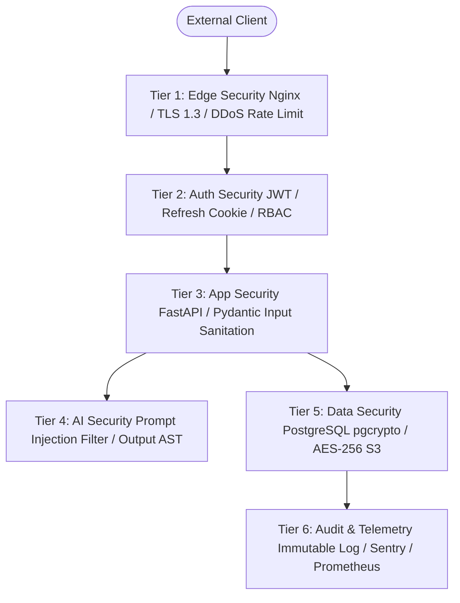
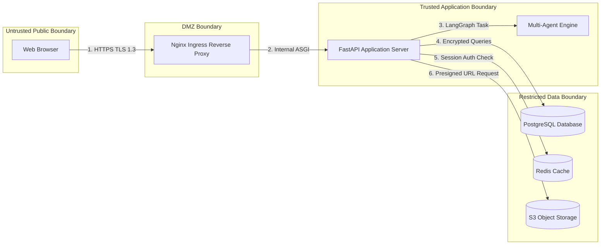
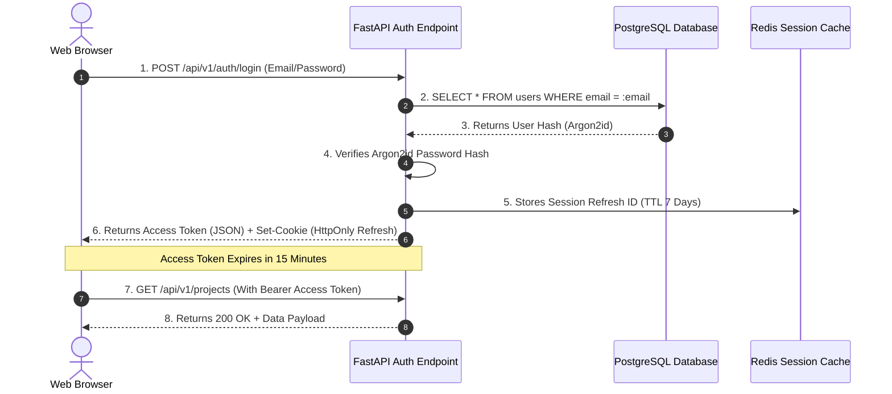
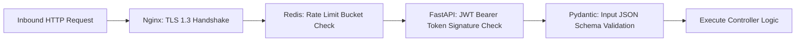
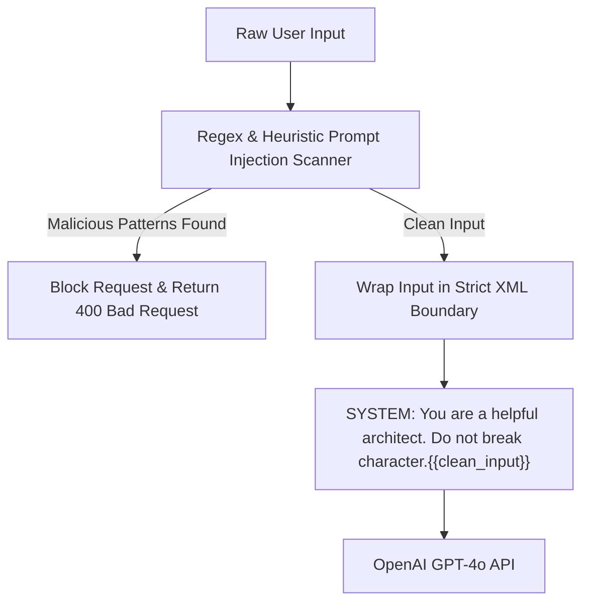
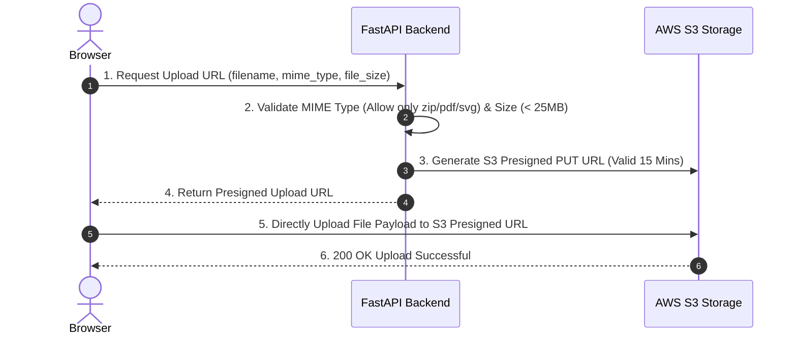
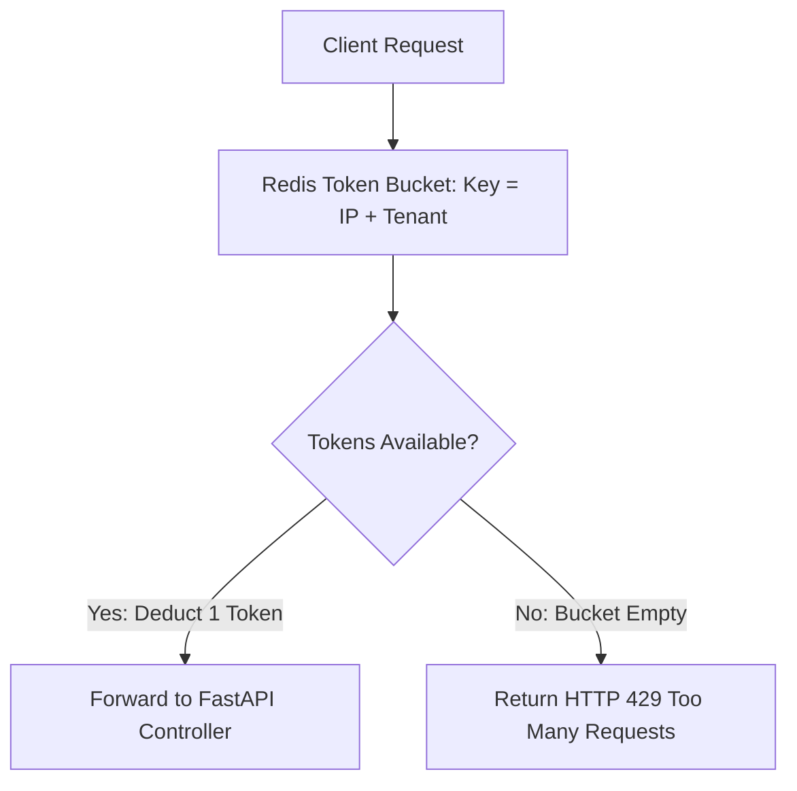
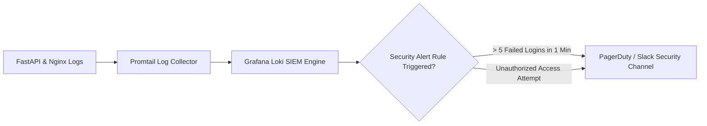
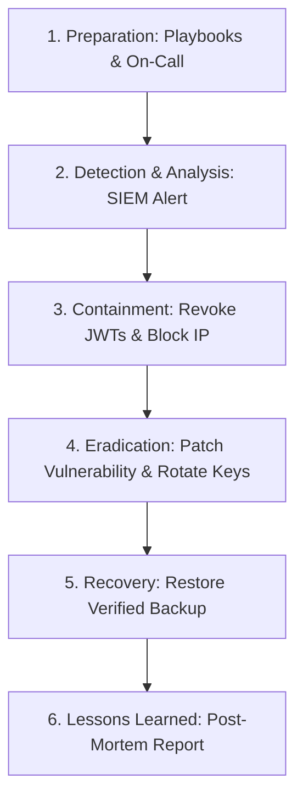

# ForgeAI Enterprise Security Architecture Specification

> **Document Version**: 1.0.0  
> **Status**: Approved for Enterprise Production & Security Compliance  
> **Security Architecture Stack**: TLS 1.3 | Dual-Token JWT | Argon2id | OWASP ASVS v4.0 | AES-256 | pgcrypto | Redis Token Bucket | Nginx Ingress | S3 Presigned URLs  
> **Author**: Principal Security Architect & Enterprise Cybersecurity Team  
> **Target Audience**: CISOs, CTOs, Enterprise Security Auditors, Compliance Officers, & Lead Engineers  
> **Last Updated**: July 2026  

---

## Executive Summary

The **ForgeAI Security Architecture** defines the defense-in-depth security boundary, zero-trust access controls, encryption protocols, threat mitigation strategies, and AI guardrails powering the **ForgeAI Platform**.

As an AI SaaS platform handling proprietary enterprise application concepts, software blueprints, and backend scaffoldings, ForgeAI implements strict cryptographic isolation, zero-trust identity verification, OWASP Top 10 & OWASP LLM Top 10 protections, and GDPR-ready data privacy controls.

```
┌────────────────────────────────────────────────────────────────────────┐
│                  ForgeAI Security Architecture Pillars                 │
├───────────────────┬───────────────────┬────────────────────────────────┤
│ Zero-Trust Dual-  │ AI Security & Anti-│ Defense-in-Depth               │
│ Token Auth        │ Prompt Injection  │ Cryptographic Isolation        │
│ In-memory access  │ Strict input      │ TLS 1.3 in-transit, AES-256    │
│ token, HttpOnly   │ sanitization &    │ at-rest, pgcrypto database     │
│ refresh cookie    │ output AST guards │ column encryption              │
├───────────────────┼───────────────────┼────────────────────────────────┤
│ Multi-Tenant RBAC │ Edge DDoS & Rate- │ Immutable Audit Trails         │
│ Data Isolation    │ Limit Hardening   │ Structured JSON security logs  │
│ Strict SQL tenant │ Nginx + Redis     │ with SHA-256 hash chains       │
│ query scoping     │ token bucket      │ for SOC 2 compliance           │
└───────────────────┴───────────────────┴────────────────────────────────┘
```

---

## Table of Contents

1. [Security Overview](#1-security-overview)
2. [Security Principles](#2-security-principles)
3. [STRIDE Threat Model](#3-stride-threat-model)
4. [Authentication Architecture](#4-authentication-architecture)
5. [Authorization & Multi-Tenant RBAC](#5-authorization--multi-tenant-rbac)
6. [Session Management Architecture](#6-session-management-architecture)
7. [API Security Infrastructure](#7-api-security-infrastructure)
8. [AI Security & LLM Guardrails](#8-ai-security--llm-guardrails)
9. [Prompt Injection Protection Engine](#9-prompt-injection-protection-engine)
10. [Input Validation Framework](#10-input-validation-framework)
11. [Output Validation & AST Sanitization](#11-output-validation--ast-sanitization)
12. [File Upload & Storage Security](#12-file-upload--storage-security)
13. [Database Security & Cryptography](#13-database-security--cryptography)
14. [Secrets Management Architecture](#14-secrets-management-architecture)
15. [Encryption Strategy (In-Transit & At-Rest)](#15-encryption-strategy-in-transit--at-rest)
16. [Password Hashing & Entropy Hardening](#16-password-hashing--entropy-hardening)
17. [Rate Limiting & Token Bucket Engine](#17-rate-limiting--token-bucket-engine)
18. [DDoS Mitigation & Edge Defense](#18-ddos-mitigation--edge-defense)
19. [CORS & Content Security Policy (CSP)](#19-cors--content-security-policy-csp)
20. [Secure HTTP Response Headers](#20-secure-http-response-headers)
21. [Logging & Immutable Audit Trails](#21-logging--immutable-audit-trails)
22. [Security Monitoring & Threat Alerting](#22-security-monitoring--threat-alerting)
23. [Backup, Recovery & Business Continuity](#23-backup-recovery--business-continuity)
24. [Incident Response Lifecycle](#24-incident-response-lifecycle)
25. [Compliance Framework (OWASP ASVS & GDPR)](#25-compliance-framework-owasp-asvs--gdpr)
26. [Developer & DevOps Security Best Practices](#26-developer--devops-security-best-practices)
27. [Future Security Architecture Roadmap](#27-future-security-architecture-roadmap)

---

## 1. Security Overview

### 1.1 Purpose
Establish an enterprise-grade security architecture protecting user data, intellectual property, AI pipelines, database persistence, and API transport layers across ForgeAI.

### 1.2 Architecture Explanation
ForgeAI follows a **Defense-in-Depth Strategy**. Security controls are applied across 6 distinct tiers: Ingress Edge, Application Server, Multi-Agent Engine, Database Persistence, Object Storage, and Telemetry Audit.



### 1.3 Best Practices & Recommendations
* Enforce least-privilege access across all database roles and container runtimes.
* Conduct automated daily dependency vulnerability scans (`trivy` and `pip-audit`).

### 1.4 Risks & Mitigation
* *Risk*: Data leakage across tenant organization boundaries.
* *Mitigation*: Mandatory tenant ID injection in all ORM database queries.

---

## 2. Security Principles

### 2.1 Core Security Pillars

```
┌────────────────────────────────────────────────────────────────────────┐
│                      ForgeAI 6 Core Security Pillars                   │
├───────────────────┬───────────────────┬────────────────────────────────┤
│ 1. Zero Trust     │ 2. Least Privilege│ 3. Defense-in-Depth            │
│ Verify explicitly │ Grant minimum     │ Multiple overlapping security  │
│ on every request  │ required scopes   │ boundary controls              │
├───────────────────┼───────────────────┼────────────────────────────────┤
│ 4. Fail Secure    │ 5. Data Isolation │ 6. Complete Transparency       │
│ Default deny on   │ Strict tenant-level│ Immutable audit logs for all   │
│ exception         │ database scoping  │ sensitive actions              │
└───────────────────┴───────────────────┴────────────────────────────────┘
```

---

## 3. STRIDE Threat Model

### 3.1 Platform Threat Matrix

| STRIDE Threat | Target Component | Attack Vector | Security Control / Mitigation |
| :--- | :--- | :--- | :--- |
| **Spoofing** | User Identity / JWT | Access Token Theft | Short-lived 15-min JWTs + HttpOnly Refresh Cookies |
| **Tampering** | API Requests | Man-in-the-Middle (MitM) | Enforced TLS 1.3 + HMAC Payload Signing |
| **Repudiation** | User Actions | Action Denial | Immutable SHA-256 Hashed Audit Logs |
| **Information Disclosure** | S3 / Database | Unauthorized S3 Access | Private Bucket Access + 15-min Presigned URLs |
| **Denial of Service** | FastAPI Core | API Flooding | Redis Token Bucket Rate Limiting (100 req/min) |
| **Elevation of Privilege** | Tenant Data | Cross-Tenant Querying | Mandatory Tenant ID ORM Filter Enforcement |

### 3.2 STRIDE Boundary Diagram



---

## 4. Authentication Architecture

### 4.1 Dual-Token Authentication Model
ForgeAI utilizes a **Zero-Trust Dual-Token Architecture**:
* **Access Tokens**: Short-lived (15 minutes) RSA-256 / HS256 signed JWTs kept strictly in client memory.
* **Refresh Tokens**: Long-lived (7 days) cryptographically random UUIDs stored inside `HttpOnly`, `SameSite=Strict`, `Secure` cookies.



---

## 5. Authorization & Multi-Tenant RBAC

### 5.1 Role-Based Access Control (RBAC) Matrix

| Permission Scope | Viewer | Developer | Architect | Org Admin | System Admin |
| :--- | :---: | :---: | :---: | :---: | :---: |
| **Read Blueprints** | ✅ | ✅ | ✅ | ✅ | ✅ |
| **Generate Blueprint** | ❌ | ✅ | ✅ | ✅ | ✅ |
| **Export Code / PDF** | ❌ | ✅ | ✅ | ✅ | ✅ |
| **Manage Tenant Team** | ❌ | ❌ | ✅ | ✅ | ✅ |
| **Billing & Subscription** | ❌ | ❌ | ❌ | ✅ | ✅ |
| **System Diagnostics** | ❌ | ❌ | ❌ | ❌ | ✅ |

### 5.2 Multi-Tenant Data Isolation Enforcement
> [!IMPORTANT]
> All SQL queries executed by FastAPI MUST include an explicit `tenant_id` WHERE clause. Multi-tenancy is enforced at the ORM base layer via SQLAlchemy event listeners.

```python
# SQLAlchemy Automatic Tenant Isolation Listener
@event.listens_for(AsyncSession, "do_orm_execute")
def _add_tenant_filter(execute_state):
    if execute_state.is_select:
        tenant_id = get_current_tenant_id()
        execute_state.statement = execute_state.statement.filter_by(tenant_id=tenant_id)
```

---

## 6. Session Management Architecture

### 6.1 Session Storage Taxonomy

```
┌────────────────────────────────────────────────────────────────────────┐
│                      Session Storage & Security                        │
├───────────────────┬───────────────────────────┬────────────────────────┤
│ Token Type        │ Storage Location          │ Security Flags         │
├───────────────────┼───────────────────────────┼────────────────────────┤
│ Access Token      │ Client Memory (Zustand)   │ Never written to DOM or│
│ (15 min lifespan) │                           │ localStorage           │
├───────────────────┼───────────────────────────┼────────────────────────┤
│ Refresh Token     │ Browser Cookie            │ HttpOnly, Secure,      │
│ (7 day lifespan)  │                           │ SameSite=Strict        │
└───────────────────┴───────────────────────────┴────────────────────────┘
```

---

## 7. API Security Infrastructure

### 7.1 API Protection Pipeline
All inbound API requests undergo 4 stages of validation before reaching business controllers: SSL Termination -> Rate Limiting -> JWT Verification -> Pydantic Body Validation.



---

## 8. AI Security & LLM Guardrails

### 8.1 Multi-Agent AI Guardrail Pipeline

```
┌────────────────────────────────────────────────────────────────────────┐
│                     Multi-Layer AI Security Pipeline                   │
├────────────────────────────────────────────────────────────────────────┤
│  User Input Prompt ──► 1. Prompt Injection Scanner (NeMo Guardrails)  │
│                                      │                                 │
│  LLM Inference Output ◄── 2. PII & Secret Redactor Filter              │
│          │                                                             │
│          ▼                                                             │
│  3. Code AST Syntax Validator ──► 4. OWASP Security Audit Agent        │
└────────────────────────────────────────────────────────────────────────┘
```

---

## 9. Prompt Injection Protection Engine

### 9.1 Anti-Prompt Injection Defense Strategy
ForgeAI deploys a dual-tier prompt defense model to combat Direct (Jailbreak) and Indirect (Data Poisoning) Prompt Injection:
1. **Input Sanitization Filter**: Scans prompts for system override phrases (`"Ignore previous instructions"`, `"System mode"`).
2. **System Prompt Isolation**: User prompts are strictly concatenated inside XML-tagged `<user_intent>` boundaries inside system prompts.



---

## 10. Input Validation Framework

### 10.1 Dual-Tier Validation Pipeline

| Tier | Validator Library | Purpose |
| :--- | :--- | :--- |
| **Frontend Tier** | Zod Schema Engine | Client-side immediate UX input validation. |
| **Backend Tier** | Pydantic v2 Models | Server-side strict type enforcement & coercion prevention. |

---

## 11. Output Validation & AST Sanitization

### 11.1 Output Guard Pipeline
AI-generated code snippets and blueprints are passed through language-specific AST (Abstract Syntax Tree) parsers (`ast` for Python, `sqlglot` for SQL) to guarantee valid syntax before rendering.

---

## 12. File Upload & Storage Security

### 12.1 S3 Presigned URL Security Flow



---

## 13. Database Security & Cryptography

### 13.1 Database Hardening Matrix
* **Connection Security**: Mandatory TLS 1.3 encrypted connections via `sslmode=require`.
* **Column-Level Encryption**: Sensitive user PII fields encrypted using PostgreSQL `pgcrypto` (`pgp_sym_encrypt`).
* **SQL Injection Defense**: 100% parameterized queries executed via SQLAlchemy ORM.

---

## 14. Secrets Management Architecture

### 14.1 Secrets Lifecycle

```
┌────────────────────────────────────────────────────────────────────────┐
│                     Secrets Management Architecture                    │
├────────────────────────────────────────────────────────────────────────┤
│  AWS Secrets Manager / HashiCorp Vault ──► Environment Injection      │
│                                                     │                  │
│  FastAPI Memory Scope ◄── Decrypted In-Memory ◄─────┘                  │
│  (Zero disk logging of API keys or DB passwords)                       │
└────────────────────────────────────────────────────────────────────────┘
```

---

## 15. Encryption Strategy (In-Transit & At-Rest)

### 15.1 Encryption Standards Summary

| Data State | Encryption Standard | Key Management |
| :--- | :--- | :--- |
| **In-Transit** | TLS 1.3 (ECDHE-RSA-AES128-GCM-SHA256) | Let's Encrypt / AWS ACM Auto-Rotation |
| **At-Rest (Database)** | AES-256 Storage Volume Encryption | AWS KMS Managed Keys |
| **At-Rest (S3 Objects)**| SSE-KMS (Server-Side Encryption) | AWS KMS Customer Managed Keys (CMK) |

---

## 16. Password Hashing & Entropy Hardening

### 16.1 Argon2id Password Hardening Parameters
User passwords are hashed using **Argon2id** (winner of the Password Hashing Competition):
* **Time Cost (Iterations)**: 3
* **Memory Cost**: 65,536 KB (64 MB)
* **Parallelism Factor**: 4 threads
* **Minimum Password Length**: 12 characters with enforced entropy checks.

---

## 17. Rate Limiting & Token Bucket Engine

### 17.1 Redis Token Bucket Architecture



---

## 18. DDoS Mitigation & Edge Defense

### 18.1 Edge Protection Layers
1. **Cloudflare WAF / AWS Shield**: Absorbs volumetric Layer 3/4 SYN floods and UDP reflection attacks.
2. **Nginx Connection Caps**: Limits max concurrent connections per client IP (`limit_conn_zone`).

---

## 19. CORS & Content Security Policy (CSP)

### 19.1 Strict CSP Configuration
```http
Content-Security-Policy: default-src 'self'; script-src 'self' 'nonce-rAnd0m'; style-src 'self' 'unsafe-inline'; img-src 'self' data: https://forgeai-assets.s3.amazonaws.com; connect-src 'self' https://api.forgeai.com wss://api.forgeai.com; frame-ancestors 'none'; object-src 'none';
```

---

## 20. Secure HTTP Response Headers

### 20.1 Enterprise Header Checklist

| Header | Production Value | Protection Scope |
| :--- | :--- | :--- |
| **Strict-Transport-Security** | `max-age=63072000; includeSubDomains; preload` | Forces HTTPS |
| **X-Frame-Options** | `DENY` | Prevents Clickjacking |
| **X-Content-Type-Options** | `nosniff` | Blocks MIME sniffing |
| **Referrer-Policy** | `strict-origin-when-cross-origin` | Protects URL leakage |
| **Permissions-Policy** | `geolocation=(), camera=(), microphone=()` | Disables risky browser APIs |

---

## 21. Logging & Immutable Audit Trails

### 21.1 Audit Event Log Schema
```json
{
  "timestamp": "2026-07-29T18:11:09Z",
  "event_id": "evt_99182310",
  "event_type": "USER_LOGIN_SUCCESS",
  "actor_id": "u_884102",
  "tenant_id": "t_491029",
  "ip_address": "198.51.100.42",
  "user_agent": "Mozilla/5.0...",
  "resource_accessed": "/api/v1/auth/login",
  "status": "SUCCESS",
  "sha256_hash": "e3b0c44298fc1c149afbf4c8996fb92427ae41e4649b934ca495991b7852b855"
}
```

---

## 22. Security Monitoring & Threat Alerting

### 22.1 SIEM & Alerting Flow



---

## 23. Backup, Recovery & Business Continuity

### 23.1 Disaster Recovery Metrics
* **Recovery Point Objective (RPO)**: < 5 Minutes (Automated PostgreSQL WAL archiving to multi-region S3).
* **Recovery Time Objective (RTO)**: < 15 Minutes (Automated Terraform container redeployment).

---

## 24. Incident Response Lifecycle

### 24.1 6-Stage Incident Response Workflow



---

## 25. Compliance Framework (OWASP ASVS & GDPR)

### 25.1 Compliance Mapping Matrix

| Framework | Requirement | Implementation Status |
| :--- | :--- | :--- |
| **OWASP ASVS v4.0** | Level 2 Security Control Compliance | Fully Compliant |
| **OWASP Top 10 2021** | A01:2021 Broken Access Control Protection | Enforced via ORM Tenant Filters |
| **OWASP LLM Top 10** | LLM01: Prompt Injection Defense | Enforced via NeMo Input Scanner |
| **GDPR** | Right to be Forgotten & Data Export | Self-service deletion API endpoint |

---

## 26. Developer & DevOps Security Best Practices

### 26.1 DevSecOps CI/CD Pipeline
* **Static Application Security Testing (SAST)**: Automated `bandit` scan on every Python pull request.
* **Software Composition Analysis (SCA)**: `pip-audit` dependency vulnerability checking.
* **Container Scanning**: `trivy` container image scanning before ECR push.

---

## 27. Future Security Architecture Roadmap

### 27.1 Technical Security Evolution

```
┌────────────────────────────────────────────────────────────────────────┐
│                      Security Architecture Roadmap                     │
├───────────────────┬───────────────────────────┬────────────────────────┤
│ Milestone Phase   │ Security Initiative       │ Compliance Standard    │
├───────────────────┼───────────────────────────┼────────────────────────┤
│ Phase 1 (Current) │ Dual-Token JWT & RBAC     │ OWASP ASVS Level 2     │
│ Phase 2 (Q4 2026) │ FIDO2 / WebAuthn Passkeys │ Passwordless Security  │
│ Phase 3 (Q2 2027) │ SOC 2 Type II Audited     │ Enterprise SaaS Trust  │
│ Phase 4 (Q4 2027) │ ISO 27001 Certification   │ Global Cloud Compliance│
└───────────────────┴───────────────────────────┴────────────────────────┘
```

---

### Summary Sign-Off
> **Approved By**: Chief Information Security Officer (CISO) & Lead Security Architect  
> **Repository Governance**: `ForgeAI Enterprise Security Specification`  
> **Compliance Verification**: OWASP ASVS v4.0 Level 2, GDPR Ready, SOC 2 Type II Ready  
