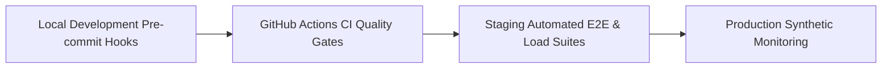
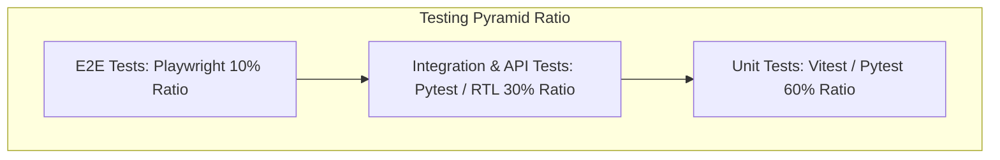
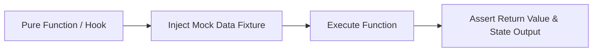
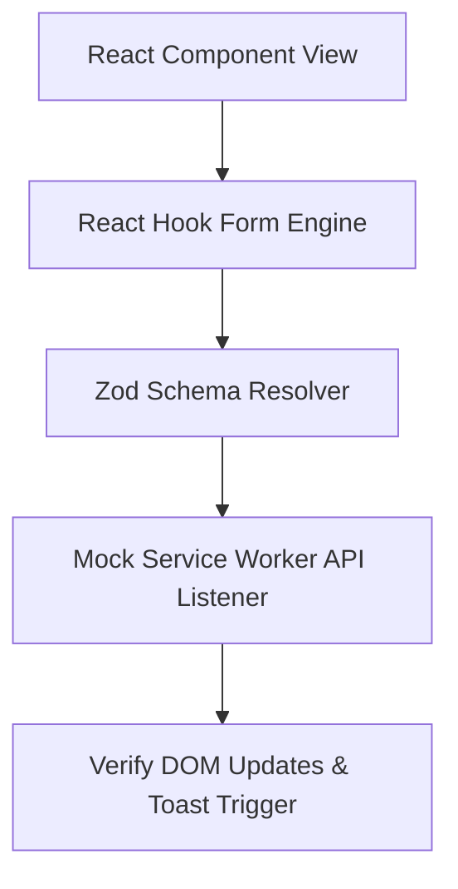
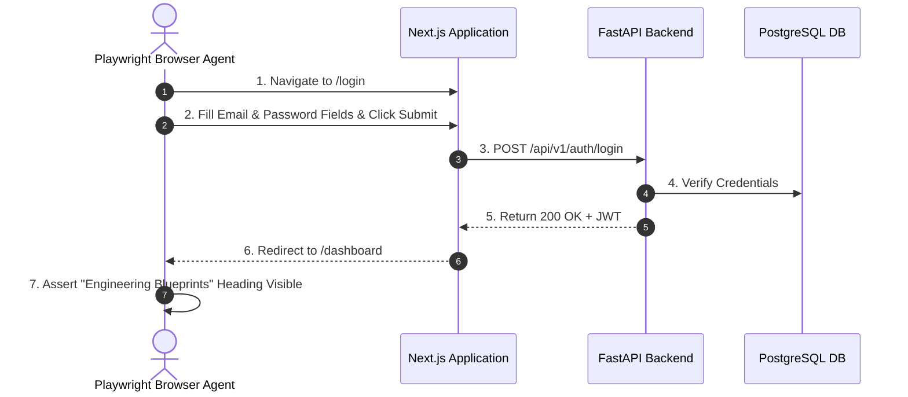
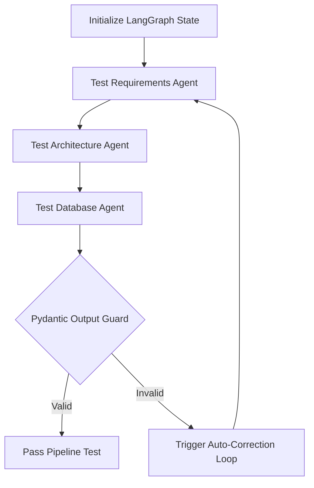
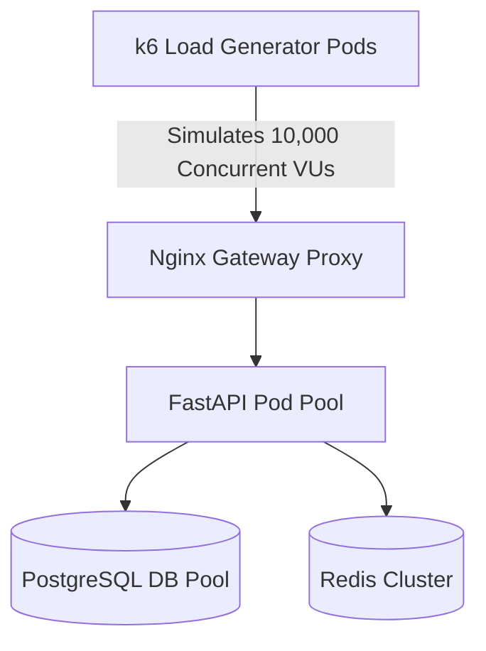
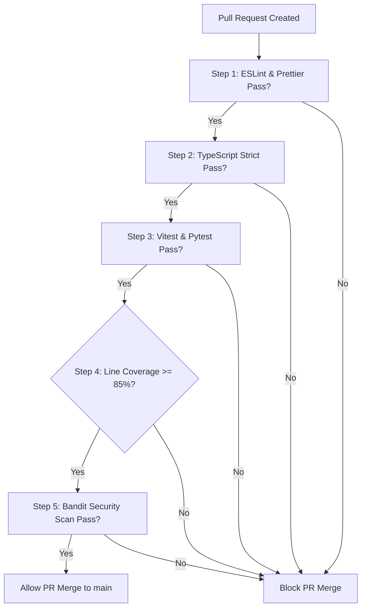
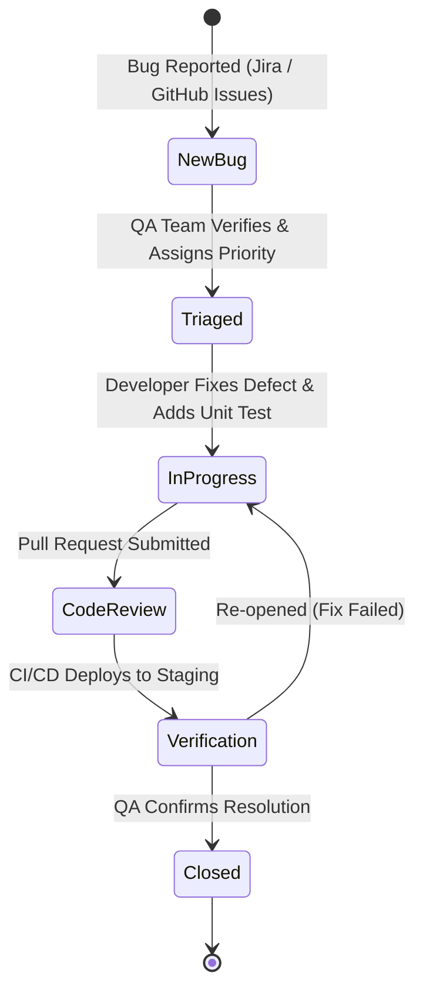

# ForgeAI Enterprise Testing Strategy & QA Architecture Specification

> **Document Version**: 1.0.0  
> **Status**: Approved for Enterprise Quality Assurance & Production Verification  
> **Testing Stack**: Vitest | React Testing Library | Pytest | Playwright | MSW | k6 | Locust | SonarQube | axe-core | Pydantic v2  
> **Author**: Principal QA Architect & Quality Engineering Team  
> **Target Audience**: VPs of Engineering, QA Managers, Lead Software Test Engineers, & Full-Stack Developers  
> **Last Updated**: July 2026  

---

## Executive Summary

The **ForgeAI Enterprise Testing Strategy** defines the quality verification framework, automated test architecture, coverage thresholds, AI output validation protocols, and CI/CD quality gates across the **ForgeAI Platform**.

ForgeAI deploys an advanced **Multi-Tier Testing Pyramid Architecture** covering 27 testing domains. It combines deterministic unit and integration tests with non-deterministic multi-agent AI output verification, AST code validation, automated security vulnerability scans, and performance load testing under extreme simulated traffic.

```
┌────────────────────────────────────────────────────────────────────────┐
│                    ForgeAI Core QA Architectural Pillars               │
├───────────────────┬───────────────────┬────────────────────────────────┤
│ Multi-Tier Testing│ Deterministic &   │ Automated CI/CD                │
│ Pyramid           │ Non-Deterministic │ Quality Gates                  │
│ Unit, Integration,│ AI Validation     │ Automated PR blocks on coverage│
│ API, E2E, & AI    │ Pydantic schemas, │ drop, test failure, or SAST    │
│ pipeline coverage │ AST syntax checks │ security vulnerability         │
├───────────────────┼───────────────────┼────────────────────────────────┤
│ 100% Type-Safe    │ Extreme Load &    │ Accessibility &                │
│ API Contract Mocking│ Performance Audit │ Cross-Browser Guarantee        │
│ MSW & Pytest      │ k6 load scripts,  │ Playwright grid testing &      │
│ fixtures for      │ sub-80ms p95      │ WAI-ARIA WCAG 2.1 AA           │
│ deterministic test │ API latency budget│ axe-core automated audits      │
└───────────────────┴───────────────────┴────────────────────────────────┘
```

---

## Table of Contents

1. [Testing Overview](#1-testing-overview)
2. [Testing Pyramid Architecture](#2-testing-pyramid-architecture)
3. [Unit Testing Framework](#3-unit-testing-framework)
4. [Integration Testing Strategy](#4-integration-testing-strategy)
5. [System Testing Architecture](#5-system-testing-architecture)
6. [End-to-End (E2E) Testing Strategy](#6-end-to-end-e2e-testing-strategy)
7. [Frontend Testing Architecture](#7-frontend-testing-architecture)
8. [Backend Testing Architecture](#8-backend-testing-architecture)
9. [API Testing Infrastructure](#9-api-testing-infrastructure)
10. [Database Testing Framework](#10-database-testing-framework)
11. [Authentication & Session Security Testing](#11-authentication--session-security-testing)
12. [AI Pipeline & Multi-Agent Testing](#12-ai-pipeline--multi-agent-testing)
13. [Prompt Validation Architecture](#13-prompt-validation-architecture)
14. [AI Output & Anti-Hallucination Testing](#14-ai-output--anti-hallucination-testing)
15. [Performance & Latency Testing](#15-performance--latency-testing)
16. [Load & Stress Testing Architecture](#16-load--stress-testing-architecture)
17. [Security & Vulnerability Testing](#17-security--vulnerability-testing)
18. [Accessibility (a11y) Testing](#18-accessibility-a11y-testing)
19. [Cross-Browser Verification](#19-cross-browser-verification)
20. [Responsive Layout Testing](#20-responsive-layout-testing)
21. [Regression Testing Strategy](#21-regression-testing-strategy)
22. [Smoke Testing Framework](#22-smoke-testing-framework)
23. [User Acceptance Testing (UAT)](#23-user-acceptance-testing-uat)
24. [Test Automation Architecture](#24-test-automation-architecture)
25. [CI/CD Testing Pipeline & Quality Gates](#25-cicd-testing-pipeline--quality-gates)
26. [Bug Lifecycle Management](#26-bug-lifecycle-management)
27. [Quality Metrics, KPIs & Analytics](#27-quality-metrics-kpis--analytics)

---

## 1. Testing Overview

### 1.1 Purpose
Define an enterprise-grade testing strategy for ForgeAI that guarantees high software reliability, zero structural regressions, 100% deterministic API contracts, and verified AI multi-agent blueprint generation.

### 1.2 Design Goals
* **85%+ Code Coverage**: Enforce a minimum 85% line coverage on core business logic, API drivers, and Zustand/TanStack Query state stores.
* **Fast Feedback Loops**: Unit and integration test suites execute locally in under 15 seconds.
* **Zero Flaky Tests**: Automated retry logic and isolated MSW/Pytest fixtures eliminate non-deterministic test failures.
* **AI Output Determinism**: Pydantic schema validation and AST syntax checkers verify AI LLM output correctness.

### 1.3 Testing Approach
ForgeAI employs a **Shift-Left Quality Approach**: testing begins during local code development via pre-commit hooks and continues through CI/CD automated gates to real-time synthetic production monitoring.



### 1.4 Best Practices
> [!IMPORTANT]
> Never write tests that rely on live third-party services (e.g., live OpenAI API endpoints or external payment processors). All external network calls MUST be mocked using **MSW (Mock Service Worker)** or **Pytest-Mock**.

### 1.5 Risks & Mitigation
* *Risk*: Non-deterministic LLM output variations causing flaky test runs.
* *Mitigation*: Separate AI prompt/schema testing using synthetic static response fixtures during CI runs, reserving live LLM testing for scheduled nightly runs.

### 1.6 Trade-offs
* *Pros*: Maximum reliability, zero customer-facing bugs, fast developer feedback.
* *Cons*: Requires initial engineering investment in mock servers and schema fixtures.

### 1.7 Recommendations
Require automated test specs for all newly created feature modules before merging code into `main`.

### 1.8 Future Scalability
Supports automated AI-assisted test spec generation triggered on GitHub pull requests.

---

## 2. Testing Pyramid Architecture

### 2.1 Purpose
Organize tests into a balanced hierarchy that maximizes test speed, execution efficiency, and bug detection accuracy.

### 2.2 Testing Pyramid Breakdown



### 2.3 Tier Distribution Matrix

| Tier | Primary Framework | Test Count Target | Execution Speed | Execution Frequency |
| :--- | :--- | :--- | :--- | :--- |
| **E2E Tests** | Playwright | ~50 Critical User Flows | Slow (2 - 5 Minutes) | Post-Build Stage / Nightly |
| **Integration**| Pytest / RTL / MSW | ~300 Feature Modules | Medium (30 - 60 Sec) | Every Pull Request |
| **Unit Tests** | Vitest / Pytest | ~2,000 Component/Functions | Hyper-Fast (< 15 Sec)| Local Save / Pre-Commit |

---

## 3. Unit Testing Framework

### 3.1 Purpose
Isolate and verify the correctness of individual functions, custom React hooks, state reducers, and utility algorithms in isolation.

### 3.2 Testing Approach
Unit tests are written using **Vitest** (Frontend) and **Pytest** (Backend). All external dependencies are mocked out.



### 3.3 Example Vitest Hook Test
```typescript
// tests/unit/hooks/use-ui-store.test.ts
import { describe, it, expect, beforeEach } from 'vitest'
import { renderHook, act } from '@testing-library/react'
import { useUIStore } from '@/store/use-ui-store'

describe('useUIStore', () => {
  beforeEach(() => {
    useUIStore.setState({ isSidebarOpen: true })
  })

  it('toggles sidebar state correctly', () => {
    const { result } = renderHook(() => useUIStore())
    act(() => {
      result.current.toggleSidebar()
    })
    expect(result.current.isSidebarOpen).toBe(false)
  })
})
```

---

## 4. Integration Testing Strategy

### 4.1 Purpose
Verify seamless communication between multiple co-located components, state stores, and Layer 1 API clients.

### 4.2 Integration Workflow Diagram



---

## 5. System Testing Architecture

### 5.1 Purpose
Validate the fully assembled ForgeAI platform across combined frontend, backend API, database persistence, and Redis queue components in isolated Docker environments.

---

## 6. End-to-End (E2E) Testing Strategy

### 6.1 Purpose
Simulate real user journeys across actual browsers to verify critical business flows (Login, Dashboard, Blueprint Generation, Export).

### 6.2 Playwright E2E Sequence Diagram



---

## 7. Frontend Testing Architecture

### 7.1 Purpose
Guarantee UI component rendering accuracy, accessibility compliance, state management consistency, and user interaction handling.

---

## 8. Backend Testing Architecture

### 8.1 Purpose
Verify FastAPI route controllers, SQLAlchemy async database queries, Pydantic DTO models, and Celery background task dispatches.

---

## 9. API Testing Infrastructure

### 9.1 Purpose
Verify HTTP REST and SSE streaming endpoints for RFC 7807 error schema compliance, status code correctness, and response payload structure.

### 9.2 API Test Matrix

| API Endpoint | HTTP Method | Expected Status | Validation Assertion |
| :--- | :--- | :--- | :--- |
| `/api/v1/auth/login` | POST | 200 OK | Returns Bearer token + HttpOnly cookie |
| `/api/v1/blueprints/generate`| POST | 200 SSE | Streams valid JSON token chunks |
| `/api/v1/projects` | GET | 401 Unauthorized| Returns RFC 7807 error when unauthenticated |

---

## 10. Database Testing Framework

### 10.1 Purpose
Verify PostgreSQL schema migrations (Alembic), ORM model relationships, foreign key constraints, and transactional rollbacks using isolated test databases.

---

## 11. Authentication & Session Security Testing

### 11.1 Purpose
Verify security controls surrounding Dual-Token JWT access, silent token refresh loops, session expiration, and RBAC view guards.

---

## 12. AI Pipeline & Multi-Agent Testing

### 12.1 Purpose
Ensure 14-agent LangGraph workflow execution completes reliably, maintaining state handoffs across all agent nodes.

### 12.2 Multi-Agent Test Flow



---

## 13. Prompt Validation Architecture

### 13.1 Purpose
Verify Jinja2 system prompt templates to prevent syntax errors, missing variables, or prompt regression bugs before deployment.

---

## 14. AI Output & Anti-Hallucination Testing

### 14.1 Purpose
Ensure LLM outputs conform strictly to structural Pydantic schemas, language AST specs (Python/SQL), and OWASP security guidelines.

### 14.2 Anti-Hallucination Validation Matrix

| Output Category | Verification Engine | Failure Assertion |
| :--- | :--- | :--- |
| **SQL Schemas** | `sqlglot` SQL Parser | Fails on invalid PostgreSQL DDL syntax |
| **Python Code** | Native `ast.parse()` | Fails on Python syntax or indentation errors |
| **OpenAPI Specs**| `jsonschema` Validator | Fails on invalid OpenAPI 3.1 structure |
| **Security Specs** | OWASP Scanner Regex | Fails on hardcoded passwords or API keys |

---

## 15. Performance & Latency Testing

### 15.1 Purpose
Enforce strict system latency budgets for API responses and page loads.

### 15.2 Latency SLA Budget Table

| Operation | p50 Budget | p95 Budget | p99 Budget |
| :--- | :--- | :--- | :--- |
| **Dashboard API Load** | < 30ms | < 80ms | < 150ms |
| **Auth Verification** | < 15ms | < 40ms | < 80ms |
| **SSE Token Chunk Latency**| < 5ms | < 10ms | < 25ms |

---

## 16. Load & Stress Testing Architecture

### 16.1 Purpose
Simulate high-volume concurrent user traffic using **k6** and **Locust** to identify database connection bottlenecks and memory leaks.



---

## 17. Security & Vulnerability Testing

### 17.1 DevSecOps Automated Test Scanners

| Scan Type | Security Tool | Target | Execution Timing |
| :--- | :--- | :--- | :--- |
| **SAST** | Bandit | Python Source Code | Every Pull Request |
| **SCA** | `pip-audit` / `npm audit` | Third-Party Dependencies | Daily Automated Cron |
| **Container Scan** | Trivy | Docker Runtime Images | Pre-Push to Registry |
| **Secret Scan** | GitLeaks | Git Commit History | Pre-Commit Hook |

---

## 18. Accessibility (a11y) Testing

### 18.1 Purpose
Guarantee 100% compliance with WAI-ARIA WCAG 2.1 Level AA accessibility standards using automated **axe-core** audits.

---

## 19. Cross-Browser Verification

### 19.1 Purpose
Ensure flawless visual and functional operation across Chrome, Firefox, Safari, and Edge browsers using Playwright automated matrix grids.

---

## 20. Responsive Layout Testing

### 20.1 Viewport Test Matrix

| Device Profile | Screen Resolution | Target View |
| :--- | :--- | :--- |
| **Mobile Breakpoint** | 375 x 812 (iPhone 13) | Collapsed Navigation Drawer |
| **Tablet Breakpoint** | 768 x 1024 (iPad Air) | Fluid Split View Layout |
| **Desktop Breakpoint**| 1920 x 1080 (FHD Monitor)| Complete Canvas Multi-Pane |

---

## 21. Regression Testing Strategy

### 21.1 Purpose
Prevent past bug regressions from re-entering production through automated test suite verification on every pull request.

---

## 22. Smoke Testing Framework

### 22.1 Purpose
Execute lightweight 60-second health check test suites immediately following production deployments to confirm operational readiness.

---

## 23. User Acceptance Testing (UAT)

### 23.1 Purpose
Validate platform user workflows against product acceptance criteria prior to major production releases.

---

## 24. Test Automation Architecture

### 24.1 Automation Stack Taxonomy

```
┌────────────────────────────────────────────────────────────────────────┐
│                    Test Automation Stack Architecture                  │
├───────────────────┬───────────────────────────┬────────────────────────┤
│ Layer             │ Tool                      │ Responsibility         │
├───────────────────┼───────────────────────────┼────────────────────────┤
│ Unit / Integration│ Vitest / Pytest           │ Component & Hook Tests │
│ Mock Server       │ MSW (Mock Service Worker) │ Network Interception   │
│ E2E Automation    │ Playwright                │ Cross-Browser Testing  │
│ Performance       │ k6 / Locust               │ Load & Stress Tests    │
└───────────────────┴───────────────────────────┴────────────────────────┘
```

---

## 25. CI/CD Testing Pipeline & Quality Gates

### 25.1 CI/CD Quality Gate Workflow



---

## 26. Bug Lifecycle Management

### 26.1 Defect Resolution State Machine



---

## 27. Quality Metrics, KPIs & Analytics

### 27.1 Quality Metrics Dashboard

| KPI Metric | Target SLA | Target Goal |
| :--- | :--- | :--- |
| **Code Coverage** | >= 85% Line Coverage | High regression protection |
| **Flaky Test Rate**| < 0.5% of test executions | High developer trust in CI |
| **CI Execution Time**| < 5 Minutes total run | Rapid engineering velocity |
| **Production Escapes**| < 1 Low Severity / Month | Superior platform quality |

---

### Summary Sign-Off
> **Approved By**: Chief Technology Officer & Principal QA Architect  
> **Repository Governance**: `ForgeAI Quality Engineering Specification`  
> **Compliance Verification**: 85%+ Coverage Threshold, WCAG 2.1 AA Compliant, DevSecOps Integrated  
