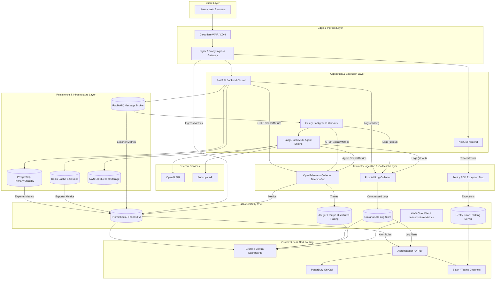

# ForgeAI Monitoring & Observability Architecture

This document defines the enterprise-grade **Monitoring, Observability, and Operational Reliability Architecture** for **ForgeAI**—an AI-powered software development platform designed to transform natural language project ideas into production-ready software blueprints via a distributed multi-agent orchestrator.

---

## 1. Monitoring Strategy

### 1.1 Goals
ForgeAI operates as a high-throughput, mission-critical SaaS platform processing thousands of complex software blueprint generations and multi-agent operations daily. The primary monitoring goals are:
- **99.95% System Availability**: Guarantee core API and rendering uptime across multi-region deployments.
- **Sub-Second Anomaly Detection**: Identify platform regressions, resource bottlenecks, and API failures within 5 seconds of inception.
- **Zero-Undetected AI Degradation**: Continuously monitor LLM provider latencies, agent loop stalls, context window overflows, and hallucination rates.
- **Rapid Mean Time to Detect (MTTD) & Respond (MTTR)**: Maintain MTTD < 1 minute and MTTR < 15 minutes for critical (P1) incidents.
- **Telemetry Transparency**: Provide unified operational visibility to Engineering, Product, Security, and Executive leadership.

### 1.2 Principles
- **Observability by Design**: Telemetry collection is natively embedded into codebases, infrastructure manifests, and multi-agent workflows—never added as an afterthought.
- **Single Pane of Glass**: Centralize logs, metrics, traces, and exception reports into unified Grafana and Sentry control planes.
- **Actionable Alerting**: Eliminate alert fatigue. Every alert fired must map directly to an automated runbook or require explicit human intervention.
- **Telemetry as Code**: All dashboards, alert rules, log parsing pipelines, and OpenTelemetry collector configurations are managed via GitOps and Terraform/Helm.
- **Low Overhead**: Telemetry agents and SDKs must consume < 1.5% of total system CPU/RAM and add < 5ms of HTTP latency overhead.

### 1.3 Reliability & High Availability
- **Multi-AZ Telemetry Core**: Deploy Prometheus (via Thanos), Loki, and Jaeger in multi-AZ configurations across AWS EKS to tolerate single-zone failures.
- **Buffering & Backpressure**: Implement local vector/Promtail agents with persistent disk buffering to prevent telemetry data loss during network partitions or backend ingestion bottlenecks.
- **Redundant Alerting**: Deploy AlertManager in a high-availability cluster with dual notification paths (PagerDuty + Webhooks to AWS SNS).

### 1.4 Fault Detection & Operational Visibility
- **Golden Signals Monitoring**: Track Latency, Traffic, Errors, and Saturation across all system boundaries.
- **AI-Specific Operational Signals**: Track Token Velocity (tokens/sec), Context Length Saturation, LLM Rate Limit Proximity, Agent Handoff Latency, and Blueprint Synthesis Error Rates.

---

## 2. Observability Architecture

### 2.1 The Four Pillars of Observability
ForgeAI leverages four interconnected telemetry pillars to achieve full system transparently:

```
+-----------------------------------------------------------------------------------+
|                                  FORGEAI PLATFORM                                 |
|   +------------------+    +-------------------+    +--------------------------+   |
|   |  Next.js Frontend|    |  FastAPI Backend  |    |  LangGraph Agent Engine  |   |
|   +--------+---------+    +---------+---------+    +------------+-------------+   |
+------------|------------------------|---------------------------|-----------------+
             |                        |                           |
             +------------------------+---------------------------+
                                      | (OpenTelemetry SDKs & Logging Drivers)
                                      v
+-----------------------------------------------------------------------------------+
|                            TELEMETRY COLLECTION LAYER                             |
|  +------------------------+  +-------------------------+  +--------------------+  |
|  | OpenTelemetry Collector|  |     Promtail / Vector   |  |     Sentry SDK     |  |
|  +-----------+------------+  +------------+------------+  +---------+----------+  |
+--------------|----------------------------|-------------------------|-------------+
               |                            |                         |
               v                            v                         v
+-----------------------------------------------------------------------------------+
|                             STORAGE & PROCESSING CORE                             |
|  +------------------------+  +-------------------------+  +--------------------+  |
|  |   Prometheus / Thanos  |  |       Grafana Loki      |  |   Jaeger / Tempo   |  |
|  |        (Metrics)       |  |          (Logs)         |  |      (Traces)      |  |
|  +-----------+------------+  +------------+------------+  +---------+----------+  |
+--------------|----------------------------|-------------------------|-------------+
               |                            |                         |
               +------------------------+   |   +---------------------+
                                        |   |   |
                                        v   v   v
+-----------------------------------------------------------------------------------+
|                           VISUALIZATION & ALERTING LAYER                          |
|  +-----------------------------------------------------------------------------+  |
|  |                            Grafana Enterprise UI                            |  |
|  +-------------------------------------+---------------------------------------+  |
|                                        |                                          |
|                                        v                                          |
|  +-----------------------------------------------------------------------------+  |
|  |                  AlertManager / PagerDuty / Sentry Console                  |  |
|  +-----------------------------------------------------------------------------+  |
+-----------------------------------------------------------------------------------+
```

1. **Metrics (Prometheus & Thanos)**: Quantitative real-time aggregations of system state (counters, gauges, histograms). Used for real-time alerting, autoscaling decisions, and capacity planning.
2. **Logs (Loki)**: Timestamped, structured JSON streams providing detailed contextual narratives of discrete execution steps across applications, infrastructure, queues, and AI agents.
3. **Traces (OpenTelemetry & Jaeger)**: End-to-end request lifecycle visualization capturing inter-service calls, multi-agent handoffs, database queries, and external LLM API spans.
4. **Events (AlertManager & EventBridge)**: Discrete state-change records (e.g., K8s pod evictions, CI/CD deployments, AI model fallbacks, circuit-breaker trips).

### 2.2 Telemetry Correlation Engine
To ensure rapid root-cause analysis, all four telemetry pillars share standard contextual header fields:
- `trace_id`: W3C compliant standard distributed trace identifier.
- `span_id`: Identifier for the current execution segment.
- `request_id`: Edge gateway request identifier.
- `tenant_id` / `user_id`: Organization and individual user identifiers.
- `blueprint_id`: Unique identifier for the specific code blueprint generation job.
- `agent_id` / `workflow_id`: Unique identifier for the executing LangGraph agent step.

---

## 3. Monitoring Architecture Diagram



---

## 4. Logging Strategy

ForgeAI standardizes logging across eleven dedicated operational streams to capture granular state without performance penalty:

### 4.1 Log Streams Breakdown
1. **Application Logs**: Execution flow within Next.js Node API routes and FastAPI background utilities.
2. **API Logs**: Ingress/egress HTTP request metadata, status codes, route latency, and request/response body sizes (excluding sensitive payloads).
3. **Authentication Logs**: Detailed security audit trail for user logins, OAuth handshakes, JWT generation/validation, token refreshes, and password resets.
4. **Database Logs**: PostgreSQL slow query logs (>200ms), lock acquisition timeouts, connection pool exhaustion events, and replication lag metrics.
5. **Queue Logs**: RabbitMQ and Celery task publishing, consumption, acknowledgement, execution duration, retries, and Dead Letter Queue (DLQ) routings.
6. **AI Agent Logs**: LangGraph state machine transitions, individual agent decision steps (Architect, Backend, Frontend, Database, Tester agents), tool execution parameters, and model fallback triggers.
7. **Workflow Logs**: End-to-end blueprint synthesis pipeline milestones, state checkpointing events, DAG execution branch results, and output generation stages.
8. **Security Logs**: Web Application Firewall (WAF) block events, RBAC authorization denials, rate-limit hits, prompt injection detection flags, and IP reputation blocks.
9. **Infrastructure Logs**: Kubernetes API server events, pod scheduling/eviction notices, node pressure warnings, and ingress controller access logs.
10. **Container Logs**: Unhandled stdout/stderr outputs emitted by Docker container entrypoints.
11. **Audit Logs**: Immutable record of administrative configurations, tenant access grants, billing plan modifications, and data deletion requests.

---

## 5. Log Levels

The platform enforces standardized log levels across Python, TypeScript, and Go infrastructure utilities:

| Log Level | Priority | Usage Criteria | Sample Event Types | Retention Period | Ingestion Target |
| :--- | :--- | :--- | :--- | :--- | :--- |
| **DEBUG** | 10 | Detailed diagnostic information required during development or deep operational troubleshooting. Disabled in production by default. | Detailed LLM prompt payloads, SQL query parameters, raw WebSocket frame data. | 3 Days | Loki (Transient / On-Demand) |
| **INFO** | 20 | Normal operational events tracking routine platform lifecycle milestones. | HTTP 200 responses, successful agent step executions, user authentication successes, Celery task completion. | 30 Days | Loki Storage |
| **WARNING** | 30 | Abnormal or unexpected events that do not disrupt current execution but signal potential performance or operational decay. | LLM API rate limit 80% threshold, DB connection pool utilization >80%, Celery task retries, cache misses. | 90 Days | Loki Storage + AlertManager (Warning) |
| **ERROR** | 40 | Runtime failures affecting specific requests or workflow steps. System continues operating but user experience is degraded. | LLM provider HTTP 5xx error, DB query timeout, Celery task failure post-retries, invalid blueprint syntax generation. | 180 Days | Loki Storage + Sentry + AlertManager (Critical) |
| **CRITICAL** | 50 | Severe failures causing overall system component unavailablity or data corruption risk. Immediate on-call escalation. | PostgreSQL primary failover, RabbitMQ node outage, total LLM provider blackout, out-of-memory container kills. | 365 Days | Loki Storage + Sentry + AlertManager (PagerDuty) |

---

## 6. Structured Logging

All logs emitted across the ForgeAI platform must be formatted as single-line JSON objects conforming to the platform schema. No unformatted text or multi-line stack traces are allowed on stdout.

### 6.1 Standard JSON Log Schema Structure
```json
{
  "timestamp": "2026-07-30T17:15:30.452912Z",
  "environment": "production-us-east-1",
  "service_name": "forgeai-agent-engine",
  "service_version": "v2.4.1",
  "host_name": "ip-10-0-34-112.ec2.internal",
  "pod_name": "agent-engine-worker-6789b9d799-x4klz",
  "log_level": "INFO",
  "trace_id": "4bf92f3577b34da6a3ce929d0e0e4736",
  "span_id": "00f067aa0ba902b7",
  "request_id": "req-9a8b7c6d5e-4321",
  "tenant_id": "org_enterprise_acme",
  "user_id": "usr_9988776655",
  "session_id": "sess_1122334455",
  "workflow_id": "wf_blueprint_8839201",
  "blueprint_id": "bp_react_fastapi_v9",
  "agent_id": "agent_architect_01",
  "agent_role": "Software Architect Agent",
  "execution_step": "evaluate_component_tree",
  "event_type": "llm_invocation_complete",
  "message": "Architect agent successfully synthesized backend domain model schema.",
  "duration_ms": 1420.5,
  "ai_metadata": {
    "provider": "Anthropic",
    "model": "claude-3-5-sonnet-20241022",
    "prompt_tokens": 3420,
    "completion_tokens": 850,
    "total_cost_usd": 0.02301,
    "temperature": 0.2,
    "finish_reason": "end_turn"
  },
  "context": {
    "http_method": "POST",
    "http_path": "/api/v1/blueprints/generate",
    "client_ip": "198.51.100.45"
  }
}
```

---

## 7. Metrics Collection

Metrics are collected via OpenTelemetry Prometheus exporters, infrastructure sidecars, and cloud integrations. They are categorized into seven operational domains:

```
+------------------------------------------------------------------------------------+
|                               METRICS TAXONOMY                                    |
+------------------+------------------+------------------+---------------------------+
| Infrastructure   | Application      | Queue & Async    | AI & Multi-Agent          |
| - CPU / Memory   | - HTTP Rate (RPS)| - Queue Depth    | - Token Throughput/Sec    |
| - Disk I/O       | - Latency (p99)  | - Unacked Count  | - Model Latency Breakdown |
| - Network Sat.   | - HTTP 4xx/5xx   | - Worker Utilization - Token Spend / Tenant    |
| - K8s Restarts   | - Active Websockets - DLQ Velocity   | - Hallucination Rate      |
+------------------+------------------+------------------+---------------------------+
| Database & Cache | Security         | Business & Product                           |
| - DB Conn Pool   | - Auth Failures  | - Daily Active Users (DAU)                |
| - Query Latency  | - WAF Blocks     | - Blueprints Generated / Hour             |
| - Cache Hit %    | - Rate Limits    | - Blueprint Synthesis Success Rate (%)    |
| - Replication Lag| - Injection Flags| - MRR & AI Token Margin %                 |
+------------------+------------------+--------------------------------------------+
```

### 7.1 Detailed Metrics Breakdown Table

| Domain | Metric Name | Type | Labels / Dimensions | Target SLI Threshold |
| :--- | :--- | :--- | :--- | :--- |
| **Infrastructure** | `container_cpu_usage_seconds_total` | Counter | `pod`, `container`, `node` | < 75% allocated limit |
| | `container_memory_working_set_bytes` | Gauge | `pod`, `container`, `node` | < 80% allocated limit |
| | `kube_pod_container_status_restarts_total`| Counter | `pod`, `namespace` | 0 per hour |
| **Application** | `http_requests_total` | Counter | `method`, `handler`, `status` | N/A (Volume indicator) |
| | `http_request_duration_seconds` | Histogram | `method`, `handler` | p95 < 200ms, p99 < 500ms |
| | `fastapi_active_connections` | Gauge | `worker_id` | < 800 per worker |
| **Queue** | `rabbitmq_queue_messages` | Gauge | `queue_name` | < 500 pending tasks |
| | `celery_task_runtime_seconds` | Histogram | `task_name` | p95 < 45s (AI workflows) |
| | `celery_dead_letter_count_total` | Counter | `queue_name`, `exception` | 0 failures |
| **AI Operations**| `forgeai_llm_tokens_total` | Counter | `provider`, `model`, `type` | N/A (Billing metric) |
| | `forgeai_llm_request_duration_seconds` | Histogram | `provider`, `model`, `agent_role`| p90 < 4.0s |
| | `forgeai_agent_step_execution_seconds` | Histogram | `agent_role`, `step_name` | p90 < 8.0s |
| | `forgeai_llm_failure_total` | Counter | `provider`, `error_code` | < 0.5% total requests |
| **Database** | `pg_stat_activity_count` | Gauge | `state`, `datname` | < 80% connection pool |
| | `pg_slow_queries_total` | Counter | `query_hash` | < 5 queries > 200ms / min |
| **Cache** | `redis_keyspace_hits_total` | Counter | `db` | Hit ratio > 90% |
| | `redis_connected_clients` | Gauge | `instance` | < 80% max connections |
| **Business** | `forgeai_blueprints_generated_total` | Counter | `tenant_type`, `status` | > 98% success rate |
| | `forgeai_active_users_current` | Gauge | `plan_tier` | Track growth |

---

## 8. Distributed Tracing

ForgeAI utilizes OpenTelemetry (OTel) standards for distributed tracing across Next.js, FastAPI, Celery, and multi-agent LangGraph orchestrators.

### 8.1 Trace Context Propagation
Context propagation across network and asynchronous boundaries follows the W3C Trace Context standard:
- `traceparent`: `00-4bf92f3577b34da6a3ce929d0e0e4736-00f067aa0ba902b7-01`
- `tracestate`: `congo=ucode:1,forgeai=tenant:acme`

Propagation occurs automatically via:
- Outbound HTTP headers generated by Next.js and FastAPI HTTP clients.
- Celery Task Message Metadata headers during job dispatch.
- LangGraph state dict propagation during agent handoffs.

### 8.2 End-to-End Span Hierarchy Example

```
[ Root Span ] HTTP POST /api/v1/blueprints/generate (FastAPI Ingress Gateway) [22.4s]
 │
 ├── [ Child Span ] Auth Middleware: Validate JWT & Tenant Quota [12ms]
 ├── [ Child Span ] DB: Read User & Tenant Profile (PostgreSQL) [8ms]
 ├── [ Child Span ] Redis: Check Rate Limit (Sliding Window) [3ms]
 ├── [ Child Span ] Queue Dispatch: Enqueue Workflow Task (RabbitMQ) [5ms]
 │
 └── [ Worker Span ] Celery Task: Execute Blueprint Pipeline [22.35s]
      │
      ├── [ Agent Span ] LangGraph Orchestrator Execution [22.30s]
      │    │
      │    ├── [ Agent Step ] Requirements Analysis Agent [3.10s]
      │    │    └── [ LLM Span ] Anthropic Messages API (Claude 3.5 Sonnet) [3.05s]
      │    │
      │    ├── [ Agent Step ] Software Architect Agent [6.40s]
      │    │    ├── [ LLM Span ] OpenAI Chat Completions (GPT-4o) [6.10s]
      │    │    └── [ Tool Span ] Validate System Architecture Diagram [250ms]
      │    │
      │    ├── [ Agent Step ] Parallel Code Generation Sub-Graph [10.50s]
      │    │    ├── [ Parallel Child ] Backend Code Agent -> LLM Call [9.80s]
      │    │    └── [ Parallel Child ] Frontend Code Agent -> LLM Call [10.10s]
      │    │
      │    └── [ Agent Step ] Synthesis & Verification Agent [2.10s]
      │         ├── [ Tool Span ] AST Code Validator [180ms]
      │         └── [ Storage Span ] Save Package to S3 Bucket [450ms]
      │
      └── [ DB Span ] DB: Update Blueprint Status to COMPLETED [15ms]
```

---

## 9. Dashboards

ForgeAI mandates eight specialized Grafana operational dashboards:

```
+-----------------------------------------------------------------------------------+
|                            GRAFANA DASHBOARD SUITE                                |
+-----------------------+-----------------------+-----------------------------------+
| 1. Executive          | 2. DevOps             | 3. Backend                        |
| Global Health, SLA,   | K8s Cluster, Pods,    | FastAPI Latency, RPS,             |
| DAU, Revenue/Cost     | Ingress, Nodes        | Error 5xx, DB Pool                |
+-----------------------+-----------------------+-----------------------------------+
| 4. AI & Agent Engine  | 5. Security           | 6. Database                       |
| LLM Latency, Tokens,  | Auth Failures, WAF,   | Postgres IOPS, Locks,             |
| Agent Handoff, Costs  | Prompt Injection Flags| Slow Queries, Replication         |
+-----------------------+-----------------------+-----------------------------------+
| 7. Infrastructure     | 8. Business & Product |                                   |
| AWS EC2/EKS, S3,      | Blueprints/Hr,        |                                   |
| ElastiCache, RabbitMQ | Success Rate %, MRR   |                                   |
+-----------------------+-----------------------+-----------------------------------+
```

### 9.1 Dashboard Specifications

#### 1. Executive Dashboard
- **Purpose**: High-level platform health, availability, business metrics, and AI burn rate for leadership.
- **KPIs**: Platform Availability % (Target 99.95%), Daily Active Users, Total Blueprints Today, Current Month AI Spend, System Global Error Rate.
- **Charts**: 30-Day Availability SLA Gauge, Real-Time Active Blueprint Workflows, Daily AI Provider Spend Stacked Area Chart, User Signups vs Churn Trend.
- **Alerts**: SLA drop below 99.9%, daily AI budget threshold warning.

#### 2. DevOps Dashboard
- **Purpose**: Real-time infrastructure utilization, container states, and deployment stability across EKS clusters.
- **KPIs**: Cluster CPU/RAM Saturation %, Pod Restart Count (Last 1h), Ingress Error Rate %, Deployment Status.
- **Charts**: CPU/Memory Utilization per Node Heatmap, Pod Restart Counter by Namespace, Ingress Request Rate vs Latency p99, Network I/O Saturation.
- **Alerts**: Node CPU > 85%, Container OOMKilled events.

#### 3. Backend Dashboard
- **Purpose**: FastAPI application performance, internal routing, and queue execution efficiency.
- **KPIs**: API Ingress RPS, p50/p95/p99 HTTP Response Latency, HTTP 5xx Rate %, Active Celery Workers.
- **Charts**: Request Throughput by Endpoint Stacked Bar, HTTP Status Code Distribution (2xx vs 4xx vs 5xx), Celery Task Execution Time Histogram, Worker CPU Saturation.
- **Alerts**: API 5xx Rate > 1% over 5 minutes, p99 Latency > 2.0s.

#### 4. AI & Agent Dashboard
- **Purpose**: Operational deep-dive into LLM providers, multi-agent execution loops, and AI generation quality.
- **KPIs**: Total Tokens Consumed/Min, LLM Provider Average Response Time, Agent Execution Failure Rate %, Token Spend Per Blueprint.
- **Charts**: LLM Response Latency by Provider (OpenAI vs Anthropic), Token Velocity (Prompt vs Completion), Agent Execution Handoff Time Breakdown, LLM HTTP 429/503 Rate.
- **Alerts**: LLM Provider Error Rate > 2%, Agent Loop Stall (>60s without state change).

#### 5. Security Dashboard
- **Purpose**: Threat monitoring, access control verification, and prompt injection defense monitoring.
- **KPIs**: Failed Authentication Rate/Min, WAF Block Count, Prompt Injection Detections, Active Admin Sessions.
- **Charts**: Failed Logins by IP / Geo Map, Prompt Injection Flag Triggers Over Time, Rate-Limit Hit Distribution, API Key Usage Anomalies.
- **Alerts**: >10 Failed Logins/Min from single IP, Detected Prompt Injection Attempt in Enterprise Tenant.

#### 6. Database Dashboard
- **Purpose**: PostgreSQL storage engine, connection pooler, and Redis cache operational visibility.
- **KPIs**: Database Active Connections %, Buffer Cache Hit Ratio %, Slow Query Velocity (>200ms), Redis Memory Saturation.
- **Charts**: PostgreSQL Connection Pool Utilization Gauge, Query Execution Time p95/p99 Trend, Transaction Commit vs Rollback Rate, Redis Hit vs Miss Ratio.
- **Alerts**: PostgreSQL Connection Pool > 85%, Cache Hit Ratio < 80%.

#### 7. Infrastructure Dashboard
- **Purpose**: Core cloud layer health across AWS services (EKS, RDS, ElastiCache, S3, RabbitMQ).
- **KPIs**: AWS EBS IOPS Saturation, S3 API Latency, RabbitMQ Queue Message Depth, ElastiCache CPU Utilization.
- **Charts**: RabbitMQ Queue Depth Stacked by Queue Name, S3 Read/Write Throughput, NAT Gateway Egress Bandwidth, ElastiCache Engine CPU.
- **Alerts**: RabbitMQ Queue Depth > 1000 messages, S3 Error Rate > 0.1%.

#### 8. Business & Product Dashboard
- **Purpose**: Tracking feature adoption, blueprint generation success, customer usage patterns, and unit economics.
- **KPIs**: Blueprint Synthesis Success Rate %, Average Blueprint Generation Time, Active User Sessions, Margin per Blueprint ($).
- **Charts**: Blueprints Generated per Hour grouped by Tech Stack (React, Next.js, FastAPI), Blueprint Completion Status Breakdown (Success, User Cancelled, System Failed), AI Cost vs Subscription Revenue Ratio.
- **Alerts**: Blueprint Generation Failure Rate > 3% over 15 minutes.

---

## 10. Alerting Strategy

### 10.1 Severity Classification Matrix

```
                          ALERT ESCALATION FLOW
                          
   [ Prometheus / Loki / Sentry ]
                 |
                 v
         [ AlertManager ]
                 |
  +--------------+--------------+-----------------+-------------------+
  |                             |                 |                   |
  v (Severity: Info)            v (Warning)       v (Critical)        v (Emergency)
[ Log Store Only ]        [ Slack/Teams ]   [ PagerDuty On-Call ]  [ PagerDuty + SMS ]
                          (15 Min Response)  (5 Min Response)     (Immediate Escalation)
```

| Severity Level | Response SLA | Notification Channels | Example Triggers | Automated Action |
| :--- | :--- | :--- | :--- | :--- |
| **INFO** | No Action Required | Log Store / Grafana Annotations | Scheduled CI/CD build deployment, Auto-scaling event triggered. | Record event in audit log. |
| **WARNING** | 15 Minutes (Business Hours) | Slack `#ops-warnings`, Microsoft Teams | Disk usage >75%, Celery queue depth >300, LLM rate limit 80% reached. | Auto-expand transient caches, trigger secondary worker warmups. |
| **CRITICAL** | 5 Minutes (24/7 On-Call) | PagerDuty (Voice/SMS), Slack `#ops-critical` | API 5xx rate >2%, PostgreSQL Primary pool >90%, Agent failure rate >5%. | Route traffic to degraded mode fallback, trigger pod autoscaling. |
| **EMERGENCY**| Immediate (All-Hands) | PagerDuty Severe Escalation, SMS, Phone Call | Total system outage, Multi-region failure, Active security breach / data leak. | Isolate affected cluster, trigger multi-region DB failover. |

### 10.2 Alert Management Rules
- **Deduplication**: AlertManager groups identical alerts by `alertname`, `service`, and `tenant_id` within a 5-minute window to eliminate notification storms.
- **Silencing**: Maintenance windows automatically apply silencers via GitOps pipeline tags prior to planned upgrades.
- **Flapping Control**: An alert must maintain its error threshold state for at least 3 consecutive scraping intervals before firing.

---

## 11. Health Checks

ForgeAI implements tiered health check probes across applications, background routines, and Kubernetes pods:

```
+------------------------------------------------------------------------------------+
|                                HEALTH CHECK TIERS                                  |
+--------------------------+----------------------------+----------------------------+
| 1. Liveness Probe        | 2. Readiness Probe         | 3. Deep Startup Probe      |
| Endpoint: /health/live   | Endpoint: /health/ready    | Endpoint: /health/deep     |
| Checks: Process run state| Checks: Local dependencies | Checks: Full ecosystem     |
| Purpose: K8s restart trigger| Purpose: Router traffic target| Purpose: Boot completion |
+--------------------------+----------------------------+----------------------------+
```

### 11.1 Subsystem Health Check Specifications

| Component | Probe Method | Target Verification Criteria | Failure Action |
| :--- | :--- | :--- | :--- |
| **API Gateway** | HTTP `GET /health/live` | Ingress process responding on HTTP 80/443. | K8s restarts container. |
| **FastAPI App** | HTTP `GET /health/ready` | Verifies DB connection pool & local Redis ping. | Removes pod from K8s Endpoints. |
| **PostgreSQL** | SQL `SELECT 1;` | Database accepts connections and executes read within 50ms. | Triggers DB alert / Standby failover. |
| **Redis Cache** | Command `PING` | Redis responds with `PONG` within 10ms. | Bypasses cache / routes reads to DB. |
| **RabbitMQ** | API `GET /api/aliveness-test` | Message broker successfully publishes and consumes test frame. | Restarts broker pod / alerts on-call. |
| **AI Providers** | Synthetic Token Ping | Lightweight API check to OpenAI/Anthropic models within 1.5s. | Trips Circuit Breaker to secondary provider. |
| **S3 Storage** | Head Bucket Check | Validates IAM credentials and S3 read/write availability. | Alerts infrastructure team. |
| **Celery Workers**| Celery Ping Signal | Workers acknowledge heartbeat within 5 seconds. | Terminates stuck worker process. |

### 11.2 Kubernetes Probe Configuration Standard
```yaml
livenessProbe:
  httpGet:
    path: /health/live
    port: 8000
  initialDelaySeconds: 5
  periodSeconds: 10
  timeoutSeconds: 2
  failureThreshold: 3
readinessProbe:
  httpGet:
    path: /health/ready
    port: 8000
  initialDelaySeconds: 10
  periodSeconds: 5
  timeoutSeconds: 3
  failureThreshold: 2
startupProbe:
  httpGet:
    path: /health/deep
    port: 8000
  initialDelaySeconds: 10
  periodSeconds: 10
  failureThreshold: 12
```

---

## 12. AI Observability

Specialized observability for the multi-agent AI pipeline addresses non-deterministic LLM behavior, multi-agent loops, context windows, and API operational costs:

```
+------------------------------------------------------------------------------------+
|                               AI OBSERVABILITY CORE                                |
+------------------------------------------------------------------------------------+
|  1. Prompt Execution & Latency (Time-To-First-Token, Generation Speed, Timeout)    |
|  2. Dynamic Model Fallback Tracking (Primary LLM -> Secondary LLM failovers)       |
|  3. Hallucination & AST Validation (Code Syntax Completeness Checks)                |
|  4. Multi-Agent Loop Tracking (Handoff Latency, Deadlock Detection, Retry Counts)  |
|  5. Context Window Utilization (% Max Tokens Used, Truncation Alerting)            |
|  6. Real-Time Unit Economics (Token Cost / Blueprint Generation)                   |
+------------------------------------------------------------------------------------+
```

### 12.1 Key AI Observability Tracking Mechanisms
- **Time-to-First-Token (TTFT)**: Tracks stream initialization speed (Target: < 800ms).
- **Token Velocity**: Measures completion generation throughput (Target: > 35 tokens/sec).
- **Agent Handoff Latency**: Measures inter-agent communication overhead within LangGraph DAG execution.
- **Context Window Saturation**: Triggers warnings when prompt token count exceeds 85% of model context limits (e.g., 100k tokens), preventing context truncation errors.
- **Hallucination & Syntax Failure Detection**: Automated AST (Abstract Syntax Tree) code parsers evaluate LLM output code blocks. Syntax parsing errors increment `forgeai_code_syntax_error_total` and trigger automated agent self-correction loops.
- **Model Fallback Engine**: Tracks circuit breaker trips from OpenAI (GPT-4o) to Anthropic (Claude 3.5 Sonnet) upon HTTP 429 (Rate Limit) or 503 (Overloaded) responses.

---

## 13. Security Monitoring

Real-time security telemetry monitors threats, user access anomalies, and prompt security across the platform:

```
+------------------------------------------------------------------------------------+
|                           SECURITY MONITORING DOMAINS                              |
+-------------------+--------------------+--------------------+----------------------+
| Authentication    | Edge & WAF         | AI & Prompt Safety | Data Compliance      |
| - Brute Force     | - DDoS Rate Limits | - Injection Detection - Secrets Leak Scan   |
| - JWT Refresh Hits| - Geo-IP Blocks    | - Jailbreak Flags  | - Audit Trail Record |
| - RBAC Failures   | - Credential Stuff | - Token Abuse      | - Unauthorized S3    |
+-------------------+--------------------+--------------------+----------------------+
```

### 13.1 Critical Security Metrics & Detection Rules
- **Brute Force & Credential Stuffing**: Alerts when >5 failed login attempts occur within 60 seconds from a single IP or targeting a single user account.
- **Prompt Injection Defense**: Evaluates incoming plain-English project prompts using vector-based injection classifiers. Injection flags trigger immediate HTTP 400 responses and log events to Loki with `security_flag: prompt_injection`.
- **Secrets Exfiltration Scanner**: Scans generated blueprint code streams for inadvertent API keys, AWS credentials, or hardcoded tokens prior to delivering code packages to S3/Users.
- **JWT Anomaly Detection**: Monitors abnormal token refresh velocities (e.g., single refresh token used concurrently across multiple geographically distant IPs).

---

## 14. Error Tracking

ForgeAI integrates Sentry for real-time application crash reporting and exception lifecycle management.

```
+------------------------------------------------------------------------------------+
|                           SENTRY ERROR PIPELINE                                    |
|                                                                                    |
| [ Application Crash / Exception ] --> [ Sentry SDK Capture & Scrubbing ]           |
|                                                     |                              |
| [ Slack Notification ] <-- [ Issue Grouping & Fingerprint ] <-- [ Source Map Match ]|
+------------------------------------------------------------------------------------+
```

### 14.1 Error Management Workflow
- **Automated Source Map Resolution**: GitHub Actions uploads release-tagged JavaScript source maps to Sentry during build deployment, enabling unminified client-side Next.js stack traces.
- **Context Sanitization**: Sentry SDK scrubbers strip sensitive headers (`Authorization: Bearer`), user passwords, and credit card numbers before transmission.
- **Custom Issue Fingerprinting**: Exceptions are grouped by root cause rather than transient wrapper messages:
  - `{{ default }}` + `{{ exception.values[0].stacktrace.frames[-1].function }}`
  - Grouping rule for LLM provider timeouts: `[LLM_TIMEOUT] - {{ provider_name }}`
- **Regression Detection**: Automatic notification fired if an issue marked as "Resolved" re-appears in a newer Git commit SHA deployment.

---

## 15. Incident Management

### 15.1 Incident Lifecycle Flow

```
[ 1. DETECTION ] ----> [ 2. ACKNOWLEDGEMENT ] ----> [ 3. INVESTIGATION ]
Prometheus / AlertManager    On-Call Ack via PagerDuty    Grafana / Loki / Jaeger
                                                                   |
[ 6. POSTMORTEM / RCA ] <--- [ 5. RECOVERY ] <-------- [ 4. MITIGATION ]
Blameless RCA Document       Validation & Health Check    Fallback / Circuit Breaker
```

### 15.2 Incident Severity Matrix & Communication Standards

| Severity | Operational Criteria | Customer Communication Channel | Update Frequency | Postmortem Required |
| :--- | :--- | :--- | :--- | :--- |
| **P1 - Catastrophic** | Total core platform outage, data loss risk, critical security breach. | Public Status Page (`status.forgeai.com`) + In-App Banner | Every 15 Minutes | Mandatory within 48 Hours |
| **P2 - High** | Degradation of AI generation engine, single region failure, high error rates. | Public Status Page + Email to Enterprise Tier | Every 30 Minutes | Mandatory within 5 Business Days |
| **P3 - Medium** | Non-critical feature disruption (e.g., export to ZIP failing), minor dashboard latency. | In-App System Notice | Every 2 Hours | Optional (SRE Discretion) |
| **P4 - Low** | Minor cosmetic UI glitch, background reporting delay. | None (Internal Tracking Only) | N/A | Not Required |

---

## 16. SLA / SLO / SLI

Service Level Agreements (SLA), Objectives (SLO), and Indicators (SLI) for ForgeAI:

| Category | Service Level Indicator (SLI) | Target SLO | Customer SLA | Disaster Recovery Target |
| :--- | :--- | :--- | :--- | :--- |
| **Platform Uptime** | Ratio of HTTP 2xx/3xx/4xx responses vs 5xx on Edge Ingress over 30 days. | **99.95%** Uptime | **99.9%** Uptime | RTO < 15 Mins<br>RPO < 5 Mins |
| **API Latency** | Percentage of non-AI HTTP requests completed in < 200ms. | **95.0%** of Requests | **90.0%** of Requests | N/A |
| **Blueprint Generation Speed**| End-to-end execution duration of standard software blueprint workflows. | **90.0%** in < 45s | **85.0%** in < 60s | N/A |
| **Blueprint Generation Quality**| Percentage of generated project blueprints that compile & pass syntax checks. | **98.0%** Success Rate | **95.0%** Success Rate | N/A |
| **Database Reliability**| Ratio of successful PostgreSQL query transactions. | **99.99%** Success Rate | N/A | RPO < 5 Mins |
| **Error Rate** | Proportion of HTTP 500 errors across all platform microservices. | **< 0.05%** of Requests | **< 0.1%** of Requests | N/A |

---

## 17. Capacity Planning & Forecasting

Capacity planning relies on automated Prometheus metric analysis to predict resource utilization and trigger proactive autoscaling:

```
+------------------------------------------------------------------------------------+
|                         CAPACITY SCALING TRIGGERS                                  |
+--------------------+---------------------+-------------------+---------------------+
| FastAPI Pods       | Celery AI Workers   | PostgreSQL Storage| RabbitMQ Broker     |
| Scale on CPU >70%  | Scale on Queue      | Scale Storage on  | Scale Cluster on    |
| or Latency >300ms  | Depth > 50 Tasks    | Disk Free < 20%   | Memory > 70%        |
+--------------------+---------------------+-------------------+---------------------+
```

### 17.1 Infrastructure Scaling Thresholds
- **Horizontal Pod Autoscaler (HPA)**:
  - FastAPI Nodes: Scale up when target CPU > 70% or HTTP Request Latency p95 > 300ms.
  - Celery Worker Nodes: Scale up based on custom metric `rabbitmq_queue_messages_unacknowledged` (>50 tasks pending).
- **Database Capacity Management**: AWS RDS Storage Auto-scaling triggers when free storage space falls below 20%. Connection poolers (pgBouncer) dynamically scale based on active thread limits.
- **AI Quota Capacity Forecasting**: Automated cron daily script analyzes 14-day token consumption velocity to request upstream rate-limit quota increases from OpenAI/Anthropic 2 weeks prior to saturation.

---

## 18. Cost Monitoring & Optimization

ForgeAI enforces real-time cost attribution to maintain healthy gross margins across AI-heavy workloads:

```
+------------------------------------------------------------------------------------+
|                             COST CONTROL ARCHITECTURE                              |
|                                                                                    |
| [ Telemetry Ingestion ] --> [ Extract Token & Cloud Metrics ]                      |
|                                     |                                              |
| [ Daily Margin Reports ] <-- [ Calculate Unit Cost / Tenant ]                      |
|                                     |                                              |
| [ Trigger Cost Anomaly Alert ] <--- [ Compare Against Tenant Monthly Ceiling ]     |
+------------------------------------------------------------------------------------+
```

### 18.1 Cost Attribution & Tracking Strategies
- **Granular Token Spend Tracking**: Every LLM request captures exact prompt and completion token counts tagged with `tenant_id`, `blueprint_id`, and `agent_role`.
- **Infrastructure Cost Tagging**: All AWS resources (EC2, EKS, RDS, S3, ElastiCache) inherit mandatory Terraform cost allocation tags: `Environment`, `Owner`, `Component`, `CostCenter`.
- **Cost Optimization Best Practices**:
  - **Prompt Caching**: Cache common system prompts and architectural boilerplate schemas in Redis to avoid redundant LLM prompt token costs (estimated 30% savings).
  - **Dynamic LLM Routing**: Route simple tasks (e.g., formatting output, basic syntax checks) to lightweight models (Claude 3.5 Haiku / GPT-4o-mini) while reserving premium models (Claude 3.5 Sonnet / GPT-4o) for core architecture design.
  - **AWS Spot Instances**: Deploy non-critical background verification Celery workers on AWS EKS Spot Instance node groups, reducing compute costs by up to 60%.

---

## 19. Disaster Monitoring & Failover Guidance

Operational monitoring protocol during catastrophic component failures:

```
+------------------------------------------------------------------------------------+
|                         DISASTER FAILOVER PROTOCOLS                                |
+------------------------+-------------------------+---------------------------------+
| Failure Mode           | Primary Circuit Action  | Fallback & Monitoring Target    |
+------------------------+-------------------------+---------------------------------+
| 1. Primary DB Outage   | RDS Automatic Failover  | Monitor Standby Promotion &     |
|                        | to Read Replica         | Connection Pool Re-Attach       |
+------------------------+-------------------------+---------------------------------+
| 2. Redis Cache Outage  | Cache Bypass Mode       | Monitor Postgres Load &         |
|                        | (Direct DB Fallback)    | Read Latency Spikes             |
+------------------------+-------------------------+---------------------------------+
| 3. Primary LLM Blackout| Trip Circuit Breaker    | Route AI Workflows to Secondary |
|                        | (OpenAI -> Anthropic)   | Model Provider & Track Token %  |
+------------------------+-------------------------+---------------------------------+
| 4. AWS Regional Outage | Route53 DNS Failover to | Monitor Cross-Region DB Sync &  |
|                        | Secondary AWS Region    | S3 Multi-Region Replication     |
+------------------------+-------------------------+---------------------------------+
```

### 19.1 Recovery Verification Checklist
Post-failover monitoring routines automatically execute automated integration tests to confirm state convergence before re-enabling standard edge ingress routing:
1. Validate database write-read consistency via synthetic test insert.
2. Confirm message broker queue consumption state.
3. Perform synthetic end-to-end blueprint generation check.
4. Clear Edge WAF circuit breakers.

---

## 20. Enterprise Best Practices

Below are 45 enterprise-grade observability and operational reliability best practices for AI-powered SaaS platforms:

### 20.1 Observability Infrastructure & Code (1–9)
1. **Never Log Sensitive Data**: Strip passwords, JWT tokens, PII, and raw credit card data at the collector layer before log persistence.
2. **Standardize Trace Header Propagation**: Enforce W3C Trace Context headers across all HTTP, gRPC, and message queue boundaries.
3. **Use Structural JSON Logging**: Emit single-line JSON formatted logs across all services to enable high-efficiency parsing in Loki.
4. **Treat Telemetry as Code**: Version-control all Prometheus alert rules, Grafana dashboards, and OpenTelemetry pipelines in Git.
5. **Enforce Low Observability Overhead**: Limit telemetry instrumentation CPU and RAM overhead to under 1.5% of total application budget.
6. **Implement Local Buffering**: Deploy node-level log collectors (Vector/Promtail) with disk-backed buffers to survive collector outages.
7. **Maintain High Availability Telemetry Stores**: Run Prometheus/Thanos and Grafana Loki in multi-AZ configurations.
8. **Decouple Metric Ingestion from Storage**: Utilize Thanos or Cortex to enable long-term metric storage and historical query analysis.
9. **Automate Dashboard Provisioning**: Automatically provision Grafana dashboards upon deployment via Terraform or GitOps operators.

### 20.2 AI & Multi-Agent Observability (10–18)
10. **Track Token Velocity**: Measure Time-to-First-Token (TTFT) and Generation Tokens-per-Second across all LLM calls.
11. **Monitor Context Window Saturation**: Fire warning alerts when prompt token counts reach 85% of LLM maximum context limits.
12. **Log Agent State Machine Transitions**: Record every state handoff, decision step, and tool execution in multi-agent workflows.
13. **Track Real-Time Unit Economics**: Tag every LLM API call with tenant, user, and workflow IDs to measure per-blueprint token costs.
14. **Implement Automated Code AST Validation**: Parse AI-generated code snippets using AST tools to track hallucination and syntax error rates.
15. **Monitor LLM Provider Fallbacks**: Alert when primary LLM providers fail over to secondary providers due to rate limits or outages.
16. **Track Prompt Injection Flags**: Log and alert on plain-English prompt injection attempts detected at the edge.
17. **Measure Agent Loop Latency**: Alert when an AI agent loop exceeds execution time limits without advancing workflow state.
18. **Scan AI Outputs for Secrets Exfiltration**: Automatically scan generated code outputs for inadvertent hardcoded API keys or credentials.

### 20.3 Metrics & Alert Hygiene (19–27)
19. **Focus on Golden Signals**: Base primary operational alerting on Latency, Traffic, Errors, and Saturation.
20. **Eliminate Alert Fatigue**: Ensure every critical alert maps directly to an actionable runbook or automated response.
21. **Implement Alert Deduplication**: Configure AlertManager to group duplicate alerts within a 5-minute window.
22. **Use Dynamic Histograms for Latency**: Track p50, p90, p95, and p99 latencies using Prometheus histograms instead of simple averages.
23. **Require Flapping Control**: Require alerts to maintain error thresholds across at least 3 consecutive scraping cycles before firing.
24. **Enforce Escalation Policies**: Automatically escalate unacknowledged Critical alerts to secondary on-call engineers after 10 minutes.
25. **Tie Alerts to Automated Runbooks**: Embed clickable runbook URLs directly inside alert notifications sent to Slack or PagerDuty.
26. **Schedule Automatic Maintenance Silences**: Silence alerts automatically during planned GitOps deployment windows.
27. **Conduct Monthly Alert Audits**: Review and prune low-value or non-actionable alerts on a monthly basis.

### 20.4 Logging & Security Observability (28–36)
28. **Enforce Log Retention Schedules**: Apply tiered log retention policies (e.g., DEBUG 3 days, INFO 30 days, ERROR 180 days).
29. **Audit All Security Access Events**: Maintain an immutable, long-term audit trail of administrative access and policy changes.
30. **Monitor Rate-Limit Proximity**: Alert when tenants consume >80% of their allocated API rate limits to prevent unexpected throttling.
31. **Track Abnormal Auth Volatility**: Trigger alerts on spikes in failed login attempts, password resets, or abnormal JWT refresh patterns.
32. **Use Distributed Fingerprinting in Error Tracking**: Standardize exception fingerprinting in Sentry to avoid issue fragmentation.
33. **Upload Deployment Source Maps**: Automatically upload JavaScript source maps during CI/CD to ensure clean client-side stack traces.
34. **Correlate Exception Reports with Trace IDs**: Embed OpenTelemetry `trace_id` values into all Sentry error events.
35. **Monitor Network Security Perimeter**: Track drop rates, WAF rule blocks, and suspicious payload flags at the edge gateway.
36. **Sanitize Stack Traces**: Ensure stack traces emitted to public API endpoints do not reveal internal database schemas or file paths.

### 20.5 Operational Excellence & Disaster Resilience (37–45)
37. **Perform Regular Chaos Testing**: Conduct scheduled fault-injection exercises (e.g., terminating pods, injecting network latency) to test observability systems.
38. **Enforce Mandatory Blameless Postmortems**: Require formal postmortems for all P1/P2 incidents within 48 hours.
39. **Automate Pod Health Probes**: Configure Liveness, Readiness, and Startup probes for every container running in Kubernetes.
40. **Establish Explicit SLOs**: Maintain clear SLO targets for Availability, Latency, and Error Rates, and report on error budgets weekly.
41. **Track Capacity Limits Proactively**: Set scaling triggers based on peak usage projections rather than static thresholds.
42. **Implement Circuit Breakers**: Use circuit breakers around external LLM APIs and databases to prevent cascading failures.
43. **Validate Backup & Restore Telemetry**: Continuously monitor and alert on backup job completion and cross-region replication lag.
44. **Maintain Offline Documentation Access**: Ensure incident response runbooks and architecture docs are cached offline and accessible during total AWS outages.
45. **Regularly Review Telemetry Spend**: Audit logging and metric storage costs to ensure observability spend stays under 10% of total cloud infrastructure expenditure.
