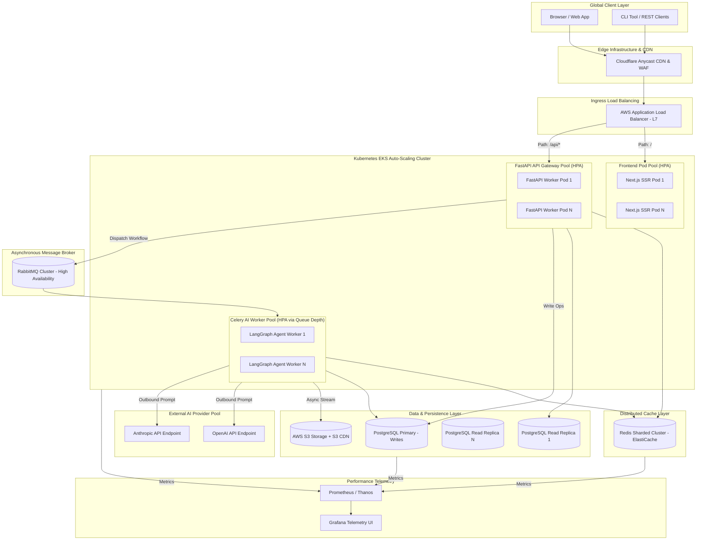

# ForgeAI Performance & Scalability Architecture

This document defines the enterprise-grade **Performance & Scalability Architecture** for **ForgeAI**—an AI-powered software development platform designed to transform natural language project ideas into complete, production-ready software blueprints via a distributed multi-agent orchestrator.

---

## 1. Performance Objectives

### 1.1 Performance Vision
ForgeAI is engineered to deliver low-latency, high-throughput, horizontally scalable software creation capabilities. The platform converts natural language project specifications into verified code blueprints, system diagrams, database schemas, and unit test suites in real time, maintaining consistent performance even under heavy platform load.

### 1.2 Scalability Goals
- **5,000+ Concurrent Blueprint Generation Workflows**: Support thousands of active, multi-agent AI execution loops simultaneously without queue starvation or worker degradation.
- **50,000+ Concurrent Active User Sessions**: Maintain sub-second responsiveness across the Next.js web application during peak global traffic.
- **1,000+ API Requests Per Second (RPS)**: Process ingress REST, GraphQL, and WebSocket API requests with sub-100ms processing overhead.
- **Elastic Compute Scaling**: Automatically scale backend compute clusters from 10 to 1,000+ container instances within 3 minutes during sudden traffic spikes.

### 1.3 User Experience Goals
- **First Contentful Paint (FCP)**: < 0.8 seconds globally via CDN edge distribution.
- **Time to Interactive (TTI)**: < 1.2 seconds for Next.js web application views.
- **Real-Time Token Streaming**: < 100ms frame-delivery latency for WebSocket and Server-Sent Events (SSE) streaming AI code tokens to client browsers.

### 1.4 Reliability Targets
- **99.95% System Uptime**: Guarantee core platform API availability.
- **Zero Single Points of Failure (SPOF)**: Fully redundant architecture across multi-AZ AWS deployments.
- **Error Budget**: Maintain an HTTP 5xx error rate of < 0.05% across all microservices.

### 1.5 Enterprise Performance Principles
- **Asynchronous by Default**: All long-running AI workflow steps, file writes, and third-party integrations execute asynchronously via Celery and RabbitMQ.
- **Multi-Tiered Caching**: Cache aggressive at every tier (Browser, CDN, API Gateway, Redis, DB Buffer, Semantic AI Cache).
- **Stateless Compute**: Maintain zero session state on API application nodes to allow instant horizontal scaling.
- **Backpressure-Aware Flow Control**: Protect downstream databases and third-party LLM APIs using rate limiters and queue backpressure triggers.

---

## 2. Performance Requirements

### 2.1 Latency & Response Time Targets

| Operational Domain | Target Metric (p50) | Target Metric (p95) | Target Metric (p99) | Maximum SLA Ceiling |
| :--- | :--- | :--- | :--- | :--- |
| **Edge CDN Response** | < 15ms | < 35ms | < 60ms | < 100ms |
| **Next.js SSR Page Render** | < 150ms | < 300ms | < 500ms | < 1000ms |
| **FastAPI REST Read API** | < 35ms | < 80ms | < 150ms | < 300ms |
| **FastAPI REST Write API** | < 60ms | < 120ms | < 250ms | < 500ms |
| **AI Streaming (TTFT)** | < 400ms | < 800ms | < 1200ms | < 2000ms |
| **AI Token Generation Speed**| > 45 tokens/sec | > 35 tokens/sec | > 25 tokens/sec | > 15 tokens/sec |
| **End-to-End Blueprint Synthesis**| < 25.0s | < 40.0s | < 55.0s | < 90.0s |

### 2.2 Throughput & Volume Requirements

| Domain | Baseline Load | Peak Target Load | Stress Capacity Ceiling | Scale Method |
| :--- | :--- | :--- | :--- | :--- |
| **Ingress API Request Rate** | 200 RPS | 1,200 RPS | 3,500 RPS | Horizontal Pod Autoscaling (HPA) |
| **Active Concurrent Users** | 5,000 | 50,000 | 120,000 | Next.js CDN Edge + Pod Scale |
| **Concurrent AI Workflows** | 250 | 2,500 | 6,000 | Celery Worker Pod Autoscaling |
| **Database Read Throughput** | 1,500 QPS | 8,000 QPS | 20,000 QPS | PostgreSQL Read Replicas |
| **Database Write Throughput** | 300 TPS | 1,500 TPS | 4,000 TPS | PgBouncer + Write Connection Pool |
| **Cache Operations (Redis)** | 5,000 OPS | 30,000 OPS | 80,000 OPS | ElastiCache Redis Cluster Sharding |
| **Queue Message Throughput** | 800 msg/sec | 5,000 msg/sec | 15,000 msg/sec | RabbitMQ Cluster Nodes |
| **File Storage Upload/Download**| 50 MB/sec | 400 MB/sec | 1,200 MB/sec | S3 Direct Presigned URLs |

---

## 3. Scalability Architecture

```
+-----------------------------------------------------------------------------------+
|                           FORGEAI SCALABILITY LAYERS                              |
+-----------------------------------------------------------------------------------+
| 1. EDGE & CDN LAYER         (Cloudflare Global Anycast CDN - Static & Edge Cache) |
| 2. LOAD BALANCING LAYER     (AWS ALB L7 - Auto-Scaling Ingress Gateway Nodes)     |
| 3. FRONTEND COMPUTE LAYER   (Next.js Node.js Containers - Stateless SSR / SSG)    |
| 4. BACKEND API LAYER        (FastAPI Uvicorn Async Workers - Stateless Microservices)|
| 5. ASYNC WORKFLOW LAYER     (Celery Multi-Agent Workers - Scaled via Queue Depth)|
| 6. DISTRIBUTED CACHE LAYER  (Redis Cluster - Multi-AZ Sharded In-Memory Store)   |
| 7. PERSISTENCE LAYER        (PostgreSQL Primary + Aurora Auto-Scaling Replicas)   |
| 8. OBJECT STORAGE LAYER     (AWS S3 - Distributed Multi-Region Object Bucket)     |
+-----------------------------------------------------------------------------------+
```

### 3.1 Scaling Strategy by Layer

1. **Stateless Microservices Scaling**:
   - Next.js frontend rendering pods and FastAPI API gateway pods maintain zero local state. User sessions are validated via asymmetric JWT public keys or cached in Redis.
   - Pod instances scale horizontally across AWS EKS Availability Zones using Kubernetes Horizontal Pod Autoscaler (HPA).

2. **AI Service & Multi-Agent Scaling**:
   - LangGraph orchestrator execution runs inside Celery worker containers isolated from API request pods.
   - Worker pods scale dynamically based on custom RabbitMQ queue depth metrics (`rabbitmq_queue_messages_unacknowledged`), ensuring API responsiveness is never impacted by heavy AI processing.

3. **Database & Read Replica Scaling**:
   - Write transactions route exclusively to the Primary PostgreSQL database instance.
   - Read-heavy queries (e.g., reading project blueprints, user profiles, templates) route across a pool of auto-scaling AWS Aurora Read Replicas.

4. **Storage & Media Delivery Scaling**:
   - Blueprint asset files, ZIP downloads, and generated codebase repositories stream directly between client browsers and AWS S3 using presigned URLs, bypassing application servers entirely.

---

## 4. Performance Architecture Diagram



---

## 5. Load Balancing Strategy

ForgeAI employs a multi-tiered load balancing architecture operating at Layer 4 (Network) and Layer 7 (Application):

```
+------------------------------------------------------------------------------------+
|                         LOAD BALANCING ARCHITECTURE                                |
+-----------------------------+------------------------------------------------------+
| Layer 4 (Network - NLB)     | High-throughput TCP / WebSocket Connection Ingress   |
| Layer 7 (Application - ALB) | Path-Based Routing, SSL Termination, HTTP/2 & gRPC   |
| Global Geo-Routing          | Cloudflare Latency-Based Anycast Routing             |
+-----------------------------+------------------------------------------------------+
```

### 5.1 Load Balancing Mechanisms
- **Layer 7 Path-Based Routing**:
  - Routing `/api/v1/ws/*` requests to dedicated WebSocket connection pods.
  - Routing `/api/v1/*` requests to FastAPI compute pools.
  - Routing `/*` requests to Next.js SSR rendering pods.
- **Routing Algorithms**:
  - **Least Connections**: Used for API Backend services to ensure requests route to nodes with the fewest active HTTP connections.
  - **Round Robin**: Used for Next.js SSR rendering pods where workload per request is deterministic.
  - **Weighted Health-Based Routing**: Traffic automatically diverts away from pods reporting elevated error rates or resource pressure.
- **Cross-AZ High Availability**: AWS ALB distributes traffic across 3 Availability Zones (AZs) in the target AWS region. If an entire AZ degrades, health checks remove its target group within 5 seconds.

---

## 6. Auto Scaling Strategy

ForgeAI implements predictive and reactive autoscaling across all compute workloads:

```
+------------------------------------------------------------------------------------+
|                               AUTOSCALING METRICS                                  |
+----------------------+-----------------------+-------------------------------------+
| Microservice         | Primary Metric        | Scaling Threshold                   |
+----------------------+-----------------------+-------------------------------------+
| FastAPI Backend      | CPU Utilization / RPS | CPU > 70% OR RPS > 400 per Pod      |
| Next.js Frontend     | Memory / HTTP Latency | Memory > 75% OR p95 Latency > 300ms |
| Celery AI Workers    | RabbitMQ Queue Depth  | Unacknowledged Tasks > 50           |
| Redis Cluster        | Engine CPU / Memory   | CPU > 75% OR Memory > 80%           |
| PostgreSQL Replicas  | Read IOPS / Replica Lag| Replica Lag > 20ms                  |
+----------------------+-----------------------+-------------------------------------+
```

### 6.1 Autoscaling Components
1. **Horizontal Pod Autoscaler (HPA)**: Kubernetes HPA evaluates Prometheus metrics every 15 seconds. HPA uses stabilization windows (30s scale-up, 300s scale-down) to prevent metric flapping.
2. **Kube-Event Queue Autoscaler (KEDA)**: Event-driven autoscaling for Celery background workers. KEDA reads RabbitMQ queue depth directly and scales worker pods from 5 to 200+ instances instantly when task backlogs increase.
3. **Kubernetes Cluster Autoscaler (CA)**: Automatically provisions or terminates AWS EC2 underlying worker nodes when pods cannot be scheduled due to CPU/RAM resource constraints.

---

## 7. Caching Strategy

ForgeAI implements an 8-layer caching architecture to minimize compute overhead and database IOPS:

```
+-----------------------------------------------------------------------------------+
|                              8-LAYER CACHING SUITE                                |
+-----------------------------------------------------------------------------------+
| 1. Browser Cache          | Cache-Control: max-age=31536000, immutable (Assets)   |
| 2. Edge CDN Cache         | Cloudflare Anycast Edge (Static pages & public schemas|
| 3. API Gateway Cache      | FastAPI Response Cache (ETag validation & 304 headers)|
| 4. Redis Key-Value Store  | Hot User Metadata, RBAC Policies, Active Sessions     |
| 5. Semantic AI Cache      | Redis Vector Search for identical LLM Prompts         |
| 6. Blueprint Schema Cache | Reusable Code Blueprint ASTs & Project Scaffolds      |
| 7. PostgreSQL Buffer Pool | Shared Buffers tuned to 25% system RAM                |
| 8. Storage CDN Cache      | AWS CloudFront edge for S3 asset zip downloads        |
+-----------------------------------------------------------------------------------+
```

### 7.1 Cache Invalidation & TTL Policies

| Cache Layer | Stored Data Type | Invalidation Strategy | Default TTL |
| :--- | :--- | :--- | :--- |
| **Edge CDN** | Static JS/CSS Bundles, Static Assets | Purge on CI/CD deployment release tag | 1 Year (Immutable) |
| **API Gateway** | Public Blueprints, Tech Stack Schemas | Time-based TTL + Manual Webhook Purge | 1 Hour |
| **Redis Metadata**| User Profile, Organization Grants | Event-driven invalidation on user update | 15 Minutes |
| **Semantic AI** | LLM Prompt Response Embeddings | LRU Eviction + Vector Distance Check | 24 Hours |
| **Blueprint Cache**| AST Templates, Generic Component Specs | Event-driven purge on template update | 7 Days |

---

## 8. Database Performance

PostgreSQL performance optimization strategies for high-concurrency read/write operations:

```
+------------------------------------------------------------------------------------+
|                         DATABASE OPTIMIZATION TIERS                                |
+-----------------------+-----------------------+------------------------------------+
| Connection Pooling    | Indexing & Partition  | Read Replication                   |
| PgBouncer in          | B-Tree, GIN Indexes,  | Primary for Writes,                |
| Transaction Mode      | Range Partitioning    | Aurora Replicas for Reads          |
+-----------------------+-----------------------+------------------------------------+
```

### 8.1 Critical Database Engineering Strategies
- **PgBouncer Connection Pooling**:
  - Deploy PgBouncer in front of PostgreSQL operating in `transaction` pooling mode.
  - Reduces connection overhead from 2,000+ application client threads to 100 backend server connections, preventing memory exhaustion.
- **Indexing Strategy**:
  - **B-Tree Composite Indexes**: On `(tenant_id, created_at)` for fast project listing queries.
  - **GIN Indexes**: On `JSONB` columns (`blueprint_spec`, `agent_metadata`) to allow sub-10ms queries within deep JSON document structures.
  - **Partial Indexes**: On active workflows (`CREATE INDEX idx_active_wf ON workflows (status) WHERE status = 'PROCESSING';`) to keep index sizes minimal.
- **Table Partitioning**:
  - Range partition the `blueprint_generations` table by month (`created_at`). Enables instant pruning during query execution and allows fast dropping of historical partition tables.
- **Vacuum Tuning**:
  - Customize autovacuum parameters (`autovacuum_vacuum_scale_factor = 0.05`, `autovacuum_vacuum_cost_limit = 1000`) to prevent database bloat without causing IOPS spikes during peak usage hours.

---

## 9. API Performance Optimization

FastAPI backend API optimization protocols:

```
+------------------------------------------------------------------------------------+
|                          API OPTIMIZATION TECHNIQUES                               |
+--------------------+---------------------+--------------------+--------------------+
| Cursor Pagination  | Brotli Compression  | Server-Sent Events | Redis Sliding Window|
| Avoid SQL OFFSET   | Reduce Wire Payload | Token Streaming    | Rate Limiting      |
+--------------------+---------------------+--------------------+--------------------+
```

### 9.1 API Optimization Protocols
- **Cursor-Based Pagination**: Replace standard `OFFSET / LIMIT` SQL queries with opaque cursor pagination (`WHERE id > :last_seen_id ORDER BY id ASC LIMIT 20`). Eliminates full index scans on large project lists.
- **Response Compression**: Enforce Brotli (or Gzip fallback) HTTP compression on all API responses > 1KB, reducing wire payload size by up to 70%.
- **Asynchronous Token Streaming**: Use Server-Sent Events (SSE) and WebSockets to stream generated code tokens directly from Celery worker threads to the browser as they are generated by the LLM.
- **Payload Minification**: Support field selection parameters (`?fields=id,name,status`) to allow clients to request only required data fields, minimizing network payload overhead.

---

## 10. AI Performance Optimization

Multi-agent execution and LLM call latency optimizations:

```
+------------------------------------------------------------------------------------+
|                             AI PIPELINE OPTIMIZATION                               |
+-------------------+--------------------+-------------------+-----------------------+
| Parallel Agents   | Semantic Caching   | Dynamic Routing   | Token Minimization    |
| Run independent   | Redis Vector Search| Fast models for   | Compress prompts and  |
| agents in parallel| for prompt matches | simple tasks      | enforce JSON schemas  |
+-------------------+--------------------+-------------------+-----------------------+
```

### 10.1 Multi-Agent Execution Optimizations
- **Parallel Agent Execution**: Execute non-dependent LangGraph agent nodes concurrently. For example, the **Backend Code Agent** and **Frontend Code Agent** run in parallel after the **Software Architect Agent** completes the domain schema.

```
[ Architect Agent ]
         |
         +-----------------------+
         |                       |
         v                       v
[ Backend Code Agent ]   [ Frontend Code Agent ]   (Parallel Execution)
         |                       |
         +-----------------------+
         |
         v
[ Verification & AST Agent ]
```

- **Semantic Prompt Caching**: Generate vector embeddings for incoming prompt specifications. If an identical prompt matches an existing entry in the Redis Vector Cache with a cosine similarity > 0.96, return the cached blueprint schema instantly (Latency: < 50ms vs 30s).
- **Dynamic Model Routing**:
  - Route simple tasks (formatting, schema extraction, basic validation) to lightweight models (Claude 3.5 Haiku / GPT-4o-mini).
  - Reserve high-capability models (Claude 3.5 Sonnet / GPT-4o) exclusively for complex system architecture and multi-file code generation.
- **Prompt Compression & AST Validation**: Strip redundant natural language boilerplate from system prompts. Enforce strict JSON output schemas to reduce generated token counts by up to 25%.

---

## 11. Queue Performance

RabbitMQ and Celery queue architecture for async task processing:

```
+------------------------------------------------------------------------------------+
|                          QUEUE TOPOLOGY & ROUTING                                  |
+------------------------+--------------------------+--------------------------------+
| Queue Name             | Priority Range           | Worker Pool Focus              |
+------------------------+--------------------------+--------------------------------+
| `ai_high_priority`     | Priority 8-10 (Enterprise)| Instant Agent Execution        |
| `ai_standard`          | Priority 1-7 (Standard)   | Standard Agent Execution       |
| `code_synthesis`       | Priority 1-5              | Heavy AST Code Formatting      |
| `notifications_email`  | Priority 1-3              | Webhooks & Email Notifications |
+------------------------+--------------------------+--------------------------------+
```

### 11.1 Queue Optimization Rules
- **Prefetch Tuning**: Set Celery worker `worker_prefetch_multiplier = 1` for long-running AI workflow tasks. Ensures single workers do not hoard task batches while other workers remain idle.
- **Dead Letter Queue (DLQ)**: Tasks failing more than 3 retries automatically route to `ai_workflow_dlq` for manual inspection, preventing toxic messages from blocking active queue consumers.
- **Backpressure Handling**: If RabbitMQ unacknowledged message counts exceed 10,000 tasks, the FastAPI Gateway temporarily returns HTTP 429 to non-priority requests, protecting consumer workers from queue exhaustion.

---

## 12. Frontend Performance

Next.js frontend optimization techniques:

```
+------------------------------------------------------------------------------------+
|                         FRONTEND OPTIMIZATION TIERS                                |
+-----------------------+-----------------------+------------------------------------+
| Rendering Strategy    | Asset Optimization    | Code Splitting                     |
| SSR for Dashboard,    | Next/Image WebP/AVIF, | Dynamic Imports,                   |
| SSG/ISR for Public    | Font Preloading       | Tree Shaking                       |
+-----------------------+-----------------------+------------------------------------+
```

### 12.1 Key Frontend Optimization Measures
- **Hybrid Rendering Strategy**:
  - **Server-Side Rendering (SSR)**: Used for dynamic dashboard views requiring real-time user state.
  - **Static Site Generation (SSG)**: Used for documentation and static marketing pages.
  - **Incremental Static Regeneration (ISR)**: Used for public blueprint showcase galleries with a 60-second revalidation period.
- **Code Splitting & Bundle Optimization**: Utilize Next.js dynamic imports (`next/dynamic`) for heavy components (e.g., Monaco Code Editor, Flowchart Renderers). Reduces initial JavaScript bundle size from 2.4MB to < 180KB.
- **Image & Font Optimization**: Leverage `next/image` to automatically convert images to WebP/AVIF formats at runtime with responsive srcset breakpoints. Preload critical Google Fonts (`Inter`, `JetBrains Mono`) using `<link rel="preload">`.

---

## 13. Storage Optimization

AWS S3 object storage optimization for generated code assets and project blueprints:

```
+------------------------------------------------------------------------------------+
|                         S3 STORAGE LIFECYCLE PIPELINE                              |
|                                                                                    |
| [ Active Blueprints ] ----> [ Standard-IA (30 Days) ] ----> [ Glacier (90 Days) ] |
| (S3 Standard Storage)       (Lower Access Cost)             (Archive / Expire)     |
+------------------------------------------------------------------------------------+
```

### 13.1 Storage Optimization Techniques
- **Direct-to-S3 Presigned Uploads**: Clients upload large assets directly to S3 using presigned PUT URLs with multipart chunking (>5MB files). Bypasses backend API servers entirely, eliminating API node memory spikes.
- **S3 Transfer Acceleration**: Enable AWS S3 Transfer Acceleration for global users, routing client upload streams via AWS Anycast edge locations.
- **Storage Lifecycle Rules**:
  - Move raw prompt logs and intermediate workflow state artifacts to S3 Standard-Infrequent Access (Standard-IA) after 30 days.
  - Transition archived project backups to S3 Glacier Flexible Retrieval after 90 days.
  - Permanently expire non-essential build artifacts after 365 days.

---

## 14. Kubernetes Optimization

Kubernetes cluster resource tuning for maximum pod density and stability:

```
+------------------------------------------------------------------------------------+
|                        KUBERNETES CONTAINER CONFIGURATION                          |
+------------------------------------------------------------------------------------+
| Pod Type          | CPU Request / Limit     | Memory Request / Limit               |
+-------------------+-------------------------+--------------------------------------+
| FastAPI Gateway   | 500m / 2000m            | 512Mi / 2048Mi                       |
| Next.js Frontend  | 250m / 1000m            | 256Mi / 1024Mi                       |
| Celery AI Worker  | 1000m / 4000m           | 1024Mi / 4096Mi                      |
| Redis Sentinel    | 500m / 1000m            | 1024Mi / 2048Mi                      |
+-------------------+-------------------------+--------------------------------------+
```

### 14.1 Kubernetes Tuning Strategy
- **Node Affinity & Tolerations**: Pin compute-heavy Celery AI worker pods to AWS EC2 `c6i.2xlarge` compute-optimized instance groups using Kubernetes Node Affinity.
- **Pod Anti-Affinity**: Enforce `podAntiAffinity` across FastAPI and Next.js pods to guarantee instances scatter across different worker nodes and Availability Zones.
- **Zero-Downtime Rolling Updates**: Set `maxSurge: 25%` and `maxUnavailable: 0%` during deployments, ensuring new pods pass readiness probes before old pods receive SIGTERM signals.

---

## 15. Performance Testing Strategy

ForgeAI executes automated performance tests within the CI/CD pipeline prior to production releases:

```
+------------------------------------------------------------------------------------+
|                          PERFORMANCE TESTING MATRIX                                |
+------------------+-----------------------+--------------------+--------------------+
| Test Type        | Target Load           | Duration           | Primary Focus      |
+------------------+-----------------------+--------------------+--------------------+
| Load Test        | 1,200 RPS / 5,000 Users| 30 Minutes          | Baseline Latency   |
| Stress Test      | 3,500 RPS             | 15 Minutes          | Breaking Point     |
| Spike Test       | 0 -> 2,500 RPS Instantly| 5 Minutes          | HPA Scale Velocity |
| Endurance Test   | 800 RPS               | 72 Hours           | Memory Leak Check  |
| Chaos Test       | Random Pod Kills      | 2 Hours            | Resilience & Recovery|
+------------------+-----------------------+--------------------+--------------------+
```

### 15.1 Testing Tooling & Execution
- **k6 / Locust**: Distributed load generator scripts simulating user browsing, API calls, and real-time WebSocket token streaming.
- **Chaos Mesh**: Injects network latency (100ms–500ms), drops packet frames, and simulates AWS Availability Zone outages to verify system fault tolerance under heavy load.

---

## 16. Capacity Planning & Forecasting

Projections for compute, database, queue, storage, and network resources across four growth milestones:

| Resource Dimension | 1 Month Forecast | 6 Month Forecast | 1 Year Forecast | 3 Year Forecast |
| :--- | :--- | :--- | :--- | :--- |
| **Registered Users** | 10,000 | 100,000 | 500,000 | 2,500,000 |
| **Daily Active Users (DAU)**| 1,500 | 15,000 | 75,000 | 375,000 |
| **Daily Blueprints Synthesized**| 5,000 | 60,000 | 350,000 | 2,000,000 |
| **Monthly AI Token Volume**| 500M Tokens | 6B Tokens | 35B Tokens | 200B Tokens |
| **PostgreSQL DB Storage**| 50 GB | 400 GB | 2.2 TB | 12 TB |
| **S3 Object Storage** | 500 GB | 6 TB | 35 TB | 200 TB |
| **Egress Bandwidth / Month**| 1.5 TB | 18 TB | 100 TB | 600 TB |
| **K8s Worker Pod Count** | 25 Pods | 120 Pods | 450 Pods | 1,800 Pods |

---

## 17. Performance Monitoring

Key performance indicators tracked continuously via OpenTelemetry, Prometheus, and Grafana:

```
+------------------------------------------------------------------------------------+
|                         PERFORMANCE TELEMETRY METRICS                              |
+----------------------+----------------------+--------------------------------------+
| Component            | Tracked Metric       | Target Threshold                     |
+----------------------+----------------------+--------------------------------------+
| API Gateway          | p95 Latency          | < 80ms                               |
| Next.js Frontend     | Time-to-Interactive  | < 1.2s                               |
| PostgreSQL           | Slow Query Count     | < 5 queries >200ms / minute          |
| Redis                | Cache Hit Ratio      | > 90%                                |
| RabbitMQ             | Queue Message Depth  | < 200 unacknowledged messages        |
| AI Provider          | Token Streaming TTFT | < 800ms                              |
+----------------------+----------------------+--------------------------------------+
```

---

## 18. Performance Bottlenecks & Mitigations

Identified architectural bottleneck zones and mitigation strategies:

| Potential Bottleneck | Root Cause | Architectural Mitigation Strategy |
| :--- | :--- | :--- |
| **1. Database Connection Exhaustion**| High API concurrency spawning too many PostgreSQL client connections. | Deploy PgBouncer in transaction mode; enforce max connection pool limits. |
| **2. LLM Provider Rate Limits (429)**| Exceeding OpenAI/Anthropic API tier token-per-minute limits during spikes. | Implement dynamic provider fallback (OpenAI $\rightarrow$ Anthropic) and semantic prompt caching. |
| **3. Redis Memory Saturation**| High key volume without explicit TTL or eviction policy. | Enforce `maxmemory-policy volatile-lru`; isolate cache DBs from session DBs. |
| **4. Slow Next.js Initial Page Load**| Large client JavaScript bundles containing heavy libraries. | Implement route-based code splitting and dynamic imports for heavy components. |
| **5. Celery Worker Queue Backlog**| Long-running AI tasks occupying all available worker threads. | Autoscale worker pods using KEDA based on RabbitMQ queue depth; isolate queue priorities. |
| **6. High S3 API Bandwidth Costs**| Direct file downloads passing through backend API nodes. | Use S3 Presigned URLs and CloudFront CDN for direct client storage downloads. |
| **7. Slow JSONB Query Execution**| Querying unindexed JSON keys in large database tables. | Create dedicated PostgreSQL GIN indexes on frequently queried JSONB fields. |
| **8. API Latency Spikes**| Synchronous handling of email notifications and file synthesis. | Offload all non-blocking logic to asynchronous Celery background tasks. |
| **9. Large Response Payloads**| Fetching entire blueprint objects including code text over API. | Support field filtering (`?fields=...`) and enforce Gzip/Brotli HTTP compression. |
| **10. WebSocket Memory Leaks**| Idle WebSocket connections remaining open indefinitely. | Enforce client heartbeat timeouts (ping/pong every 30s) and close idle sockets. |

---

## 19. Disaster Performance Strategy

System performance degradation controls during major infrastructure incidents:

```
+------------------------------------------------------------------------------------+
|                         DEGRADATION & FAILOVER PROTOCOLS                           |
+-------------------------+----------------------------------------------------------+
| Incident Scenario       | Disaster Action & Performance Mitigation Strategy        |
+-------------------------+----------------------------------------------------------+
| 1. High Traffic Spike   | Enable API Rate Limiting; disable non-essential analytics |
| 2. DB Primary Failure   | Auto-promote Aurora Read Replica; pause write API routes  |
| 3. Primary LLM Outage   | Circuit-breaker trips traffic to secondary LLM provider  |
| 4. Redis Cluster Outage | Bypass cache tier; route reads directly to DB read pool  |
| 5. AWS Region Failure   | Route53 DNS Anycast failover to secondary AWS region     |
+-------------------------+----------------------------------------------------------+
```

---

## 20. SLA / SLO / SLI

Service Level Indicators (SLI), Objectives (SLO), and Service Level Agreements (SLA):

| Indicator (SLI) | Target SLO | Customer SLA | Error Budget (30 Days) | Recovery Target |
| :--- | :--- | :--- | :--- | :--- |
| **API Availability** | **99.95%** | **99.9%** | 21.6 Minutes | RTO < 15 Mins |
| **API Response Latency** | **95%** < 80ms | **90%** < 150ms | N/A | N/A |
| **AI Stream Latency (TTFT)**| **90%** < 800ms | **85%** < 1200ms | N/A | N/A |
| **Blueprint Synthesis Success**| **98.0%** Success | **95.0%** Success | 2.0% Failures | N/A |
| **Database Data Durability**| **99.999%** Durability| N/A | N/A | RPO < 5 Mins |

---

## 21. Cost vs Performance Optimization

Strategies for maximizing platform efficiency and profit margins while delivering top-tier performance:

```
+------------------------------------------------------------------------------------+
|                            COST vs PERFORMANCE MATRIX                              |
+----------------------+--------------------------+----------------------------------+
| Optimization Vector  | Strategy                 | Financial & Performance Impact   |
+----------------------+--------------------------+----------------------------------+
| Compute Nodes        | AWS EC2 Spot Instances   | 60% savings on background workers|
| LLM API Calls        | Prompt Caching & Routing | 35% reduction in total token spend|
| Object Storage       | S3 IA & Glacier Rules    | 40% savings on long-term storage |
| Database Compute     | Reserved Instances (1-Yr)| 35% savings on RDS Primary DB    |
+----------------------+--------------------------+----------------------------------+
```

---

## 22. Enterprise Best Practices

50 enterprise-grade performance and scalability best practices for AI SaaS platforms:

### 22.1 API & Backend Performance Engineering (1–10)
1. **Enforce Asynchronous Execution**: Offload all tasks taking > 100ms to background task queues.
2. **Use Cursor-Based Pagination**: Avoid `OFFSET` SQL queries for large datasets.
3. **Minify Wire Payloads**: Compress API responses using Brotli/Gzip and support field filtering.
4. **Implement Stateless API Nodes**: Keep zero session data on application servers to allow instant pod scaling.
5. **Optimize Database Connection Pools**: Use PgBouncer in transaction mode to maximize connection reuse.
6. **Reuse HTTP/2 Connections**: Keep HTTP connections alive between microservices to eliminate TCP handshake latency.
7. **Use Server-Sent Events for AI Tokens**: Stream AI output tokens directly over SSE or WebSockets instead of polling.
8. **Enforce Strict API Timeouts**: Set aggressive timeouts (e.g., 5s for internal microservices, 30s for external APIs).
9. **Protect Downstream Services with Circuit Breakers**: Automatically trip circuit breakers when external APIs fail.
10. **Validate API Inputs Early**: Validate request schemas at the gateway tier before hitting internal compute functions.

### 22.2 Database & Storage Scaling (11–20)
11. **Offload Reads to Replicas**: Direct all read-only queries to database read replicas.
12. **Create Covered Indexes**: Build B-Tree indexes that include requested fields to allow index-only scans.
13. **Index JSONB Columns**: Use GIN indexes for frequently queried JSON fields in PostgreSQL.
14. **Partition Large Tables**: Range partition high-volume tables by date or tenant.
15. **Tune PostgreSQL Autovacuum**: Customize vacuum scale factors to prevent bloat without causing IOPS spikes.
16. **Use Presigned S3 URLs**: Enable direct client-to-S3 uploads and downloads to bypass API compute nodes.
17. **Enable S3 Transfer Acceleration**: Speed up global file transfers using AWS edge locations.
18. **Implement S3 Lifecycle Rules**: Transition old files to S3 IA and Glacier to minimize storage costs.
19. **Cache Query Results in Redis**: Cache frequently read database rows in Redis with event-driven invalidation.
20. **Monitor Database Replica Lag**: Trigger alerts if read replica lag exceeds 20ms.

### 22.3 AI Agent & LLM Pipeline Optimization (21–30)
21. **Execute Independent Agents in Parallel**: Run non-dependent LangGraph nodes concurrently.
22. **Implement Semantic Prompt Caching**: Use vector search to return cached results for identical LLM prompts.
23. **Route Prompts Dynamically**: Send simple tasks to lightweight models and reserve premium models for complex generation.
24. **Compress System Prompts**: Remove redundant wording from prompts to save input token costs and latency.
25. **Enforce JSON Output Schemas**: Use structured output formats to avoid parsing overhead and token waste.
26. **Set Maximum Generation Token Limits**: Cap completion token lengths to prevent run-away generation loops.
27. **Implement Exponential Backoff for LLM Calls**: Add randomized jitter to LLM retry loops to prevent rate-limit thundering herds.
28. **Monitor Time-to-First-Token (TTFT)**: Track initial response latency across all LLM providers.
29. **Use AST Parsing for Code Quality**: Validate code syntax programmatically before delivering generated code to clients.
30. **Track Token Expenditure per Tenant**: Monitor real-time LLM cost per user to protect gross margins.

### 22.4 Infrastructure & Kubernetes Tuning (31–40)
31. **Set Explicit Pod Requests and Limits**: Define clear resource requests and limits for CPU and RAM on every container.
32. **Use Event-Driven Pod Autoscaling**: Scale worker pods via KEDA based on actual queue depth rather than CPU metrics.
33. **Enforce Pod Anti-Affinity**: Distribute pods across multiple Availability Zones to ensure high availability.
34. **Use Compute-Optimized Nodes for AI Workers**: Run AI workers on EC2 `c6i` instance families.
35. **Configure Zero-Downtime Rolling Updates**: Set `maxSurge: 25%` and `maxUnavailable: 0%` during K8s deployments.
36. **Run Background Workers on Spot Instances**: Utilize AWS EC2 Spot instances for fault-tolerant task queues to save 60% compute costs.
37. **Use Multi-AZ Load Balancers**: Distribute ingress traffic across 3 Availability Zones using AWS ALB.
38. **Pre-warm Kubernetes Pods**: Scale compute clusters proactively prior to scheduled marketing events or product launches.
39. **Isolate Compute Workloads**: Run heavy code synthesis tasks on separate pod pools from light API Gateway tasks.
40. **Tune Linux Kernel Networking**: Adjust TCP socket buffer sizes (`sysctl net.ipv4.tcp_rmem`) on high-throughput ingress nodes.

### 22.5 Caching, Queueing & Frontend Speed (41–50)
41. **Cache Static Assets at Edge CDN**: Use Cloudflare Anycast CDN for static JS/CSS bundles with 1-year immutable TTLs.
42. **Use Prefork Celery Workers**: Optimize worker processes to match CPU core counts ($N_{cores} \times 2$).
43. **Set Celery Prefetch Multiplier to 1**: Prevent fast workers from idling while slow workers hoard tasks.
44. **Route Failed Messages to DLQ**: Send tasks failing > 3 times to a Dead Letter Queue to keep main queues moving.
45. **Implement Code Splitting in Next.js**: Dynamically import heavy UI components to keep initial bundles under 180KB.
46. **Optimize Images and Fonts**: Use `next/image` with WebP/AVIF formats and preload critical web fonts.
47. **Enable Incremental Static Regeneration (ISR)**: Use ISR for public galleries to serve pre-rendered pages with periodic revalidation.
48. **Apply Sliding-Window Rate Limiting**: Protect backend APIs from abuse using Redis-backed sliding window rate limiters.
49. **Enforce WebSocket Heartbeat Timeouts**: Automatically disconnect idle client sockets after 30 seconds of inactivity.
50. **Continuously Run Automated Load Tests**: Execute k6 load tests in CI/CD pipelines to catch performance regressions early.
