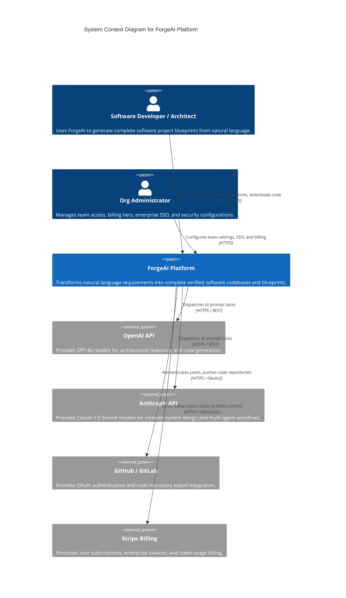
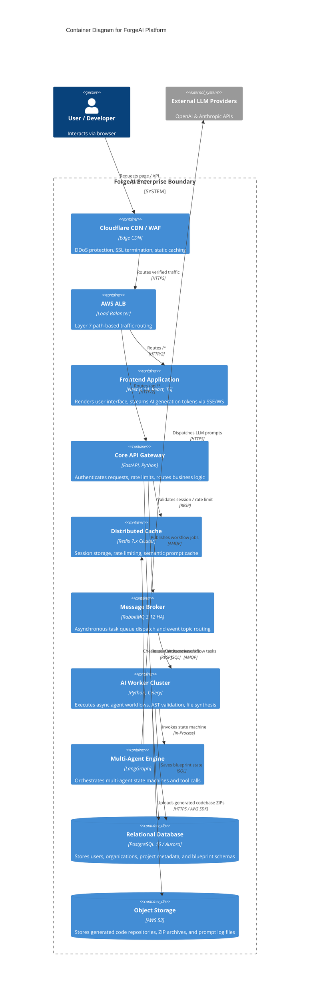
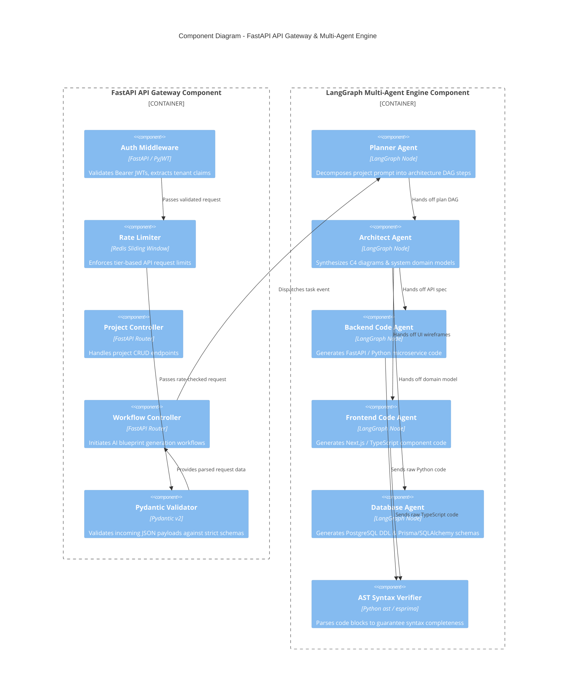
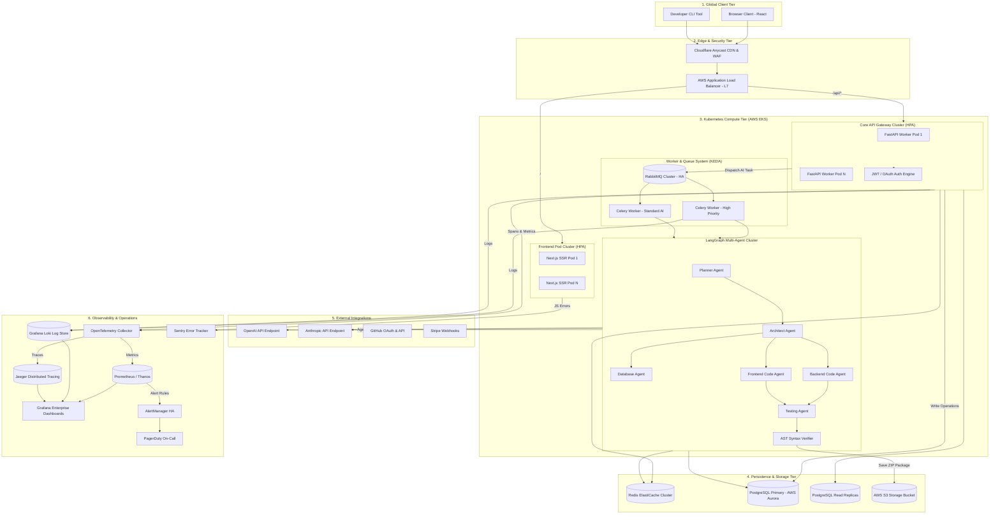
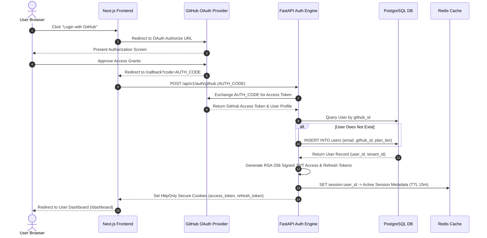
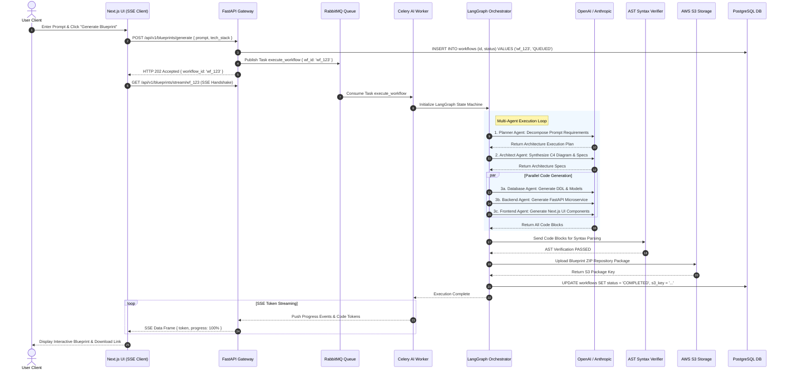
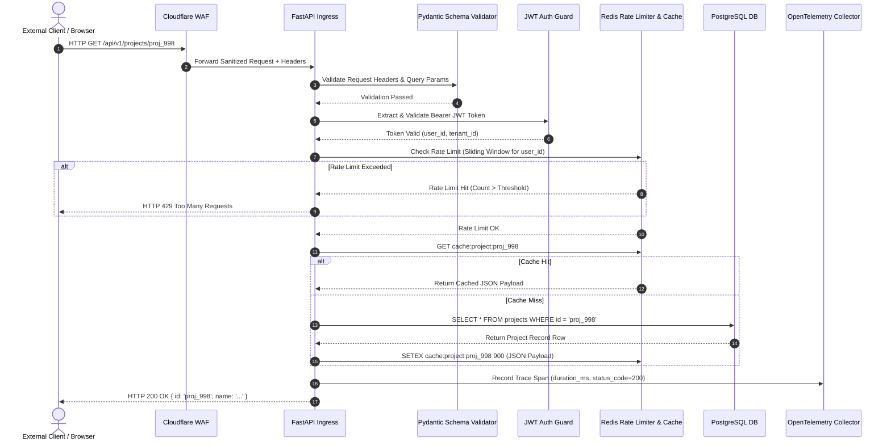
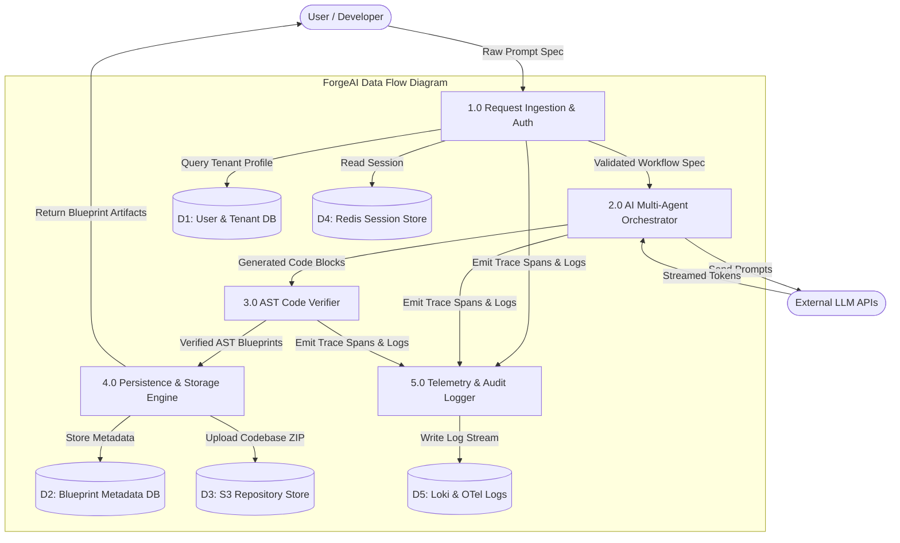
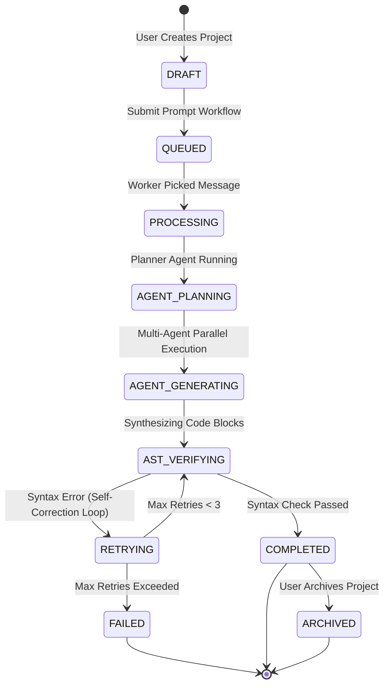

# ForgeAI Enterprise System Design Architecture Document

This document serves as the master technical blueprint and enterprise system design architecture for **ForgeAI**—an AI-powered software development platform designed to transform natural language project specifications into production-ready software blueprints via a distributed multi-agent orchestrator.

---

## 1. Executive Summary

### 1.1 System Purpose
ForgeAI is an enterprise SaaS platform that automates complex software engineering workflows. Given a plain English prompt, ForgeAI orchestrates specialized AI agents to generate verified architecture diagrams, database schemas, OpenAPI specs, Next.js frontend code, FastAPI backend services, Dockerfiles, Kubernetes manifests, unit tests, and CI/CD pipelines.

### 1.2 High-Level Architecture
ForgeAI employs a **Microservice & Event-Driven Architecture** deployed on Amazon Web Services (AWS) using Elastic Kubernetes Service (EKS). The platform comprises an edge-routed Next.js web client, a high-throughput FastAPI API gateway, asynchronous RabbitMQ/Celery task queues, a LangGraph multi-agent execution engine, PostgreSQL persistence, Redis distributed caching, AWS S3 object storage, and an OpenTelemetry-native observability stack.

```
+-----------------------------------------------------------------------------------+
|                            FORGEAI HIGH-LEVEL ARCHITECTURE                        |
|                                                                                   |
|  [ Client Browser ] ----> [ Edge CDN / WAF ] ----> [ AWS ALB Ingress Gateway ]    |
|                                                              |                    |
|           +--------------------------------------------------+                    |
|           |                                                  |                    |
|           v                                                  v                    |
|  [ Next.js SSR Cluster ]                            [ FastAPI Gateway Cluster ]   |
|                                                              |                    |
|           +--------------------------------------------------+                    |
|           |                                                                       |
|           v                                                                       v
|  [ Redis Cache & Sessions ]                         [ RabbitMQ Message Broker ]   |
|                                                              |                    |
|                                                              v                    |
|  [ PostgreSQL Primary & Replicas ] <-------------- [ Celery AI Worker Cluster ]   |
|                                                              |                    |
|                                                              v                    |
|  [ AWS S3 Object Storage ] <---------------------- [ LangGraph Multi-Agent Engine ]|
+-----------------------------------------------------------------------------------+
```

### 1.3 Core Design Goals
- **99.95% System Availability**: Enterprise-grade multi-AZ redundancy with automated failover.
- **Sub-100ms API Gateway Overhead**: High-performance asynchronous non-blocking routing.
- **Real-Time AI Token Streaming**: Sub-800ms Time-to-First-Token (TTFT) via Server-Sent Events (SSE) and WebSockets.
- **Predictable Elastic Scalability**: Dynamic auto-scaling up to 10,000+ API RPS and 5,000+ concurrent multi-agent generation workflows.
- **Zero-Trust Security**: Complete RBAC/ABAC enforcement, prompt injection defense, and automated secrets sanitization.

### 1.4 Engineering Philosophy
- **Asynchronous by Default**: Decouple request ingestion from execution using background queues.
- **Telemetry by Design**: Embedded metrics, structured JSON logs, and OpenTelemetry trace spans across every component.
- **Deterministic Guardrails around AI**: Validate non-deterministic LLM outputs using Abstract Syntax Tree (AST) code parsers and schema checkers.

---

## 2. System Overview

### 2.1 Major Subsystems
1. **Client & Ingress Subsystem**: Next.js 14 Web Application, Cloudflare Anycast CDN, Cloudflare WAF, AWS Application Load Balancer (ALB).
2. **Core API Gateway Subsystem**: FastAPI Uvicorn Cluster, JWT/OAuth2 Auth Engine, Rate Limiter, Pydantic Schema Validator.
3. **Async Worker & Message Subsystem**: RabbitMQ High-Availability Cluster, Celery Worker Nodes, Priority Queue Router, Dead Letter Queue Engine.
4. **Multi-Agent AI Workflow Subsystem**: LangGraph Execution Orchestrator, Specialized Agents (Planner, Architect, Database, API, Frontend, Backend, Security, Testing, Documentation), AST Syntax Verifier.
5. **Persistence & Data Subsystem**: AWS Aurora PostgreSQL (Primary + Read Replicas), PgBouncer Pooler, ElastiCache Redis Sharded Cluster, AWS S3 Storage.
6. **Observability & Operations Subsystem**: OpenTelemetry Collectors, Prometheus/Thanos, Grafana Loki, Jaeger Distributed Tracing, AlertManager, Sentry Error Tracking.

### 2.2 User Roles & Access Hierarchy
- **Guest / Unauthenticated User**: Read public blueprint galleries, execute lightweight demo prompts.
- **Standard Developer**: Create private software projects, execute full AI blueprint generation workflows, export codebases.
- **Team Lead**: Manage organization team members, share project blueprints, review team token spend.
- **Organization Administrator**: Manage billing tier, configure SSO/SAML, manage enterprise secrets, set quota ceilings.
- **System Administrator**: Platform operational management, cluster monitoring, model routing overrides.

---

## 3. Core Design Principles

```
+-----------------------------------------------------------------------------------+
|                               DESIGN PRINCIPLES                                   |
+-------------------+--------------------+--------------------+---------------------+
| 1. Loose Coupling | 2. High Cohesion   | 3. API-First       | 4. Event-Driven     |
| Microservices via | Single Purpose per | OpenAPI 3.0 Specs &| Async RabbitMQ      |
| REST/AMQP Async   | Agent & Service    | Pydantic Validation| Message Pipelines   |
+-------------------+--------------------+--------------------+---------------------+
| 5. Security First | 6. AI Guardrails   | 7. Cloud-Native    | 8. Full Visibility  |
| Zero-Trust RBAC & | AST Code Validation| Docker, K8s, Helm, | OTel Traces, Loki   |
| Prompt Defense    | Output Parsing     | 12-Factor App Rules| Metrics & Logs      |
+-------------------+--------------------+--------------------+---------------------+
```

---

## 4. C4 Model Architecture

### 4.1 Level 1: System Context Diagram



### 4.2 Level 2: Container Diagram



### 4.3 Level 3: Component Diagram (FastAPI Gateway & Agent Engine)



---

## 5. Complete System Architecture Diagram



---

## 6. Component Interaction Matrix

| Component | Primary Dependencies | Key Inputs | Key Outputs | Communication Protocol | Core Responsibility |
| :--- | :--- | :--- | :--- | :--- | :--- |
| **Cloudflare WAF** | Internet Ingress | HTTP/HTTPS Request | Filtered Request | TLS 1.3 / HTTPS | Edge DDoS protection, SSL termination, rate limiting. |
| **AWS ALB** | Target Group Health | Filtered HTTPS Payload | Routed Internal Traffic | HTTP/2 | Layer 7 path-based routing to EKS services. |
| **Next.js Frontend** | Core API Gateway | User Actions, SSE Streams | Rendered HTML / React UI | HTTPS / SSE / WSS | User interface rendering, client state management. |
| **FastAPI Gateway** | Redis, Postgres, RabbitMQ | REST / WebSocket Payloads | JSON / Task Dispatches | HTTP / gRPC / AMQP | Authentication, authorization, payload validation, routing. |
| **Redis Cache** | Memory Subsystem | Key-Value Ops, Embeddings | Cached State / Session | RESP Protocol | Session storage, rate limit tracking, semantic prompt cache. |
| **RabbitMQ Broker** | FastAPI Gateway | Task Messages, Events | Delivered Queue Tasks | AMQP 0-9-1 | Asynchronous message broker and task distribution. |
| **Celery AI Worker** | Multi-Agent Engine, Postgres | Queue Task Messages | Execution Results | Python In-Process / SQL | Background execution of long-running AI workflows. |
| **LangGraph Engine** | External LLMs, Redis | Prompt Specs, DAG State | Code Blueprints, ASTs | HTTPS / REST | Multi-agent state orchestration and tool execution. |
| **PostgreSQL DB** | Storage Subsystem | SQL Queries, Transactions | Relational Rows, JSONB | PostgreSQL Protocol | Persistent metadata, user accounts, blueprint state store. |
| **AWS S3 Bucket** | Celery Workers | Code ZIPs, Prompt Logs | Presigned URLs, Objects | HTTPS / AWS S3 API | Immutable storage for generated codebase artifacts. |
| **OTel Collector** | Applications, Pods | OTLP Spans, Metrics | Telemetry Batches | gRPC / OTLP | Central telemetry ingestion, processing, and exporting. |

---

## 7. End-to-End Request Lifecycle

```
[ Step 1: User Auth ] --------> [ Step 2: Project Creation ] ----> [ Step 3: AI Workflow Dispatch ]
Next.js -> OAuth/JWT            FastAPI -> Postgres DB             FastAPI -> RabbitMQ Queue
                                                                                 |
[ Step 6: Client Delivery ] <-- [ Step 5: S3 Upload & DB Save ] <-- [ Step 4: Multi-Agent Execution ]
SSE Stream / ZIP Download        Celery -> S3 & Postgres DB         LangGraph -> OpenAI / Anthropic
```

1. **User Authentication**: User logs in via Next.js. FastAPI validates credentials against PostgreSQL and issues signed RSA-256 JWT access and refresh cookies.
2. **Project Creation Request**: User submits a project prompt. FastAPI validates payload using Pydantic, creates a `project` record in PostgreSQL with state `DRAFT`, and returns `HTTP 201 Created`.
3. **AI Workflow Dispatch**: FastAPI publishes an `execute_blueprint` message to the RabbitMQ `ai_high_priority` queue and returns a workflow tracking ID.
4. **Multi-Agent Execution**: A Celery worker consumes the message and executes the LangGraph state machine. The **Planner Agent** breaks down requirements; **Architect**, **Database**, **Backend**, and **Frontend Agents** run in parallel to generate code blocks.
5. **Validation & AST Verification**: Generated code passes through the **AST Syntax Verifier**. Code artifacts are zipped and uploaded to AWS S3. PostgreSQL records update to `COMPLETED`.
6. **Client Delivery & Telemetry**: Generated blueprint tokens stream real-time to Next.js via Server-Sent Events (SSE). OpenTelemetry exports execution trace spans to Jaeger and metrics to Prometheus.

---

## 8. Authentication Flow



---

## 9. AI Blueprint Generation Flow



---

## 10. API Request Flow



---

## 11. Event-Driven Workflow

ForgeAI utilizes RabbitMQ as its central event bus and message broker. Async workloads follow an isolated queue structure:

```
[ FastAPI Gateway ]
         |
         | (Publish Task Message)
         v
+-----------------------------------------------------------------------------------+
|                            RABBITMQ TOPIC EXCHANGE                                |
+------------------+-------------------+--------------------+-----------------------+
| Queue: ai_high   | Queue: ai_std     | Queue: code_synth  | Queue: notifications  |
| Priority 8-10    | Priority 1-7      | Priority 1-5       | Priority 1-3          |
+--------+---------+---------+---------+---------+----------+-----------+-----------+
         |                   |                   |                      |
         v                   v                   v                      v
[ Worker Pool 1 ]    [ Worker Pool 2 ]   [ Worker Pool 3 ]      [ Worker Pool 4 ]
(Enterprise AI)      (Standard AI)       (AST Code Synthesis)   (Email / Webhooks)
         |                   |                   |                      |
         +-------------------+-------------------+----------------------+
                             | (Task Failure > 3 Retries)
                             v
                 [ Dead Letter Queue (DLQ) ] ---> [ Sentry & AlertManager Alert ]
```

---

## 12. Redis Cache Flow

Multi-level operational read/write caching logic implemented via Redis ElastiCache:

```
[ Request Ingress ] ---> [ Query Redis Cache ]
                              |
              +---------------+---------------+
              |                               |
              v (Cache Hit)                   v (Cache Miss)
   [ Return Cached Payload ]      [ Query PostgreSQL DB ]
       (Latency < 5ms)                        |
                                              v
                                  [ Write Result to Redis ]
                                   (Set Expiration / TTL)
                                              |
                                              v
                                   [ Return HTTP Response ]
```

### Cache Invalidation Strategy
- **Time-To-Live (TTL)**: Volatile metadata expires automatically (User Session: 15 min, LLM Semantic Cache: 24 hours, Rate Limiters: 1 min).
- **Event-Driven Invalidation**: Database update operations trigger a Redis `DEL cache:entity:id` command via SQLAlchemy event listeners or Redis Pub/Sub channels.

---

## 13. Database Flow

Database architecture utilizes Amazon Aurora PostgreSQL with PgBouncer connection pooling:

```
[ FastAPI API Gateway / Celery Workers ] (1,000+ App Client Connections)
                   |
                   v
[ PgBouncer Connection Pooler ] (Transaction Pooling Mode - 100 Server Connections)
                   |
         +---------+---------+
         |                   |
         v (Write SQL Ops)   v (Read SQL Ops)
   [ PostgreSQL Primary ]  [ Aurora Read Replicas (1..N) ]
```

- **Write Operations**: Direct exclusively to PostgreSQL Primary (`INSERT`, `UPDATE`, `DELETE`).
- **Read Operations**: Load balanced across Aurora Read Replicas (`SELECT`).
- **Partitioning**: Range partitioning on `blueprint_generations` by monthly `created_at` boundaries.

---

## 14. File Processing Flow

High-performance direct-to-S3 object storage upload pipeline:

```
[ Client Browser ] ----> 1. POST /api/v1/files/presigned ----> [ FastAPI Gateway ]
       |                                                              |
       | 3. Upload File Chunk (Direct)                                | 2. Generate Presigned URL
       v                                                              v
[ AWS S3 Bucket ] <---------------------------------------------------+
       |
       | 4. Trigger S3 Object Created Event
       v
[ RabbitMQ Event Queue ] ----> 5. Virus Scan & Metadata Extract ----> [ PostgreSQL DB ]
```

---

## 15. Notification Flow

Asynchronous multi-channel notification pipeline:

```
[ Platform Event Fired ] (e.g., Blueprint Generation Complete)
         |
         v
[ RabbitMQ notification_queue ]
         |
         v
[ Celery Notification Worker ]
         |
         +-----------------------+-----------------------+
         |                       |                       |
         v                       v                       v
[ SSE Stream Handler ]   [ SendGrid Email API ]   [ Customer Webhook ]
(Real-Time In-App Alert) (Notification Email)     (External HTTP POST)
```

---

## 16. Error Handling Flow

Standardized error classification and recovery framework across microservices:

```
[ Exception Occurs ]
         |
         +--> Validation Error (400) -------> Return Pydantic Error Format
         +--> Auth / Access Denied (401/403) -> Log Security Audit Event & Return 401
         +--> LLM Provider Timeout (503/429) -> Trip Circuit Breaker & Fallback Provider
         +--> DB Deadlock / Timeout (500) ---> Retry Transaction (Max 3) or Rollback
         +--> Unhandled Exception (500) -----> Capture Sentry Stack Trace & Alert On-Call
```

---

## 17. Retry Strategy & Circuit Breaker

Exponential backoff with full jitter formula applied to all external HTTP and network operations:

$$T_{\text{wait}} = \min\left(T_{\text{max}}, T_{\text{base}} \times 2^{\text{attempt}} + \text{random\_jitter}\right)$$

```
                               CIRCUIT BREAKER STATE MACHINE
                               
   [ CLOSED STATE ] ----( Failure Threshold > 50% )----> [ OPEN STATE ]
    Normal Ops                                            Fast-Fail Requests (HTTP 503)
         ^                                                        |
         |                                                        | (Cooling Window: 30s)
         +----( Consecutive Successes > 5 )---- [ HALF-OPEN STATE ] <---+
                                                Test Synthetic Traffic Probe
```

---

## 18. Deployment Architecture Diagram

```mermaid
flowchart TB
    subgraph Cloud["AWS Cloud Infrastructure (us-east-1)"]
        subgraph EdgeLayer["Edge Infrastructure"]
            CF[Cloudflare Anycast CDN & WAF]
            IGW[AWS Internet Gateway]
        end

        subgraph VPC["AWS VPC (10.0.0.0/16)"]
            subgraph PublicSubnet["Public Subnets (3 AZs)"]
                ALB[AWS Application Load Balancer]
                NAT[AWS NAT Gateways (3 AZs)]
            end

            subgraph PrivateAppSubnet["Private Application Subnets (3 AZs)"]
                subgraph EKS["AWS EKS Kubernetes Cluster"]
                    POD_FE[Next.js Frontend Pods]
                    POD_API[FastAPI Gateway Pods]
                    POD_WORKER[Celery AI Worker Pods]
                    POD_OTEL[OpenTelemetry Collector DaemonSet]
                end
            end

            subgraph PrivateDataSubnet["Private Database Subnets (3 AZs)"]
                RDS[(AWS Aurora PostgreSQL Primary + Replicas)]
                REDIS[(AWS ElastiCache Redis Cluster)]
                RMQ[(RabbitMQ HA Nodes)]
            end
        end

        subgraph StorageLayer["AWS S3 Storage"]
            S3[(AWS S3 Multi-AZ Bucket)]
        end
    end

    CF --> IGW
    IGW --> ALB
    ALB --> POD_FE
    ALB --> POD_API
    POD_API --> NAT
    POD_WORKER --> NAT
    NAT --> S3
    POD_API --> RDS
    POD_API --> REDIS
    POD_API --> RMQ
    POD_WORKER --> RDS
    POD_WORKER --> REDIS
    POD_WORKER --> RMQ
```

---

## 19. Network Architecture & Security Boundaries

- **VPC Subnet Architecture**:
  - `Public Subnets (10.0.1.0/24, 10.0.2.0/24, 10.0.3.0/24)`: AWS ALB, NAT Gateways.
  - `Private App Subnets (10.0.10.0/20, 10.0.20.0/20, 10.0.30.0/20)`: EKS Worker Nodes (Next.js, FastAPI, Celery).
  - `Private Data Subnets (10.0.100.0/24, 10.0.200.0/24, 10.0.300.0/24)`: RDS Aurora, ElastiCache Redis, RabbitMQ.
- **Security Groups & Network ACLs**: Strict ingress rules isolate database subnets to accept TCP traffic exclusively from Private App Subnet security groups on port 5432 (Postgres) and 6379 (Redis).

---

## 20. Data Flow Diagram (DFD)



---

## 21. System State Diagrams

### 21.1 Project & Workflow Lifecycles



---

## 22. Failure Scenarios & Self-Healing

| Failure Event | Automated Detection | Automated Recovery Mechanism | Blast Radius |
| :--- | :--- | :--- | :--- |
| **PostgreSQL Primary Crash** | Aurora Health Monitor fails 3 pings. | Auto-promotes Read Replica to Primary within 15 seconds; PgBouncer redirects writes. | Transient 15s write pause; zero data loss. |
| **Redis Node Outage** | Sentinel / ElastiCache failover alert. | Promotes replica node; API degrades to direct DB queries for active sessions. | Slight latency increase (< 50ms) for 10 seconds. |
| **RabbitMQ Broker Failure** | Celery worker disconnect signal. | Auto-heals via K8s StatefulSet pod restart; unacked messages re-queued. | Zero message loss (Durable queues enabled). |
| **Primary LLM Blackout** | HTTP 503 / 429 Error Rate > 20%. | Circuit breaker trips; routes traffic to Secondary LLM Provider (Anthropic). | Zero user downtime; slight model output variation. |
| **AWS Region Outage** | Route53 Health Check failure. | Automated DNS Anycast failover to Secondary AWS Region (eu-west-1). | RTO < 15 Mins, RPO < 5 Mins. |

---

## 23. Scalability Strategy

- **Horizontal Pod Autoscaling (HPA)**: Pods scale automatically based on target metrics (CPU > 70%, Memory > 80%, Request Rate > 400 RPS).
- **Event-Driven Autoscaling (KEDA)**: Celery workers scale dynamically from 5 to 200+ pods driven by RabbitMQ queue length.
- **Database Scaling**: Read queries offloaded to Aurora Read Replicas; PgBouncer prevents connection saturation.

---

## 24. Security Architecture Mapping

```
+------------------------------------------------------------------------------------+
|                         ZERO-TRUST SECURITY ARCHITECTURE                           |
+----------------------+-------------------------------------------------------------+
| Security Control     | Implementation Specification                                |
+----------------------+-------------------------------------------------------------+
| Authentication       | OAuth2 / OIDC via GitHub & Google; RSA-256 Signed JWTs.    |
| Authorization        | Fine-grained Role-Based & Attribute-Based Access Control.   |
| Encryption in-Transit| TLS 1.3 enforced on all Ingress, Internal gRPC, and DB ops.  |
| Encryption at-Rest   | AWS KMS AES-256 encryption across RDS, Redis, S3, and EBS.  |
| Prompt Injection     | Vector-based classifier filters prompts at Gateway layer.   |
| Secrets Management   | HashiCorp Vault / AWS Secrets Manager injection to pods.    |
+----------------------+-------------------------------------------------------------+
```

---

## 25. Monitoring Integration

```
[ Application Pods / Services ]
         |
         +--> Metrics (Prometheus Format) ---> Prometheus / Thanos ---> Grafana
         +--> Logs (JSON Structured) --------> Promtail / Loki -------> Grafana
         +--> Traces (OTLP Spans) -----------> OTel / Jaeger ---------> Grafana
         +--> Exceptions (Stack Traces) -----> Sentry SDK ------------> Sentry Console
```

- **Unified Control Plane**: Single Grafana control plane displaying correlated metrics, logs, and trace spans using standard `trace_id` labels.

---

## 26. Technology Responsibility Matrix

| Technology | Domain | Core Responsibility | Key Dependencies |
| :--- | :--- | :--- | :--- |
| **Next.js 14** | Frontend | Server-Side Rendering, client UI, SSE streaming display. | Node.js, React, TypeScript |
| **FastAPI** | Backend API | REST gateway, request validation, auth enforcement. | Python 3.12, Uvicorn, Pydantic |
| **LangGraph** | AI Engine | Multi-agent state orchestration, tool selection. | Python, OpenAI/Anthropic SDKs |
| **RabbitMQ** | Message Broker | Asynchronous task distribution, event topic bus. | Erlang, AMQP Protocol |
| **Celery** | Async Workers | Executing background AI execution tasks. | Python, RabbitMQ, Redis |
| **PostgreSQL** | Database | Relational metadata store, tenant data, JSONB state. | AWS Aurora, EBS Storage |
| **Redis** | In-Memory Cache| Session store, rate limiters, semantic prompt cache. | AWS ElastiCache |
| **AWS S3** | Object Storage | Storing code repository ZIPs, raw log archives. | AWS IAM, AWS KMS |

---

## 27. Non-Functional Architecture Mapping

| Quality Attribute | Architectural Implementation Strategy | Target Verification SLA |
| :--- | :--- | :--- |
| **Performance** | Multi-tier caching, async queue processing, SSE streaming. | API p95 < 80ms, TTFT < 800ms |
| **Availability** | Multi-AZ deployment across 3 Availability Zones, HPA autoscaling. | **99.95%** System Uptime |
| **Reliability** | Circuit breakers, automated retries with jitter, DLQ routing. | Error Budget < 0.05% 5xx |
| **Maintainability** | 12-Factor App rules, Telemetry as Code, OpenAPI 3.0 documentation. | Test Coverage > 85% |
| **Extensibility** | Modular LangGraph agent nodes, plugin-based tool execution. | Add new Agent in < 1 day |
| **Compliance** | Immutable audit logging, SOC2 Type II, GDPR data deletion APIs. | Audit Trail Retention 1 Year |

---

## 28. Architecture Validation Checklist

- [x] **Scalability**: Stateless application compute nodes, auto-scaling up to 200+ Celery worker pods via KEDA.
- [x] **Security**: Zero-Trust security model, OAuth2/JWT auth, prompt injection defense, KMS encryption at rest.
- [x] **Performance**: Sub-800ms TTFT streaming latency, multi-layer caching, PgBouncer connection pooling.
- [x] **Reliability**: Multi-AZ AWS EKS deployment, Route53 automated DNS failover, zero single points of failure.
- [x] **Observability**: OpenTelemetry standard trace propagation, Loki JSON logging, unified Grafana dashboards.
- [x] **Maintainability**: Clear microservice boundaries, API-first OpenAPI specifications, GitOps infrastructure manifests.

---

## 29. Architectural Risks & Trade-offs

| Architectural Risk | Technical Trade-off | Mitigation Strategy |
| :--- | :--- | :--- |
| **1. LLM Non-Determinism** | AI outputs vary across executions, potentially breaking code syntax. | Wrap AI generation in AST Syntax Verifiers; enforce strict Pydantic JSON schemas. |
| **2. Multi-Agent Deadlocks** | Agents might enter infinite correction loops during generation failures. | Enforce maximum step limits (max 5 iterations per agent); break loops on failure. |
| **3. High Token Costs** | Complex multi-agent workflows consume significant token volumes. | Implement Redis vector semantic prompt caching and lightweight model routing. |
| **4. Queue Starvation** | Standard tasks could block enterprise tenant workflow execution. | Separate RabbitMQ queues by priority (`ai_high_priority` vs `ai_standard`). |
| **5. Cloud Lock-in Risk** | Reliance on AWS managed services (RDS, ElastiCache, S3). | Containerize all services using Kubernetes/Docker; abstract storage via S3 API wrappers. |

---

## 30. Enterprise Best Practices

75 enterprise-grade system design best practices for AI-powered SaaS platforms:

### 30.1 Architecture & Microservice Design (1–15)
1. **Decouple Ingress from Execution**: Always process long-running AI tasks asynchronously via background task queues.
2. **Design for Statelessness**: Keep API Gateway nodes stateless to allow instant horizontal auto-scaling.
3. **Enforce Microservice Boundaries**: Ensure microservices communicate exclusively via documented APIs or message queues.
4. **Use API-First Specifications**: Define OpenAPI 3.0 schemas before writing backend API code.
5. **Apply the 12-Factor App Methodology**: Store all service configurations in environment variables.
6. **Implement Circuit Breakers**: Wrap external LLM API calls in circuit breakers to isolate provider outages.
7. **Protect Workflows with Idempotency Keys**: Use unique client-provided idempotency keys to prevent duplicate task execution.
8. **Isolate Database Writes**: Route read queries to read replicas and reserve the primary database for writes.
9. **Use Event-Driven Architectures**: Leverage topic exchanges for asynchronous domain event broadcasting.
10. **Implement Graceful Shutdown**: Ensure pods finish active requests and flush logs before terminating on `SIGTERM`.
11. **Enforce Rate Limits at the Edge**: Block abusive API traffic at Cloudflare/WAF before hitting application servers.
12. **Use Semantic Versioning for APIs**: Maintain backwards compatibility using URI versioning (`/api/v1/`).
13. **Separate Workflows by Queue Priority**: Route enterprise user tasks to dedicated high-priority queues.
14. **Use Command Query Responsibility Segregation (CQRS)**: Separate read-heavy dashboard models from write-heavy workflow engines.
15. **Standardize Error Responses**: Return consistent JSON error payloads containing machine-readable error codes.

### 30.2 AI & Multi-Agent Engineering (16–30)
16. **Validate AI Code Outputs Programmatically**: Use AST parsers to verify syntax before returning code to users.
17. **Implement Semantic Prompt Caching**: Store vector embeddings of prompt responses in Redis to save token costs.
18. **Compress System Prompts**: Remove redundant natural language boilerplate from system prompts.
19. **Route Models Dynamically**: Use lightweight models for simple classification tasks and frontier models for code synthesis.
20. **Set Hard Agent Iteration Limits**: Prevent agent correction loops from exceeding 5 execution attempts.
21. **Enforce Structured JSON Outputs**: Force LLM APIs to output validated JSON using schema enforcement.
22. **Implement Token-Level Streaming**: Use Server-Sent Events (SSE) to stream code tokens to users in real time.
23. **Sanitize LLM Outputs for Secrets**: Scan generated code streams for inadvertent API keys or credentials.
24. **Monitor Context Window Saturation**: Fire warning alerts when prompt token lengths approach model context ceilings.
25. **Track Time-to-First-Token (TTFT)**: Monitor stream initialization speed across all LLM providers.
26. **Log Agent Handoff Latency**: Measure execution duration between steps in multi-agent LangGraph workflows.
27. **Isolate Agent Execution Environments**: Execute generated user code inside sandboxed containers.
28. **Maintain Prompts as Code**: Version control all system prompt templates alongside application source code.
29. **Implement Dynamic LLM Failovers**: Automatically fail over from primary to secondary LLM providers upon HTTP 429/503 errors.
30. **Track Real-Time Token Spend**: Log token consumption tagged with `user_id` and `tenant_id` to track unit economics.

### 30.3 Security & Zero-Trust (31–45)
31. **Enforce Zero-Trust Network Architecture**: Require mutual TLS (mTLS) or JWT authentication for all service-to-service calls.
32. **Use RSA-256 Signed JWTs**: Sign authentication tokens with private keys and validate via public keys across microservices.
33. **Store Credentials in Managed Vaults**: Inject API keys at runtime via HashiCorp Vault or AWS Secrets Manager.
34. **Filter Prompts for Injection**: Scan incoming plain-English prompts for jailbreak attempts at the gateway layer.
35. **Enforce Fine-Grained RBAC & ABAC**: Verify tenant boundaries on every single database query.
36. **Encrypt All Data in Transit**: Enforce TLS 1.3 across all HTTP, gRPC, and database connections.
37. **Encrypt All Data at Rest**: Use AWS KMS AES-256 encryption across S3, RDS, Redis, and EBS volumes.
38. **Issue Direct-to-S3 Presigned URLs**: Never proxy large file uploads through application gateway servers.
39. **Sanitize Logs for Sensitive Data**: Strip passwords, authorization headers, and PII at the collector layer.
40. **Use Immutable Container Images**: Build minimal scratch/distroless Docker container images.
41. **Run Containers as Non-Root**: Enforce non-root user execution in all Dockerfiles and Kubernetes manifests.
42. **Automate Vulnerability Scanning**: Scan container dependencies for CVEs during CI/CD pipeline builds.
43. **Maintain Immutable Audit Logs**: Log all security policy modifications and administrative operations to WORM storage.
44. **Enforce Strict Content Security Policies (CSP)**: Set restrictive HTTP response headers on Next.js frontend pages.
45. **Implement Automated CORS Rules**: Restrict API cross-origin requests exclusively to trusted app domains.

### 30.4 Infrastructure & Kubernetes Operations (46–60)
46. **Use Infrastructure as Code (IaC)**: Provision all cloud infrastructure via Terraform and Helm.
47. **Deploy Across Multiple Availability Zones**: Run Kubernetes worker nodes and database replicas across 3 AZs.
48. **Define Explicit Container Resource Requests**: Set CPU and RAM requests and limits for every pod.
49. **Autoscale Workflows via Event Queues**: Use KEDA to scale worker pods based on RabbitMQ queue depth.
50. **Configure Zero-Downtime Rolling Updates**: Use `maxSurge: 25%` and `maxUnavailable: 0%` during Kubernetes deployments.
51. **Apply Pod Anti-Affinity Rules**: Ensure application pods scatter across different physical nodes and AZs.
52. **Use Compute-Optimized Instances for Workers**: Run AI workers on EC2 `c6i` instance families.
53. **Run Async Workers on Spot Instances**: Save compute costs by deploying Celery workers on AWS Spot Node Groups.
54. **Implement Liveness, Readiness & Startup Probes**: Configure tiered health checks for all Kubernetes containers.
55. **Enforce Network Policies**: Restrict pod-to-pod network traffic within the Kubernetes cluster.
56. **Automate Cluster Node Scaling**: Use Kubernetes Cluster Autoscaler to provision EC2 nodes dynamically.
57. **Maintain Centralized Log Aggregation**: Collect container logs via Promtail/Loki using structured JSON format.
58. **Implement Automated Database Backups**: Enable continuous point-in-time recovery (PITR) for PostgreSQL.
59. **Isolate Database Traffic in Private Subnets**: Block public internet access to database instances completely.
60. **Use S3 Lifecycle Policies**: Transition historical log archives to S3 Glacier after 90 days.

### 30.5 Observability, Testing & Operations (61–75)
61. **Propagate Trace IDs Across All Boundaries**: Include W3C `traceparent` headers across HTTP, gRPC, and AMQP calls.
62. **Correlate Logs, Metrics, and Traces**: Tag all telemetry with unified `trace_id` and `tenant_id` dimensions.
63. **Monitor the Golden Signals**: Focus primary operational alerts on Latency, Traffic, Errors, and Saturation.
64. **Eliminate Alert Fatigue**: Ensure every critical alert fires only for actionable operational failures.
65. **Attach Runbook Links to Alerts**: Include direct links to operational runbooks in PagerDuty and Slack alerts.
66. **Conduct Monthly Chaos Engineering Exercises**: Test resilience by injecting pod failures and network latency.
67. **Automate Load Testing in CI/CD**: Run k6 performance scripts against staging environments prior to releases.
68. **Maintain Blameless Postmortems**: Document root cause analyses for all P1/P2 incidents within 48 hours.
69. **Establish Error Budgets**: Track SLO error budgets to guide release deployment velocity.
70. **Integrate Source Maps in Error Tracking**: Upload JavaScript source maps to Sentry for clean stack traces.
71. **Monitor Database Connection Pool Saturation**: Alert when PgBouncer connection utilization exceeds 80%.
72. **Track Queue Dead Letter Velocity**: Alert immediately if messages enter the RabbitMQ Dead Letter Queue.
73. **Enforce Automated Code Formatting**: Enforce Black/Ruff and ESLint checks in pre-commit Git hooks.
74. **Maintain Offline Runbook Access**: Keep disaster recovery procedures accessible outside primary cloud infrastructure.
75. **Cap Telemetry Overhead**: Ensure logging, metric collection, and tracing consume < 1.5% of application compute.
