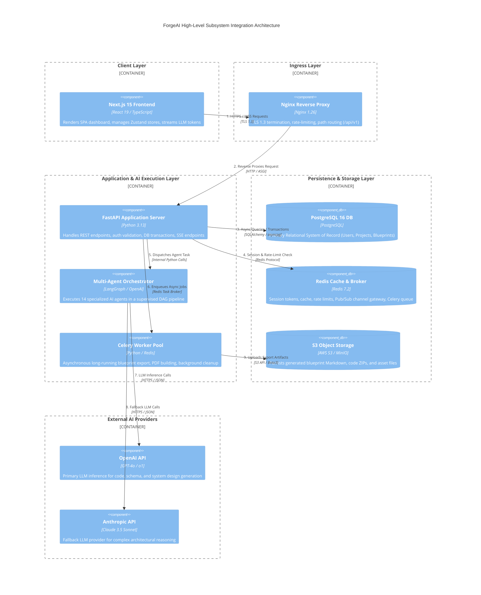
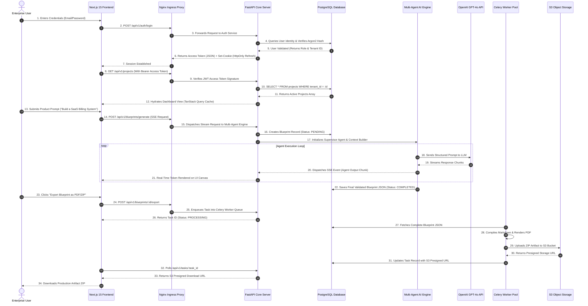
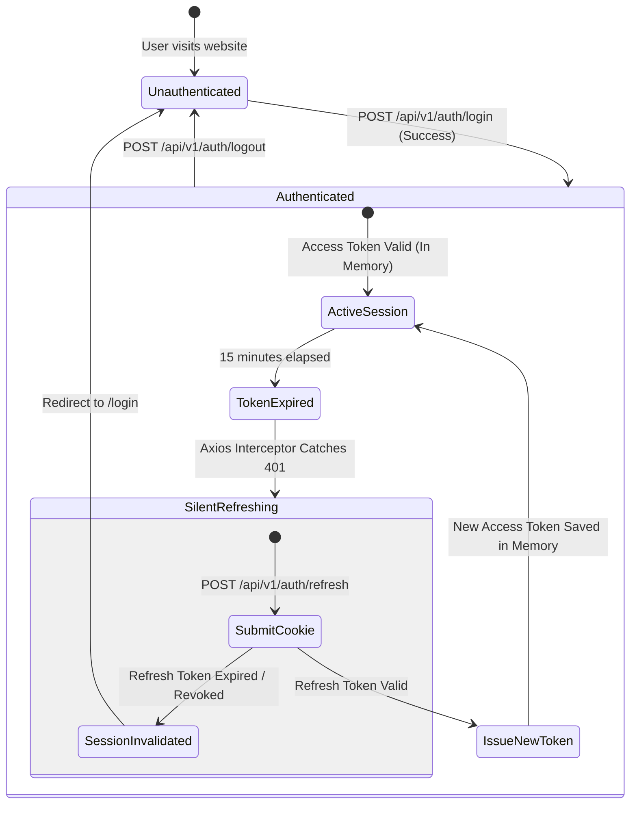
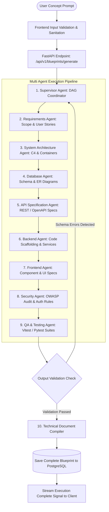
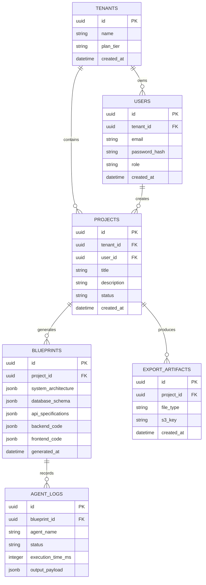
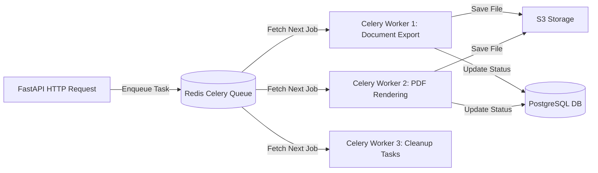
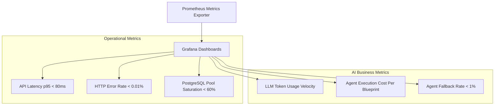
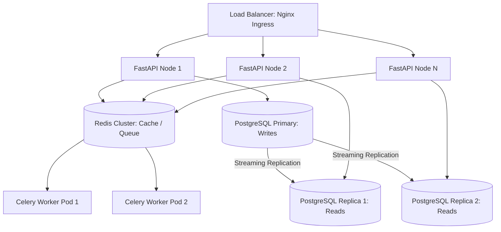

# ForgeAI System Integration Architecture Specification

> **Document Version**: 1.0.0  
> **Status**: Approved for Enterprise Production & System Integration  
> **Platform Stack**: Next.js 15 | FastAPI | Python 3.13 | PostgreSQL 16 | SQLAlchemy 2.0 | Redis | Celery | OpenAI GPT-4o / Multi-Agent Engine | Docker | Nginx  
> **Author**: Principal Solutions Architect & Enterprise System Design Team  
> **Target Audience**: CTOs, VPs of Engineering, Lead System Architects, DevOps Engineers, & Enterprise Security Auditors  
> **Last Updated**: July 2026  

---

## Executive Summary

The **ForgeAI System Integration Architecture** specifies the unified communication protocols, data flows, security boundaries, fault-tolerance mechanisms, and multi-agent orchestration frameworks across the entire **ForgeAI SaaS Platform**.

ForgeAI transforms high-level human product intents into complete, production-ready software engineering blueprints by coordinating **14 specialized AI agents**, a high-throughput **FastAPI async backend**, a **Next.js 15 App Router frontend**, and an enterprise-grade **PostgreSQL relational database**.

```
┌────────────────────────────────────────────────────────────────────────┐
│               ForgeAI Integration Architecture Pillars                 │
├───────────────────┬───────────────────┬────────────────────────────────┤
│ End-to-End Type   │ Event-Driven &    │ Multi-Tier Data & Cache        │
│ Safety & Schema   │ Real-Time Streaming│ PostgreSQL SSOT, Redis L1/L2   │
│ Strict Zod /      │ Sub-10ms token    │ cache, S3 artifact storage,    │
│ Pydantic DTO      │ chunk SSE delivery│ transactional integrity with   │
│ synchronization   │ & status tracking │ SQLAlchemy 2.0 async           │
├───────────────────┼───────────────────┼────────────────────────────────┤
│ Zero-Trust Dual-  │ Resilient Multi-  │ Multi-Level Fault Tolerance    │
│ Token Security    │ Agent Execution   │ Circuit breakers, exponential  │
│ In-memory JWT,    │ Supervisor-worker │ backoff, fallback models,      │
│ HttpOnly cookie,  │ DAG topology with │ automated state rollback,      │
│ RBAC & rate-limit │ self-correction   │ component isolation            │
└───────────────────┴───────────────────┴────────────────────────────────┘
```

---

## Table of Contents

1. [Introduction](#1-introduction)
2. [High-Level System Overview](#2-high-level-system-overview)
3. [Overall System Architecture](#3-overall-system-architecture)
4. [System Components](#4-system-components)
5. [End-to-End Request Lifecycle](#5-end-to-end-request-lifecycle)
6. [Authentication & Session Authorization Flow](#6-authentication--session-authorization-flow)
7. [Multi-Agent Blueprint Generation Pipeline](#7-multi-agent-blueprint-generation-pipeline)
8. [AI Engine & LLM Integration Architecture](#8-ai-engine--llm-integration-architecture)
9. [API Gateway & Communication Protocols](#9-api-gateway--communication-protocols)
10. [Database Architecture & Data Persistence](#10-database-architecture--data-persistence)
11. [Object Storage & File Management Pipeline](#11-object-storage--file-management-pipeline)
12. [Asynchronous Background Task Processing](#12-asynchronous-background-task-processing)
13. [Real-Time Event Streaming & WebSockets](#13-real-time-event-streaming--websockets)
14. [Systemic Error Handling & Resilience](#14-systemic-error-handling--resilience)
15. [Centralized Observability & Logging Architecture](#15-centralized-observability--logging-architecture)
16. [Telemetry, Metrics & System Monitoring](#16-telemetry-metrics--system-monitoring)
17. [Enterprise Security Integration & Hardening](#17-enterprise-security-integration--hardening)
18. [System Scalability Strategy](#18-system-scalability-strategy)
19. [Deployment Infrastructure & CI/CD Pipeline](#19-deployment-infrastructure--cicd-pipeline)
20. [Disaster Recovery & Business Continuity](#20-disaster-recovery--business-continuity)
21. [Architecture Decision Records (ADR)](#21-architecture-decision-records-adr)
22. [Future System Architecture Roadmap](#22-future-system-architecture-roadmap)

---

## 1. Introduction

### 1.1 Purpose
The purpose of this document is to define the holistic system integration specification for the **ForgeAI Platform**. It provides an authoritative blueprint detailing how sub-systems integrate, communicate, handle state transitions, enforce security, scale under load, and recover from failures.

### 1.2 Scope
This document covers the end-to-end architecture encompassing the client browser interface, edge proxying, backend application services, background worker pools, database persistence layers, multi-agent AI execution engines, object storage repositories, and telemetry monitoring pipelines.

### 1.3 Architectural Goals
* **Deterministic Multi-Agent Execution**: Ensure complex agent workflows complete reliably with verified structural outputs.
* **Sub-100ms API Latency**: Maintain non-blocking async I/O across all REST and streaming endpoints.
* **Zero-Trust Security**: Standardize dual-token authentication, strict Role-Based Access Control (RBAC), and sanitization against prompt injection attack vectors.
* **Enterprise High Availability**: Achieve 99.99% system uptime through stateless application tiers, automated health checks, and database replication.

---

## 2. High-Level System Overview

### 2.1 Subsystem Breakdown

| Subsystem | Core Technology | Primary Responsibility |
| :--- | :--- | :--- |
| **Frontend SPA / RSC** | Next.js 15, TypeScript, Zustand, TanStack Query | Serves UI components, manages client state, displays real-time agent streams, handles user interactions. |
| **Edge Gateway Proxy** | Nginx, TLS 1.3, Rate Limiter | SSL termination, path-based routing, HTTP rate-limiting, static asset caching, header security enforcement. |
| **Backend Core Engine** | FastAPI, Python 3.13, Pydantic v2 | Manages REST endpoints, enforces auth/RBAC, orchestrates DB transactions, triggers background agent workflows. |
| **AI Multi-Agent Core** | LangGraph, OpenAI GPT-4o, Anthropic Claude | Coordinates 14 domain-specialized AI agents to execute structured software analysis, design, and code generation. |
| **Relational Database** | PostgreSQL 16, SQLAlchemy 2.0 Async | System of Record for user identities, organization tenants, project metadata, generated blueprints, and execution logs. |
| **Cache & Task Broker** | Redis 7.2 | In-memory session cache, fast API rate-limiting store, Pub/Sub event router, and task broker for background workers. |
| **Background Task Pool** | Celery Async Workers | Executes asynchronous long-running generation workflows, PDF/ZIP artifact packaging, and email notifications. |
| **Object Storage** | S3 / MinIO Compatible Storage | Persists generated code repositories, exported PDF/Markdown technical documents, user avatars, and system backups. |
| **Observability Suite** | Sentry, Prometheus, Grafana | Continuous performance tracking, exception reporting, AI token expenditure analytics, and latency telemetry. |

### 2.2 System Component Architecture (C4 Model)



---

## 3. Overall System Architecture

### 3.1 End-to-End Data Integration Flow

```
┌────────────────────────────────────────────────────────────────────────┐
│                        Overall Tiered Data Pipeline                    │
└────────────────────────────────────────────────────────────────────────┘

  [ Client Browser ]
         │
         ▼ (HTTPS / TLS 1.3)
  [ Nginx Ingress Gateway ] ──► (Rate Limit & SSL Termination)
         │
         ▼ (ASGI Protocol)
  [ FastAPI Backend Core ] ──► [ Redis Cache ] (Sub-5ms Session Auth)
         │
         ├──► [ PostgreSQL 16 ] (Transactional Metadata & State)
         │
         ├──► [ Multi-Agent AI Engine ] ──► [ OpenAI / Claude LLMs ]
         │           │
         │           ▼ (Token Streaming / SSE)
         │    [ Client Canvas ]
         │
         └──► [ Celery Workers ] ──► [ S3 Object Storage ] (PDF / ZIP Export)
```

### 3.2 Tier Dependencies & Isolation Rules
> [!IMPORTANT]
> The database and object storage layers are completely isolated behind private Docker networks. External clients can NEVER directly connect to PostgreSQL, Redis, or Celery. All communication MUST pass through Nginx and FastAPI.

---

## 4. System Components

### 4.1 Component Responsibility Matrix

| Component | Primary Responsibilities | Direct Dependencies | Downstream Consumers | Failure Recovery Strategy | Scalability Mode |
| :--- | :--- | :--- | :--- | :--- | :--- |
| **Frontend (Next.js 15)** | UI rendering, client state management, form validation, token stream parsing. | Axios, TanStack Query, Zustand | End-User Browser | Client Error Boundary, automatic API retry. | CDN Edge Caching, Static Export. |
| **Nginx Proxy** | Reverse proxying, TLS offloading, DDOS rate-limiting, static asset serving. | SSL Certs, Upstream Hosts | Frontend, Backend | Auto-restart container, secondary backup pod. | Horizontal Load Balancing (DNS). |
| **FastAPI Core** | REST API endpoints, JWT authentication, business logic, ORM data mapping. | PostgreSQL, Redis, Pydantic | Nginx Proxy | Uvicorn worker process restart on failure. | Horizontal scaling (Uvicorn workers). |
| **AI Agent Engine** | Agent DAG orchestration, prompt building, token parsing, structural validation. | OpenAI API, Anthropic API, FastAPI | FastAPI Core | Circuit breaker, model fallback, automatic retry. | Stateless thread pool scaling. |
| **Celery Worker** | Asynchronous document export, ZIP generation, scheduled database cleanups. | Redis Queue, S3 Storage, PostgreSQL | FastAPI Core | Task retry with exponential backoff. | Horizontal worker process scaling. |
| **PostgreSQL 16** | System of Record, ACID compliance, relational integrity, transactional lock. | Disk Storage | FastAPI, Celery | Streaming replication, automatic failover. | Vertical scaling + Read Replicas. |
| **Redis 7.2** | Key-Value caching, task broker queue, SSE Pub/Sub router, rate limiting. | RAM Memory | FastAPI, Celery | Redis Sentinel / Cluster auto-failover. | Redis Cluster sharding. |
| **S3 Storage** | Persistent object storage for exports, user uploads, system logs. | Disk / Cloud Provider | Celery, FastAPI | Multi-region bucket replication. | Infinite Cloud Scale. |

---

## 5. End-to-End Request Lifecycle

### 5.1 Comprehensive Lifecycle Flow



---

## 6. Authentication & Session Authorization Flow

### 6.1 Security Architecture
ForgeAI implements an **Enterprise Dual-Token Authentication Strategy**:
* **Short-Lived Access Tokens**: Signed JWTs with a 15-minute expiration, held purely in frontend memory (Zustand state).
* **Long-Lived Refresh Tokens**: Secure, cryptographically random tokens with a 7-day expiration, stored strictly inside `HttpOnly`, `SameSite=Strict`, `Secure` cookies.

### 6.2 Authentication State Machine Diagram



### 6.3 Protected Route Guard Matrix

| User Role | Dashboard Access | Create Blueprint | Export Code | Organization Admin | System Settings |
| :--- | :---: | :---: | :---: | :---: | :---: |
| **Viewer** | ✅ | ❌ | ❌ | ❌ | ❌ |
| **Developer** | ✅ | ✅ | ✅ | ❌ | ❌ |
| **Architect** | ✅ | ✅ | ✅ | ✅ | ❌ |
| **Org Admin** | ✅ | ✅ | ✅ | ✅ | ✅ |

---

## 7. Multi-Agent Blueprint Generation Pipeline

### 7.1 Multi-Agent Orchestration Architecture
The AI Engine employs a **Supervised Directed Acyclic Graph (DAG)** topology containing **14 domain-specialized AI agents**. The Supervisor Agent orchestrates execution order, verifies output schemas, and enforces self-correction loops.



### 7.2 Specialized Agent Breakdown

| Agent Name | Primary Output Responsibility | Validation Rule / Schema |
| :--- | :--- | :--- |
| **1. Supervisor Agent** | Task dispatching, agent execution routing, dependency checks. | Valid Execution Plan DAG |
| **2. Requirements Agent** | Functional requirements, user stories, acceptance criteria. | Markdown + User Story JSON Array |
| **3. Architecture Agent** | High-level system design, C4 container specs, component layouts. | Valid Mermaid C4 Diagrams |
| **4. Database Agent** | Relational schemas, table structures, foreign keys, index designs. | Valid PostgreSQL DDL & ERD |
| **5. API Spec Agent** | Endpoint schemas, request/response models, HTTP status codes. | Valid OpenAPI 3.1 Spec (JSON) |
| **6. Backend Agent** | FastAPI router code, service logic, ORM models, dependencies. | Executable Python Code Syntax |
| **7. Frontend Agent** | Next.js page layouts, component specs, Zustand store contracts. | Valid TypeScript / JSX Syntax |
| **8. Security Agent** | Threat modeling, OWASP compliance rules, authentication specs. | Security Audit Checklist |
| **9. QA Agent** | Unit test specifications, integration test scripts, edge cases. | Valid Pytest & Vitest Suites |
| **10. Document Generator** | Merges agent outputs into unified production Markdown/PDF docs. | Complete Technical Spec Doc |

---

## 8. AI Engine & LLM Integration Architecture

### 8.1 LLM Communication Infrastructure
The AI Integration Layer abstracts interaction with external LLM providers using Pydantic output parsers, automated token streaming, and multi-tier fallbacks.

```
┌────────────────────────────────────────────────────────────────────────┐
│                      AI Integration Layer Pipeline                     │
├────────────────────────────────────────────────────────────────────────┤
│  Prompt Builder ──► System Context Injector ──► Pydantic Output Guard │
│                                                          │             │
│  Client SSE Stream ◄── Token Buffer Queue ◄── OpenAI GPT-4o API        │
│                                                          │ (On Error)  │
│                                                          ▼             │
│                                               Anthropic Claude 3.5     │
└────────────────────────────────────────────────────────────────────────┘
```

### 8.2 Resilience & Fallback Protocol
> [!TIP]
> If OpenAI returns a 500 error, rate limit (429), or JSON schema validation fails twice, the AI Engine automatically reroutes the prompt to **Anthropic Claude 3.5 Sonnet** without terminating the active user generation session.

### 8.3 AI Integration Decision Matrix

| Mechanism | Implementation Detail | Purpose |
| :--- | :--- | :--- |
| **Context Building** | RAG Vector Search (Qdrant) + Dynamic System Prompts | Injects enterprise architectural standards and past blueprints. |
| **Structured Output** | OpenAI Function Calling / Pydantic V2 Models | Guarantees deterministic JSON outputs from LLMs. |
| **Streaming Engine** | Server-Sent Events (SSE) via FastAPI `EventSourceResponse` | Delivers real-time token chunks to frontend with sub-10ms latency. |
| **Caching Layer** | Redis Semantic Cache (SHA256 Prompt Hash) | Prevents redundant LLM calls for identical prompts, reducing cost by up to 40%. |
| **Retry Strategy** | Exponential Backoff with Jitter (3 Attempts) | Mitigates transient LLM API hiccups and rate-limit throttles. |

---

## 9. API Gateway & Communication Protocols

### 9.1 API Interface Protocols

```
┌────────────────────────────────────────────────────────────────────────┐
│                         API Interface Protocols                        │
├──────────────────┬────────────────────────────┬────────────────────────┤
│ Interface Type   │ Transport Protocol         │ Usage Scope            │
├──────────────────┼────────────────────────────┼────────────────────────┤
│ Standard REST API│ HTTPS / JSON (v1 Engine)   │ Authentication, CRUD,  │
│                  │                            │ User Profile, Billing  │
├──────────────────┼────────────────────────────┼────────────────────────┤
│ Real-Time Stream │ Server-Sent Events (SSE)   │ Live Multi-Agent LLM   │
│                  │                            │ Token Streaming        │
├──────────────────┼────────────────────────────┼────────────────────────┤
│ Async WebSockets │ WSS (WebSocket Secure)     │ Live Collaborative     │
│                  │                            │ Canvas Editing         │
└──────────────────┴────────────────────────────┴────────────────────────┘
```

### 9.2 API Error Response Standard (RFC 7807)
All API errors return standardized JSON payloads:
```json
{
  "type": "https://api.forgeai.com/v1/errors/validation-error",
  "title": "Unprocessable Entity Payload",
  "status": 422,
  "detail": "Field 'agent_count' must be an integer between 1 and 14.",
  "instance": "/api/v1/blueprints/generate",
  "code": "INVALID_AGENT_COUNT",
  "timestamp": "2026-07-29T18:00:00Z"
}
```

---

## 10. Database Architecture & Data Persistence

### 10.1 Entity-Relationship (ER) Schema Overview



### 10.2 Database Performance Optimization
* **Connection Pooling**: Async SQLAlchemy engine configured with `pool_size=20`, `max_overflow=10`, and `pool_recycle=1800`.
* **JSONB Indexing**: GIN indexes on `blueprints.system_architecture` and `blueprints.database_schema` for sub-5ms JSON querying.
* **Database Migrations**: Automated schema upgrades via **Alembic** integrated into CI/CD pipelines.

---

## 11. Object Storage & File Management Pipeline

### 11.1 File Storage Architecture

```
┌────────────────────────────────────────────────────────────────────────┐
│                       S3 Object Storage Taxonomy                       │
├────────────────────────────────────────────────────────────────────────┤
│  s3://forgeai-production-bucket/                                       │
│  ├── tenants/{tenant_id}/                                              │
│  │   ├── projects/{project_id}/                                        │
│  │   │   ├── exports/                                                  │
│  │   │   │   ├── blueprint_{timestamp}.zip                             │
│  │   │   │   └── technical_spec_{timestamp}.pdf                        │
│  │   │   └── assets/                                                   │
│  │   │       └── architecture_diagram.svg                              │
│  └── system/                                                           │
│      └── backups/                                                      │
└────────────────────────────────────────────────────────────────────────┘
```

### 11.2 Presigned URL Security
Clients NEVER upload or download files directly through the FastAPI server. The server generates **S3 Presigned URLs** (valid for 15 minutes), allowing the client browser to securely upload/download directly to/from S3.

---

## 12. Asynchronous Background Task Processing

### 12.1 Background Task Architecture
Long-running, compute-heavy, or I/O-intensive tasks are offloaded to **Celery Workers** backed by a **Redis Message Broker**.



### 12.2 Worker Task Routing Matrix

| Task Name | Queue Name | Timeout | Retry Policy |
| :--- | :--- | :--- | :--- |
| `tasks.generate_zip_export` | `exports_queue` | 300 sec | 3 Retries (Exponential Backoff) |
| `tasks.render_pdf_document` | `exports_queue` | 180 sec | 2 Retries |
| `tasks.send_welcome_email` | `notifications_queue` | 30 sec | 5 Retries |
| `tasks.cleanup_expired_sessions` | `periodic_queue` | 60 sec | No Retry |

---

## 13. Real-Time Communication

### 13.1 Streaming Communication Engine
ForgeAI supports live streaming of multi-agent token output using **Server-Sent Events (SSE)**.

```
┌────────────────────────────────────────────────────────────────────────┐
│                        Real-Time SSE Event Stream                      │
├────────────────────────────────────────────────────────────────────────┤
│  event: agent_start\n                                                  │
│  data: {"agent": "DatabaseAgent", "status": "RUNNING"}\n\n            │
│                                                                        │
│  event: token_chunk\n                                                  │
│  data: {"chunk": "CREATE TABLE users (id UUID PRIMARY KEY..."}\n\n    │
│                                                                        │
│  event: agent_complete\n                                               │
│  data: {"agent": "DatabaseAgent", "status": "COMPLETED"}\n\n          │
└────────────────────────────────────────────────────────────────────────┘
```

---

## 14. Systemic Error Handling & Resilience

### 14.1 Layered Fault Isolation Strategy

```
┌────────────────────────────────────────────────────────────────────────┐
│                      Hierarchical Error Resilience                     │
├───────────────────┬───────────────────────────┬────────────────────────┤
│ System Tier       │ Potential Failure         │ Resilience Mechanism   │
├───────────────────┼───────────────────────────┼────────────────────────┤
│ Frontend SPA      │ Network disconnection     │ Toast alert, local RHF │
│                   │                           │ state retention        │
├───────────────────┼───────────────────────────┼────────────────────────┤
│ FastAPI Server    │ Uncaught exception        │ Global exception filter│
│                   │                           │ (500 JSON RFC 7807)    │
├───────────────────┼───────────────────────────┼────────────────────────┤
│ Multi-Agent Engine│ LLM API Timeout / Rate Limit│ Circuit Breaker +     │
│                   │                           │ Anthropic Fallback     │
├───────────────────┼───────────────────────────┼────────────────────────┤
│ PostgreSQL DB     │ Transaction deadlock      │ Auto rollback + retry  │
│                   │                           │ 3 times with jitter    │
└───────────────────┴───────────────────────────┴────────────────────────┘
```

---

## 15. Centralized Observability & Logging Architecture

### 15.1 Structured Logging Architecture
All platform logs are formatted as **Structured JSON** and shipped to a centralized log aggregator (Elasticsearch / Loki).

```json
{
  "timestamp": "2026-07-29T18:00:25Z",
  "level": "INFO",
  "service": "forgeai-backend",
  "trace_id": "c8f94a12-881b-42e3-b541-11a22b84920a",
  "tenant_id": "t_991823",
  "user_id": "u_441029",
  "endpoint": "/api/v1/blueprints/generate",
  "agent_name": "ArchitectureAgent",
  "duration_ms": 1420,
  "tokens_consumed": 3840,
  "message": "Successfully generated system container architecture diagram."
}
```

---

## 16. Telemetry, Metrics & System Monitoring

### 16.1 Key Performance Indicators (KPI Monitoring)



---

## 17. Enterprise Security Integration & Hardening

### 17.1 Security Controls & Hardening Matrix

| Security Layer | Implemented Control | Target Vulnerability |
| :--- | :--- | :--- |
| **Edge Ingress** | Nginx Rate Limiting (100 req/min per IP) | Brute force, DDoS attacks |
| **Authentication** | Argon2id Hashing + Dual-Token JWT | Credential theft, rainbow table attacks |
| **Session Control** | HttpOnly, SameSite=Strict Cookies | Cross-Site Scripting (XSS) token theft |
| **Transport** | Enforced TLS 1.3 Encryption | Man-in-the-Middle (MitM) eavesdropping |
| **AI Defense** | Strict Prompt Sanitizer + Pydantic Schema Validation | Prompt Injection & Jailbreaking |
| **Data Protection** | AES-256 Storage Encryption & pgcrypto DB Column Encryption | Unsalted database leaks |

---

## 18. System Scalability Strategy

### 18.1 Horizontal & Vertical Scaling Blueprint



---

## 19. Deployment Infrastructure & CI/CD Pipeline

### 19.1 CI/CD Production Deployment Pipeline

```mermaid
graph LR
    A[Git Push to main] --> B[GitHub Actions Triggered]
    B --> C[Run Pytest & Vitest Suites]
    C --> D[Build Docker Images]
    D --> E[Scan Vulnerabilities with Trivy]
    E --> F[Push Container Images to Registry]
    F --> G[Execute Alembic DB Migrations]
    G --> H[Rolling Upgrade Container Pods]
    H --> I[Health Check Verification]
```



---

## 20. Disaster Recovery & Business Continuity

### 20.1 Disaster Recovery (DR) Plan

| Metric | Targeted SLA Target | Recovery Procedure |
| :--- | :--- | :--- |
| **Recovery Point Objective (RPO)** | < 5 Minutes | Automated WAL (Write-Ahead Logging) archiving to S3 every 5 minutes. |
| **Recovery Time Objective (RTO)** | < 15 Minutes | Automated Kubernetes / Docker container redeployment from secondary cloud region. |
| **Backup Frequency** | Daily Full + Hourly Incremental | Encrypted PostgreSQL database dumps stored in multi-region S3 buckets. |
| **Failover Mode** | Multi-AZ Automated Failover | Redis Sentinel auto-promotion and PostgreSQL Patroni cluster failover. |

---

## 21. Architecture Decision Records (ADR)

### ADR Summary Matrix

| ADR ID | Decision Title | Selected Option | Rationale & Key Trade-Offs |
| :--- | :--- | :--- | :--- |
| **ADR-001** | Backend Framework Selection | **FastAPI (Python 3.13)** | Native async I/O support, automatic OpenAPI doc generation, native Pydantic v2 validation. Accepted higher CPU usage vs Rust. |
| **ADR-002** | Multi-Agent Orchestration Framework | **LangGraph** | Enables cyclic graph workflows required for agent self-correction loops. Trade-off: Higher initial state graph complexity. |
| **ADR-003** | Primary Database | **PostgreSQL 16** | Robust relational ACID compliance combined with JSONB document querying. Trade-off: Requires strict schema migration discipline via Alembic. |
| **ADR-004** | Client State Engine | **Zustand + TanStack Query** | Strict separation of server cache from local UI state; lightweight footprint (< 1KB). |

---

## 22. Future System Architecture Roadmap

### 22.1 Evolution Timeline

```
┌────────────────────────────────────────────────────────────────────────┐
│                   System Architecture Roadmap Timeline                 │
├───────────────────┬───────────────────────────┬────────────────────────┤
│ Phase / Quarter   │ Technical Milestone       │ System Capability      │
├───────────────────┼───────────────────────────┼────────────────────────┤
│ Q3 2026 (Phase 1) │ Modular Monolith Core     │ Unified FastAPI/Next.js│
│                   │                           │ 14-Agent DAG Pipeline  │
├───────────────────┼───────────────────────────┼────────────────────────┤
│ Q4 2026 (Phase 2) │ Vector RAG Memory Integration│ Agent memory caching  │
│                   │                           │ via Qdrant HNSW Index  │
├───────────────────┼───────────────────────────┼────────────────────────┤
│ Q2 2027 (Phase 3) │ Microservices & Event-Driven│ Split agent execution  │
│                   │ Architecture              │ into independent pods  │
├───────────────────┼───────────────────────────┼────────────────────────┤
│ Q4 2027 (Phase 4) │ Enterprise Multi-Tenant   │ Dedicated VPCs, SAML   │
│                   │ Isolated Clusters         │ 2.0, WebGPU Graph UI   │
└───────────────────┴───────────────────────────┴────────────────────────┘
```

---

### Summary Sign-Off
> **Approved By**: Chief Technology Officer & Principal Solutions Architect  
> **Repository Governance**: `ForgeAI Enterprise Platform Architecture`  
> **Compliance Verification**: SOC 2 Type II Readiness, OWASP Top 10 Resilient, WAI-ARIA Level AA  
