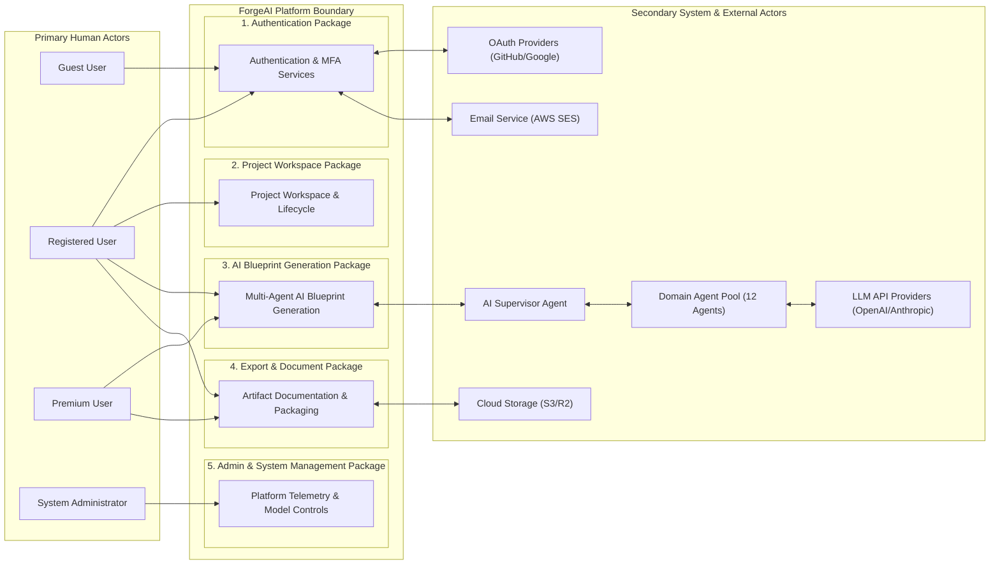

# ForgeAI Enterprise Use Case & Requirements Specification

> **Document Version**: 2.0.0-ENTERPRISE  
> **Status**: Approved for Production Engineering & Business Analysis  
> **Target Audience**: Business Analysts, Product Managers, Lead Architects, Full-Stack Developers, QA Engineers  
> **UML Standard**: UML 2.5 Specification Compliant  
> **Last Updated**: July 2026  

---

## Executive Summary

**ForgeAI** is an enterprise AI-powered software development platform designed to convert raw human software ideas into complete, deterministic, production-ready engineering blueprints.

This document defines the formal **UML Use Case Specification** for ForgeAI. It establishes the complete functional boundary of the platform, detailing all human and automated actors, primary user interactions, administrative operations, multi-agent AI execution workflows, security access control matrices, business rules, and relationship dependencies (`<<include>>`, `<<extend>>`, and Generalization).

```
┌────────────────────────────────────────────────────────────────────────┐
│                   ForgeAI Functional Scope & Capabilities              │
├───────────────────┬───────────────────┬────────────────────────────────┤
│ Multi-Actor Access│ Supervised Multi- │ Granular Enterprise            │
│ Governance        │ Agent Execution   │ Document & Code Packaging      │
│ Guests, Registered│ Autonomous SRS,   │ Exportable Markdown, PDF,      │
│ Users, Premium    │ Architecture, DDL,│ OpenAPI 3.1 specs, and ZIP     │
│ Users, & Admins   │ & Code generation │ runnable directory structures  │
└───────────────────┴───────────────────┴────────────────────────────────┘
```

---

## Table of Contents

1. [High-Level Use Case Diagram](#1-high-level-use-case-diagram)
2. [Detailed Use Case Diagram](#2-detailed-use-case-diagram)
3. [Actor Description Catalog](#3-actor-description-catalog)
4. [Comprehensive Use Case Catalog](#4-comprehensive-use-case-catalog)
5. [UML Use Case Relationship Analysis](#5-uml-use-case-relationship-analysis)
6. [Role-Based Access Control (RBAC) Matrix](#6-role-based-access-control-rbac-matrix)
7. [Enterprise Business Rules Specification](#7-enterprise-business-rules-specification)
8. [System Assumptions & Architectural Constraints](#8-system-assumptions--architectural-constraints)

---

## 1. High-Level Use Case Diagram

The high-level diagram visualizes the macro system boundaries, primary human actors, external secondary actors, and the core functional use case packages:



---

## 2. Detailed Use Case Diagram

The detailed UML 2.5 Use Case Diagram maps every discrete action across Authentication, Project Management, AI Generation, Document Export, Settings, Administration, and System Agents:

```mermaid
graph TD
    %% ACTORS
    subgraph Primary_Actors ["Primary Human Actors"]
        Actor_Guest["Guest User"]
        Actor_RegUser["Registered User"]
        Actor_PremUser["Premium User"]
        Actor_Admin["System Administrator"]
    end

    subgraph Secondary_Actors ["Secondary Infrastructure & External Actors"]
        Sec_Auth["Auth Provider (OAuth)"]
        Sec_Email["Email Service (SES)"]
        Sec_LLM["LLM Providers (OpenAI/Anthropic/Gemini)"]
        Sec_S3["Cloud Storage (S3/R2)"]
        Sec_Super["AI Supervisor Agent"]
        Sec_Agents["Specialized AI Agents Pool"]
        Sec_Val["Validation Engine"]
    end

    %% USE CASE BOUNDARY
    subgraph ForgeAI_Boundary ["ForgeAI Platform System Boundary"]
        
        %% AUTHENTICATION
        subgraph Package_Auth ["Authentication & Account Security"]
            UC_Register(["UC-101: Register Account"])
            UC_Login(["UC-102: Login"])
            UC_Logout(["UC-103: Logout"])
            UC_ResetPass(["UC-104: Reset Password"])
            UC_VerifyEmail(["UC-105: Verify Email"])
            UC_EnableMFA(["UC-106: Enable MFA"])
        end

        %% PROJECT MANAGEMENT
        subgraph Package_Project ["Project Workspace Management"]
            UC_CreateProj(["UC-201: Create Project"])
            UC_EditProj(["UC-202: Edit Project Metadata"])
            UC_DeleteProj(["UC-203: Delete Project"])
            UC_ArchiveProj(["UC-204: Archive Project"])
            UC_CloneProj(["UC-205: Clone Project"])
            UC_SearchProj(["UC-206: Search & Filter Projects"])
            UC_ShareProj(["UC-207: Share Project Workspace"])
        end

        %% AI GENERATION
        subgraph Package_AIGen ["AI Generation & Multi-Agent Execution"]
            UC_StartAISession(["UC-301: Start AI Session"])
            UC_SubmitIdea(["UC-302: Submit Software Idea"])
            UC_AnswerQuestions(["UC-303: Answer Clarification Questions"])
            UC_GenBlueprint(["UC-304: Generate Full Blueprint"])
            UC_RegenSection(["UC-305: Regenerate Specific Section"])
            UC_StopGen(["UC-306: Stop Generation"])
            UC_ResumeGen(["UC-307: Resume Generation"])
        end

        %% DOCUMENTATION & EXPORTS
        subgraph Package_Doc ["Documentation & Artifact Export"]
            UC_ViewDoc(["UC-401: View Interactive Document Canvas"])
            UC_DownloadPDF(["UC-402: Download Architecture PDF"])
            UC_ExportMD(["UC-403: Export Markdown Suite"])
            UC_ExportZIP(["UC-404: Export Project ZIP Archive"])
            UC_CopyContent(["UC-405: Copy Snippet Content"])
        end

        %% SETTINGS
        subgraph Package_Settings ["User & Tenant Settings"]
            UC_ManageProfile(["UC-501: Manage User Profile"])
            UC_APIKeys(["UC-502: Manage Custom LLM API Keys"])
            UC_Preferences(["UC-503: Manage UI Preferences & Theme"])
            UC_Billing(["UC-504: Manage Subscription & Billing"])
        end

        %% ADMIN USE CASES
        subgraph Package_Admin ["System Administration & Governance"]
            UC_AdminUsers(["UC-601: Manage System Users"])
            UC_AdminModels(["UC-602: Configure AI Model Router"])
            UC_AdminPrompts(["UC-603: Manage System Prompt Registry"])
            UC_MonitorJobs(["UC-604: Monitor Real-Time AI Worker Jobs"])
            UC_ViewLogs(["UC-605: View System & Audit Logs"])
            UC_SystemAnalytics(["UC-606: View Token Cost Analytics"])
            UC_AdminTemplates(["UC-607: Manage Blueprint Templates"])
            UC_ConfigProviders(["UC-608: Configure LLM & Cloud Providers"])
            UC_AuditSystem(["UC-609: Audit Security Access Events"])
            UC_FeatureFlags(["UC-610: Manage Feature Flags"])
        end

        %% AI AGENT INTERNAL USE CASES
        subgraph Package_AIAgentInternal ["AI Agent Execution Subsystem"]
            UC_PlanTasks(["UC-701: Plan Execution DAG"])
            UC_AssignAgents(["UC-702: Assign Domain Agent Tasks"])
            UC_MergeOutputs(["UC-703: Merge Agent Artifact Outputs"])
            UC_ValidateArtifacts(["UC-704: Validate Structural AST Integrity"])
            
            UC_GenReq(["UC-705: Generate SRS & Stories"])
            UC_GenArch(["UC-706: Generate Architecture & C4"])
            UC_GenDB(["UC-707: Generate SQL DDL & ERD"])
            UC_GenBE(["UC-708: Generate OpenAPI & Router Code"])
            UC_GenFE(["UC-709: Generate React & Page Specs"])
            UC_GenSec(["UC-710: Generate OWASP Threat Model"])
            UC_GenTest(["UC-711: Generate Pytest/Vitest Suites"])
            UC_GenDeploy(["UC-712: Generate Docker & CI/CD Specs"])

            UC_ValOutput(["UC-713: Execute Structural AST Checks"])
            UC_MissingCheck(["UC-714: Detect Missing Artifact Sections"])
            UC_ScoreQuality(["UC-715: Calculate Blueprint Quality Score"])
            UC_TriggerRetry(["UC-716: Trigger Supervisor Self-Repair"])
        end
    end

    %% ACTOR INHERITANCE
    Actor_Guest -.->|Generalization| Actor_RegUser
    Actor_RegUser -.->|Generalization| Actor_PremUser

    %% USER CONNECTIONS
    Actor_Guest --> UC_Register & UC_Login & UC_ResetPass
    Actor_RegUser --> UC_Logout & UC_VerifyEmail & UC_CreateProj & UC_EditProj & UC_SearchProj & UC_StartAISession & UC_SubmitIdea & UC_GenBlueprint & UC_ViewDoc & UC_ExportMD & UC_CopyContent & UC_ManageProfile & UC_Preferences
    Actor_PremUser --> UC_CloneProj & UC_ShareProj & UC_RegenSection & UC_DownloadPDF & UC_ExportZIP & UC_APIKeys & UC_Billing

    %% ADMIN CONNECTIONS
    Actor_Admin --> UC_AdminUsers & UC_AdminModels & UC_AdminPrompts & UC_MonitorJobs & UC_ViewLogs & UC_SystemAnalytics & UC_AdminTemplates & UC_ConfigProviders & UC_AuditSystem & UC_FeatureFlags

    %% INCLUDES AND EXTENDS
    UC_Login ..->|<<include>>| UC_EnableMFA
    UC_SubmitIdea ..->|<<include>>| UC_StartAISession
    UC_GenBlueprint ..->|<<include>>| UC_PlanTasks
    UC_PlanTasks ..->|<<include>>| UC_AssignAgents
    UC_AssignAgents ..->|<<include>>| UC_GenReq & UC_GenArch & UC_GenDB & UC_GenBE & UC_GenFE & UC_GenSec & UC_GenTest & UC_GenDeploy
    UC_GenBlueprint ..->|<<include>>| UC_ValidateArtifacts
    UC_ValidateArtifacts ..->|<<include>>| UC_ValOutput & UC_MissingCheck & UC_ScoreQuality
    
    UC_AnswerQuestions ..->|<<extend>>| UC_SubmitIdea
    UC_TriggerRetry ..->|<<extend>>| UC_ValidateArtifacts
    UC_StopGen ..->|<<extend>>| UC_GenBlueprint
    UC_ResumeGen ..->|<<extend>>| UC_StopGen

    %% SECONDARY ACTOR CONNECTIONS
    UC_Login & UC_Register <--> Sec_Auth
    UC_VerifyEmail & UC_ResetPass <--> Sec_Email
    UC_AssignAgents <--> Sec_Agents
    Sec_Agents <--> Sec_LLM
    UC_PlanTasks <--> Sec_Super
    UC_ValidateArtifacts <--> Sec_Val
    UC_ExportZIP & UC_DownloadPDF <--> Sec_S3
```



---

## 3. Actor Description Catalog

### 3.1 Primary Human Actors

| Actor | Responsibilities | Permissions | Interacts With |
| :--- | :--- | :--- | :--- |
| **Guest User** | Explores platform landing page, registers account, initiates password reset. | Public pages, Account registration, Password recovery. | Web App UI, Auth Service. |
| **Registered User**| Creates standard software projects, submits prompts, generates basic markdown blueprints. | Standard project CRUD, basic AI generation, Markdown view/copy. | Workspace UI, Project Svc, AI Orchestration. |
| **Premium User** | Inherits Registered User capabilities; generates complex multi-file blueprints, exports ZIP archives & PDF summary reports, manages custom API keys. | Full blueprint generation, ZIP/PDF export, custom LLM key routing, priority queue access. | Workspace UI, File Service, Model Router. |
| **System Administrator** | Oversees platform operation, monitors token costs, manages system prompts, configures LLM providers, audits logs. | Complete platform administrative access, user management, feature flags, cost analytics. | Admin Panel, Telemetry Svc, Vault, System DB. |

---

### 3.2 Secondary System & Infrastructure Actors

| Actor | Responsibilities | Permissions | Interacts With |
| :--- | :--- | :--- | :--- |
| **AI Supervisor Agent** | Receives user intent, constructs execution DAG, coordinates domain worker agents, resolves outputs. | Internal graph state execution, worker task routing. | Redis Streams, Domain Agents, LangGraph. |
| **Domain AI Agents (Pool of 12)** | Generates specialized artifacts (SRS, C4 diagrams, SQL DDL, OpenAPI, Next.js specs, Pytest suites). | Read upstream state, execute domain LLM calls. | Prompt Registry, Memory Manager, Model Router. |
| **Authentication Provider** | Authenticates user identities via OAuth2 (GitHub, Google) and issues JWT tokens. | Identity verification, social login scope validation. | Auth Service, User Service. |
| **Email Service (AWS SES)** | Sends account activation links, password reset tokens, and security alert emails. | Transactional email dispatch. | Auth Service, User Management. |
| **LLM Providers (OpenAI/Anthropic/Gemini)**| Executes neural inference calls for prompt inputs and outputs structured text/code responses. | Process API tokens within quota limits. | Model Router, LLM Adapter. |
| **Cloud Storage (S3 / R2)** | Persists compiled downloadable project ZIP packages and rendered PDF summary reports. | Read/Write presigned S3 URLs. | Blueprint Generator, File Service. |
| **Notification Service (SSE)** | Streams real-time progress events and generation tokens to the client frontend canvas. | Publish-Subscribe message streaming. | Redis Streams, Frontend Web App UI. |

---

## 4. Comprehensive Use Case Catalog

Below are detailed, enterprise-grade specifications for core system use cases:

### 4.1 UC-102: User Authentication (Login)
* **Name**: UC-102: User Authentication
* **Goal**: Authenticate a registered user and issue a secure JWT access token.
* **Primary Actor**: Registered User
* **Preconditions**: User has a valid registered account and email is verified.
* **Main Success Scenario (Flow)**:
  1. User navigates to login screen and enters email and password (or selects GitHub OAuth).
  2. Frontend sends POST request to `/api/v1/auth/login`.
  3. Auth Service verifies password hash using Passlib (Bcrypt).
  4. Auth Service generates a signed JWT Access Token (TTL 15m) and Refresh Token (TTL 7d).
  5. Auth Service returns tokens to client; client stores JWT in HttpOnly secure cookie.
  6. User is redirected to Dashboard workspace.
* **Alternative Flows**:
  * *AF-1 (OAuth Login)*: User selects "Login with GitHub". Auth Service redirects to GitHub OAuth gateway, receives authorization code, trades for access token, fetches profile, and issues ForgeAI JWT.
* **Exceptions**:
  * *E-1 (Invalid Credentials)*: Password mismatch; system displays "Invalid email or password" error and increments failed attempt counter.
  * *E-2 (Unverified Email)*: Email not verified; system blocks access and prompts user to click link sent to their inbox.
* **Postconditions**: User session established; audit record saved in `security_audit_logs`.

---

### 4.2 UC-304: Generate Full Software Blueprint
* **Name**: UC-304: Generate Full Software Blueprint
* **Goal**: Transform a high-level user software concept into a validated multi-artifact project blueprint.
* **Primary Actor**: Registered User / Premium User
* **Secondary Actors**: AI Supervisor Agent, Domain AI Agents, Validation Engine, LLM Provider.
* **Preconditions**: User is logged in, has created a project workspace, and possesses active generation credits.
* **Main Success Scenario (Flow)**:
  1. User enters software concept (e.g., "SaaS Payment Gateway with Billing & Invoicing") and clicks "Generate Blueprint".
  2. Client sends POST request to `/api/v1/blueprints/generate`.
  3. AI Orchestrator receives request, creates a new execution thread in Redis, and enqueues a job into Redis Streams.
  4. Supervisor Agent dequeues task, constructs a 10-step DAG execution plan, and emits SSE event `ORCHESTRATION_STARTED`.
  5. Requirements Agent executes LLM inference call, generating SRS and User Stories.
  6. Architecture Agent receives SRS snapshot and generates C4 diagrams and ADRs.
  7. Database Agent and Frontend Agent execute concurrently:
     * Database Agent generates PostgreSQL 16 DDL and ERD.
     * Frontend Agent generates Next.js page structure and React component trees.
  8. Backend Agent receives DB DDL snapshot and generates OpenAPI 3.1 specs and FastAPI router code.
  9. Security, Testing, and Deployment Agents execute in sequence.
  10. Documentation Agent compiles main `README.md` and developer onboarding guide.
  11. Validation Agent executes AST syntax checks (`ast.parse`, `sqlglot`), schema validation, and computes Quality Score.
  12. If Quality Score >= 85, Blueprint Generator packages files into `.zip` archive, uploads to S3, and returns signed download URLs.
  13. Notification Service emits SSE `BLUEPRINT_COMPLETE` event to client UI.
* **Alternative Flows**:
  * *AF-1 (Clarification Questions Triggered)*: Requirements Agent detects ambiguous concept scope; Supervisor halts DAG execution and emits `CLARIFICATION_REQUIRED` event to UI with 3 target questions. User answers questions (UC-303), and DAG resumes.
* **Exceptions**:
  * *E-1 (LLM Rate Limit / 429)*: Primary LLM provider fails; Model Router circuit breaker switches traffic to Anthropic Claude 3.5 Sonnet fallback endpoint.
  * *E-2 (Validation Failure)*: Quality score < 85; Validation Agent returns error diffs to Supervisor; Supervisor re-prompts failing agent with targeted repair instructions (UC-716) max 2 times.
* **Postconditions**: Fully validated software blueprint persisted in PostgreSQL and S3; project state marked `COMPLETED`.

---

### 4.3 UC-404: Export Project ZIP Archive
* **Name**: UC-404: Export Project ZIP Archive
* **Goal**: Package and stream a complete, runnable directory structure `.zip` file to the user.
* **Primary Actor**: Premium User
* **Preconditions**: Project blueprint generation state is `COMPLETED` and validated.
* **Main Success Scenario (Flow)**:
  1. User clicks "Download Project ZIP" on the workspace canvas.
  2. Client sends request to `/api/v1/projects/{id}/export/zip`.
  3. File Service verifies user's Premium subscription tier and project ownership.
  4. File Service checks if pre-compiled `.zip` archive exists in AWS S3.
  5. File Service generates a secure, time-limited presigned AWS S3 download URL (TTL 15m).
  6. Client browser initiates direct download of `forgeai_blueprint_[id].zip` from S3.
* **Exceptions**:
  * *E-1 (Tier Unauthorized)*: Registered User (Free Tier) attempts ZIP download; system blocks request and prompts user to upgrade to Premium.
* **Postconditions**: ZIP package downloaded by user; export action logged in analytics database.

---

### 4.4 UC-602: Configure AI Model Router
* **Name**: UC-602: Configure AI Model Router
* **Goal**: Administer primary/fallback LLM providers, model temperatures, and token budget thresholds.
* **Primary Actor**: System Administrator
* **Preconditions**: Admin user is authenticated with `ROLE_ADMIN` permissions.
* **Main Success Scenario (Flow)**:
  1. Admin opens Admin Panel -> Model Router Management.
  2. Admin modifies primary model mapping (e.g., set Architecture Agent to `claude-3-5-sonnet` and Requirements Agent to `gpt-4o`).
  3. Admin sets circuit breaker failure threshold (e.g., 3 consecutive 5xx errors in 60 seconds).
  4. Admin clicks "Save Configuration".
  5. System updates Model Router configuration in Redis and PostgreSQL.
  6. Model Router hot-reloads configuration without service disruption.
* **Postconditions**: Subsequent agent LLM calls route according to updated admin rules.

---

## 5. UML Use Case Relationship Analysis

```
+-----------------------------------------------------------------------+
|                 Key Architectural Relationship Summary                 |
+-----------------------------------------------------------------------+
| Relationship Type  | Upstream Use Case    | Target Use Case           |
+--------------------+----------------------+---------------------------+
| <<include>>        | UC-102 Login         | UC-106 Enable MFA         |
| <<include>>        | UC-304 Gen Blueprint | UC-701 Plan Tasks         |
| <<include>>        | UC-701 Plan Tasks    | UC-702 Assign Agents      |
| <<include>>        | UC-304 Gen Blueprint | UC-704 Validate Artifacts |
| <<extend>>         | UC-303 Answer Qs     | UC-302 Submit Idea        |
| <<extend>>         | UC-716 Trigger Retry | UC-704 Validate Artifacts |
| <<extend>>         | UC-306 Stop Gen      | UC-304 Gen Blueprint      |
| Generalization     | Guest User           | Registered User           |
| Generalization     | Registered User      | Premium User              |
+--------------------+----------------------+---------------------------+
```

### 5.1 Rationale for `<<include>>` Relationships
* **`UC-304 (Generate Blueprint) <<include>> UC-701 (Plan Tasks)`**: Every blueprint generation MUST execute an autonomous task planning phase before worker agents can execute.
* **`UC-304 (Generate Blueprint) <<include>> UC-704 (Validate Artifacts)`**: Blueprint generation CANNOT complete without executing mandatory AST syntax and schema validation checks.

### 5.2 Rationale for `<<extend>>` Relationships
* **`UC-303 (Answer Clarification Questions) <<extend>> UC-302 (Submit Idea)`**: Only executed conditionally when the Requirements Agent evaluates the user's initial concept as underspecified or ambiguous.
* **`UC-716 (Trigger Supervisor Self-Repair) <<extend>> UC-704 (Validate Artifacts)`**: Only executed conditionally when the Validation Agent detects syntax errors or quality score < 85.

---

## 6. Role-Based Access Control (RBAC) Matrix

```
Legend:
C = Create, R = Read, U = Update, D = Delete, X = Execute, - = Denied
```

| Functional Subsystem | Guest User | Registered User | Premium User | System Admin |
| :--- | :---: | :---: | :---: | :---: |
| **Authentication & Registration** | C, R | R, U | R, U | C, R, U, D |
| **Project Workspace (Own Projects)**| - | C, R, U, D | C, R, U, D | C, R, U, D |
| **Project Sharing & Collaboration** | - | - | C, R, U | C, R, U, D |
| **Basic AI Generation (Markdown)** | - | C, R, X | C, R, X | C, R, X |
| **Advanced AI Generation (Regen)** | - | - | C, R, X | C, R, X |
| **Markdown / Snippet Export** | - | R, X | R, X | R, X |
| **ZIP Package & PDF Export** | - | - | R, X | R, X |
| **Custom LLM API Key Configuration**| - | - | C, R, U, D | C, R, U, D |
| **Admin User & Role Management** | - | - | - | C, R, U, D, X |
| **Model Router & System Prompts** | - | - | - | C, R, U, D, X |
| **System Telemetry & Audit Logs** | - | - | - | R, X |

---

## 7. Enterprise Business Rules Specification

### 7.1 Authentication & Security Rules
* **BR-SEC-01 (Password Complexity)**: Passwords must be at least 12 characters long and contain at least one uppercase letter, one lowercase letter, one number, and one special character.
* **BR-SEC-02 (Account Locking)**: 5 consecutive failed login attempts lock the account for 15 minutes.
* **BR-SEC-03 (Token Lifetime)**: JWT Access Tokens expire in 15 minutes; Refresh Tokens expire in 7 days.

### 7.2 AI Generation Quota & Execution Rules
* **BR-AI-01 (Free Tier Quota)**: Registered Users (Free Tier) receive 3 full blueprint generations per month.
* **BR-AI-02 (Premium Tier Quota)**: Premium Users receive 50 full blueprint generations per month with priority queue dispatching.
* **BR-AI-03 (Quality Gate Threshold)**: No blueprint payload may be delivered to a user if its Validation Quality Score is below 85/100.
* **BR-AI-04 (Maximum Self-Repair Attempts)**: An agent task may trigger a maximum of 2 automated self-repair retries per DAG turn before escalating to human fallback.

### 7.3 Data Retention & Privacy Rules
* **BR-DAT-01 (Project Artifact Retention)**: Free tier generated project zip files are retained in S3 for 30 days. Premium tier archives are retained indefinitely.
* **BR-DAT-02 (PII Sanitization)**: All user prompt inputs must be scrubbed for PII (emails, API keys, IPs) before propagating to external LLM provider APIs.

---

## 8. System Assumptions & Architectural Constraints

### 8.1 Technical Assumptions
1. External LLM Provider APIs (OpenAI, Anthropic) maintain >= 99.9% uptime.
2. User client devices run modern browsers supporting ES2022 JavaScript, WebSockets, and Server-Sent Events (SSE).
3. Kubernetes production cluster provides dynamic volume provisioning and horizontal auto-scaling.

### 8.2 Architectural Constraints
1. **Latency Budget**: End-to-end multi-agent project blueprint generation must complete within 45 to 90 seconds.
2. **Context Window Constraint**: Prompt inputs to LLMs must be compressed using Tiktoken and sliding windows to fit within model token limits (e.g., 128k tokens).
3. **Stateless Service Design**: All API backend pods must remain completely stateless to allow seamless horizontal pod autoscaling.

---

### Sign-Off & Architectural Verification
> **Approved By**: Lead Business Analyst & Principal Software Architect  
> **Compliance**: UML 2.5 Specification Compliant | Enterprise RBAC Enforced | ISO 25010 Software Standard  
> **Repository Target**: `c:\Users\tharu\OneDrive\Desktop\ForgeAi\USE_CASE_SPECIFICATION.md`  
